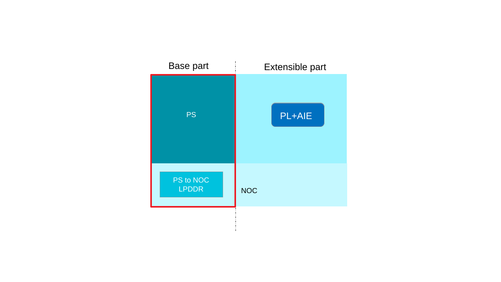

<table class="sphinxhide" width="100%">
 <tr width="100%">
    <td align="center"><h1>Getting Started with AMD Versal™ AI Edge Gen2 VEK385 with Vitis™ Unified IDE (EDF flow)</h1>
    <a href="https://www.xilinx.com/products/design-tools/vitis.html">See Vitis Development Environment on xilinx.com</br></a>
    </td>
 </tr>
</table>

***Version: Vitis 2026.1 and Vivado 2026.1***

Welcome to the Vitis Getting Started tutorial for the VEK385 EDF flow.

This tutorial showcases the steps to build an AI Engine 2-PS (AIE2-PS) graph along with a host application, and run the design in hardware emulation (QEMU) and on the VEK385 board.

This tutorial uses the pre-built `vek385_base_reva.xpfm` platform from the Vitis installation (`${PLATFORM_REPO_PATHS}/vek385_base_reva/vek385_base_reva.xpfm`) to compile the AIE2-PS kernels.

The pre-built VEK385 platform has:

- Base part: PS and PS-to-NoC-DDR connectivity
- Extensible part: PL and AIE regions

   

The base part serves as the foundation to generate the EDF WIC image. The extensible part is later linked with the AIE2-PS kernels, producing a fixed XSA that is used to build the host application and the device PDI.

> **Note:** The CED-design-based platform enables segmented configuration by default. The PS-NoC-to-LPDDR is used to initialize the LPDDR memory and provide access to it during system bring-up. For more details, refer to [UG1273](https://docs.amd.com/r/en-US/ug1273-versal-acap-design/Segmented-Configuration).

This tutorial is aligned with the AMD **Embedded Development Framework (EDF)**. For more information, see the official [AMD EDF Wiki page](https://xilinx-wiki.atlassian.net/wiki/spaces/A/pages/3250585601/AMD+Embedded+Development+Framework+EDF#Introduction-to-the-AMD-Embedded-Development-Framework).

Please go through the [Makefile](./Makefile) and [makefile_aie2ps](./makefile_aie2ps) provided in this tutorial to better understand the Vitis EDF tool flow.

## Design overview

- AIE2-PS graph implementing a GMIO-based input/output flow (`gm2aie`), with the AIE array streaming data through PL-less GMIO ports.
- Host application that loads the xclbin, drives the graph, and verifies the result.

## Prerequisites

1. Source Vitis 2026.1:

   ```bash
   source <path_to_vitis_install>/settings64.sh
   ```

2. Export `PLATFORM_REPO_PATHS` and `YOCTO_ARTIFACTS`:

   ```bash
   export PLATFORM_REPO_PATHS=<path_to_vitis_install>/base_platforms
   export YOCTO_ARTIFACTS=<path-to-design>/yocto_artifacts
   ```

3. Download the EDF Yocto artifacts for Versal Gen2 (Cortex-A78) from the [Embedded Development Framework (EDF) downloads page](https://www.xilinx.com/support/download/index.html/content/xilinx/en/downloadNav/embedded-design-tools.html) (package matching Vitis 2026.1):

   - `amd-cortexa78-mali-common_meta-edf-app-sdk` — install into `${YOCTO_ARTIFACTS}/amd-cortexa78-mali-common_meta-edf-app-sdk/sdk`:

     ```bash
     ./amd-edf-glibc-x86_64-meta-edf-app-sdk-cortexa72-cortexa53-amd-cortexa78-mali-common-toolchain.sh \
         -d ${YOCTO_ARTIFACTS}/amd-cortexa78-mali-common_meta-edf-app-sdk/sdk -y
     ```

   - `amd-cortexa78-mali-common_edf-platform-disk-image` — unzip and move into `${YOCTO_ARTIFACTS}/`.
   - `amd-cortexa78-mali-common_vek385_qemu_prebuilt` — unzip and move into `${YOCTO_ARTIFACTS}/`.
   - `versal-2ve-2vm-vek385-multidomain_edf-ospi` — OSPI flash image used for on-board OSPI boot.

4. Set up the EDF sysroot environment:

   ```bash
   source ${YOCTO_ARTIFACTS}/amd-cortexa78-mali-common_meta-edf-app-sdk/sdk/environment-setup-cortexa72-cortexa53-amd-linux
   ```

## Building the design

### Hardware emulation (QEMU)

```bash
make all
```

This compiles the AIE2-PS graph, builds the host application, packages with `--package.defer_aie_run`, assembles the QEMU combined image, copies the host application, `gm2aie.xclbin`, `gm2aie.pdi`, `gm2aie.dtbo`, `emconfig.json`, and `run_app_hw_emu.sh` into the WIC rootfs using `wic cp`, and launches `launch_hw_emu.sh` with the EDF `combined.qemuboot.conf`. The QEMU session auto-logs in as `amd-edf`, mounts `/dev/sda2`, and executes `run_app_hw_emu.sh`.

### Hardware (OSPI boot)

```bash
make sd_card
```

This builds everything for `TARGET=hw` and prepares `aie2ps_work/package.hw/` with the `gm2aie.pdi`, `gm2aie.dtbo`, `gm2aie.xclbin`, host `application`, and `embedded_exec.sh` ready to copy to the VEK385 board.

## Running on the VEK385 board

Refer to the AMD EDF Wiki for full details on booting the VEK385 board: [AMD EDF Getting Started — Discovery and Evaluation of AMD Versal device portfolio](https://xilinx-wiki.atlassian.net/wiki/spaces/A/pages/3258155011/AMD+EDF+Getting+started+-+Discovery+and+Evaluation+AMD+Versal+device+portfolio).

1. Program the OSPI flash with the `versal-2ve-2vm-vek385-multidomain_edf-ospi` image, following the chapter *How to boot a board using the pre-built Images: OSPI Boot* in the Wiki link above.
2. Program the EDF platform rootfs WIC (`edf-platform-disk-image-amd-cortexa78-mali-common.rootfs.wic.xz`) to a microSD card, following the chapter *Writing the EDF Linux® disk image (wic) to the secondary boot media : SD card* in the Wiki link above.

   > **Note:** Eject the SD card properly from the host system after programming it.

3. Insert the microSD card into the VEK385 and set boot mode to OSPI (`SW1 = ON,ON,ON,OFF` = `0001`).
4. Power on the board and open the UART console.
5. Log in as `amd-edf` (set a new password on first login):

   ```bash
   amd-edf login: amd-edf
   amd-edf:~$ sudo su
   ```

6. Copy the contents of `aie2ps_work/package.hw/` (host `application`, `gm2aie.pdi`, `gm2aie.dtbo`, `gm2aie.xclbin`, and `embedded_exec.sh`) to the board (via `scp` or by placing them on the SD card).
7. Run the application:

   ```bash
   amd-edf:/home/amd-edf# ./embedded_exec.sh
   ```

   Expected output:

   ```text
   INFO: Load the pdi and dtbo using fpgautil
   Initializing ADF API...
   XAIEFAL: INFO: Resource group Avail is created.
   XAIEFAL: INFO: Resource group Static is created.
   XAIEFAL: INFO: Resource group Generic is created.
   run s2mm
   graph end
   s2mm completed with status(4)
   Releasing remaining XRT objects...
   TEST PASSED
   INFO: Embedded host run completed.
   ```

## Cleaning

```bash
make clean       # remove intermediate build artifacts
make ultraclean  # remove the entire aie2ps_work/ working directory
```

<p class="sphinxhide" align="center"><sub>Copyright © 2026 Advanced Micro Devices, Inc.</sub></p>

<p class="sphinxhide" align="center"><sup><a href="https://www.amd.com/en/corporate/copyright">Terms and Conditions</a></sup></p>
