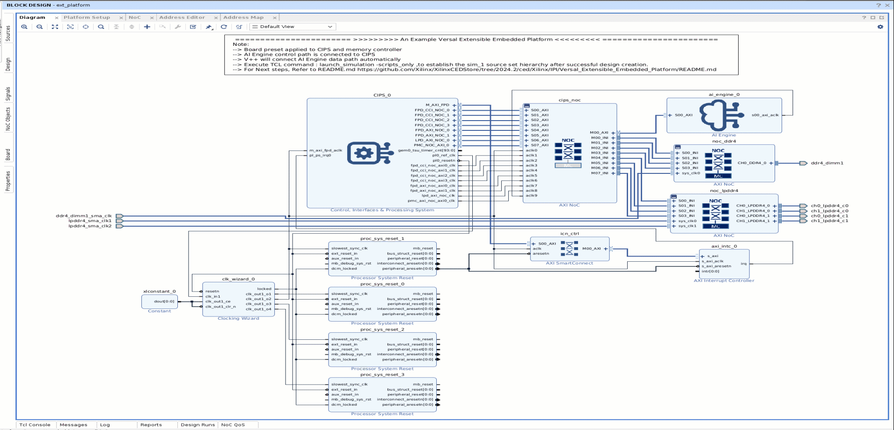
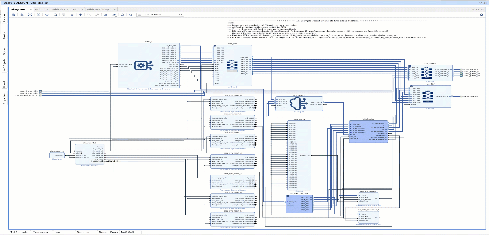

<table class="sphinxhide" style="width:100%;">
  <tr>
    <td align="center">
      <picture>
        <source media="(prefers-color-scheme: dark)" srcset="https://raw.githubusercontent.com/Xilinx/Image-Collateral/main/logo-white-text.png">
        
      </picture>
      <h1>AMD Vitis™ Getting Started Tutorials</h1>
      <a href="https://www.amd.com/en/products/software/adaptive-socs-and-fpgas/vitis.html">See Vitis™ Development Environment on amd.com</a>
    </td>
  </tr>
</table>


# Vitis Linker and Packager (VPL)

In this chapter we will understand the Vitis Linker and Packager input, output and syntax.

## Vitis Linker

As discussed in the tutorial introduction page, the Vitis linker inputs are kernels, platform and a configuration file. Let's look at the files we have generated so far:

1. `libadf.a`: AI Engine kernel
2. `mm2s.xo` and `s2mm.xo`: HLS/PL kernels
3. `xilinx_vck190_base_202520_1.xpfm`: AMD provided platform

> **Important Note:** This tutorial uses the AMD provided platform. For custom platform flow details, please check tutorials under [Vitis_Platform_Creation](https://github.com/Xilinx/Vitis-Tutorials/tree/2025.2/Vitis_Platform_Creation)

With the input kernels and platform ready, we need to define the connection of these kernel using a configuration file, let's call it system.cfg.

### 1. Vitis Linker Configuration File

This tutorial uses the system.cfg to provide guidance for the linker tool on the connectivity for the compiled kernels.

If you recall the design connectivity, we need two MM2S kernels and one S2MM kernel. Using the below code, we are declaring the required three kernels and also associating a name to each kernel:

```
nk = mm2s:2:mm2s_1,mm2s_2
nk = s2mm:1:s2mm
```

As we have now declared three kernels, it is the time to define the connectivity of these PL kernels with the AI Engine kernel. Using the below code, we are providing the connectivity details to the linker.
As the AXI-Stream interface is used to connect the PL kernels to the AI Engine, stream_connect is used to define the interface for the linker. The syntax is: `stream_connect=kernel_name.port_name:kernel_name.port_name`

```
stream_connect = mm2s_1.s:ai_engine_0.DataIn1
stream_connect = mm2s_2.s:ai_engine_0.DataIn2
stream_connect = ai_engine_0.DataOut1:s2mm.s
```

### 2. Running the Vitis Linker

As all the inputs for the linker are ready, we can use the below command to run the linker:

```
v++ --link --target hw/hw_emu \
			--platform  xilinx_vck190_base_202520_1.xpfm \
			--config ./system.cfg \
			s2mm.xo mm2s.xo \
			libadf.a \
```

The above step will generate a "fixed" XSA file that contains the updated design.

To understand the linker step, let's look into the block design of "Before Linker Run" vs "After Linker Run"

#### Before the Linker Run (Extensible XSA)

Here is a quick video of how the block design look like before running the linker. There are a few important points to note:

1. The AI Engine is just a place holder (no configuration is done)
2. No "VitisRegion" in the block design
3. No MM2S and S2MM kernels




#### After the Linker Run (Fixed XSA)

Here is a quick video of how the block design look like after running the linker. There are a few important points to note:

1. The AI Engine is configured and you can see the data ports added to the AI Engine
2. A VitisRegion block design is added into the design
3. The VitisRegion gets added by the Vitis Linker that includes the HLS/PL kernels
4. Changes in noc_ddr4 interfaces



##### Vitis Linker command and its output

| Commands            | Expected Output | Log file | Vitis Analyzer Supported File |
|---------------|---------------|---------------|---------------|
| v++ --link  | Fixed XSA | ./vpp_link.log | ./v++.link_summary |

## Vitis Packager

Once the fixed XSA is generated by the linker, we can use the Vitis packager to pack all the files to either run the design in Hardware Emulation or on the VCK190 hardware board. the Vitis packager inputs are fixed XSA, `libadf.a`, boot files, linux files and a configuation file. Let's look at the files we have so far:

1. libadf.a: AI Engine kernel and its boot files
2. Fixed XSA: output of the linker
3. host.exe: output of the host code compiler
4. rootfs.ext4: root file system, using the AMD provided VCK190 platform file
5. Image: Linux image, using the AMD provided VCK190 platform file

With the input files ready, we need to create a configuration file to provide guidance to the packager, let us call this file as `pack.cfg`.

### 1. Vitis Packager Configuration File

In the below configuration file, we are inputting the platform, run target, boot mode and also pointing to the files needed for the packager run.
Creating a configuration file for the packager may not be mandatory and all the below options can also used as an argument to the v++ --package command instead of using a configuration file.

```
platform=xilinx_vck190_base_202520_1
save-temps=1

[package]
boot_mode=sd
out_dir=pack_out_dir
rootfs=<path_platform>/xilinx-versal-common-v2025.2/rootfs.ext4
image_format=ext4
kernel_image=<path_platform>/xilinx-versal-common-v2025.2/Image
sd_file=host.exe
```

### 2. Running the Vitis Packager

As all the inputs for the packager are ready, we can use the below command to run the Vitis packager:

```
v++ --package \
    --config pack.cfg \
    --package.defer_aie_run \
    libadf.a \
    a.xsa -o a.xclbin
```

##### Vitis Packager command and its output


| Commands            | Expected Output | Log file | Vitis Analyzer Supported File |
|---------------|---------------|---------------|---------------|
| v++ --package  | SD_CARD image containing boot files, application executable and xclbin file | vpp_<xsa_name>.log | <xsa_name>.xclbin.package_summary |


Next Chapter: [Running the Hardware Emulation](../../../Running_the_Hardware_Emulation.md)


<hr class="sphinxhide"></hr>

<p class="sphinxhide" align="center"><sub>Copyright © 2020–2026 Advanced Micro Devices, Inc.</sub></p>

<p class="sphinxhide" align="center"><sup><a href="https://www.amd.com/en/corporate/copyright">Terms and Conditions</a></sup></p>
