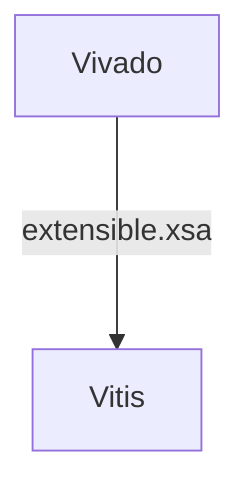
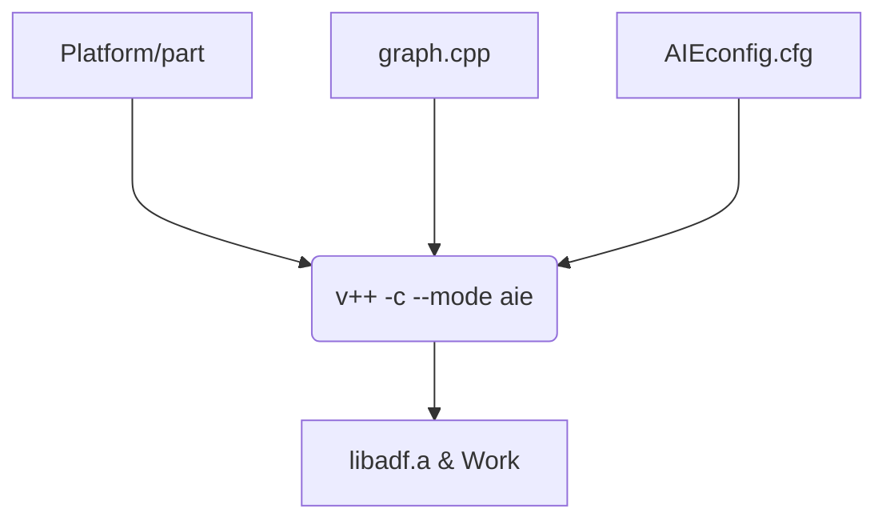
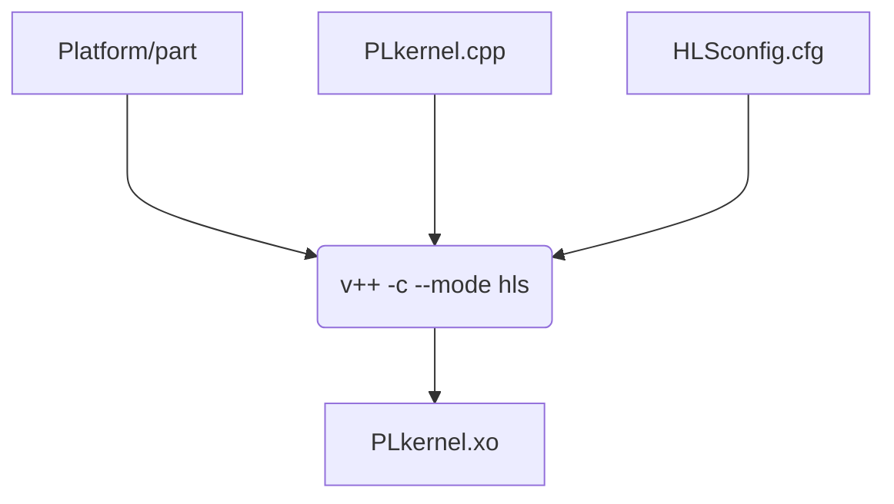
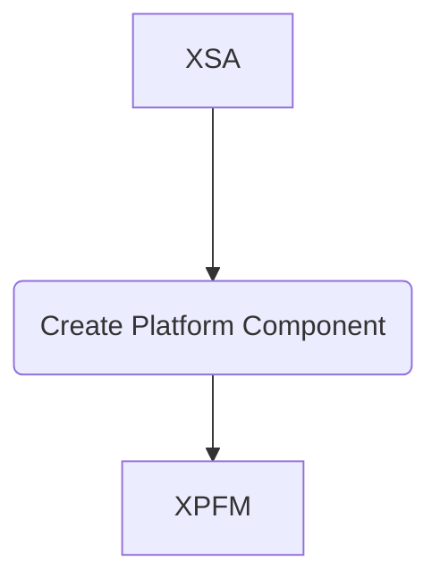
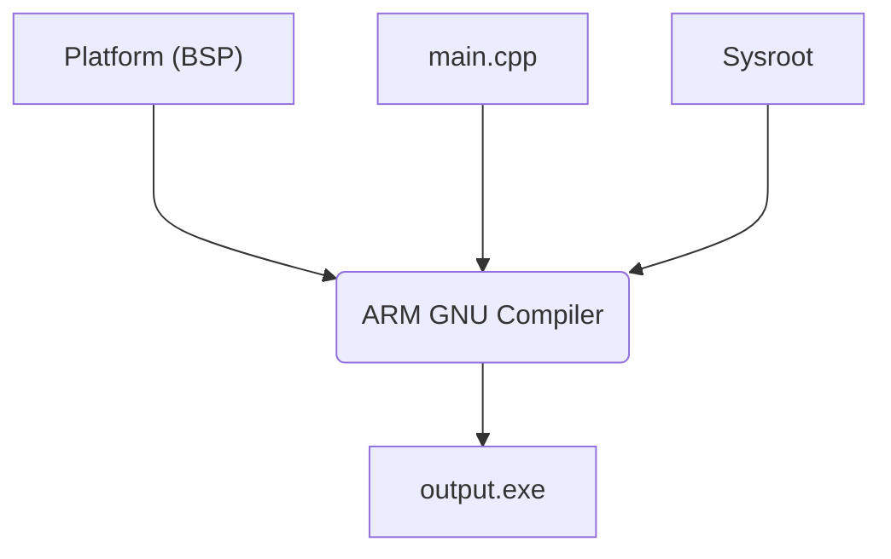
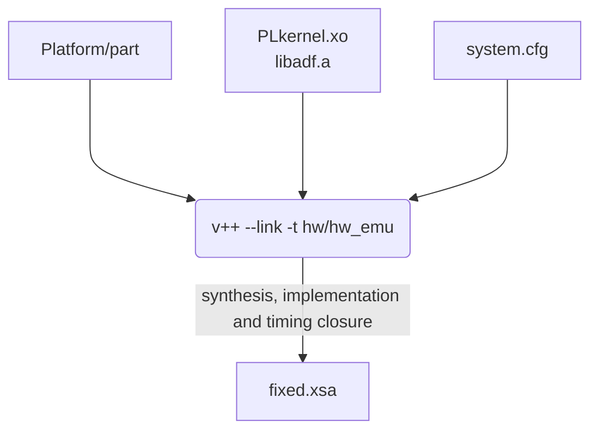
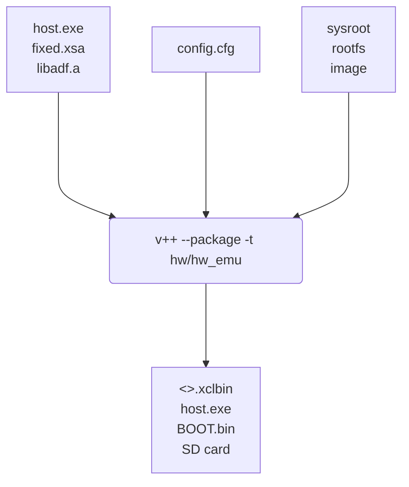

<table class="sphinxhide" width="100%">
 <tr width="100%">
    <td align="center"><h1>AI Engine Development</h1>
    <a href="https://www.xilinx.com/products/design-tools/vitis.html">See Vitis™ Development Environment on xilinx.com </a>
    <a href="https://www.xilinx.com/products/design-tools/vitis/vitis-ai.html">See Vitis™ AI Development Environment on xilinx.com</a>
    </td>
 </tr>
</table>

# Understanding the Vitis Tool Flow

This tutorial helps to kickstart your journey with Vitis tool flows. Before we deep dive into the Vitis flows, it is important we make base line understanding to start.

> **Important Note:** This tutorial does not discuss all the feature and flow offered by Vitis. Please use the user guide links provided in the reference section to read about each tool and flow in detail. 

## What is Vitis? 

Vitis is a software platform development tool that helps to configure and develop the designs targeting Programmable Logic (PL), AI Engines and Processor Subsystem (PS). 
AMD Vitis Unified Software Platform offers range of libraries along with compilers, simulators and analysis tools that can be used as standalone and also in conjunction with other Vitis tools to design, develop, simulate and analyze the functionality on the hardware. 

## How to get started with Vitis?

The first and foremost component to get started with Vitis Acceleration flow is an **extensible hardware platform**. 
The XSA file generated from Vivado is an extensible hardware platform, the word extensible means the platform is not complete yet and more logic will be added later to the platform. 
Also, to quickly get started with Versal designing, AMD provides platforms targeted to the respective boards. 
For customer platfoms and steps to create an extensible hardware platform, please refer to the [Platform Tutorial](../../Vitis_Platform_Creation/Design_Tutorials/03_Edge_VCK190/step1.md)

In this tutorial we will use the VCK190 AMD platform to understand below:
1. [Vitis Component Level Tools and Flow](#vitis-component-level-tools-and-flow)
2. [System Level Tools and Flow](#system-level-tools-and-flow)

### Vitis Component Level Tools and Flow:

Vitis components are like mini projects targetted to build important Vitis components. In this section we will look into the Vitis component level tools including:
- [AI Engine Graph Creation](#ai-engine-graph-creation-overview)
- [Vitis HLS Kernel Creation](#vitis-hls-kernel-creation-overview)
- Detailed explanation of each tool and its primary function.

#### AI Engine Graph Creation Overview:

aiecompiler (v++ -c --mode aie) is used to compile the AI Engine graph and kernel files. The compiler settings can be driven by using a configuration (<>.cfg) file. 
The aiecompiler generates AI Engine graph applications (libadf.a) and a Work directory as an output. 

#### Vitis HLS Kernel Creation Overview:

Vitis HLS allows users to add PL kernels using the C/C++ code, the HLS tool compiles the C/C++ user logic to equivalent RTL code.
Vitis HLS compiler (v++ -c --mode hls) is used to compile the HLS/PL kernel file to generate a PL kernel (<>.xo) file. The user guidance to the tool can be driven by using a configuration (<>.cfg) file. 

### System Level Tools and Flow:

In the previous section chapter we created all the components required as a building block for a Versal design, in this chapter we will look into the tools that helps to combine all components and make Versal System Design. Overview of the system level tools including: 
- [Vitis Platform Creation](#vitis-platform-creation-overview)
- [Embedded Application Creation](#embedded-application-creation-overview)
- [Vitis Linker](#vitis-linker)
- [Vitis Packager](#vitis-packager)
- Brief explanation of each tool and its primary function.
- A flow diagram is provided for each tool showing how it fits within the overall system design.

#### Vitis Platform Creation Overview:
Vitis uses the Vivado generated extensible hardware platform (XSA) and add software (SW) components and create an embedded platform **XPFM**.  
XPFM = XSA + SW platform (Linux/Baremetal + boot components)

In this flow, the Vitis backend uses System Device Tree (SDT) generator, Yocto/PetaLinux and Lopper to deliver the SW compoenents.

#### Embedded Application Creation Overview:

Depending on the target platform, you can either use XRT APIs or an AMD provided Board Support Package (BSP) to write the host code and control the AI Engine and PL kernel

#### Vitis Linker:

Vitis Linker integrates the AI Engine and HLS kernels into the user platform. It also manages the memory mapping, interface, clocking and etc. Based on the platform and user configuration, the linker may add the data width convertors, generated clocks, clock domain crossing (CDC) modules, Debug modules and required NoC connections.

The Vitis linker (v++ --link) uses the Vivado generated extensible hardware platform and adds the PL kernel, AI Engine kernel and connect these kernels to the rest of the design based on the user provide <>.cfg file. This configuration file should include point to point connections, clock requirement and other user guidance like synthesis, timing closure and implementation guidance for the linker.

The linker adds and connect the components into the extensible hardware platform and generates a fixed.xsa. Here the fixed.xsa means that all the user logic is now added into the design.

#### Vitis Packager:

The Vitis Packager (v++ --package) generates SD card and other flash images required for booting the system, in addition to the <>.xclbin device binary. 

The above genarted files are ready to run on Hardware or in Hardware Emulation. 

Vitis Tool: Detailed summary of available Vitis tools and its usages
| Sub-Tools            | Processor Subsystem (PS) | Programmable Logic | AI Engine | Description                          |
| -------------------- | -----------------------  | ------------------ | --------- | ------------------------------------ |
| Vitis Embedded      | &#x2611;                 | &#x2612;           | &#x2612;  | Consists of Compiler and Debuggers targeting PS                |
| Vitis HLS            | &#x2612;                 | &#x2611;           | &#x2612;  | To create PL kernels using C/C++ files                |
| AI Engine Tools      | &#x2612;                 | &#x2612;           | &#x2611;  | aiecompiler, x86sim, and aiesimulator for AI Engine designing.   **aiecompiler** uses AI Engine targeted C/C++ source files to output libadf.a (AIE Kernels).   **x86sim** is the functional simulator for AI Engines that helps to test, debug, and verify the functionality.   **aiesimulator** simulates a cycle approximate SystemC model of AI Engine. |
| Vitis Linker         | &#x2612;                       | &#x2611;                | &#x2611;       | Works on existing platform and provides connection between AI Engine, PL and NoC. Also takes care of clock connections and data width conversions.               |
| Vitis Packager       | &#x2611;                      | &#x2611;                 | &#x2611;      | Pack all necessaey hardware and software components and also to configure boot of the device              |
| Hardware Emulation   | &#x2611;                      | &#x2611;                 | &#x2611;      | To simulate the PS+PL+AIE, where PS gets simulated using QEMU and PL and AIE with simulators like XSIM             |
| Vitis Analyzer               | &#x2612;                      | &#x2611;                 | &#x2611;      | Helps to review and debug the AI Engine and PL targetted output files              |

Next Chapter: [Getting Started with Designing using the Vitis Tool](./Design_Overview.md)

Copyright © 2020–2025 Advanced Micro Devices, Inc.

<a href="https://www.amd.com/en/corporate/copyright">Terms and Conditions</a>

