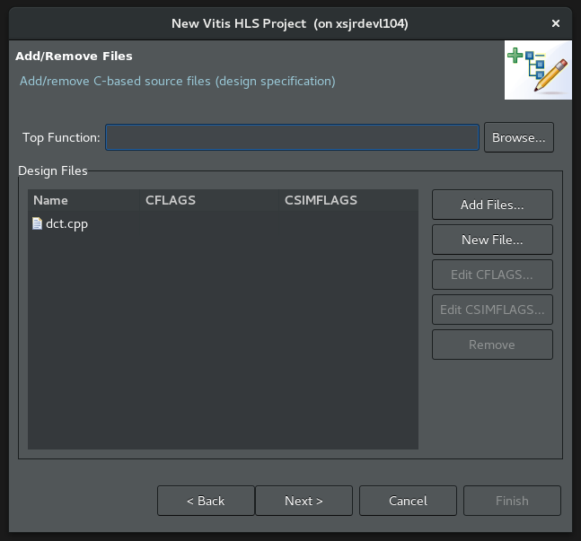
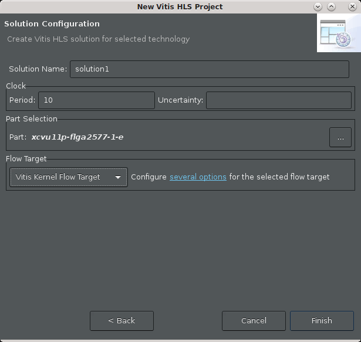

<table class="sphinxhide">
 <tr>
   <td align="center"><h1>2020.2 Vitis™ Application Acceleration Tutorials</h1>
   <a href="https://github.com/Xilinx/Vitis-Tutorials/tree/2020.1">See 2020.1 Tutorials</a>
  </td>
 </tr>
 <tr>
 <td>
 </td>
 </tr>
</table>

<!-- 
# Copyright 2021 Xilinx Inc.
# 
# Licensed under the Apache License, Version 2.0 (the "License");
# you may not use this file except in compliance with the License.
# You may obtain a copy of the License at
#
#     http://www.apache.org/licenses/LICENSE-2.0
#
# Unless required by applicable law or agreed to in writing, software
# distributed under the License is distributed on an "AS IS" BASIS,
# WITHOUT WARRANTIES OR CONDITIONS OF ANY KIND, either express or implied.
# See the License for the specific language governing permissions and
# limitations under the License.
-->

# 1. Creating a Vitis HLS Project

The Vitis HLS tool lets you specify C/C++ code for synthesis into Vitis core development kit kernels (`.xo`) or RTL IP for implementation in the PL region of Xilinx devices. The first step in creating a new project is identifying the C/C++ source code for synthesis.

In this tutorial, you are working with a simple discrete cosine transform (DCT) algorithm that processes an input matrix of values, applies fixed coefficients, and returns a matrix of modified values. In the `reference_files/src` folder, the `dct.cpp` contains the top-level DCT function.

1. Enter the following command to launch Vitis HLS in GUI mode.

   `vitis_hls`

   Vitis HLS opens.

2. Select **File** > **New Project**. 

   The New Vitis HLS Project wizard is displayed.

    

3. Create the Vitis HLS project type:
   1. In the Project name field, enter `dct_prj`.
   2. In the Location field, click **Browse** to select the location for the project.
   3. Click **Next>**.

   The Add/Remove Files page of the New Project wizard displays.

   

4. Make the following selections:
   1. Select **Add Files** to specify source files for the project.
      1. Navigate to the **./reference-files/src** folder location, and select **dct.cpp**.
   2. In the Top Function field at the top of the New Project wizard, select the **Browse...** button to open the Select Top Function dialog box, as shown below. 
       1. Select the **dct (dct.cpp)** function and click **OK**.

            

   3. Click **Next>**.

         The Add/Remove Testbench Files page of the New Project wizard displays.

         Writing a good testbench can greatly increase your productivity because C functions execute in orders of magnitude faster than RTL simulations. Using C to develop and validate the algorithm before synthesis is much faster than developing and debugging RTL code. For more information, refer to [Writing a Testbench](https://www.xilinx.com/html_docs/xilinx2020_1/vitis_doc/verifyingcodecsimulation.html#sav1584759936384) in the Vitis HLS Flow of the Vitis Unified Software Platform Documentation (UG1416).

      

5. Select **Add Files** to specify the testbench, and additional files for the project. 
   1. Navigate to the `./reference-files/src` folder, and select **dct_test.cpp, in.dat** and **out.golden.dat**. 
      * `dct_test.cpp` is a test bench for the design that iterates through the kernel multiple times. 
      * `in.dat` provides the input values to be processed by the kernel. 
       * `out.golden.dat` provides known output results to use for comparing the output of the dct function against.
   2. Click **Next>**.

      The Solution Configuration page of the New Project wizard is opened as shown below.

      The Solution Configuration creates and defines a solution which is a specific build configuration that the tool uses to build against. The solution includes definitions for the clock period, and clock uncertainty, and specifies a platform, with a Xilinx device, to build against. The solution provides you a framework for building your RTL code, and testing different optimizations by using different directives (possibly in different solutions).

      

6. Make the following selections:
      1. Specify the **Solution Name**, or use the default name. 
      2. Specify the **Period** for the clock as the default period of 10 ns.
      3. Leave the clock uncertainty blank. The default clock uncertainty, when it is not specified, is 27% of the clock period. For more information, refer to [Specifying the Clock Frequency](https://www.xilinx.com/cgi-bin/docs/rdoc?v=2020.2;t=vitis+doc;d=creatingnewvitishlsproject.html;a=ycw1585572210561) in the Vitis HLS Flow of the Vitis Unified Software Platform Documentation (UG1416).
      4. Define the part for the project by selecting the **Browse (...)** command.

            This opens the Device Selection dialog box (our device shows in the **Boards** category, see next step...).
        

         The Device Selection dialog box lets you specify a Xilinx device for the project or a board containing one or more Xilinx devices.

7. Make the following selections:
    1. Select **Board** at the top of the dialog box.
    2. In the Search field, enter `U200`. The selections are narrowed as you enter the search text.
       1. Select **Alveo U200 Data Center Accelerator Card**.
         1. Click **OK**.

        You are back to the New vitis HLS Project dialog window.

8. In the Solution Configuration dialog box, select the **Vitis Kernel Flow Target** from the dropdown menu.

   This enables the creation of a Vitis application acceleration hardware kernel (.xo) as an output for the project. For more information on how enabling the Vitis kernel flow configures the default behavior of the tool, refer to [Vitis HLS Process Overview](https://www.xilinx.com/html_docs/xilinx2020_2/vitis_doc/vitis_hls_process.html#djn1584047476918) in the Vitis HLS Flow of the Vitis Unified Software Platform Documentation (UG1416).

9. With your project settings now configured, click **Finish**.
    Vitis HLS opens the new project in the default view.

      

## Conclusion

You created the DCT project, targeted your Xilinx device or board, and configured the solution characteristics. You are ready to move to the next lab, [Running Simulation, Synthesis and Analyzing Results](./synth_and_analysis.md).
 

<b><a href="/README.md">Return to Main Page</a> — <a href="./README.md">Return to Start of Tutorial</a></b>

Copyright&copy; 2021 Xilinx

