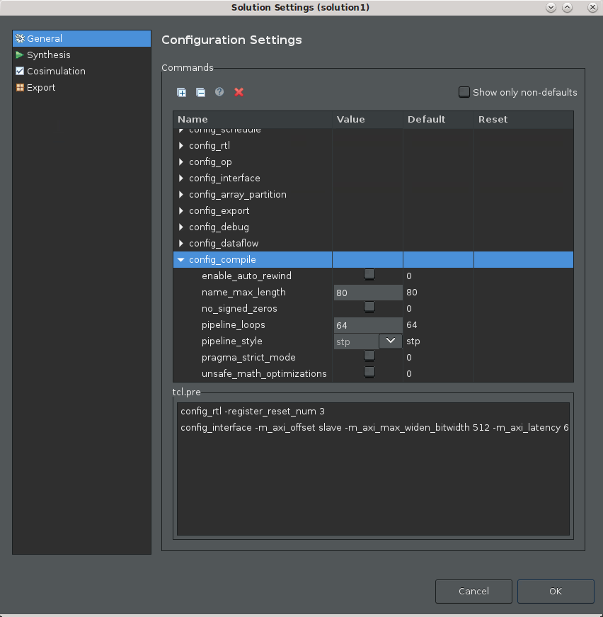
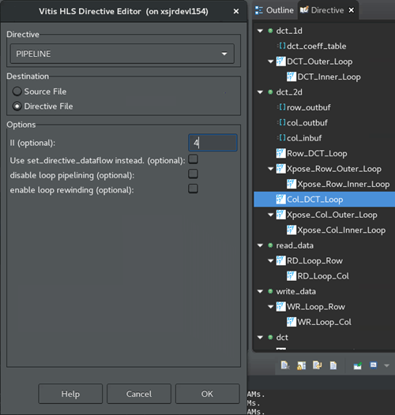
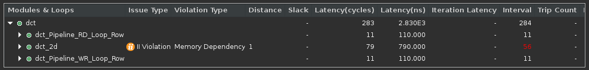
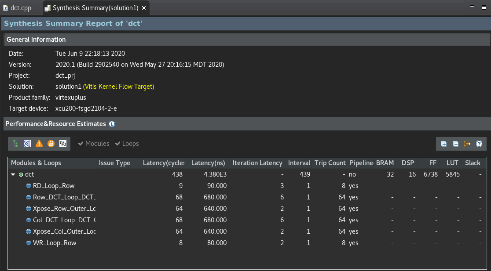

<table class="sphinxhide">
 <tr>
   <td align="center"><h1>2020.2 Vitis™ Application Acceleration Tutorials</h1>
   <a href="https://github.com/Xilinx/Vitis-Tutorials/tree/2020.1">See 2020.1 Tutorials</a>
  </td>
 </tr>
 <tr>
 <td>
 </td>
 </tr>
</table>

<!-- 
# Copyright 2021 Xilinx Inc.
# 
# Licensed under the Apache License, Version 2.0 (the "License");
# you may not use this file except in compliance with the License.
# You may obtain a copy of the License at
#
#     http://www.apache.org/licenses/LICENSE-2.0
#
# Unless required by applicable law or agreed to in writing, software
# distributed under the License is distributed on an "AS IS" BASIS,
# WITHOUT WARRANTIES OR CONDITIONS OF ANY KIND, either express or implied.
# See the License for the specific language governing permissions and
# limitations under the License.
-->

# 3. Using Optimization Techniques

This lab discusses various optimization techniques that you can use to reconcile any performance concerns with regard to your design.

## Configure the Pipeline Loops Threshold

1. In the Explorer view, right-click the project solution, or `solution1`, and select **Solution Settings**. 
    This opens the Solution Settings dialog box.

2. Select the **General** setting, and expand the **config_compile** setting as shown in the following figure.
   
    

3. In the **Configuration Settings** dialog box edit `pipeline_loops` to specify  `6`. This indicates that the tool should automatically unroll inner loops with six or fewer iterations. The default setting is 64.

5. Click **OK**  to add the `config_compile` command to limit the automatic loop pipelining as specified.

6. From the toolbar, click **C Synthesis**  to rerun the synthesis command and display the results.

    This configuration might be an acceptable response to II violations when the loops are not in the critical path of the design, or they represent a small problem relative to some larger problems that must be resolved. In other words, not all violations need to be resolved, and in some cases, not all violations can be resolved. They are simply artifacts of performance.

   

## Configure the Pipeline Initiation Interval

 >**ACTION**: Back out the change before proceeding, right-click on the solution. Select **Solution Settings** command, and reset the `config_compile pipeline_loop` command to its default value. 

Another possible optimization is to tell the tool that a specific number of clock cycles before processing another sample is acceptable, for example of two or four clock cycles. This eliminates II violations because the latency would then match your specification. The overall latency of an application indicates that perhaps II=4 for some loops is not really a problem.

In the last section, the **config_compile** command is a tool configuration command that affects the compilation of the whole design. This optimization uses a code directive applied to a specific portion of the source code rather than to the tool itself.

1. Open the Source Code Editor for the function.

   This can be done from the Explorer view by expanding the `Source` folder for the project, and double-clicking on the `dct.cpp` file to open it.

    With the Source Code Editor open, the right hand of the IDE also displays the Outline and Directive views for your code.

    * **Outline view**: Displays an outline of the displayed source code file. Select a region or function for quick navigation of the code.
    * **Directives view**: Select operations or elements of your code to assign `HLS pragmas` to your source code, or to assign `set_directive` commands to a Tcl script that is associated with the active solution. For more information, refer to [Adding Pragmas and Directives](https://www.xilinx.com/cgi-bin/docs/rdoc?v=2020.2;t=vitis+doc;d=optimizinghlsproject.html;a=gip1583519972576) in the Vitis HLS FLow of the Vitis Unified Software Platform Documentation (UG1416).

2. In the Directives view, right-click the `dct_2d` function, and select **Insert Directive**.

    The Vitis HLS Directive Editor is displayed.

    

3. For Directive, select the **PIPELINE** directive.

4. For Destination, select **Directive File**.
    This is the default.

    Directives let you create different solutions, with different directive files to optimize performance in different ways, and find the best solution. With HLS pragmas added directly into the source file, all solutions have the same optimizations. 

    >**TIP:** Late in your design process it is worth moving settled optimizations from the directive file to HLS pragmas in your C/C++ code, so the optimizations become part of your code. You will do this later in this tutorial.

5. In the II field, enter `4`. This defines an acceptable level of performance, and can eliminate II violations.

6. Click **OK** to apply the directive.
The `HLS PIPELINE II=4` is added to the Directive view.

7. Click **C Synthesis** to rerun synthesis.

    Notice the Interval column for the `dct_2d` function reads 4, but it is not reported as a problem.

    

## Assign Dual-Port RAMs with BIND_STORAGE

>**ACTION**: Back out the change before proceeding. Select the source code tab to make it active and display the Directive view. Right-click **HLS PIPELINE II=4** and select **Remove Directive**. 

In some designs, a Guidance message `Unable to schedule load operation...` indicates a load/load (or read/read conflict) issue with memory transactions. In these cases rather than accepting the latency, you could try to optimize the implementation to achieve the best performance (II=1).

The specific problem of reading or writing to memory can possibly be addressed by increasing the available memory ports to read from, or to write to. One approach is to use the BIND_STORAGE pragma or directive to specify the type of device resource to use in implementing the storage. BIND_STORAGE defines a specific device resource for use in implementing a storage structure associated with a variable in the RTL. For more information, refer to [BIND_STORAGE](https://www.xilinx.com/html_docs/xilinx2020_2/vitis_doc/hls_pragmas.html#chr1584844747152) in the Vitis HLS Flow of the Vitis Unified Software Platform Documentation (UG1416).

 

1. Select the **dct.cpp** tab to make the Code Editor active.

2. In the Directives view, right-click on the `col_inbuf` variable in the `dct_2d` function, and select **Add Directive**. 

    This displays the Vitis HLS Directive Editor.

3. For Directive, select **BIND_STORAGE**. 

4. For Destination, select **Directive File**. 

5. In **Options**, the variable you selected is listed. Specify the type of memory to use for the variable as dual-port RAM, `ram_2p`, and specify the implementation as `bram`. 

    You can optionally specify the latency, but leave it blank for now. 

6. Click **OK**. 

7. Repeat the process for the the `buf_2d_out` variable of the top-level `dct` function. 

    1. In the Directive view, select the `buf_2d_out` variable and add the **BIND_STORAGE** pragma to specify the dual-port RAM `ram_2p`, and implementation `bram`.

8. Click **Run C Synthesis** to rerun synthesis to see the results. 

## Assign an Array Partition

 >**ACTION:** Back out the change before proceeding. Select the Source Code tab to make it active and display the Directive view. Right-click on **HLS BIND_STORAGE** pragmas and select **Remove Directive**.  

Another approach to solve memory port conflicts is to use the ARRAY_PARTITION directive to reconfigure the structure of an array. ARRAY_PARTITION lets you partition an array into smaller arrays or into individual registers instead of one large array. This effectively either increases the amount of read and write ports for the storage and potentially improves the throughput of the design. 

However, ARRAY_PARTITION also requires more memory instances or registers, and so increases area and resource consumption. For more information, refer to [ARRAY_PARTITION](https://www.xilinx.com/html_docs/xilinx2020_2/vitis_doc/hls_pragmas.html#gle1504034361378) in the Vitis HLS Flow of the Vitis Unified Software Platform Documentation (UG1416). If partitioning large arrays, this can also increase the compile time.

1. In the Directives view, select the array variables, **col_inbuf** and **buf_2d_out**  from the associated II violations.

2. Right-click and select **Add Directive**.

    This opens the Vitis HLS Directive Editor as shown in the following figure. 

    

3. In the Vitis HLS Directive Editor, make the following selections:
    1. For Directive,  select **ARRAY_PARTITION**. 
    2. For Destination, select **Directive File**. 
    3. In  Options, the variable you previously selected should be listed. 
    1.Leave the dimension set to 1, the default value. 
    1. Specify a factor of **8**.
    2. Select **cyclic** for the type.
4. Click **OK** to close the form, and apply the directive. 

5. Repeat the steps above for the `buf_2d_out` variable. 

6. Click **C Synthesis** to rerun the synthesis to see the results.

7. Re-examine the Synthesis Summary report to see the details of your synthesized design.

     

    The reason for choosing a cyclic partition with a factor of 8 has to do with the code structures involved. The loop is processing an 8x8 matrix, which requires taking eight passes through the outer loop, and eight passes through the inner loop. By selecting a cyclic array partition, with a factor of 8, you are creating eight separate arrays that each get read one time per iteration. This eliminates any contention for accessing the memory during the pipeline of the loop.

## Next Step

Now that you have examined different optimizations for different issues in the design, there is one more optimization to explore: [the DATAFLOW optimization](./dataflow_design.md).
 

<b><a href="/README.md">Return to Main Page</a> — <a href="./README.md">Return to Start of Tutorial</a></b>

Copyright&copy; 2021 Xilinx
