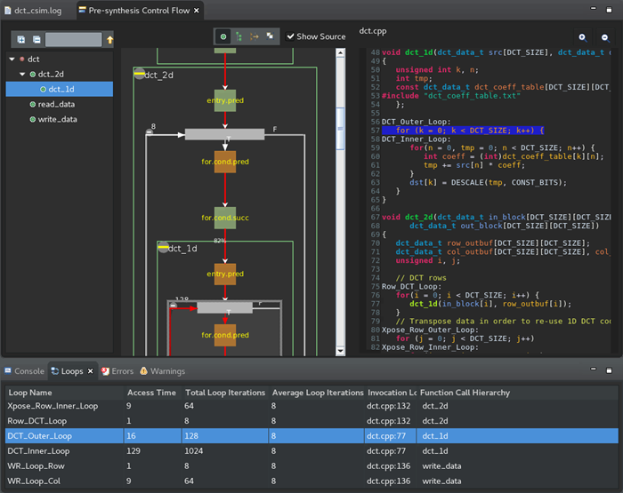
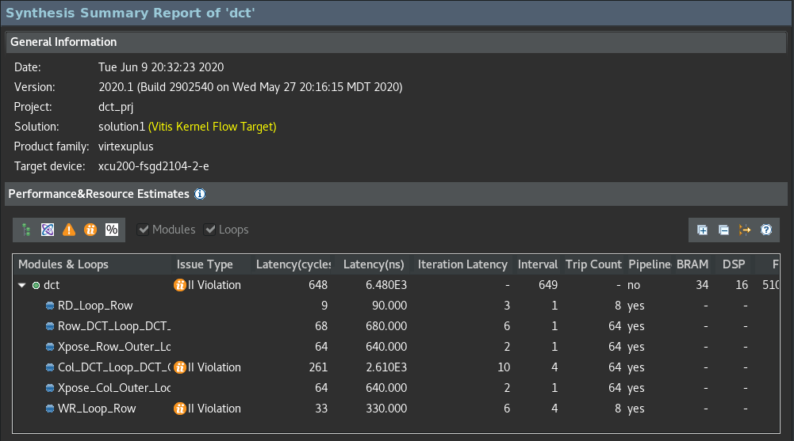
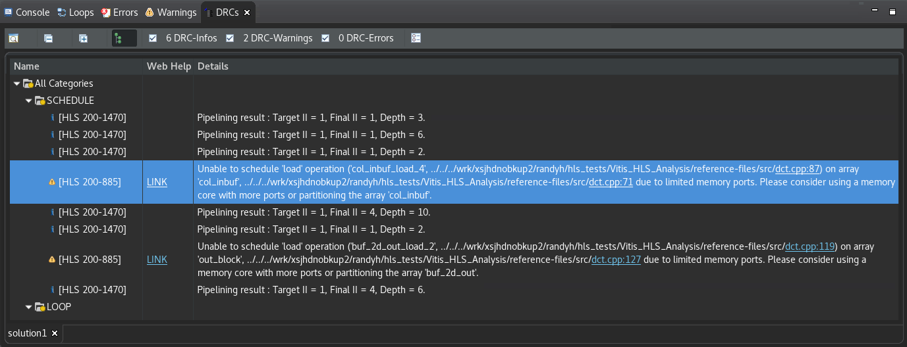

<table class="sphinxhide" width="100%">
 <tr>
   <td align="center"><h1>Vitis™ Application Acceleration Tutorials</h1>

   </td>
 </tr>
 <tr> 
 <td>
 </td>
 </tr>
</table>

# 2. Running Simulation, Synthesis and Analyzing Results

## Run the C Simulation

With the source code and testbench added to the project, you can now run the C simulation.
>TIP: For more information about the features of a well-written test bench, refer to [Writing a Test Bench](https://docs.xilinx.com/r/en-US/ug1399-vitis-hls/Writing-a-Test-Bench) in the Vitis HLS Flow of the Vitis Unified Software Platform Documentation (UG1416).

1. From the Flow Navigator, select **C-Simulation > Run C Simulation**. 

   The C Simulation Dialog is displayed.

    

2. Select the **Enable Pre-synthesis Control Flow Viewer** check box to produce a control flow view of your design after C simulation.

   >**NOTE**: This option is not available on Windows.

3. Click **OK**.

   After the simulation completes, the tool displays the `dct_csim.log` file with the results of simulation, and also displays the Pre-synthesis Control Flow graph. The log file displays print statements from the executed testbench, and information that the test passed.

   The Control Flow graph, as shown in the following figure, offers some insight into the control structure of your code. Take a look at to see how Vitis HLS understands your code.
   >**NOTE**: Control structure here refers to the branches in your code caused by various kinds of loops and conditional statements like `if` and `switch` statements.

     
4. Zoom in on the graph and examine the structure of the DCT function. It includes the following elements:

   * **read_data**: Reads the data from the DDR, as an array, and reformats it into a matrix.
   * **dct_2d**: Processes the matrix of values, applying the cosine transform to the matrix values.
   * **write_data**: Writes the results back to DDR, converting the matrix back into an array.

5. Look at the Loops view below the graph. 

   This view shows the loops found in the code, and displays some basic statistics related to the loop iterations, and timing. Vitis HLS automatically applies names to unlabeled loops, and associates these names with the loop. These names can then be used in the Tcl Console view to refer to the loop. If you select a loop in the view, the loop is also cross-selected in the control flow graph and the source code.

   Some of the key highlights of the Control Flow graph are as follows:

   * Shows the control paths in your C/C++ code (as indicated by the red arrows and is an artifact of code profiling). 

       * The percentages on the red arrows indicate the percentage of time that particular branch is taken versus the other branch. This gives you an idea of where the time is spent inside the design and the areas to focus on.
         
      >**NOTE**: Because this path is derived by running the testbench, this path is specific to your test.

   * Allows you to see where the memory reads/writes are in the control flow graph. This allows you to get a sense for memory port contention issues. 
       * If memory accesses are on different branches, then these accesses would be considered mutually exclusive (and therefore, no conflict can occur). 
       * If however, the memory accesses are on the same branch, then loop II violations can occur because of multiple memory accesses in the same sequential portion of the code. 

## Run C Synthesis

1. To run synthesis, simply click the **C Synthesis** toolbar button. 

   The C Synthesis dialog box is displayed.

    

2. Click **OK**.

   The synthesis command runs, and writes a transcript in the Console view. Examine the transcript to see what steps the tool takes during synthesis. The following list describes some of the steps listed:
   * Project and solution initialization loads source and constraints files, and configures the active solution for synthesis.
   * Start compilation reads source files into memory. 
   * Interface detection and setup reviews and generates port and block interfaces for the function. 
   * Burst read and write analysis for ports/interfaces.
   * Compiler transforms code to operations.
   * Performs Synthesizeability checks.
   * Automatic pipelining of loops at tripcount threshold.
   * Unrolling loops, both automatic and user-directed.
   * Balance expressions using associative and commutative properties. 
   * Loop flattening to reduce loop hierarchy.
   * Partial write detection (writing part of a memory word)
   * Finish architecture synthesis, start scheduling.
   * End scheduling, generate RTL code.
   * Report FMax and loop constraint status.

   The Vitis HLS tool also automatically inlines small functions, dissolving the logic into the higher-level calling functions, and pipelines small loops with limited iterations. These features are configurable by user directives or pragmas.

3. After synthesis completes, the Synthesis Summary report displays as shown in the following figure. Review the results.

   

   Notice that the various sub-functions from the Pre-synthesis control flow diagram are no longer reported in the synthesis results. This is because the tool has inlined these functions automatically. You can disable the inlining of specific functions by adding the INLINE OFF pragma or directive for the function, or by adding the DATAFLOW optimization to the design, which you will be doing later in this tutorial.

   The Vitis HLS tool also automatically pipelined loops that have fewer than a specified number of iterations. Pipelining loops with fewer than 64 iterations is the default setting. When pipelining, the tool tries to achieve an II of 1. The II is the number of clock cycles before the next iteration of the loop is processed. When pipelining the loop with `II=1`, you want the next iteration to start at the next clock cycle. 

## Analyze the Results

The Synthesis Summary report displays the results of synthesis, including performance and utilization estimates, and data related to interfaces and data transfer in the design. Now you can analyze the design to examine any reported issues.

1. At the bottom of the IDE, next to the Console view, select the **Guidance** view. This view reports a little more information related to any issues found in the design as shown in the following figure.

   >**TIP**: If the Guidance view is not displayed, select **Window** > **Show View** > **Guidance**.

    

   Guidance messages report issues found during synthesis, suggest possible remedies, and provide links to more detailed information.

2. From the Flow Navigator click the **C Synthesis > Reports and Viewers Schedule Viewer** command to display the Schedule Viewer.

   The left side of the Schedule Viewer lists each operation in chronological order in the synthesized function. It displays the design control steps presented horizontally as a timeline starting at step 0, and running through to completion. You can select operations from the list to view the connections between them.

   The default view shows all of the operations. However, a drop-down menu at the top of the Schedule Viewer lets you select specific functions, loops, or elements of the design that are of interest. 

   

## Next Step

Next, learn about [using optimization techniques](./optimization_techniques.md) to achieve your desired performance.
 

<b><a href="/README.md">Return to Main Page</a> — <a href="./README.md">Return to Start of Tutorial</a></b>

Copyright © 2020–2023 Advanced Micro Devices, Inc

<a href="https://www.amd.com/en/corporate/copyright">Terms and Conditions</a>

