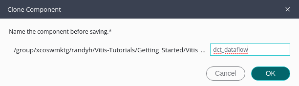

   <table class="sphinxhide" width="100%">
 <tr>
   <td align="center"><h1>Vitis™ Application Acceleration Tutorials</h1>

   </td>
 </tr>
 <tr>
 <td>
 </td>
 </tr>
</table>

# 4. Reviewing the DATAFLOW Optimization

As stated in [Abstract Parallel Programming Model for HLS](https://docs.amd.com/access/sources/dita/topic?Doc_Version=2024.1%20English&url=ug1399-vitis-hls&resourceid=kvc1662736907763.html), in order to achieve high performance hardware the HLS compiler must infer parallelism from sequential code and exploit it to achieve greater performance. The DATAFLOW optimization tries to create task-level parallelism where possible between the various functions in the code, on top of the loop-level parallelism of pipelining.

In the earlier steps, you found different ways to optimize the DCT algortithm so that you could achieve an II=1 with the pipelined loops. In this step, you use the DATAFLOW directive to enable task-level parallelism for functions or loops. For more information, refer to [syn.directive.dataflow](https://docs.amd.com/access/sources/dita/topic?Doc_Version=2024.1%20English&url=ug1399-vitis-hls&resourceid=nzf1677218684169.html) for more information.

## Clone Component for Design Exploration

The Vitis Components Explorer provides the **Clone Component** command, which lets you create a new component based on the current state and configuration of an existing component. The clone does not include prior results or reports. The cloned component also does not include the source code unless it was imported into the original HLS component when it was created. This means that any design changes to the cloned component must be added as directives to the config file rather than as pragmas to the source code in order to observe differences from the original component. 

 

1. Right-click the `dct` component in the Vitis Components Explorer and select **Clone Component**. 

You can specify a new component name to create a clone of the selected component, `dct-dataflow` in this example. 

2. After specifying a name, select **OK** to clone the component. 
 
**TIP:** The rule of thumb here would be to clone a component before embarking on some optimization experiment and make your changes in the clone. 

## Adding the Dataflow Directive

3.  In the Vitis Components Explorer select the new cloned components, `dct-dataflow` in this example, and select the `hls_config.cfg` file of the cloned component to open it. 

4.  In the Config Editor select **Add Item** for **Dataflow** to open the Directive Editor. In the HLS Directive view navigate to the `dct` function and select **Add Directive**. 
5.  In the Add Directive dialog box select the **DATAFLOW** pragma, and specify **Config File** as the location to add `syn.directive.dataflow`.

6. Rerun synthesis and review the reports. 

Notice that the Synthesis Summary report now displays a negative value in the Slack column, indicating a potential timing violation in the generated RTL design. As described in [Running Implementation](https://docs.amd.com/access/sources/dita/topic?Doc_Version=2024.1%20English&url=ug1399-vitis-hls&resourceid=stb1677606118821.html), the HLS compiler reports the results of high-level synthesis providing an estimate of the results with projected clock frequencies, timing, and resource utilization (LUTs, DSPs, BRAMs, etc). However, these results are only estimates because the tool cannot know what optimizations or routing delays will be in the final synthesized or implemented design. A more accurate estimate of the resources and timing of the RTL design can be provided by runing the design through synthesis or implementation in the Vivdao Design Suite. You will do this shortly to check the timing of the design. 

You should also notice the addition of the Dataflow Viewer report as a result of adding the Dataflow directive. However, as explained in [Dataflow Viewer](https://docs.amd.com/access/sources/dita/topic?Doc_Version=2024.1%20English&url=ug1399-vitis-hls&resourceid=twx1584322463297.html), you must run C/RTL Co-simulation in order to get details from the dataflow design. Examine the Dataflow Viewer report prior to running Co-simulation, and then again after. First you should configure the Co-simulation to perform as you want. 

## Run C/RTL Co-Simulation

7.  Open the Config File editor, an select the **C/RTL Co-Simulation** category on the left side. The options for Co-simulation are displayed on the right. 
8.  Select `enable_dataflow_profiling` to turn on the feature.
9.  Select `enable_fifo_sizing` to turn on this feature. 

11.  Select **Run** under C/RTL Co-Simulation in the Flow Navigator. 
 
The DATAFLOW optimization is a dynamic optimization that can only really be understood after C/RTL co-simulation which provides needed performance data. After co-simulation the columns of the Process table are populated with values from the simulation results. 

 

## View the Dataflow Graph

The Dataflow Viewer graph illustrates the overall topology of the DATAFLOW region and shows what type of channels (FIFO/PIPO) were inferred for communication between the tasks in the DATAFLOW region. Analyzing each channel and process can be useful to resolve issues such as deadlock or poor throughput because of bad FIFO sizing. The icons at the top-right of the Dataflow viewer provide a legend for the diagram and access to settings. 

The DataFlow Viewer displays the functions and the flow through the functions. After running C/RTL co-simulation, the elements of the graph are filled out with performance data, and the Process and Channel tables beneath the graph are also filled out. Without the performance data provided by co-simulation, the graph and tables will have NA values to reflect the missing values. 

The Dataflow Viewer enables the following throughput analysis options:
* The graph shows the overall topology of the DATAFLOW region and shows what type of channels (FIFO/PIPO) were inferred for communication between the tasks in the DATAFLOW region. Analyzing each channel and process can be useful to resolve issues such as deadlock or poor throughput due to bad FIFO sizing. 
* The co-simulation data helps with the FIFO sizing problem by tracking the maximum size of the FIFO during the course of the simulation and thereby giving the user a good reference point on how to size the FIFOs. In addition, when running co-simulation, automatic deadlock detection can highlight the processes and channels involved in the deadlock allowing the user to quickly narrow the focus and fix the issue. 
* In addition to FIFO sizing, the data reported after co-simulation also provides, on a per process and channel basis, the time spent stalling either waiting for input or blocked from writing output. The graph helps the user understand such issues and manage how the channels are sized to accommodate slow producers versus fast consumers and/or vice-versa. In addition, the graph is useful in understanding how reading from the input in the middle of a DATAFLOW region can impact performance. This is a fairly common scenario where performance can be impacted.  

## Running Implementation to Improve Timing and Resource Estimates

To check the timing error that was reported earlier, you can run Vivado Synthesis or Implementation on the RTL design. This lets the Vivado tool provide more detailed analysis of the RTL design after synthesis of the netlist, or place and route of the logic into a device. 

1. In the Config File Editor, select the **Implementation** heading and specify the `vivado.flow` to `Run only synthesis` or `Run full implementation`. 
2. Check the `max_timing_paths` to set or ensure it is set to the default value of 10 timing paths. This lets the tool return the 10 worst timing paths. 

3. In the Flow Navigator select **Run** under the Implementation heading.

The Vivado tool is launched with the RTL design, and synthesis and implementation are run on the design. Under the Report heading in the Flow Navigator you will find the **RTL Synthesis** report or the **Place and Route** report. Open either and scroll to the bottom to review the **Timing Paths** section of the report. This should confirm that there is no timing issue with the design. 

## Export the Vitis Kernel

Finally, you can export the results of the high-level synthesis as a synthesized Vitis kernel (`.xo`) file or Vivado IP (`.zip`) for use in downstream processes.

1. In the Config File Editor, select the **IP/XO Packaging** heading and enable the `output.syn` to generate the selected output file format. 
2. In the Flow Navigator select **Run** under the Package heading.

This time the IP or kernel is exported from the design. The green circle no longer shows the yellow warning triangle. An output has been generated. 

## Summary

In this tutorial:

1. You worked to optimize C/C++ code in the Vitis HLS tool, to synthesize it into RTL code for use in the Vitis application acceleration development flow. 
2. With the code optimized, you exported the compiled kernel object (`.xo`) file for use in a Vitis application project. 

These are the elements of building and accelerating applications and functions using the Vitis and Vitis HLS tools. You can mix the Vitis HLS kernels with RTL kernel objects (`.xo`) and uncompiled C/C++ kernel code (`.c`/`.cpp`) in the Vitis application project to create more complex accelerated applications. 

You have the optimized but uncompiled C++ code (`dct.cpp`) that you saved in an earlier step of this tutorial. You can remove the HLS kernel object and add this optimized C++ code in the Vitis application project if you prefer. In this case, the Vitis IDE will call Vitis HLS as part of the build process when compiling the C++ kernel code.  

 

<b><a href="/README.md">Return to Main Page</a> — <a href="./README.md">Return to Start of Tutorial</a></b>

Copyright © 2020–2023 Advanced Micro Devices, Inc

<a href="https://www.amd.com/en/corporate/copyright">Terms and Conditions</a>

