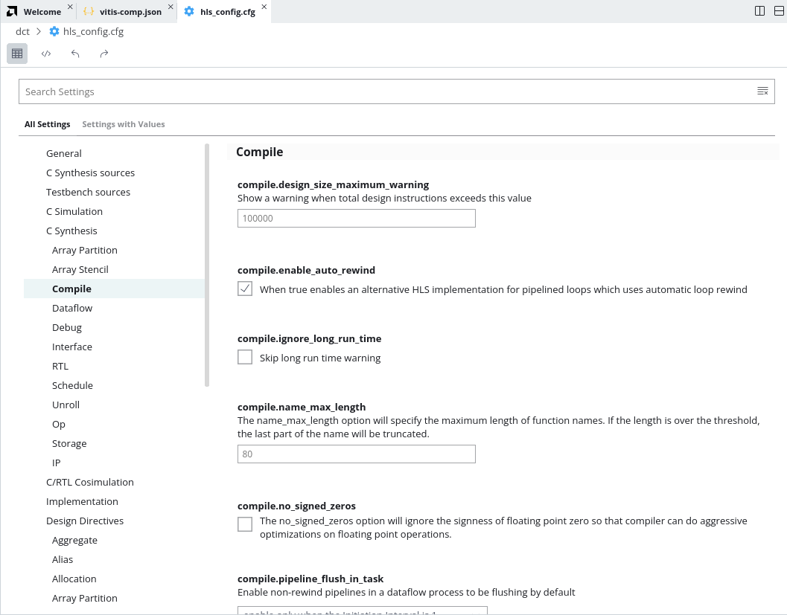
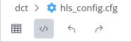
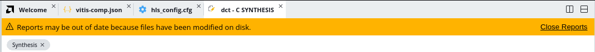

<table class="sphinxhide" width="100%">
 <tr>
   <td align="center"><h1>Vitis™ Application Acceleration Tutorials</h1>

   </td>
 </tr>
 <tr>
 <td>
 </td>
 </tr>
</table>


# 3. Using Optimization Techniques

This lab discusses various optimization techniques that you can use to reconcile performance concerns related to your design. You are going to be setting and changing configuration options in the `hls_config.cfg` file to drive the synthesis process using the Config File Editor. 

1.  Open the `hls_config.cfg` file. 

There are a number of ways to find the file. The last time you opened it from the `vitis-comp.json` of the HLS component. This time go to the Vitis Components Explorer, expand the HLS component folders, and click the `hls_config.cfg` file in the *Settings* folder. 

## Loop Pipeline

 

2.  Select the **Compile** category on the left side of the Config File Editor. 
3.  Locate the `compile.pipeline_loops` option and set it to 5. 

This indicates that the tool should automatically unroll loops with six iterations or more. The default setting is 64.

4.  Change the view of the Config Editor to the **Source Editor** by selecting the icon at the top of the editor window. 

 

This lets you examine and edit the `hls_config.cfg` as a text file file rather than through the GUI. Notice the addition of the `syn.compile.pipeline_loops=5` command in the config file. 

5.  In the Flow Navigator click the **Run** command under C Synthesis to rerun with the new directive.
6.  Examine the updated reports to see if there is any performance improvement. 

If any of the reports are opened when the tool regenerates them you will see an out-of-date notice appear in the open report. You will need to close the report and then reopen it.

 

## Pipeline Directive

**ACTION:** Back out the prior change before proceeding. Go back to the Config Editor window and hover your mouse to the left of the `compile.pipeline_loops` command to display and click the **More Actions** command. Click the **Reset to Default** command. Alternatively, you can just remove the command from the `hls_config.cfg` file. 

Another possible optimization is to tell the tool that a function or loop should occur before processing another sample. The `Pipeline` pragma or directive defines an acceptable level of performance, and can eliminate II violations from the reports because the latency would then match your specification. The overall latency of an application could indicate that perhaps `II=4` is acceptable for some loops.

This configuration might be an acceptable response to II violations when the loops are not in the critical path of the design, or they represent a small problem relative to some larger problems that must be resolved. In other words, not all violations need to be resolved, and in some cases, not all violations can be resolved. They are simply artifacts of performance.

7.  In the Settings Form of the Config File Editor go to the bottom of the categories on the left side and go to **Design Directives > Pipeline**. This shows the `hls.syn.directive.pipeline` with the syntax of options and accepted values. 

8.  Click **Add Item** under Pipeline. This displays a text entry box

9.  Type the following text: 
```
dct_2d II=4
```

10. Click **OK**

When using the GUI to edit the `hls_config.cfg` file you can enter the options in abbreviated form as shown above. The GUI adds the complete directive. When editing the text file you must use the whole command as shown in the text editor: 
```syn.directive.pipeline=dct_2d II=4```

11.  In the Flow Navigator click the **Run** command under C Synthesis to rerun with the new directive.
12.  Examine the updated reports to see if there is any performance improvement.

## Assign Dual-Port RAMs with BIND_STORAGE

**ACTION:** Back out the prior change before proceeding. 

In some designs, a Guidance message `Unable to schedule load operation...` indicates a load/load (or read/read conflict) issue with memory transactions. In these cases rather than accepting the latency, you could try to optimize the implementation to achieve the best performance (II=1).

The specific problem of reading or writing to memory can possibly be addressed by increasing the available memory ports to read from, or to write to. One approach is to use the BIND_STORAGE pragma or directive to specify the type of device resource to use in implementing the storage. BIND_STORAGE defines a specific device resource for use in implementing a storage structure associated with a variable in the RTL. For more information, refer to [BIND_STORAGE](https://docs.xilinx.com/r/en-US/ug1399-vitis-hls/pragma-HLS-bind_storage). 

Looking at the Bind Storage section of the Synthesis report you can see that the tool has implemented the `buf_2d_in` variable with a `ram_s2p`. This allows reading on one port while writing on the other. But the RAM_2P allows simultaneous reading on both ports, or reading on one and writing on the other. This might offer some performance improvement. 

13.  In the Config Editor, select the **Bind_Storage** directive and enter the following text:
`dct buf_2d_in impl=bram type=ram_2p`

**TIP:** You can also edit the `hls_config.cfg` file and add the following line directly: `syn.directive.bind_storage=dct buf_2d_in impl=bram type=ram_2p`

14. Run C Synthesis again, and again this has resulted in a modest improvement. 
 
## Using Array_Partition

Another approach to solve memory port conflicts is to use the `Array_Partition` directive to reconfigure the structure of an array. `Array_Partition` lets you partition an array into smaller arrays or into individual registers instead of one large array. This effectively either increases the amount of read and write ports for the storage and potentially improves the throughput of the design. However, `Array_Partition` also requires more memory instances or registers, and so increases area and resource consumption. For more information, refer to [ARRAY_PARTITION](https://docs.xilinx.com/r/en-US/ug1399-vitis-hls/pragma-HLS-array_partition).

15. Open the Config File editor and add to the `Array_Partition` directives as follows: 
```
dct_2d col_inbuf dim=1 factor=8 type=cyclic
dct buf_2d_out dim=1 factor=8 type=cyclic
```

The reason for choosing a cyclic partition with a factor of 8 has to do with the code structures involved. The loop is processing an 8x8 matrix, which requires taking eight passes through the outer loop, and eight passes through the inner loop. By selecting a cyclic array partition, with a factor of 8, you are creating eight separate arrays that each get read one time per iteration. This eliminates any contention for accessing the memory during the pipeline of the loop. 

Run synthesis and re-examine the Synthesis Summary report to see the results of this latest change. 

**ACTION:** Back out the prior change before proceeding. 

## Next Step

Now that you have examined different optimizations for different issues in the design, there is one more optimization to explore: [the DATAFLOW optimization](./unified-dataflow_design.md).
</br>
<hr/>
<p align="center" class="sphinxhide"><b><a href="/README.md">Return to Main Page</a> — <a href="./README.md">Return to Start of Tutorial</a></b></p>


<p class="sphinxhide" align="center"><sub>Copyright © 2020–2023 Advanced Micro Devices, Inc</sub></p>

<p class="sphinxhide" align="center"><sup><a href="https://www.amd.com/en/corporate/copyright">Terms and Conditions</a></sup></p>

