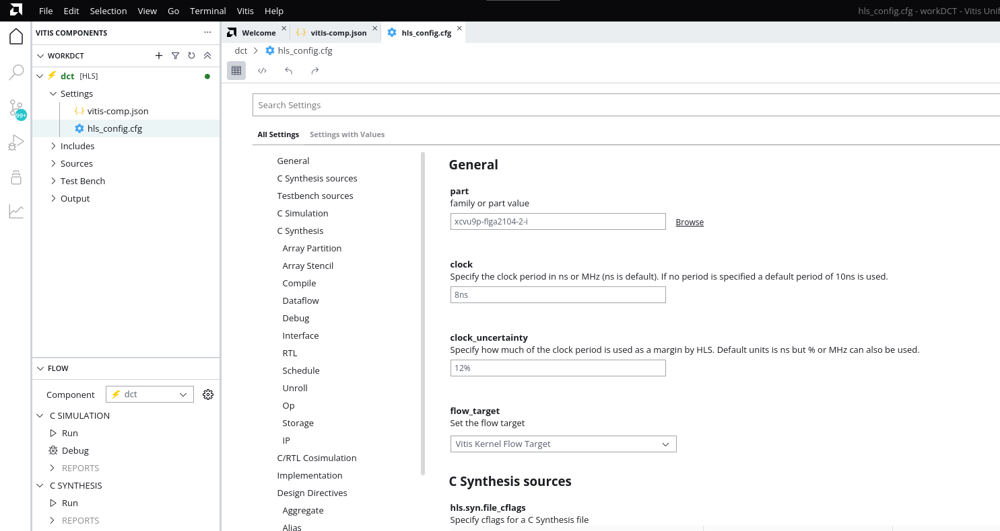
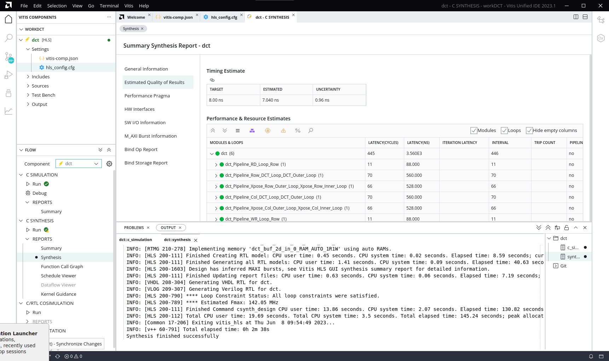
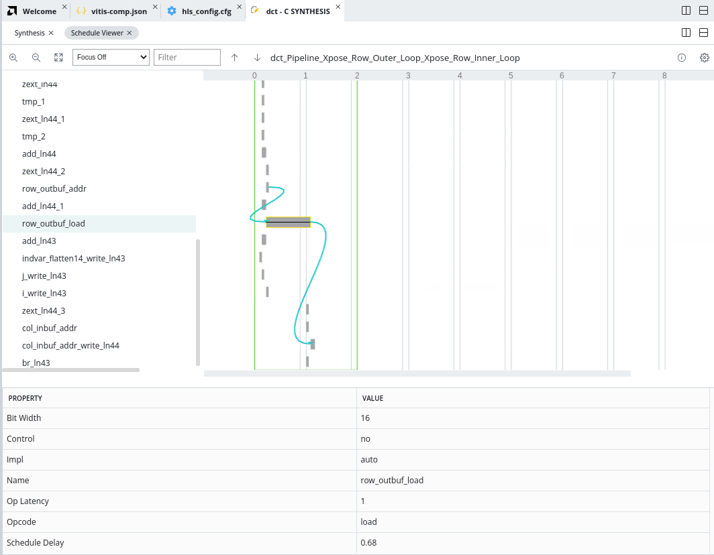

<table class="sphinxhide" width="100%">
 <tr>
   <td align="center"><h1>Vitis™ Application Acceleration Tutorials</h1>

   </td>
 </tr>
 <tr> 
 <td>
 </td>
 </tr>
</table>


# 2. Running Simulation, Synthesis and Analyzing Results

## Run the C Simulation

You are ready to run C Simulation on the project, but first you can configure the simulation by editing the `hls_config.cfg` file. 

In the open `vitis-comp.json` for the `dct` component click the `hls_config.cfg` link to open the Configuration Editor. On the left is a list of categories for configuring the HLS component, and on the right are the various configuration options. 

   

You can see the General settings of the dct component reflect the part, clock and flow_target settings you specified when creating the HLS component. Scroll down and you can see the C Synthesis sources and Testbench sources you added as well.

1.  On the left, select the **C Simulation** category. 
2.  Review the various simulation settings. 
3.  Select the checkbox for **Enable Profiling**. 

Look at the Flow Navigator with the dct component active. It displays the C Simulation step, C Synthesis, C/RTL Co-simulation, and Implementation as the primary steps of the HLS component workflow. 

4.  Click **Run** under C SIMULATION. 

The Output window is displayed in the console area, and the `dct::c_simulation` transcript is displayed. You can review the transcript as simulation occurs. 

After simulation completes the Reports beneath C Simulation show a summary you can view. It merely shows the command used to launch C simulation and the timestamp of the run. In the Vitis unified IDE the simulation uses the following command line: 
```
vitis-run --mode hls --csim --work_dir dct \
--config <tutorial_path>/Getting_Started/Vitis_HLS/reference-files/workDCT/dct/hls_config.cfg
```

## Run C Synthesis

5.  After simulation completes, click **Run** under C Synthesis. 

The default output format for C synthesis is RTL. This is to let you evaluate the results of high-level synthesis before exporting the Vivado IP or Vitis kernel for further use in an embedded system design or Data Center acceleration. 

Again, you can view the `dct::synthesis` transcript displayed in the Output window as the design is synthesized. Examine the transcript to see what steps the tool takes during synthesis. The following list describes some of the steps listed:
* Project and solution initialization loads source and constraints files, and configures the active solution for synthesis.
* Start compilation reads source files into memory. 
* Interface detection and setup reviews and generates port and block interfaces for the function. 
* Burst read and write analysis for ports/interfaces.
* Compiler transforms code to operations.
* Performs Synthesizeability checks.
* Automatic pipelining of loops at tripcount threshold.
* Unrolling loops, both automatic and user-directed.
* Balance expressions using associative and commutative properties. 
* Loop flattening to reduce loop hierarchy.
* Partial write detection (writing part of a memory word)
* Finish architecture synthesis, start scheduling.
* End scheduling, generate RTL code.
* Report FMax and loop constraint status.

The Vitis HLS tool also automatically inlines small functions, dissolving the logic into the higher-level calling functions, and pipelines small loops with limited iterations. These features are configurable by user directives in the `hls_config.cfg` file, or pragmas in the `dct.cpp` source.

After synthesis completes you will see the Run command marked with a green circle and a checkmark to indicate it has been succesfully run. However it will also have a yellow Caution triangle to indicate that the `output.format` was RTL and no IP or XO was generated from the design. This output will need to be generated before the HLS component can be used in downstream tools such as the Vivado Design Suite, or in a System project. 

After synthesis completes you will also see Reports under C Synthesis is populated with a Summary report, Synthesis, Function Call Graph, Schedule Viewer, Dataflow Viewer (for Dataflow designs), and Kernel Guidance. You can click to view any of these reports. 

6.  Open the Synthesis report. This is the Synthesis Summary report that would previously open after synthesis. Now you can access the report when needed. 

   

Look at the top of the Performance and Resource Estimates table in the figure above. It displays a number of icons that enable different features of the report. Also notice the icon on the Timing Report that changes timing from ns to MHz.  

Notice that the various sub-functions from the `dct.cpp` source are not reported in the synthesis results. This is because the tool has inlined these functions automatically. You can disable the inlining of specific functions by adding the INLINE OFF pragma or directive for the function, or by adding the DATAFLOW optimization to the design, which you will be doing later in this tutorial.

The HLS tool also automatically pipelined loops that have fewer than a specified number of iterations. Pipelining loops with fewer than 64 iterations is the default setting. When pipelining, the tool tries to achieve an II of 1. The II is the number of clock cycles before the next iteration of the loop is processed. When pipelining the loop with `II=1`, you want the next iteration to start at the next clock cycle. 

## Analyze the Results

7.  In the Flow Navigator, select the **Schedule Viewer** report. 

The left side of the Schedule Viewer lists each operation in chronological order in the synthesized function. It displays the design control steps presented horizontally as a timeline starting at step 0, and running through to completion. You can select operations from the list to view the connections between them.

The default view shows all of the operations. However, a drop-down menu at the top of the Schedule Viewer lets you select specific functions, loops, or elements of the design that are of interest. 

   

## Next Step

Next, learn about [using optimization techniques](./unified-optimization_techniques.md) to achieve your desired performance.
</br>
<hr/>
<p align="center" class="sphinxhide"><b><a href="/README.md">Return to Main Page</a> — <a href="./README.md">Return to Start of Tutorial</a></b></p>


<p class="sphinxhide" align="center"><sub>Copyright © 2020–2023 Advanced Micro Devices, Inc</sub></p>

<p class="sphinxhide" align="center"><sup><a href="https://www.amd.com/en/corporate/copyright">Terms and Conditions</a></sup></p>
