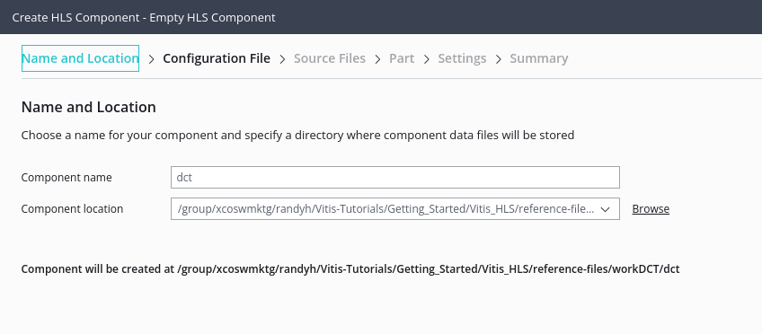
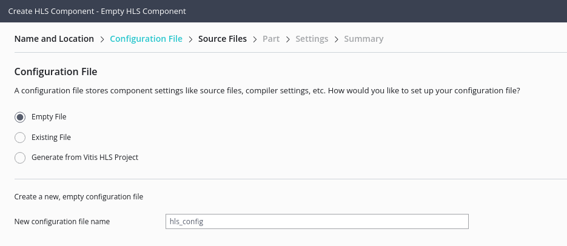
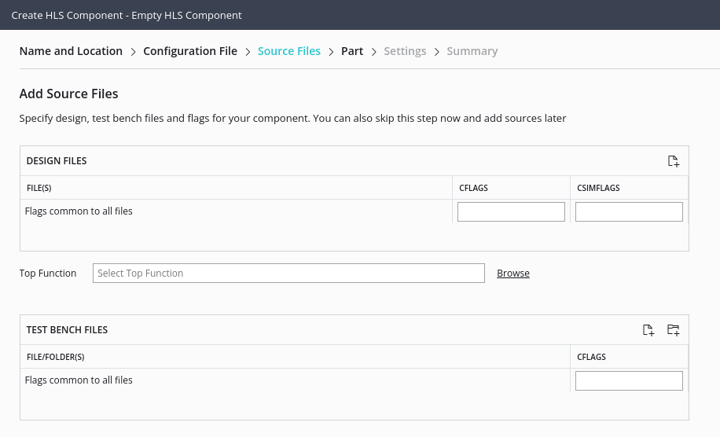
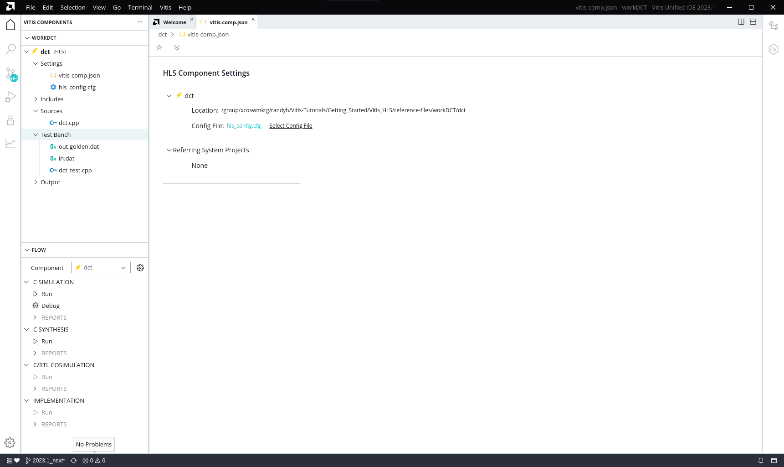

<table class="sphinxhide" width="100%">
 <tr>
   <td align="center"><h1>Vitis™ Application Acceleration Tutorials</h1>

   </td>
 </tr>
 <tr>
 <td>
 </td>
 </tr>
</table>

<!-- 
#/*
# Copyright (C) 2023, Advanced Micro Devices, Inc. All rights reserved.
# SPDX-License-Identifier: X11
#*/
-->

# 1. Creating an HLS Component in the Vitis Unified IDE

High-Level Synthesis (HLS) is a key part of the Vitis application acceleration development flow. The tool is responsible for compiling C/C++ code into an RTL module for implementation in the programmable logic (PL) region of Xilinx devices or platforms. 

In the new Vitis IDE the PL kernel is created as an HLS component, letting you run C simulation on your C/C++ source code, optimize your design with pragmas or directives, synthesize and analyze the results, and export the design as either an RTL IP for implementation in the PL region of AMD devices, or as a Vitis kernel (`.xo`) file for use in a higher-level System project. 

The first step is to create a workspace for your project, and to launch the Vitis unified IDE using the following steps: 

1. Create a workspace: `mkdir <tutorial_path>/Getting_Started/Vitis_HLS/reference_files/workDCT`
2. Launch the Vitis unified IDE: `vitis -new -w workDCT`

The workspace is a folder for holding the various components and projects of a design. 

**TIP:** The workspace is simply the place where you will store the files related to creating and building your project, or multiple projects. However, file watcher limitations can occur if you create a project with too many files as described in the [*Limitations and Known Issues*](https://docs.xilinx.com/r/en-US/ug1553-vitis-ide/Limitations-and-Known-Issues). 

The Vitis Unified IDE opens displaying the Welcome page. Use the **File > New Component > HLS** to create a new HLS component. This opens the Create HLS Component wizard to the *Name and Location* page. 

 

3. For the **Component name** field specify `dct`
4. For the **Component location** specify the workspace (default value)
5. Click Next to open the *Configuration File* page

The *Configuration File* lets you specify commands for building and running the HLS component as described in [*v++ Mode HLS*](https://docs.xilinx.com/r/en-US/ug1553-vitis-ide/v-Mode-HLS). You can specify a new empty file, an existing config file, or generate a config file from an existing HLS project as described in [*Creating an HLS Component*](https://docs.xilinx.com/r/en-US/ug1553-vitis-ide/Creating-an-HLS-Component).

 

6.  Select **Empty File** and click **Next**. 

This opens the *Source Files* page. 

 

In this tutorial, you are working with a simple discrete cosine transform (DCT) algorithm that processes an input matrix of values, applies fixed coefficients, and returns a matrix of modified values. In the `reference_files/src` folder, the `dct.cpp` contains the top-level DCT function.

7.  Select the **Add Files** icon to open a file browser, navigate to `<tutorial_path>/Getting_Started/Vitis_HLS/reference_files/src/dct.cpp` and select **Open** to add the file. 

8.  Under the Top Function browse and select the `dct(short*, short*)` function and click **OK**.  

9. Under the Test Bench Files select the **Add Files** icon to open a file browser and select the following three files: 
      * `dct_test.cpp` is a test bench for the design that iterates through the kernel multiple times. 
      * `in.dat` provides the input values to be processed by the kernel. 
      * `out.golden.dat` provides known output results to use for comparing the output of the dct function against.

Writing a good testbench can greatly increase your productivity because C functions execute in orders of magnitude faster than RTL simulations. Using C to develop and validate the algorithm before synthesis is much faster than developing and debugging RTL code. For more information, refer to [Writing a Testbench](https://docs.xilinx.com/r/en-US/ug1399-vitis-hls/Writing-a-Test-Bench).

10. Click **Next** to open the the *Select Part* page to select the default part and click **Next** to open the *Settings* page. 

11.  On the *Settings* page select the `Vitis Kernel Flow`, but do not enable the check box to `Run Additional Packing Step to create .xo output` as this is something you will do later in the tutorial. 

12.  Under the Clock settings specify `8ns` for the Period, and `12%` for the Uncertainty to override the default values. 

The default clock uncertainty, when it is not specified, is 27% of the clock period. For more information, refer to [Specifying the Clock Frequency](https://docs.xilinx.com/r/en-US/ug1399-vitis-hls/Specifying-the-Clock-Frequency)

13. Click **Next** to open the *Summary* page. Review the *Summary* page and click **Finish** to create the defined HLS component.

The HLS component is created and opened as shownin the figure below.

 

 In the Vitis Components Explorer you can see the `dct` component created, with the `vitis-comp.json` file opened in the center editor. You can see the `hls-config.cfg` file which is where the build directives will be placed to control the simulation and synthesis process. You can also see the Sources folder and the Test Bench files that were added as the component was created. 

The Flow Navigator displays the dct component as the active component, and shows the flow for designing the HLS component including C Simulation, C Synthesis, C/RTL Co-simuation, and Implementation. You will walk through each of these steps in the following sections. 

## Conclusion

You created the DCT project, targeted your AMD device or board, and configured the solution characteristics. You are ready to move to the next lab, [Running Simulation, Synthesis and Analyzing Results](./unified-synth_and_analysis.md).
 

<b><a href="/README.md">Return to Main Page</a> — <a href="./README.md">Return to Start of Tutorial</a></b>

Copyright © 2020–2023 Advanced Micro Devices, Inc

<a href="https://www.amd.com/en/corporate/copyright">Terms and Conditions</a>

