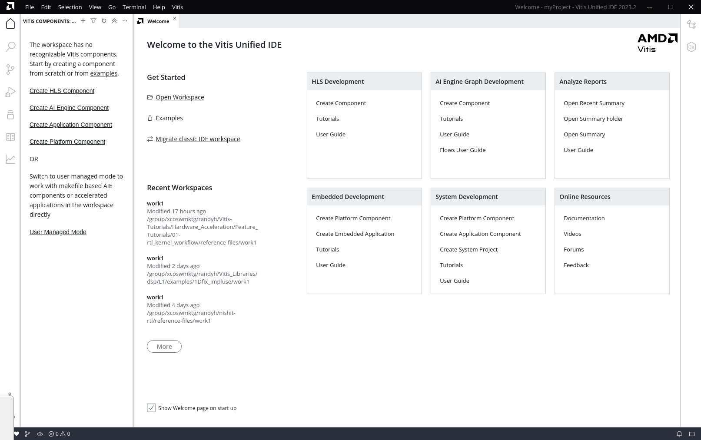
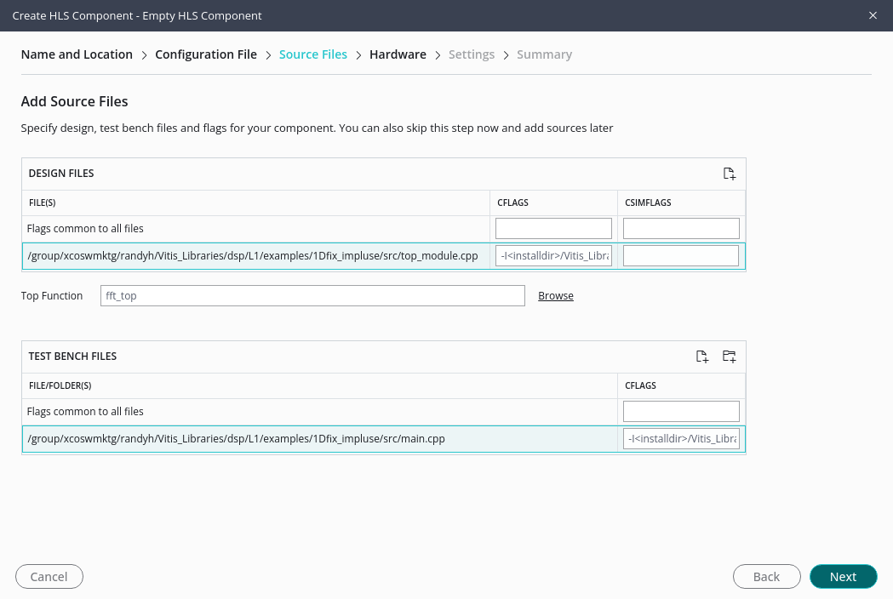
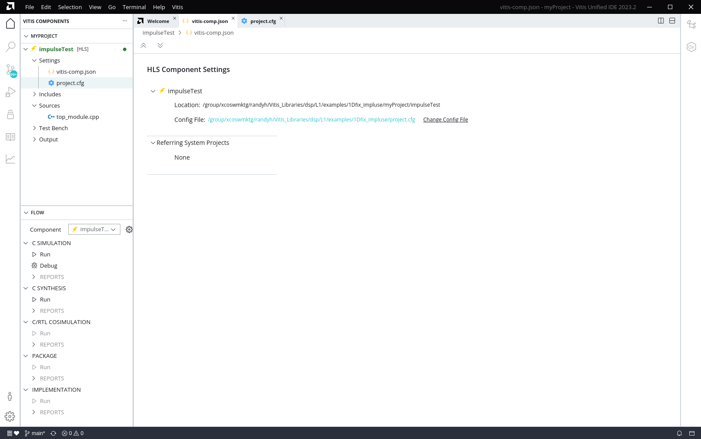
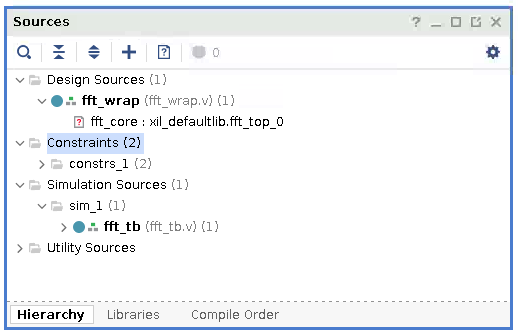

<table class="sphinxhide" width="100%">
 <tr>
   <td align="center"><h1>Vitis™ Application Acceleration Tutorials</h1>
   </td>
 </tr>
</table>

**Note:** This tutorial has been updated for use with the Vitis unified IDE in the 2023.2 release. To use this tutorial with the classic Vitis and Vitis HLS tools refer to the 2023.1 version of the tutorial. 

# Getting Started With Vitis Libraries

***Version: Vitis 2023.2***

This tutorial focuses on how to leverage the AMD Vitis™ Libraries to build your own design. The tutorial will use FFT's L1 library as an example. It contains instructions from cloning the library, compile, and simulate on its own till instantiate it into top-level design.

## Before You Begin

### Setup Environment
Before playing with the libraries, set up the Vitis environment first. For instructions on setting up the Vitis environment, refer to [Setting Up the Vitis Environment](https://docs.xilinx.com/access/sources/dita/topic?Doc_Version=2023.2%20English&url=ug1393-vitis-application-acceleration&resourceid=zks1565446519267.html).
Below are the example scripts to set up Vitis and XRT:

```
$ source <Vitis Tool Installation Path>/Vitis/2023.2/settings64.sh
$ source /opt/xilinx/xrt/setup.sh
$ export PLATFORM_REPO_PATHS=<Platform Installation Path>

```

### Get Vitis Libraries

Now clone the Vitis Libraries into local path.

The Vitis Library is open source on AMD GitHub: https://github.com/Xilinx/Vitis_Libraries. 

Assuming that you are using `<installdir>` as working directory, then use following command to clone the Vitis Library repository into the working directory:

```
cd <installdir>
git clone https://github.com/Xilinx/Vitis_Libraries.git
```

This takes a few minutes for downloading depending on your network. 
After it is completed, browse into the sub folders to get familiar with the file structure.

~~~
Vitis_Libraries/
├── Jenkinsfile
├── LICENSE.txt
├── README.md
├── blas/
├── codec/
├── data_analytics/
├── data_compression/
├── data_mover/
├── database/
├── dsp/
├── graph/
├── hpc/
├── motor_control/
├── quantitative_finance/
├── security/
├── solver/
├── sparse/
├── ultrasond/
├── utils/
└── vision/
~~~

Libraries are written in C++ and typically contain three levels of abstractions:

* L1: Module level, it provides optimized hardware implementation of the core LZ based and data compression specific modules like lz4 compress and snappy compress.
* L2: Kernel level, a demo on lz4, snappy, zlib, and zstd data compression algorithms are shown via kernel, which internally uses the optimized hardware modules.
* L3: The software API level wraps the details of offloading acceleration with prebuilt binary (overlay) and allows users to accelerate data compression tasks on the AMD Alveo™ cards without hardware development.

In this lab, you are going to use the **dsp** library. So enter the the sub-directory *dsp*, and you can find following directory structure.

~~~
dsp/
├── Jenkinsfile
├── L1/
│   ├── README.md
│   ├── examples/
│   ├── include/
│   ├── meta/
│   ├── src/
│   └── tests/
├── L2/
│   ├── README.md
│   ├── benchmarks/
│   ├── examples/
│   ├── include/
│   ├── meta/
│   └── tests/
├── LICENSE.txt
├── README.md
├── docs/
│   ├── Doxyfile
│   ├── Makefile
│   ├── Makefile.sphinx
│   ├── README.md
│   └── src/
├── ext/
│   ├── README.md
│   ├── make_utility/
│   └── xcl2/
└── library.json
~~~

## Create and run an HLS Component

In this step, you are going to create an HLS component by using the files provided in the [1Dfix_impluse](https://github.com/Xilinx/Vitis_Libraries/tree/main/dsp/L1/examples/1Dfix_impluse) L1 examples of the Vitis `dsp` library. The source files and script file are all located under this folder. Here, it is assumed that you have cloned the Vitis Libraries into *<installdir>/Vitis_Libraries* directory.

1. Go into the `<installdir>/Vitis_libraries/dsp/L1/examples/1Dfix_impluse` folder, create a directory to use as a workspace, and launch the Vitis unified IDE to create an HLS component as described in [Building and Running an HLS Component](https://docs.xilinx.com/access/sources/dita/topic?Doc_Version=2023.2%20English&url=ug1399-vitis-hls&resourceid=aeg1676136124434.html).

```
 mkdir myProject
 vitis -w myProject
```
 
The Vitis unified IDE opens as shown below. 
 
 
 
 2. Select **File > New Component > HLS** to create a new HLS component. 
 
 This opens the **Name and Location** page of the **Create HLS Component** wizard 
 * Enter the **Component name:** `implTest`
 * Enter the **Component location:** *Leave as set for the workspace*
 * Click **Next** to move forward
 
 This opens the **Configuration File** page
 * Select the **Empty File** radio button
 * Leave the **New configuration file name** as the default: `hls_config`
 * Click **Next** to move forward
 
 This opens the **Add Source Files** page
 * Under **Design Files** select the **Add Files** command icon, 
 * Browse to the `examples/1Dfix_impluse/src` folder, select the `top_module.cpp` file, and click **Open** to add the file and close the dialog. 
 * In the **CFLAGS** entry field next to the `top_module.cpp` file, paste the following text to provide an include path:
    `-I<installdir>/Vitis_Libraries/dsp/L1/include/hw/vitis_fft/fixed`
 
 * Select **Browse** next to **Top Function**
 * Select the `fft_top(int * int *)` top module, and select **OK** to close the dialog box
 
 * Under **Test Bench Files** select the **Add Files** command icon
 * Browse to `examples/1Dfix_impluse/src` folder, select the `main.cpp` file, and click **Open** to add the file and close the dialog.
 * In the **CFLAGS** entry field next to the `main.cpp` file, paste the following text to provide an include path:
    `-I<installdir>/Vitis_Libraries/dsp/L1/include/hw/vitis_fft/fixed`
 * Click **Next** to move forward. 
 
  

 This opens the **Hardware** page
 * Click **Next** to accept the default part and move forward. 
 
 This opens the **Settings** page. 
 * Click **Next** to accept all defaults and move forward. 
 
 This opens the **Summary** page. 
 * Review the page contents and click **Finish** to create the HLS component as defined. 
 

 3. The HLS component is created in the Vitis unified IDE and opened in the Flow Navigator. 
 
  
 
 You can browse into the Settings, view the  and open the `top_module.cpp` file by selecting the source file in the Vitis Components Explorer view. The `top_module.cpp` calls the FFT library and the parameters are defined in the `data_path.hpp` file. For detailed instructions on using the FFT library, refer to the  [Vitis Library](https://docs.xilinx.com/r/en-US/Vitis_Libraries/dsp/user_guide/L1.html_5).

 * In Flow Navigator select **Run** under the **C Simulation** heading 
 * Select **Run** under the **C Synthesis** heading
 * Select **Run** under the **C/RTL Co-simulation** heading
 
 After C/RTL Co-Simulation, the following results are returned. 
~~~
...

===============================================================
--Input Impulse:
(1,0)
(0,0)
(0,0)
(0,0)
(0,0)
(0,0)
(0,0)
(0,0)
(0,0)
(0,0)
(0,0)
(0,0)
(0,0)
(0,0)
(0,0)
(0,0)
===============================================================
===============================================================
--Output Step fuction:
(1,0)
(1,0)
(1,0)
(1,0)
(1,0)
(1,0)
(1,0)
(1,0)
(1,0)
(1,0)
(1,0)
(1,0)
(1,0)
(1,0)
(1,0)
(1,0)
===============================================================
INFO: [COSIM 212-1000] *** C/RTL co-simulation finished: PASS ***

...

~~~

The testbench uses a single pulse signal as input to the FFT and the output should be a step signal. And these can be verified by looking at the values printed out to the screen.

4. View the Waveform during C/RTL Co-Simulation (optional)

 Open the `hls_config.cfg` configuration file by selecting it under the Settings heading in the Vitis Components Explorer view, or by selecting it from the open `vitis-comp.json` file for the HLS component. 
 * Scrool down to the **C/RTL Cosimulation** section of the Config File editor
 * Under **trace_level** select **all**
 * Enable the **wave_debug** option
 * In the Flow Navigator select **Run** under the **C/RTL Co-simulation** heading
 
In this way, you get the simulation waveform, such as the following example for a single SSR stream port:


Use the interface signals behavior in co-simulation waveform as a reference for the Vivado simulation testbench.

5. Export the HLS Component as a Vivado IP

Now that you have verified that the library IP is working properly you can export your design to a Vivado™ IP. 
* Click **Run** under the **Package** heading in the Flow Navigator

By default the IP is exported to the `myProject/implTest/fft_top` folder to the `fft_top.zip` file. This file contais the zipped contents of the Vivado IP, and can be added to your IP Catalog for use in the Vivado Design Suite RTL designs and IP Integrator designs. 

## Use the Exported IP in the Vivado Design Suite

**Note:** This portion of the tutorial requires you to be in the `<installdir>/Vitis_Tutorials/Getting_Started/Vitis_Libraries` folder.

1. Use the following commands to create  a top level Vivado project using provided RTL source files:
```
mkdir vivado
cd ./vivado
vivado &
```

Create a new project with default project name *project_1* and select the type as ***RTL Project*** with ***Do not specify sources at this time*** box checked. Select ***xcvu9p-flgc2104-2-e*** as the part of this project. You can select other parts as well.

Now the project has been created, add the source files into the project. 
 * From `PROJECT MANAGER` > `Add Sources`  select `Add or create design sources` and click **Next**
 * Click `Add Files` to add the ***fft_wrap.v*** which is located under ***src*** folder of this tutorial. 
 * Then select `Add or create simulation sources` menu and click `Add Files` to add the ***fft_tb.v*** into the project. 
 * Use the same procedure to add the ***datain.txt*** and ***dataref.txt*** files into the project as constraints.
 


The ***fft_wrap.v*** instantiates the `fft_top` IP that was exported from the HLS component. However, you must first set up the IP repo path to let Vivado find it, and add it to your design. To do so, click **Settings** from Flow Navigator panel and add the IP export folder to the repo path.


Then click `IP Catalog` from Flow Navigator and you should see the FFT IP shown in the User Repository.


Double click on the IP and click `OK` to add it into the project. Now you should see that the IP core was correctly instantiated in the project hierarchy view.

2. Open the **fft_wrap.v** file to take a look at its port signals. 

Along with the clock, reset, and control signals (start, done, idle, ready), there are four input steam ports (*inData_x* and *inData_x_ce*) and four output stream ports (*outData_x* and *outData_x*we*). The input and output data bus are simply validated by *_ce* or *_we* signals. In the testbench file **fft_tb.v**, read the input data from **datain.txt** file, divide them into four data streams, and then send them to the fft module. Four output data streams are received and compared with the reference data file **dataref.txt**. The test datasets are identical with the simulation example in */home/project/Vitis_Libraries/dsp/L1/examples/1Dfix_impluse* directory.

~~~
module fft_wrap (
  output          inData_0_ce,
  output          inData_1_ce,
  output          inData_2_ce,
  output          inData_3_ce,

  input   [31:0]  inData_0,
  input   [31:0]  inData_1,
  input   [31:0]  inData_2,
  input   [31:0]  inData_3,

  output          outData_0_we,
  output          outData_1_we,
  output          outData_2_we,
  output          outData_3_we,  

  output  [41:0]  outData_0,
  output  [41:0]  outData_1,
  output  [41:0]  outData_2,
  output  [41:0]  outData_3,
  
  input           clk,
  input           rst,
  input           start,
  output          done,
  output          idle,
  output          ready

);
~~~

3. Simulate the top level project

Click `Run Simulation` from Flow Navigator and select `Run Behavioral Simulation`. Vivado simulator launches with waveform loaded. The input data bus width is 32-bit and output data bus width is 42-bit.

If no issues are encountered, simulation ends smoothly.

~~~
Result verification SUCCEED!
Simulation finished.
~~~

Below is the screenshot of the simulation waveform.


Close the simulation window.

At this point the tutorial is complete. You can `Run Implementation` from Flow Navigator panel and click ***OK*** in the pop-up window. This runs through the Vivado synthesis and implementation flow that generates both timing and resource reports for this IP.

## Summary

In this tutorial, you learned how to leverage a L1 Vitis library element to build your own HLS component and export a Vivado IP. The FFT example is selected for explanation, and you can follow a similar flow to use other library elements.

## Reference

Documentation on Vitis Libraries: https://docs.xilinx.com/r/en-US/Vitis_Libraries


<p class="sphinxhide" align="center"><sub>Copyright © 2020–2023 Advanced Micro Devices, Inc</sub></p>

<p class="sphinxhide" align="center"><sup><a href="https://www.amd.com/en/corporate/copyright">Terms and Conditions</a></sup></p>
