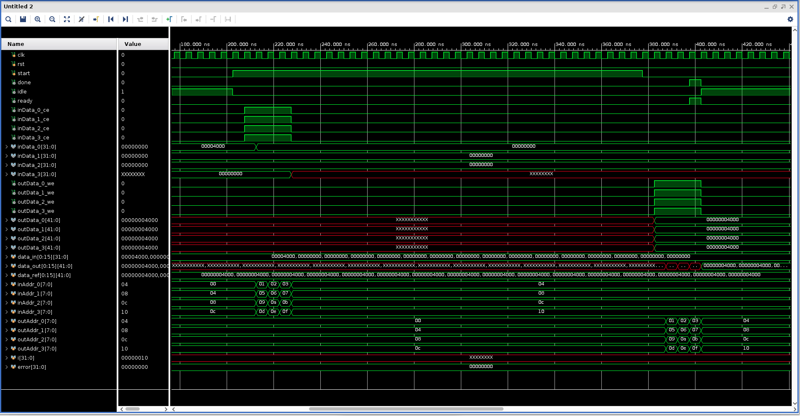

<table class="sphinxhide" width="100%">
 <tr>
   <td align="center"><h1>Vitis™ Application Acceleration Tutorials</h1>
   </td>
 </tr>
</table>


# Getting Started With Vitis Libraries

***Version: Vitis 2023.1***

This tutorial focuses on how to leverage the AMD Vitis™ Libraries to build your own design. The tutorial will use FFT's L1 library as an example. It contains instructions from cloning the library, compile, and simulate on its own till instantiate it into top-level design.

## Before You Begin

### Setup Environment
Before playing with the libraries, set up the Vitis environment first. For instructions on setting up the Vitis environment, refer to [Vitis online documentation](https://docs.xilinx.com/r/en-US/ug1393-vitis-application-acceleration/Setting-Up-the-Environment-to-Run-the-Vitis-Software-Platform).
Below are the example scripts to set up Vitis and XRT:

```
$ source <Vitis Tool Installation Path>/Vitis/2023.1/settings64.sh
$ source /opt/xilinx/xrt/setup.sh
$ export PLATFORM_REPO_PATHS=<Platform Installation Path>

```

### Get Vitis Libraries

Now clone the Vitis Libraries into local path.

The Vitis Library is open source on AMD GitHub: https://github.com/Xilinx/Vitis_Libraries. 

Assuming that you are using $/home/project$ as working directory, then use following command to clone the Vitis Library repository into the working directory:

```
cd /home/project
git clone https://github.com/Xilinx/Vitis_Libraries.git
```

This takes a few seconds to minutes for downloading depending on network. 
After it is completed, browse into the sub folders to get familiar with the file structure.

~~~
Vitis_Libraries/
├── Jenkinsfile
├── LICENSE.txt
├── README.md
├── blas/
├── codec/
├── data_analytics/
├── data_compression/
├── data_mover/
├── database/
├── dsp/
├── graph/
├── hpc/
├── motor_control/
├── quantitative_finance/
├── security/
├── solver/
├── sparse/
├── ultrasond/
├── utils/
└── vision/
~~~

There are many different categories of libraries under the top level folder. In this lab, we are going to use the **dsp** library. So enter the the sub-directory *dsp*, and you can find following directory structure.

~~~
dsp/
├── Jenkinsfile
├── L1/
│   ├── README.md
│   ├── examples/
│   ├── include/
│   ├── meta/
│   ├── src/
│   └── tests/
├── L2/
│   ├── README.md
│   ├── benchmarks/
│   ├── examples/
│   ├── include/
│   ├── meta/
│   └── tests/
├── LICENSE.txt
├── README.md
├── docs/
│   ├── Doxyfile
│   ├── Makefile
│   ├── Makefile.sphinx
│   ├── README.md
│   └── src/
├── ext/
│   ├── README.md
│   ├── make_utility/
│   └── xcl2/
└── library.json
~~~

This library is written in C++ and it contains three levels of abstractions.

* L1: Module level, it provides optimized hardware implementation of the core LZ based and data compression specific modules like lz4 compress and snappy compress.
* L2: Kernel level, a demo on lz4, snappy, zlib, and zstd data compression algorithms are shown via kernel, which internally uses the optimized hardware modules.
* L3: The software API level wraps the details of offloading acceleration with prebuilt binary (overlay) and allows users to accelerate data compression tasks on the AMD Alveo™ cards without hardware development.

## Running the Tutorial

### Create and run a HLS project

In this step, we are going to create a HLS project by using the files provided in the [1Dfix_impluse](https://github.com/Xilinx/Vitis_Libraries/tree/main/dsp/L1/examples/1Dfix_impluse) example of L1 Vitis dsp library. The source files and script file are all located under this folder. Here, it is assumed that you have cloned the Vitis Libraries into */home/project/Vitis_Libraries* directory.

1. Go into the `/home/project/Vitis_libraries/dsp/L1/examples/1Dfix_impluse` folder and run the following command to create the HLS project.

```
 make run CSIM=1 CSYNTH=1 COSIM=1 XPART=xcvu9p-flgc2104-2-e
```
By executing the command, it runs through project creation, C synthesis, C simulation, and Co-simulation flow. You can modify the parameter to skip certain steps. Here, the xcvu9p part is used as an example, you can change it to other FPGA parts. Or you can use `DEVICE` keyword to specify an acceleration platform such as u250 Alveo platform. At the end of the flow, console window prints out the input and output data value and show ***PASS*** at the end of simulation.

~~~
...

===============================================================
--Input Impulse:
(1,0)
(0,0)
(0,0)
(0,0)
(0,0)
(0,0)
(0,0)
(0,0)
(0,0)
(0,0)
(0,0)
(0,0)
(0,0)
(0,0)
(0,0)
(0,0)
===============================================================
===============================================================
--Output Step fuction:
(1,0)
(1,0)
(1,0)
(1,0)
(1,0)
(1,0)
(1,0)
(1,0)
(1,0)
(1,0)
(1,0)
(1,0)
(1,0)
(1,0)
(1,0)
(1,0)
===============================================================
INFO: [COSIM 212-1000] *** C/RTL co-simulation finished: PASS ***

...

~~~

The testbench uses a single pulse signal as input to the FFT and the output should be a step signal. And these can be verified by looking at the values printed out to the screen.

2. Open the project in Vitis HLS GUI. Enter the following command in `/home/project/Vitis_libraries/dsp/L1/examples/1Dfix_impluse` directory:

```
vitis_hls -p prj_impulse_test.prj &
```

You may browse into the source files, synthesis report, or waveform viewer by simply selecting them from the 'Explorer' window and 'Flow Navigator' window.

The `top_module.cpp` calls the FFT library and the parameters are defined in the `data_path.hpp` file. For detailed instructions on using the FFT library, refer to the Vitis Library [Doc Portal](https://docs.xilinx.com/r/en-US/Vitis_Libraries/dsp/user_guide/L1.html_5).

3. Export IP in HLS project

Now we have verified that the library IP is working properly and we will export it to an AMD Vivado™ IP. To do so, click the `Export RTL` from *IMPLEMENTATION* item in *Flow Navigator*. In the pop-up window, leave every setting unchanged and click `OK` to export the IP.
By default, the IP is exported to the `<project folder>/solutionN/impl`, in this case, it is in following directory:

~~~
/home/project/Vitis_Libraries/dsp/L1/examples/1Dfix_impluse/prj_impulse_test.prj/solution1/impl
~~~

However, you can customize the path in the export pop-up menu.

In the next step, launch Vivado and create a top-level design to instantiate the exported IP. You can now close the Vitis HLS GUI.

4. View Co-Simulation Waveform (optional)

You could modify the co-simulation related command lines in file `./run_hls.tcl` (around line 48) as below to turn-on the xsim waveform dump switch:

~~~
...
if {$COSIM == 1} {
  cosim_design -wave_debug
}
...
~~~

Then re-run the command:

```
 make run COSIM=1 XPART=xcvu9p-flgc2104-2-e
```


In this way, you get the simulation waveform, such as the following example for a single SSR stream port:


Use the interface signals behavior in co-simulation waveform as a reference for the following Vivado simulation testbench.

### Use the Exported IP in RTL Design with Vivado Flow

Assuming that you are in the root directory for this tutorial.

1. Create top level project in Vivado using provided RTL source files

Use the following command to create a directory and start Vivado GUI:

```
mkdir vivado
cd ./vivado
vivado &
```

Create a new project with default project name *project_1* and select the type as ***RTL Project*** with ***Do not specify sources at this time*** box checked. Select ***xcvu9p-flgc2104-2-e*** as the part of this project. You can select other parts as well.

Now the project has been created.Add the source files into the project. Select `Add or create design sources` menu from `PROJECT MANAGER` > `Add Sources` and then click `Add Files` to add the ***fft_wrap.v*** which is located under ***src*** folder. Then select `Add or create simulation sources` menu and click `Add Files` to add the ***fft_tb.v*** into the project. Use the same procedure to add the ***datain.txt*** and ***dataref.txt*** files into the project as constraints.

The ***fft_wrap.v*** simply instantiates the FFT IP that was just exported earlier. Set up the IP repo path to let Vivado find it. To do so, click `settings` from Flow Navigator panel and add the IP export folder to the repo path.


Then click `IP Catalog` from Flow Navigator and you should see the FFT IP shown in the User Repository.


Double click on the IP and click `OK` to add it into the project. Now you should see that the IP core was correctly instantiated in the project hierarchy view.

2. Open the **fft_wrap.v** file to take a look at its port signals. Along with the clock, reset, and control signals (start, done, idle, ready), there are four input steam ports (*inData_x* and *inData_x_ce*) and four output stream ports (*outData_x* and *outData_x*we*). The input and output data bus are simply validated by *_ce* or *_we* signals. In the testbench file **fft_tb.v**, read the input data from **datain.txt** file, divide them into four data streams, and then send them to the fft module. Four output data streams are received and compared with the reference data file **dataref.txt**. The test datasets are identical with the simulation example in */home/project/Vitis_Libraries/dsp/L1/examples/1Dfix_impluse* directory.

~~~
module fft_wrap (
  output          inData_0_ce,
  output          inData_1_ce,
  output          inData_2_ce,
  output          inData_3_ce,

  input   [31:0]  inData_0,
  input   [31:0]  inData_1,
  input   [31:0]  inData_2,
  input   [31:0]  inData_3,

  output          outData_0_we,
  output          outData_1_we,
  output          outData_2_we,
  output          outData_3_we,  

  output  [41:0]  outData_0,
  output  [41:0]  outData_1,
  output  [41:0]  outData_2,
  output  [41:0]  outData_3,
  
  input           clk,
  input           rst,
  input           start,
  output          done,
  output          idle,
  output          ready

);
~~~

3. Simulate the top level project

Click `Run Simulation` from Flow Navigator and select `Run Behavioral Simulation`. Vivado simulator launches with waveform loaded. The input data bus width is 32-bit and output data bus width is 42-bit.

If no issues are encountered, simulation ends smoothly.

~~~
Result verification SUCCEED!
Simulation finished.
~~~

Below is the screenshot of the simulation waveform.



Close the simulation window.

4. Implement the top level project

Click `Run Implementation` from Flow Navigator panel and click ***OK*** in the pop-up window. This runs through the Vivado synthesis and implementation flow that generates both timing and resource reports for this IP.

## Summary

In this tutorial, we explain how to leverage a L1 Vitis library element to build your own design. The FFT example is selected for explanation, and you can follow a similar flow to use other library elements.

## Reference

Documentation on Vitis Libraries: https://docs.xilinx.com/r/en-US/Vitis_Libraries


<p class="sphinxhide" align="center"><sub>Copyright © 2020–2023 Advanced Micro Devices, Inc</sub></p>

<p class="sphinxhide" align="center"><sup><a href="https://www.amd.com/en/corporate/copyright">Terms and Conditions</a></sup></p>
