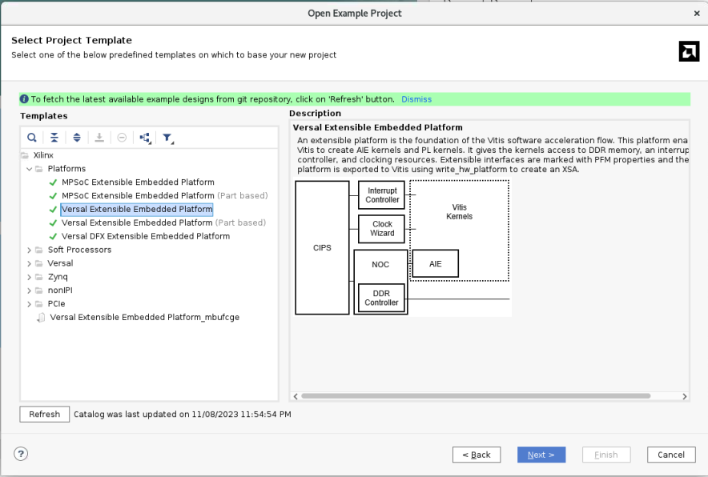
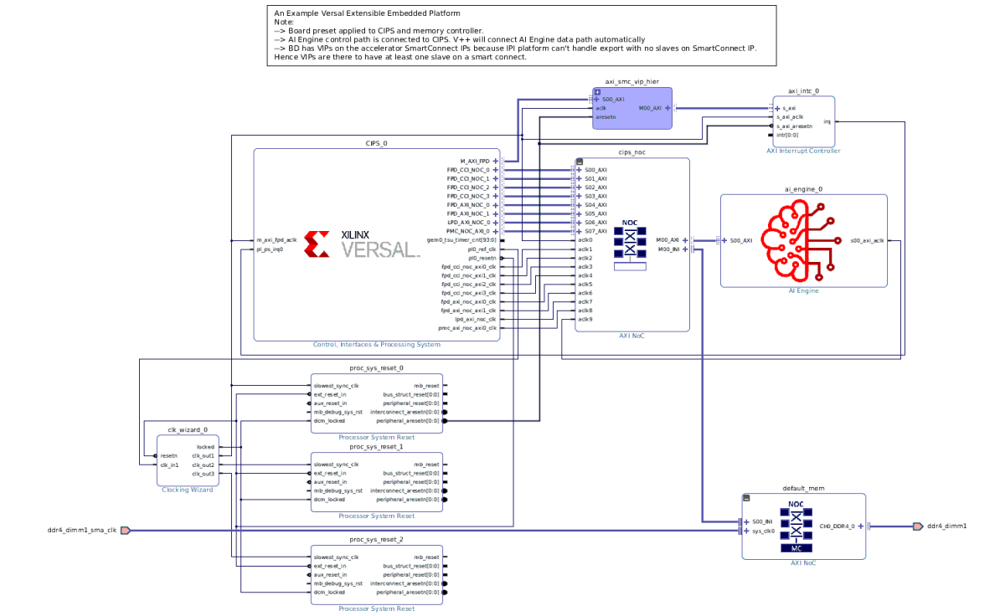
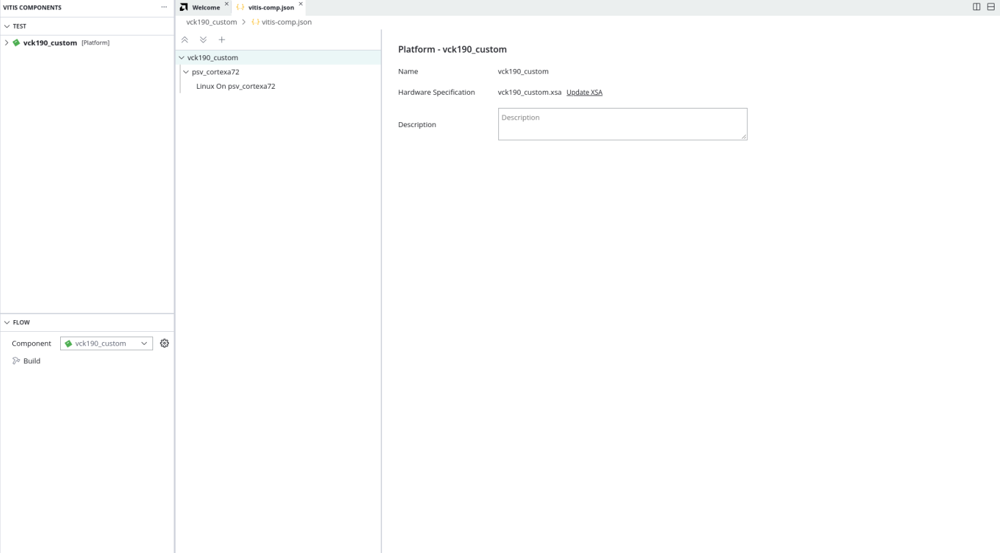
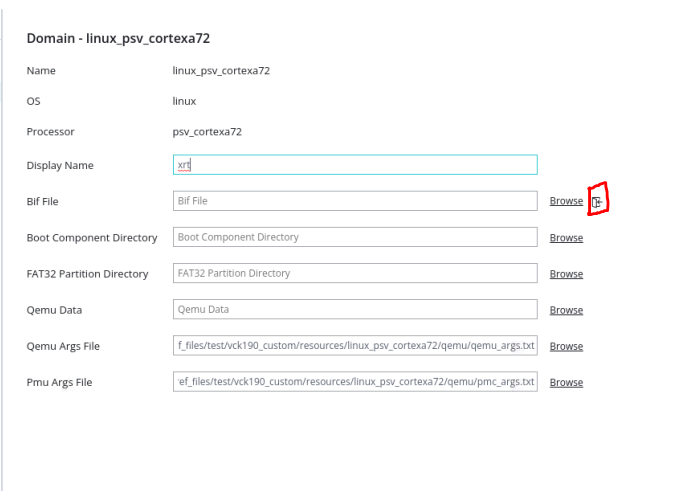
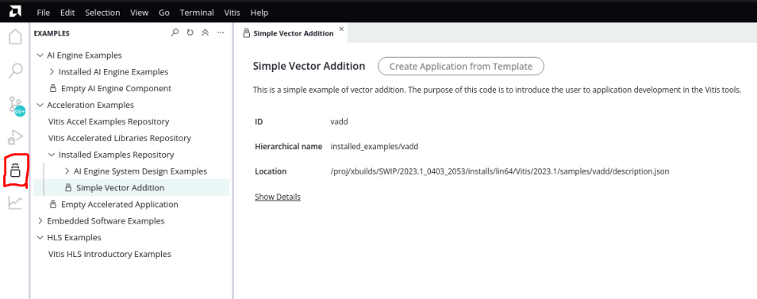
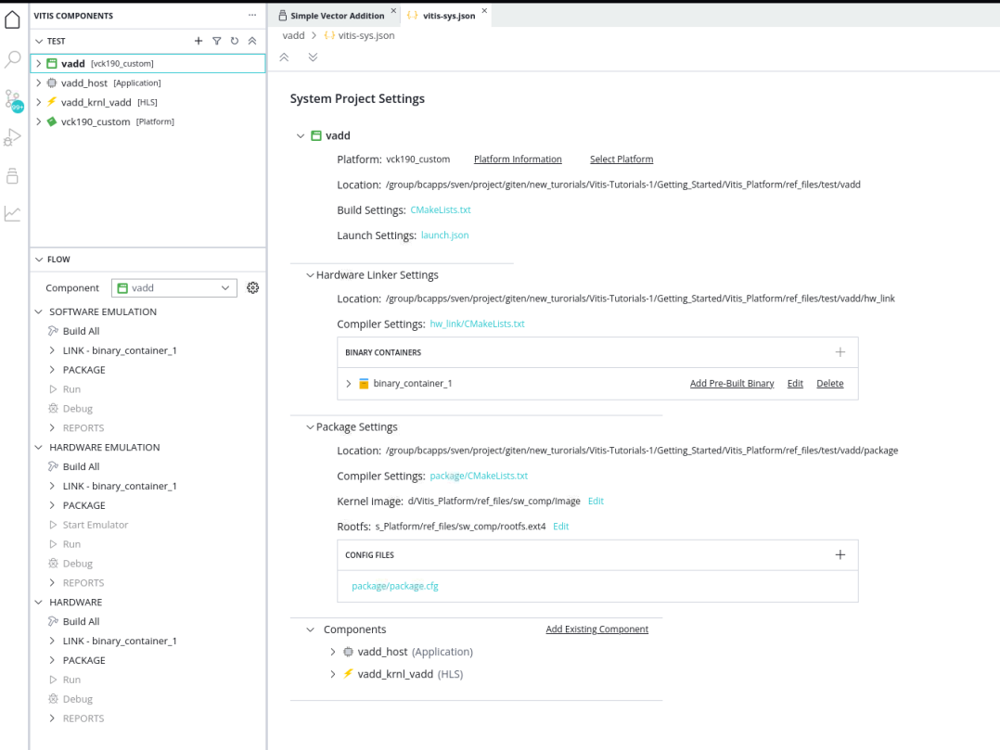
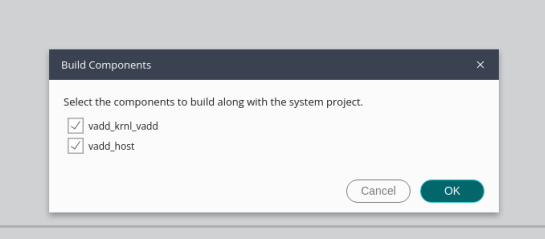

<table class="sphinxhide" width="100%">
 <tr width="100%">
    <td align="center">
    </td>
 </tr>
</table>

# Versal Platform Creation Quick Start

***Vitis New IDE 2023.1***, ***Vivado 2023.1***

***Board: VCK190***

In this module, we will get started with three steps to quickly create a platform and run applications to validate this platform based on VCK190 evaluation board in short. 

This time, we will utilize AMD Versal™ extensible platform from the CED example, using pre-built Linux common image and `createdts` command to generate software components. And then create an embedded Versal acceleration platform with AMD Vitis™ new IDE. At last, leverage the Vector Addition example to validate this platform. 

This is a quick start for Versal platform creation. If you have queries about some steps or settings or want to create a platform for customer's board, refer to [Versal Custom Platform Creation Tutorial](../../Vitis_Platform_Creation/Design_Tutorials/03_Edge_VCK190/). Besides, if you need to customize the Linux system image, refer to the [PetaLinux customization page](../../Vitis_Platform_Creation/Feature_Tutorials/02_petalinux_customization/README.md) for reference.

## Step 1: Create Vivado Design and Generate XSA

1. Create a workspace and launch AMD Vivado™ 

   - mkdir WorkSpace
   - cd WorkSpace
   - Run `source <Vitis_Install_Directory>/settings64.sh` to setup Vivado running environment
   - Run Vivado by typing `vivado` in the console.

2. Download the Versal Extensible Embedded Platform Example
   
   - Click menu **Tools -> Vivado Store.**
   - Click **OK** to agree to download open source examples from web.
   - Select **Platform -> Versal Extensible Embedded Platform** and click the download button on the tool bar.
   - Click **Close** after installation complete.

   

3. Create the Versal Extensible Embedded Platform Example project

   - Click **File -> Project -> Open Example**.
   - Click **Next**.
   - Select **Versal Extensible Embedded Platform** in Select Project Template window.
   - Input **project name** and **project location**. Keep **Create project subdirectory** checked. Click **Next**.
   - Select target board in Default Part window. In this example, we use **Versal VCK190 Evaluation Platform**. Click **Next**.
  
   

   - Configure Clocks Settings. You can enable more clocks, update output frequency and define default clock in this view. In this example, we can keep the default settings.
   - Configure AXI master and Interrupt Settings. You can choose how many interrupt and AXI masters this platform should support. 63 interrupts modes use two AXI_INTC in cascade mode. In this example, we can keep the default setting.
   - Enable the AI engine according to your requirement. In this example, we can keep the default setting.
   - Click **Next**.
   - Review the new project summary and click **Finish**.
   - After a while, the design example is generated.

   The generated design is shown in the following figure:

   

   At this stage, the Vivado block automation has added a Control, Interface & Processing System (shorten with CIPS in the future) block, AXI NOC block, AI Engine, and all supporting logic blocks to the diagram, and applied all board presets for the VCK190. 
   
4. Generate Block Diagram

   - Click **Generate Block Diagram** from the Flow Navigator window.

   

   - Select **Synthesis Options** to **Global** to save generation time. 

   

   - Click **Generate** button.

   **Note**: It is safe to ignore this critical warning. Vitis will connect this signal in the future.

   

5. Export hardware platform with the following scripts:

   - Click **File -> Export -> Export Platform**. Alternative ways are: **Flow Navigator** window: **IP Integrator -> Export Platform**, or the **Export Platform** button on the bottom of **Platform Setup** tab.
   - Click **Next** on Export Hardware Platform page.
   - Select **Hardware and hardware emulation**.  Click **Next**.
   - Select **Pre-synthesis**, because we are not making an DFX platform. Click **Next**.
   - Input Name: **VCK190_Custom_Platform**, click Next.
   - Update file Xsa file name to **vck190_custom**, click Next.
   - Review the summary. Click **Finish**.
   - **vck190_custom.xsa** file is generated in Vivado project location directory.

   >Note: If there are any IPs that do not support simulation, generate Hardware XSA and Hardware Emulation XSA separately.

## Step 2: Create Vitis Platform

1. Download Versal common image from [AMD website download page](https://www.xilinx.com/support/download.html), place it under your `WorkSpace` directory, and extract the common image.

   ```bash
   tar xvf ../xilinx-versal-common-v2023.1.tar.gz .
   ```

2. Create the device tree file
   Device tree describes the hardware components of the system. `createdts` command can generate the device tree file according to the hardware configurations from XSA file. If there are any settings not available in XSA, for example, any driver nodes that do not have corresponding hardware, or the user has their own design hardware, the user needs to add customization settings in `system-user.dtsi`.

   Besides, uboot in common image does not have default environment variables. So update the bootargs manually. A pre-prepared [system-user.dtsi](ref_files/system-user.dtsi) file, which adds pre-defined bootargs is under `ref_files` directory. Copy `system-user.dtsi` to `WorkSpace` directory and follow below steps to generate the DTB file.

   ```bash
   cd WorkSpace
   source <Vitis_Install_Directory>/settings64.sh
   xsct 
   ```
   Then execute `createdts` command in XSCT console like the following:

   ```bash
   createdts -hw <full path>/vck190_custom_hw.xsa -out . -zocl \
   -platform-name mydevice -git-branch xlnx_rel_v2023.1 -board versal-vck190-reva-x-ebm-02-reva -dtsi system-user.dtsi -compile   
   ```

   Notice that `-hw ` option is your XSA file generated in step1 located in your Vivado Project directory named `vck190_custom_hw.xsa`. Besides, the following information would show in XSCT console. Ignore the following warning and that means you succeed to get system.dtb file, which is located in `mydevice/psv_cortexa72_0/device_tree_domain/bsp/`.

   ```bash
   pl.dtsi:9.21-46.4: Warning (unit_address_vs_reg): /amba_pl@0: node has a unit name, but no reg property
   pl.dtsi:41.26-45.5: Warning (simple_bus_reg): /amba_pl@0/misc_clk_0: missing or empty reg/ranges property
   ```

   Type `exit` in console to exit XSCT console.

3. Create Vitis platform

   - Create two directories under `WorkSpace` directory for FAT32 partition and boot components. Then prepare images like the following:

      ```bash
      cd WorkSpace
      mkdir sd_dir
      mkdir boot
      cp xilinx-versal-common-v2023.1/boot.scr sd_dir/
      cp xilinx-versal-common-v2023.1/bl31.elf boot/
      cp xilinx-versal-common-v2023.1/u-boot.elf boot/
      cp mydevice/psv_cortexa72_0/device_tree_domain/bsp/system.dtb boot/
      ```

   - Install SDK tool by typing `sh xilinx-versal-common-v2023.1/sdk.sh -d xilinx-versal-common-v2023.1/ -y` in console. Option of -d is to specify the directory where to install. Option of -y means confirmation. So it gets installed in `xilinx-versal-common-v2023.1/` folder.
   - Run Vitis by typing `vitis --new -w .` in the console. **-w** is to specify the workspace.
   - In the Vitis IDE, select **File > New Component > Platform** to create a platform component.
   - Enter the **Component name**. For this example, type `vck190_custom`, click **Next**.
   - In the XSA selecting page, click **Browse** button, select the XSA file generated by the Vivado. In this case, it is located in `Your Vivado Project Directory>/vck190_custom.xsa`. Click **Next**.
   - Set the **operating system** to **linux** and set the processor to **psv_cortexa72**. Click **Next**.
   - Review the summary and click **Finish**.

   

   - Click the **linux On psv_cortexa72** domain.
   - Update the **Display Name** to `xrt` by clicking the entry bar and inputting the name. It is indicated that this is a Linux domain has XRT installed and can run acceleration applications.
   - Set **Bif file**: Click the button as shown in the following diagram and generate BIF file. The BIF file is generated in the resource directory.
  
      

   - **Boot Components Directory**: Browse to **boot** and click OK. Bootgen looks for boot components referred by BIF in this directory to generate `BOOT.BIN`.
   - **FAT32 Partition Directory**: Browse to **sd_dir** and click OK. Files in this directory are copied to FAT32 partition of SD card.
   - **QEMU Data**: Browse to **boot/** and click OK. Emulator will use boot components from this directory.
   - In the **Flow** view window, click the drop-down button to select the component. In this case, select **vck190_custom** component and click the **Build** button to generate the platform.
   
   >Note: If there are additional QEMU settings, update `qemu_args.txt` accordingly.
   
   After this step2, the platform creation process is completed. Next, run an application to validate this platform.

## Step 3: Validate this Vitis PLatform

   - Run Vitis by typing `vitis --new -w .` in the console (If you have launched Vitis, omit this step).
   - In the view, Click **Example** button and expand the **Installed Examples Repository** directory like the following:

   

   - Select **Simple Vector Addition**, and click **Create application from template**.
   - Input the **System project name**: `Vadd` and click **Next**.
   - Select the platform we created in previous step. In this case, it is `vck190_custom` platform.
   - Input **Sysroot** path `xilinx-versal-common-v2023.1/sysroots/cortexa72-cortexa53-xilinx-linux`
   - Input **RootFS** path `xilinx-versal-common-v2023.1/rootfs.ext4`
   - Input **Kernel Image** path `xilinx-versal-common-v2023.1/Image` and click **Next**.
   - Review the project summary and click **Finish**.

   After some time, the project is created.
   

   - Select Component **Vadd**. Click **Build all** under **Hardware**. A window pops up prompting to choose which modules to compile. Select all and click OK.

   

   - It takes some time to build hardware. Finally, Vitis generates **sd_card.img** in `vadd/build/hw/package/package/` directory.

#### Run the Application on Hardware

1. Copy `vadd/build/hw/package/package/sd_card.img` to local if you build the project on a remote server or virtual machine.

2. Program sd_card.img to SD card. Refer to [AR#73711](https://www.xilinx.com/support/answers/73711.html) for detailed steps.

   > Note: Eject the SD card properly from the system after programming it.

3. Connect to UART console.

4. Insert the SD card and boot the VCK190 board with SD boot mode (SW1[4:1] = "1110": OFF, OFF, OFF, ON) and power on.

   > Note: Refer to [VCK190 Evaluation Board User Guide](https://www.xilinx.com/support/documentation/boards_and_kits/vck190/ug1366-vck190-eval-bd.pdf) for details about boot mode.

5. Launch the test application from UART console.

   <details>
   <summary><strong>Follow below steps to run the application</strong></summary>

     Login with user `petalinux` first and setup a new password (it is then also the sudo password):

     - Log into the system
     
     ```bash
     petalinux login:petalinux
     You are required to change your password immediately (administrator enforced).
     New password:
     Retype new password:
     petalinux:~$ sudo su
     We trust you have received the usual lecture from the local System
     Administrator. It usually boils down to these three things:
         #1) Respect the privacy of others.
         #2) Think before you type.
         #3) With great power comes great responsibility.
     Password:
     petalinux:/home/petalinux#
     ```

     - Go to auto mounted FAT32 partition and run the application as shown below:

     ```
     petalinux:/home/petalinux# cd /run/media/sd-mmcblk0p1
     petalinux:/home/petalinux# ./simple_vadd krnl_vadd.xclbin
     ```
   </details>  


6. Expected print on UART console.

<details>
  <summary><b>Show Log</b></summary>

  ```
  root@petalinux:/run/media/mmcblk0p1# ./vadd binary_container_1.xclbin
  EXE: /run/media/mmcblk0p1/simple_vadd
[XRT] WARNING: The xrt.ini flag "opencl_summary" is deprecated and will be removed in a future release.  A summary file is generated when when any profiling is enabled, so please use the appropriate settings from "opencl_trace=true", "device_counter=true", and "device_trace=true."
[XRT] WARNING: The xrt.ini flag "opencl_device_counter" is deprecated and will be removed in a future release.  Please use the equivalent flag "device_counter."
INFO: Reading krnl_vadd.xclbin
Loading: 'krnl_vadd.xclbin'
[   74.394840] zocl-drm amba_pl@0:zyxclmm_drm: zocl_create_client: created KDS client for pid(577), ret: 0
[   74.395731] zocl-drm amba_pl@0:zyxclmm_drm: zocl_destroy_client: client exits pid(577)
[   74.401000] zocl-drm amba_pl@0:zyxclmm_drm: zocl_create_client: created KDS client for pid(577), ret: 0
Trying to program device[0]: edge
[   74.937477] [drm] skip kind 29(AIE_RESOURCES) return code: -22
[   74.938038] [drm] found kind 8(IP_LAYOUT)
[   74.938641] [drm] found kind 9(DEBUG_IP_LAYOUT)
[   74.939375] [drm] skip kind 25(AIE_METADATA) return code: -22
[   74.939688] [drm] found kind 7(CONNECTIVITY)
[   74.940087] [drm] found kind 6(MEM_TOPOLOGY)
[   74.940907] [drm] Memory 0 is not reserved in device tree. Will allocate memory from CMA
[   74.948647] [drm] Memory 1 is not reserved in device tree. Will allocate memory from CMA
[   74.963753] cu_drv CU.2.auto: cu_probe: CU[0] created
[   74.974174] cu_drv CU.2.auto:  ffff000803cbac10 xrt_cu_intr_thread: CU[0] start
[   74.989334] [drm] zocl_xclbin_read_axlf f4f049d5-183a-e265-264d-ecfa34a51343 ret: 0
[   75.037345] [drm] bitstream f4f049d5-183a-e265-264d-ecfa34a51343 locked, ref=1
[   75.038188] zocl-drm amba_pl@0:zyxclmm_drm:  ffff000800323c10 kds_add_context: Client pid(577) add context CU(0xffffffff) shared(true)
[   75.041054] zocl-drm amba_pl@0:zyxclmm_drm:  ffff000800323c10 kds_del_context: Client pid(577) del context CU(0xffffffff)
[   75.042096] [drm] bitstream f4f049d5-183a-e265-264d-ecfa34a51343 unlocked, ref=0
[   75.094803] [drm] bitstream f4f049d5-183a-e265-264d-ecfa34a51343 locked, ref=1
[   75.095393] zocl-drm amba_pl@0:zyxclmm_drm:  ffff000800323c10 kds_add_context: Client pid(577) add context CU(0xffffffff) shared(true)
Device[0]: program successful!
[   75.188269] zocl-drm amba_pl@0:zyxclmm_drm:  ffff000800323c10 kds_add_context: Client pid(577) add context CU(0xffffffff) shared(true)
[   75.192218] zocl-drm amba_pl@0:zyxclmm_drm:  ffff000800323c10 kds_add_context: Client pid(577) add context CU(0x0) shared(true)
TEST PASSED
[   78.347703] zocl-drm amba_pl@0:zyxclmm_drm:  ffff000800323c10 kds_del_context: Client pid(577) del context CU(0xffffffff)
[   78.349191] zocl-drm amba_pl@0:zyxclmm_drm:  ffff000800323c10 kds_del_context: Client pid(577) del context CU(0x0)
[   78.354584] zocl-drm amba_pl@0:zyxclmm_drm:  ffff000800323c10 kds_del_context: Client pid(577) del context CU(0xffffffff)
[   78.355356] [drm] bitstream f4f049d5-183a-e265-264d-ecfa34a51343 unlocked, ref=0
[   78.462912] zocl-drm amba_pl@0:zyxclmm_drm: zocl_destroy_client: client exits pid(577)
  ```

</details>


### Fast Track

Scripts are provided to package and test the Vitis platform.

To use these scripts, download Versal common image from [AMD website download page](https://www.xilinx.com/support/download.html) and give its path to the following command.

1. Run build

   ```bash
   # cd to the ref_files directory, e.g.
   cd ref_files
   make all COMMON_IMAGE_VERSAL=<path/to/common_image/>  #Specify the path of the common image
   ```
   This command is to generate platform with pre-built software components and do sw emulation by running vadd application to test this platform.

   ```
   make sd_card COMMON_IMAGE_VERSAL=<path/to/common_image/>  #Specify the path of the common image
   ```
   This command is to generate platform with pre-built software components and do hw test on board by running vadd application to test this platform.


2. To clean the generated files, run

   ```bash
   make clean
   ```

<p class="sphinxhide" align="center"><sub>Copyright © 2020–2023 Advanced Micro Devices, Inc</sub></p>

<p class="sphinxhide" align="center"><sup><a href="https://www.amd.com/en/corporate/copyright">Terms and Conditions</a></sup></p>
