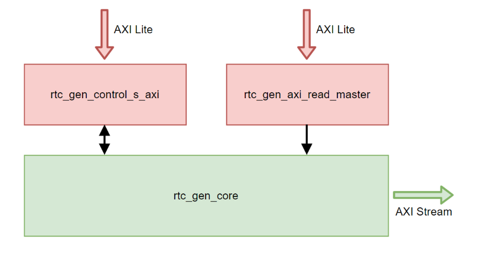

<table class="sphinxhide" width="100%">
 <tr>
   <td align="center"><h1>Vitis™ Application Acceleration Development Flow Tutorials</h1>
   </td>
 </tr>
 <tr>
 <td>
 </td>
 </tr>
</table>

# Mixed Kernels Design Tutorial with AXI Stream and Vitis

***Version: Vitis 2023.1***

This tutorial demonstrate the design flow for an example mixed kernels hardware design, which includes both register transfer level (RTL) kernel and HLS C kernels, as well as the Vitis Vision Library. The design generates a real-time clock image, resizes it, then alpha-mixes it with an input image in global memory, finally output the result image to global memory. The AXI4-Stream interface is used for the kernel-to-kernel connection.


The hardware design includes three kernels: *rtc_gen*, *alpha_mix*, and *strm_dump*. These kernels are directly connected together using AXI stream link. The topology of the design is shown in the following figure.


**Additional Requirements for RedHat/CentOS 7**
The host program is using the Xilinx Runtime (XRT) Native API, which need higher version of the GNU compiler collection (GCC). If you are using RedHat/CentOS 7, the default installed GCC version is 4.x.x. You must use the following command to install and switch to GCC 7 before compiling the host program.

```shell
sudo yum install centos-release-scl
sudo yum install devtoolset-7-gcc-c++
scl enable devtoolset-7 bash
```

The directory struction and brief explainations are as follows.
~~~
├── doc/                            # documents
├── hw/                             # Hardware build working directory
│   ├── alpha_mix.cpp               # HLS C source code for alpha_mix kernel
│   ├── build_rtc_gen_xo.sh         # shell script to call AMD Vivado™ to package rtc_gen kernel IP to xo file
│   ├── config_gen.mk               # Makefile sub-module to generate Vitis linking configuration files
│   ├── include/                    # Vision Vision library include file for HLS C
│   ├── Makefile                    # Makefile for hardware building
│   ├── package_rtc_gen.tcl         # Vivado tcl script to package rtc_gen kernel IP to xo file
│   ├── rtc_gen_ip/                 # IP directory for rtc_gen kernel, including all the RTL source codes
│   ├── rtc_gen_kernel.xml          # Kernel desctiption file for rtc_gen kernel
│   └── strm_dump.cpp               # HLS C source for strm_dump kernel
├── README.md
├── rtc_gen                         # working directory for rtc_gen kernel development
│   ├── font_sim_data.txt           # text format font library file for RTL simulation
│   └── src/                        # RTL source code for rtc_gen kernel
└── sw/                             # Test program directory
    ├── build/                      # Software build working directory
    │   ├── font.dat                # Font library file including 11 characters
    │   ├── setup_emu.sh            # setup script for emulation mode
    │   └── xrt.ini                 # XRT configuration for emulation and debug
    ├── CMakeLists.txt              # cmake configuration file
    ├── media/                      # Media files for test program
    └── src/                        # Test program source codes
        ├── rtc_alpha_tb.cpp        # Test program for the whole design
        └── rtc_gen_test.cpp        # Test program for rtc_gen kernel
~~~

## RTL Kernel: rtc_gen (XO)

*rtc_gen* is the real-time clock digit image generation kernel written in Verilog HDL. *rtc_gen* has an internal always-run real-time-clock driven by an AXI bus clock with a clock divider. The time value can be set by host via kernel arguments. The kernel will firstly load the font image library for digits 0-9 from the global memory to the on-chip buffer, then output the real-time-clock digit image through the AXI4-Stream port. You can also read out the time value from the internal always-run time counter.

The character size in the font library is 240 (height) by 160 (width) pixels, and the font library includes 11 characters, i.e., digits 0-9 and colon. Refer to the following image for the font library contents.  


Each pixel in the font library is represented with 4-bit, which is actually the opacity value for each pixel. When output through the AXI4-Stream port, the 4-bit opacity value will be expanded to 8-bit by left shifting 4-bit then add 15 (i.e., expand `0xB` to `0xBF`). The opacity value will be used by the downstream alpha-mixing kernel to generate time digit with color setting. The font image data size for single chracter is:

~~~
  240 x 160 x 4 = 153,600 bits = 19,200 bytes
~~~

The total font image library size is:

~~~
  19,200 x 11 = 211,200 bytes
~~~

*rtc_gen* support two time formats: one is with centi-second, namely HOUR:MIN:SEC:CENTISEC, including 11 characters; the other is without centi-second, namely HOUR:MIN:SEC, including eight chracters. The time format is set in kernel arguments. Refer to the following figures for examples of the two output time format.


The *rtc_gen* kernel has three bus interfaces:

+ AXI4-Lite slave interface for kernel argument and control
+ AXI4-Lite master interface for font library data loading
+ AXI4-Stream master interface for clock digit image output

The kernel is composed of three blocks: *rtc_gen_axi_read_master* for AXI master-based font library reading, *rtc_gen_control_s_axi* for AXI slave-based kernel arguments and control, and *rtc_gen_core* for core kernel function and AXI4-Stream output. *rtc_gen_axi_read_master* is a standard block generated by the Vitis/Vivado RTL Kernel Wizard. *rtc_gen_control_s_axi* is also a generated block, but you need to make some modifications to it to add time value read-out function.



When triggered by the host, the kernel will read the time value from the internel real-time-clock, and output a frame of the time image corresponding to the time value.

The following table summarizes the arguments used by the *rtc_gen* kernel.

|No.   | Arguments   | Width  | Description |
| ---- | ----        | ----   | ---- |
|0     | work_mode   | 1      |[0]: determine the kernel working mode <br> 0 - load font from global memory to on-chip static random access memory (RAM) (SRAM) via the AXI read master <br> 1 - output real-time clock (RTC) digit figure via the AXI stream master |
|1     | cs_count    | 32     |[21:0]: Centi-second counter. For example, if the system clock is 200 MHz, the cs_count should be set to 2,000,000 |
|2     | time_format | 1      |[0]: determine whether centisecond is included in the output digit images <br> 0 - disable centiseconds output <br> 1 - enable centiseconds output |
|3     | time_set_val| 32     |Set time value for internal free-running clock: <br> [31:24] - hours <br> [23:16] - minutes <br> [15:8] - seconds <br> [7:0] - centi-seconds |
|4     | time_set_en | 1      |[0]: write 1 to this bit will load the time_set_value to internal free-running clock. |
|5     | time_val    | 32     |Read-only regsiter for internal real-time-clock time value: <br> [31:24] - hours <br> [23:16] - minutes <br> [15:8] - seconds <br> [7:0] - centi-seconds |
|6     | read_addr   | 64     |AXI master pointer, this is the FPGA device buffer address for the font library |

Read [RTC_GEN RTL Kernel Creation](./doc/rtc_gen_tutorial.md) for more details about the RTL kernel *rtc_gen* and the step-by-step guideline to create this RTL kernel.

## HLS C Kernel: alpha_mix (XO)

The kernel *alpha_mix* finishes the follow tasks in order:

+ Receive the clock digit image from *rtc_gen* kernel via the AXI4-Stream port
+ Resize the clock digit image with Vitis Vison Library resize function
+ Load the background image from global memory, then execute alpha mixing with the clock digit image
+ Send out the mixed image via the AXI4-Stream port


The *alpha_mix* kernel has four bus interfaces:

+ AXI4-Lite slave interface for control
+ AXI4-Lite master interface for background image loading
+ AXI4-Stream slave interface for clock digit image receiving
+ AXI4-Stream master interface for mixed image output

The following table summarized the arguments used by *alpha_mix* kernel. Note the kernel use *XF_NPPC8* mode, namely eight pixels will be processed at each clock cycle, so ensure the *background image width* and *resized time image width* are integer multiples of eight, otherwise, the kernel might hang.

|No.   | Arguments          | Width | Description |
| ---- | ----               | ----  | ----  |
|0     | reserved           | -     | -     |
|1     | bgr_img_input      | 64    | AXI master pointer, FPGA device buffer for input background image     |
|2     | reserved           | -     | -     |
|3     | time_img_rows_in   | 32    | Input time image height           |
|4     | time_img_cols_in   | 32    | Input time image width            |
|5     | time_img_rows_rsz  | 32    | Resized time image height         |
|6     | time_img_cols_rsz  | 32    | Resized time image width          |
|7     | time_img_pos_row   | 32    | Time image vertical coordinate, start from 0    |
|8     | time_img_pos_col   | 32    | Time image horizontal coordinate, start from 0  |
|9     | time_char_color    | 32    | Time figure color, bit range [23:0] used for [RGB]|
|10    | time_bgr_color     | 32    | Time background color, bit range [23:0] used for [RGB]|       |
|11    | time_bgr_opacity   | 32    | Time background opacity, [7:0] used, value range from 0 - 255 |
|12    | bgr_img_rows       | 32    | Background image height           |
|13    | bgr_img_cols       | 32    | Background image width            |

You could refer to below figure for the meaning of some kernel arguments.


Read [ALPHA_MIX HLS C Kernel Creation](./doc/alpha_mix_tutorial.md) for more details about the HLS C kernel *alpha_mix*.

## HLS C Kernel: strm_dump (XO)

*strm_dump* is a simple HLS kernel to dump the input AXI4-Stream to global memory via AXI4-Lite master.

The following table summarizes the arguments used by the *strm_dump* kernel.

|No.   | Arguments   | Width  | Description |
| ---- | ----        | ----   | ---- |
|0     | reserved    | -      |- |
|1     | output_addr | 64     |AXI master pointer, this is the FPGA device buffer address for output image |
|2     | byte_size   | 32     |Data quantity to be output in bytes. This can be calculated based on time format and color depth |

## Bitstream Implementation (XCLBIN)

### rtc_gen_test_hw.xclbin / rtc_gen_test_hw_emu.xclbin

This is a simple test system for the *rtc_gen* kernel, which integrates two kernels: *rtc_gen* and *strm_dump*, which are connected together using an AXI4-Stream bus. Refer to the following connection diagram on the U50 platform. According to the different building target (hw or hw_emu), two XCLBIN files will be generated.


### rtc_alpha_hw.xclbin / rtc_alpha_hw_emu.xclbin

This is the fully implemented system, which integrated all the three kernels: *rtc_gen*, *alpha_mix*, and *strm_dump*, which are connected together via an AXI4-Stream bus. Note the function of the kernel *strm_dump* is very easy to be merged into the *alpha_mix* kernel. Here  is separated just to demonstrate the kernel-to-kernel AXI4-Stream connection functionality. Refer to the following connection diagram on the U50 platform. According to the different building target (hw or hw_emu), two XCLBIN files will be generated.


## Test Program

### rtc_gen_test.cpp

This program first judges the running mode according to the environment variable *XCL_EMULATION_MODE*, then chooses to use the binary file `rtc_gen_test_hw.xclbin` or `rtc_gen_test_hw_emu.xclbin` to finish the testing of the RTL kernel *rtc_gen*. It will test both the 8-digit and 11-digit clock format, and the generated clock image will be displayed directly. The program also uses the *kernel::read_register* API to read and print out the value of the register *time_val* of the *rtc_gen* kernel, namely the value of the internal hardware time counter. The value of *time_val* is also used to control the image display refresh. To ensure the correct operation of *xclRegRead* function, ensure to create or modify the `xrt.ini` file in the execution directory to add the following lines:

~~~
[Runtime]
rw_shared=true
~~~

### rtc_alpha_tb.cpp

This program first judges the running mode according to the environment variable *XCL_EMULATION_MODE*, then chooses to use binary file `rtc_alpha_hw.xclbin` or `rtc_alpha_hw_emu.xclbin` to mix the generated real time clock images to a background image. You can select the background image, set the time format, and set the clock time by command parameters. You can also change the color, size, and position of the clock image by modifying the program source code. This test program also uses *kernel::read_register* API to read the value of register *time_val* of *rtc_gen* kernel and use that value to control image display refresh.

## How to Use This Repository

Before going through the following steps, do not forget to source the XRT and Vitis setup files. For example:

~~~
source /opt/xilinx/xrt/setup.sh
source /opt/xilinx/Vitis/2023.1/settings64.sh
~~~

The two test programs need to display images. If you are using remote server, use VNC desktop, or ssh connection with X11 forwarding along with local X11 server.

### Build the hardware

Change to the `./hw` directory, then use the `make` command to finish the building of the three XO files and two XCLBIN files. All the available `make` command option include:

~~~
make
      Display help information

make all TARGET=<hw/hw_emu> PLATFORM=<FPGA PLATFORM>
      Command to build all the rtc_gen_test and rtc_alpha xclbin and necessary kernel files (xo) for  
      specified target and platform. By default, TARGET=hw, PLATFORM=xilinx_u200_gen3x16_xdma_2_202110_1

make all_xo TARGET=<hw/hw_emu> PLATFORM=<FPGA PLATFORM>
      Command to build all the kernel files (xo), including rtc_gen.xo, alpha_mix.xo and strm_dump.xo
      By default, TARGET=hw, PLATFORM=xilinx_u200_gen3x16_xdma_2_202110_1

make clean
      Command to remove all the generated files.
~~~

In the `make` command options, the TARGET can be *hw* or *hw_emu*. Because the *rtc_gen* kernel does not provide software emulation model, *sw_emu* mode cannot be used. When the TARGET is *hw*, the XCLBIN and XO files will be with *_hw* postfix; when the TARGET is *hw_emu*, the XCLBIN and XO files will be with *_hw_emu* postfix. Note the RTL kernel *rtc_gen* will not be affected by the *hw* or *hw_emu* option, and there will only be a XO file `rtc_gen.xo`.

The PLATFORM could be one of the six choices: xilinx_u200_gen3x16_xdma_2_202110_1, xilinx_u250_gen3x16_xdma_3_1_202020_1, xilinx_u250_xdma_201830_2, xilinx_u50_gen3x16_xdma_201920_3, and xilinx_u280_xdma_201920_3. No matter whether you have these AMD Alveo™ cards installed, you can use the platform as the build PLATFORM if you have installed the development platform package (deb or rpm packages) on your system. You can look into the `/opt/xilinx/platform` directory, or use the command `platforminfo -l` to check which platforms have been installed. The finally generated xclbin and xo files will be in the `./hw` directory after the successful execution of the `make` command.

For example, if you would like to build all the XO and XCLBIN files in hardware emulation mode with a U50 card, just input:

~~~
make all TARGET=hw_emu PLATFORM=xilinx_u50_gen3x16_xdma_201920_3
~~~

Because the XCLBIN file building for hardware target needs a long time, to save your time,the pre-built XCLBIN files (`rtc_gen_test_hw.xclbin` and `rtc_alpha_hw.xclbin`) are provided for each kind of supported Alveo platforms. Note they are built with the *TARGET=hw* option and cannot be used in *hw_emu* mode. For *hw_emu* target XCLBIN files, it is much faster to build and system dependent, so build them by yourself. 

You can download the pre-built XCLBIN files via the link: <https://www.xilinx.com/bin/public/openDownload?filename=rtl_stream_kernel_xclbin_2020.2.tgz>.

**To use the pre-built xclbin files, copy the two xclbin files corresponding to your target platform into the `./hw` directory, which will be used directly in downstream steps.**

### Build and Run the Software

#### Step 1: Generate the Makefile

Change to the `./sw/build` directory, then enter the `cmake ..` or `cmake3 ..` command. This will generate the *Makefile* for the software builds, as well as link the two XCLBIN files in the `./hw` directory to the `./sw/build` directory.

~~~
cd ./sw/build
cmake ..
~~~

#### Step 2: Compile the Programs

Enter the `make` command, then the two C++ program will be compiled. This will generate two executables: *rtc_gen_test* and *rtc_alpha_tb*.

~~~
make
~~~

 Because the XRT low-level API *xclRegRead* is used in the test program, there are different link library sets for the hardware mode and hardware emulation mode. Altogether four executables will be generated after the successful compilation: *rtc_alpha_tb*, *rtc_alpha_tb_emu*, *rtc_gen_test*, and *rtc_gen_test_emu*. Use the correct executables for hardware or hardware emulation modes.

#### Step 3: Configure the Running Mode (Hardware or Hardware Emulation)

The script, *setup_emu.sh*, is provided to set the running mode.

##### Run in Hardware Mode

If you did not enter emulation mode before, just run the executables *rtc_gen_test* and *rtc_alpha_ab* to run in hardware mode. If you have entered hardware emulation mode and want to exit to real hardware mode, just use following command before running the executables:

~~~
source setup_emu.sh -s off
~~~

##### Run in Hardware Emulation Mode

To try the test programs in hardware emulation mode, you should use the executables *rtc_gen_test_emu* and *rtc_alpha_tb_emu*. Before running them, first run the following command:

~~~
source setup_emu.sh -s on -p PLATFORM_NAME
~~~

The *PLATFORM_NAME* is one of the six supported platform, you could run following command to get help information:

~~~
source setup_emu.sh
~~~

For example, if you want to run the executable in hardware emulation mode with a U50 platform, just input:

~~~
source setup_emu.sh -s on -p xilinx_u50_gen3x16_xdma_201920_3
~~~

*setup_emu.sh* will generate the necessary configuration file and set up the environment. 

>**NOTE:** The *PLATFORM_NAME* you input here should be consistent with the XCLBIN files in the `./sw/build` directory.

For more detailes on the hardware emulation for this example design, read the [Emulation Tutorial](./doc/hw_emu_tutorial.md)

#### Step 4: Run the Executables **rtc_gen_test** or **rtc_gen_test_emu**

Run the executable *rtc_gen_test* or *rtc_gen_test_emu* to finish the program running in hardware or hardware emulation mode. First, an eight-digit clock will be displayed, keep the image window front, and press the *ESC* key; a second eleven-digit clock will be displayed. Keep the image window in front, then press the *ESC* key again to exit the program. It will also read and print out the value of register *time_val* of the kernel. **Do not forget to set the running mode to hardware emulation before running *rtc_gen_test_emu*.**

~~~
./rtc_gen_test

or

./rtc_gen_test_emu
~~~

The program will first judge the running mode (hw or hw_emu), then look for `./sw/build/rtc_gen_test_hw.xclbin` or `./sw/build/rtc_gen_test_hw_emu.xclbin` file and analyze it to get the platform it is using, then compare it with the card you have installed. If mismatching is detected, error information will be reported, and the program will exit.

>**NOTE:** Running under hardware emulation mode can take a long time because it is actually running the RTL simulation.

#### Step 5: Run the executables **rtc_alpha_tb** or **rtc_alpha_tb_emu**

Run the executable *rtc_alpha_tb* or *rtc_alpha_tb_emu* to finish the program running in hardware or hardware emulation mode. There are a few command parameters for the executable, the usage is as follows:

~~~
rtc_alpha_tb [-i BACK_IMAGE] [-f] [-s] [-h]

  -i BACK_IMAGE: Set the path to the background image, default is ../media/alveo.jpg
  -f : Set to use eleven-digit clock, default is eight-digit
  -s : Use system time to set the clock, default don't set the clock
  -h : Print help information
~~~

There are three images provided in the `./sw/media` directory: `alveo.jpg`, `vitis.jpg`, and `victor.jpg`, and you could also use other images. Note the images should be in three-channel format (RGB without transparency). Also use images large enough; otherwise, modify the program source code to adjust the clock image size or position.

The following is some execution command line examples:

~~~
rtc_alpha_tb
      Mix the clock image with ../media/alveo.jpg and display, don't sync the kernel internal real-time-clock 
      with Linux system clock, and use 8-digit format.

rtc_alpha_tb -i ../media/vitis.jpg -f -s
      Mix the clock image with ../media/vitis.jpg and display, sync the kernel internal real-time-clock with
      Linux system clock, and use 11-digit format.
~~~

To exit the program, just keep the image window in front, then press the **ESC** key.

The program will first judge the running mode (hw or hw_emu), then look for the `./sw/build/rtc_alpha_hw.xclbin` or .`/sw/build/rtc_alpha_hw_emu.xclbin` file and analyze it to get the platform it is using, and  then compare it with the card you have installed. If mismatching is detected, the error information will be reported, and the program will exit.

You could make modifications to following *#define* section at the beginning of the `./sw/src/rtc_alpha_tb.cpp` file to adjust the color, size, position, and opacity of the clock image, then repeat **step 2** to re-compile the program, and run to see the result. Do not forget to ensure that the width of the background image and resized clock image are integer multiples of eight.

~~~c++
// position of clock image, top-left corner is (0,0)
#define RTC_POSITION_ROW 64
#define RTC_POSITION_COL 400

// resized clock image size for 8-digit font digit size
// ensure RTC_IMG_WIDTH is integer multiple of 8
#define RTC_IMG_WIDTH_8D 480
#define RTC_IMG_HEIGHT_8D 90

// resized clock image size for 11-digit font digit size
// ensure RTC_IMG_WIDTH is integer multiple of 8
#define RTC_IMG_WIDTH_11D 528
#define RTC_IMG_HEIGHT_11D 72

// clock image font color
#define FONT_COLOR_R 255
#define FONT_COLOR_G 255
#define FONT_COLOR_B 255

// clock image background color
#define BGR_COLOR_R 80
#define BGR_COLOR_G 80
#define BGR_COLOR_B 80

// clock image background opacity
#define BGR_OPA 100
~~~

>**NOTE:** Running under hardware emulation mode can take a long time because it is actually running the RTL simulation. You could use some smaller background images to reduce the run time, and do not forget to modify those size and position parameters described above accordingly in this case.

#### Step 6: Try the Vitis Profiling Function with **rtc_gen_test** and **rtc_alpha_tb** Program

Vitis provides powerful profiling features which enable you to get a deeper view into the performance, bandwidth usage, design bottleneck, etc. Read [Profiling the Application](./doc/profile_tutorial.md) for more details.

<p class="sphinxhide" align="center"><sub>Copyright © 2020–2023 Advanced Micro Devices, Inc</sub></p>

<p class="sphinxhide" align="center"><sup><a href="https://www.amd.com/en/corporate/copyright">Terms and Conditions</a></sup></p>
