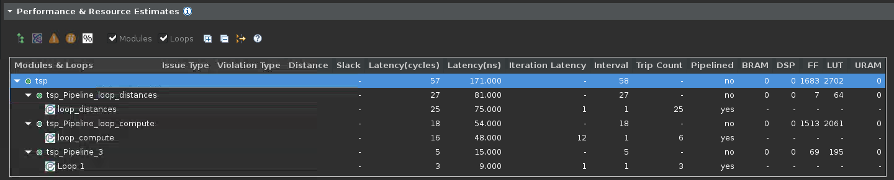

<table class="sphinxhide" width="100%">
 <tr width="100%">
    <td align="center"><h1>Vitis™ Hardware Acceleration Tutorials</h1>
    <a href="https://www.xilinx.com/products/design-tools/vitis.html">See Vitis™ Development Environment on xilinx.com</a>
    </td>
 </tr>
</table>

> **NOTE:** In this section, the TSP design is implemented with four parallel memory lookups to fetch distances.

## Load the Project into Vitis HLS

Open a terminal, and navigate to the `build` directory. Launch the following command which will open the graphical interface of Vitis HLS and configure the project based on the settings included in the `hls_opt.tcl` Tcl file:

```console
user@server:~$ cd ./build
user@server:~$ vitis_hls -p hls_opt.tcl &
```

When the tool comes up, on the left-hand side, locate the *Explorer* pane, expand **proj**->**Source** and double-click `tsp_opt.cpp` to inspect the source code. The testbench is found below in **proj**->**TestBench** in the file is `tsp_TB.cpp`.

## Review the Code Changes

There are now four arrays for the distances:

```cpp
uint16_t distances_0[N][N];
uint16_t distances_1[N][N];
uint16_t distances_2[N][N];
uint16_t distances_3[N][N];
```

The incoming distance data points are still read one at a time, but they are copied into all four memories:

```cpp
loop_distances: for (int i = 0; i < N*N; ++i)
  {
    uint16_t val;
    streamDistances >> val;
    distances_0[i/N][i%N] = val;
    distances_1[i/N][i%N] = val;
    distances_2[i/N][i%N] = val;
    distances_3[i/N][i%N] = val;
  }
```

The `loop_compute` main loop continuously increments by four and distributes the four values to copies of the `compute` function. Each evaluates a route:

```cpp
loop_compute: for( unsigned long int i_ = 0; i_ < factorialN; i_ += 4 )
  {
    #pragma HLS pipeline II=1
    candidate0 = std::min(candidate0, compute(i_+0, distances_0));
    candidate1 = std::min(candidate1, compute(i_+1, distances_1));
    candidate2 = std::min(candidate2, compute(i_+2, distances_2));
    candidate3 = std::min(candidate3, compute(i_+3, distances_3));
  }
```

Final determination of the shortest distance:

```cpp
    // Determine shortest between the four candidates
    shortestDistance = std::min({ candidate0, candidate1,
                                  candidate2, candidate3 });
```

## Running C Simulation and C Synthesis

First, you will run C simulation to confirm the optimized design works as expected. Edit the `tsp.h` file to make sure the number of cities is small (`N=5`) for faster simulation run times and **Run C Simulation**.  

After reviewing the results of simulation, increase the number of cities again (`N=13`) in the `tsp.h` file for C synthesis so that you can compare results with the original design. **Run C Synthesis**.

The following figure shows the C synthesis report in the Vitis HLS GUI (the **Performance and Resource Estimates** section):  


You will notice that:

- The latency for the `tsp` function is now less than a second.
- The loop distance trip count is unchanged as expected since the input data is same.
- The tripcount for the main loop (`loop_compute`) is now a fourth of factorial 12 (12!/4) thanks to the parallel execution of the `compute` function.
- The new `Loop 3` originates from the final `std::min` call that returns the smallest of the four results obtained.

<p class="sphinxhide" align="center"><sub>Copyright © 2020–2023 Advanced Micro Devices, Inc</sub></p>

<p class="sphinxhide" align="center"><sup><a href="https://www.amd.com/en/corporate/copyright">Terms and Conditions</a></sup></p>
