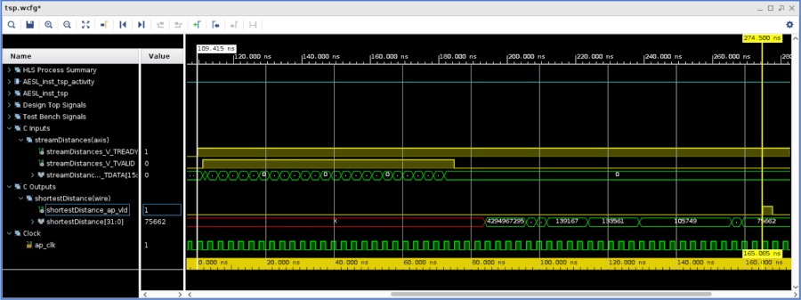

<table class="sphinxhide" width="100%">
 <tr width="100%">
    <td align="center"><h1>Vitis™ Hardware Acceleration Tutorials</h1>
    <a href="https://www.xilinx.com/products/design-tools/vitis.html">See Vitis™ Development Environment on xilinx.com</a>
    </td>
 </tr>
</table>

> **In this Section:** Run and describe the RTL/C Cosimulation phase.

## Run the Co-Simulation

This phase runs the test vectors of the tesbench on the RTL generated for the **tsp** block.
This is evidently an essential step of the flow in which you will confirm the correctness of the generated RTL code. Given the long runtime of the algorithm on CPUs for higher number of cities compounded by the additional time taken by running an RTL simulator, you are going to set a small number of cities.

Open `tsp.h`, change the number of cities to 5 (`N=5`), and rerun C synthesis.

From the GUI, the RTL/C co-simulation can be started from the same icon toolbar dropdown as before or via the main menu: **Solution** -> **Run C/RTL Cosimulation**.

From the configuration dialog (see the following screenshot), select "dump traces" **all**.  
  
Press **OK**.  

When the simulation completes, see the report coming up in the GUI ,or select the console window. As during the C simulation, the result matches the pre-calculated value in the testbench. The latency of 55 reported after C synthesis is confirmed after this co-simulation, and because you created the dump traces, you can access the AMD Vivado™ waveform viewer. Click the rightmost icon on the toolbarm or from the main menu, go to **Solutions** -> **Open Wave Viewer**.

Once the Vivado Waveform viewer displays, you will see that the signals are already organized in folders to the testbench and the accelerated function under test. You can then visualize the latency between the first distance data sent and the final result which is 55 clock cycles which translates to an executon time of 55 x 3.0ns = 165ns:
  

Close the Waveform viewer before moving on to the next lab.

## Next

* [Export the Design and Evaluate Performance in Vivado](./export.md)

Copyright © 2020–2023 Advanced Micro Devices, Inc

<a href="https://www.amd.com/en/corporate/copyright">Terms and Conditions</a>

