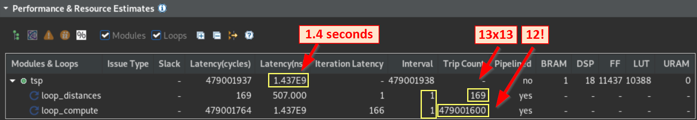

<table class="sphinxhide" width="100%">
 <tr width="100%">
    <td align="center"><h1>Vitis™ Hardware Acceleration Tutorials</h1>
    <a href="https://www.xilinx.com/products/design-tools/vitis.html">See Vitis™ Development Environment on xilinx.com</a>
    </td>
 </tr>
</table>

> **In this section:** You perform C synthesis to create a register transfer level (RTL) representation of the design and discuss the compiler hints (pragmas) used.

## Run Vitis HLS C Synthesis

In the previous phase, the C simulation, the code execution was purely C based, and although special libraries are used for streams, no RTL was yet involved. In C synthesis, the top function `tsp` is analyzed and compiled based on the hints (called pragma or directives) passed to the HLS compiler. When the operations are scheduled and mapped onto hardware constructs, the final code is generated in RTL (with both Verilog and VHDL).

The code uses three of these "hints":

- `PIPELINE`: Requests execution of the main loop (labeled `loop_compute`) at each clock cycle as specified by the `II=1` option.
- `INLINE`: Dissolves a sub-function for better optimization results. This is used for the `compute` function.
- `INTERFACE`: Specifies a protocol for a given top function argument. This is optional and only to demonstrate how AXI4-Stream can be added to an HLS stream.
- `BIND_STORAGE`: Assigns an array to a specific type of on-chip memory. Here the `distance` array is mapped onto a RAM with one write port and multiple read ports to allow simultaneous access to multiple city to city distances and calculate the full route quicker.

Before running synthesis, open the `tsp.h` file, and set the number to 13 (`N=13`). You can open the `tsp.h` file in the Vitis HLS GUI from the `tsp.cpp` file by holding the mouse over the `#include "tsp.h"` line and pressing the **CTRL** key while clicking the mouse.

To run HLS synthesis from the GUI, use the same shortcut used for C simulation earlier and select 'Run C Synthesis' or via the main menu, **Solution** -> **Run C Synthesis** - > **Active Solution**.

When synthesis has completed, the main window shows "Performance and Resource Estimates":  
(collapse the "General Information" and "Timing Estimates" sections by clicking on their title to make more room if necessary).

This "Performance and Resource Estimates" section shows a table in which you see the main function, `tsp` and the main loops. Because you gave them a label in the source code, it is easy to know which they are.  

## Next

- [Run the RTL/C Cosimulation](./cosim.md)

Copyright © 2020–2023 Advanced Micro Devices, Inc

<a href="https://www.amd.com/en/corporate/copyright">Terms and Conditions</a>

