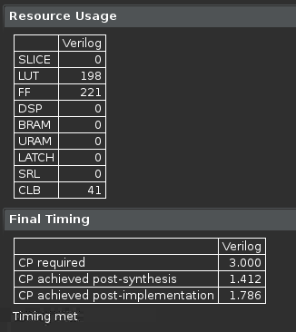

<table class="sphinxhide" width="100%">
 <tr width="100%">
    <td align="center"><h1>Vitis™ Hardware Acceleration Tutorials</h1>
    <a href="https://www.xilinx.com/products/design-tools/vitis.html">See Vitis™ Development Environment on xilinx.com</a>
    </td>
 </tr>
</table>

> **In this Section**: You look at the export phase of the flow to packages the RTL in either the AMD Vivado™ or the Vitis flow. In addition, you run the Vivado tool directly from the Vitis HLS GUI to get more accurate timing and resource estimates.

## Export the Accelerated Function and Evaluate in Vivado

During the export phase of the flow, Vitis HLS packages the results into a form that can be consumed by either Vitis or Vivado.  

- Change the number of cities back to 13 in `tsp.h`.
- Run C synthesis.
- Export through the toolbar "play" pulldown menu or via the main menu: **Solution** -> ***Run Implementation**.
- In the dialog, select `RTL synthesis, Place and Route` as follows:  

- Click **OK**, and let Vivado synthesis and implementation run until the flow completes and updates the main screen of Vitis HLS.

## Review the Vivado Results

## Next Step

- [Code optimization with Four Parallel Memory Lookups](./code_opt.md)

Copyright © 2020–2023 Advanced Micro Devices, Inc

<a href="https://www.amd.com/en/corporate/copyright">Terms and Conditions</a>

