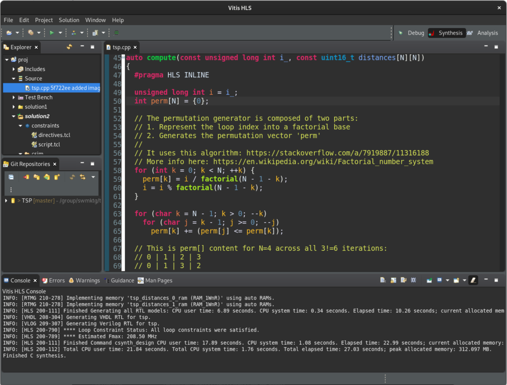

 
<table class="sphinxhide" width="100%">
 <tr width="100%">
    <td align="center"><h1>Vitis™ Hardware Acceleration Tutorials</h1>
    <a href="https://www.xilinx.com/products/design-tools/vitis.html">See Vitis™ Development Environment on xilinx.com</a>
    </td>
 </tr>
</table>

 > **In this Section:**
You load the C++ TSP design in Vitis HLS GUI.

## Launching the Vitis HLS GUI

Open a terminal and navigate to the `build` directory, then launch the `vitis_hls` command (see the following). It will open the graphical interface of Vitis HLS and configure the project based on the the content of `hls.tcl` (a Tcl file):

```console
user@server:~$ cd ./build
user@server:~$ vitis_hls -p hls.tcl &
```

When the tool comes up, on the left-hand side, locate the *Explorer* pane and expand **proj->Source**. Then double click `tsp.cpp` to inspect the source code. The testbench is found just below in **proj->TestBench** in the file called `tsp_TB.cpp`.



The Tcl file you used as an argument of the `-p` switch (`vitis_hls -p hls.tcl`) allowed the tool to simply read the setup and configuration options, and skip the flow commands that would require the execution of simulation or synthesis.  

Here is the content of the Tcl file (notice that how the `tsp.cpp` and its testbench `tsp_TB.cpp` are added to the project):

```tcl
# Project setup
#
open_project -reset proj
set_top tsp
add_files ../code/tsp.cpp
add_files -tb ../code/tsp_TB.cpp

# Solution commands
#
open_solution "solution1" -flow_target vivado
set_part {xcvu9p-flga2104-2-i}
create_clock -period 3.0 -name default
set_clock_uncertainty 0.5
config_export -format ip_catalog -rtl verilog

# Main flow commands
#
csim_design
csynth_design
cosim_design
export_design -flow impl -rtl verilog -format syn_dcp
```

This accelerated `tsp` function receives distances as a series of integers computed outside of the function by the testbench. Click on the following link for an explanation of the design structure.

## Next Step

* [Design structure](./design.md)

<p class="sphinxhide" align="center"><sub>Copyright © 2020–2023 Advanced Micro Devices, Inc</sub></p>

<p class="sphinxhide" align="center"><sup><a href="https://www.amd.com/en/corporate/copyright">Terms and Conditions</a></sup></p>
