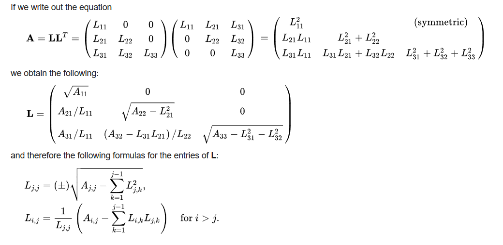

<table class="sphinxhide" width="100%">
 <tr width="100%">
    <td align="center"><h1>Vitis™ Hardware Acceleration Tutorials</h1>
    <a href="https://www.xilinx.com/products/design-tools/vitis.html">See Vitis™ Development Environment on xilinx.com</a>
    </td>
 </tr>
</table>

> **_In this initial module..._**<br>
_1> Description of the Cholesky algorithm_<br>
_2> Running the algorithm on the CPU_

#### Algorithm Description
This tutorial is based on a C++ kernel that we'll optimize for highest throughput.

The algorithm is a common linear algebra solver, the decomposition of a Hermitian, positive-definite matrix into the product of a lower triangular matrix and its conjugate transpose.  For this purpose we will use the Cholesky decomposition or Cholesky factorization (pronounced /ʃo-LESS-key/).  This solver is useful for several numerical problems, in particular for Monte Carlo simulations.

This algorithm has a serial complexity O(n<sup>3</sup>).



[_More information on wikipedia..._](https://en.wikipedia.org/wiki/Cholesky_decomposition)
Note that this solver is included as part the official Vitis accelerated libraries, here is a link to its documentation:
https://xilinx.github.io/Vitis_Libraries/solver/2022.1/guide_L2/L2_api.html#potrf

For our purpose, we will start with a simple description implemented in C++ and explain how to adapt it for acceleration with an Alveo U50 card.

#### Run this design on CPU

Open a terminal and navigate to the <code>./docs/cpu_src</code> directory.

Run the following command to compile the design:
```
g++ cpu_cholesky.cpp test.cpp matrixUtility.hpp -std=c++0x -O3 -o test
./test -M 512 -N 512 -seed 12
```
Run with different sizes of matrices small and large (maximum size is 2048x2048) to gauge the impact on the execution time.
Study the code to check how it implements the Cholesky algorithm.

> **Note 1**: If your server has limited stack size, this program might issue a segmentation fault at values smaller than 2048x2048. 

> **Note 2**: On Nimbix servers, fitted with Intel® Xeon® Processor E5-2640 v3 (20M Cache, 2.60 GHz), the algorithm execution time is about 21ms for a 512x512 matrix.

#### Next

Continue to [**module 1**](../module1_baseline/README.md) to build and run a baseline version with Vitis.


<p align="center"><sup>Copyright&copy; 2020-2022 Xilinx</sup></p>
