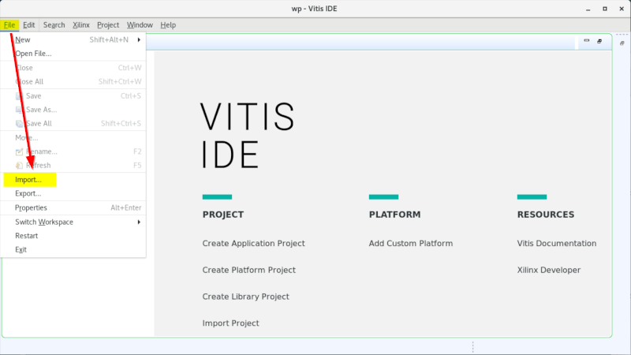
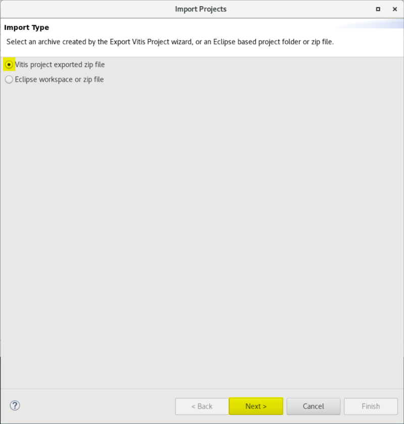
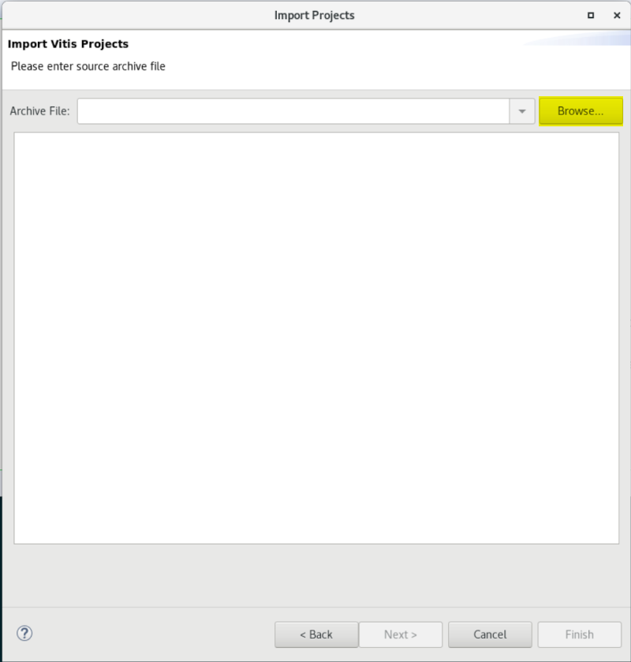
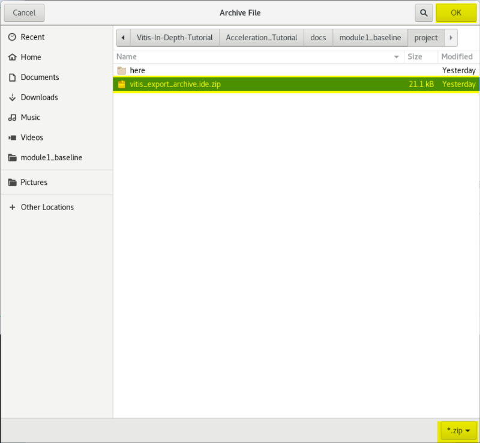
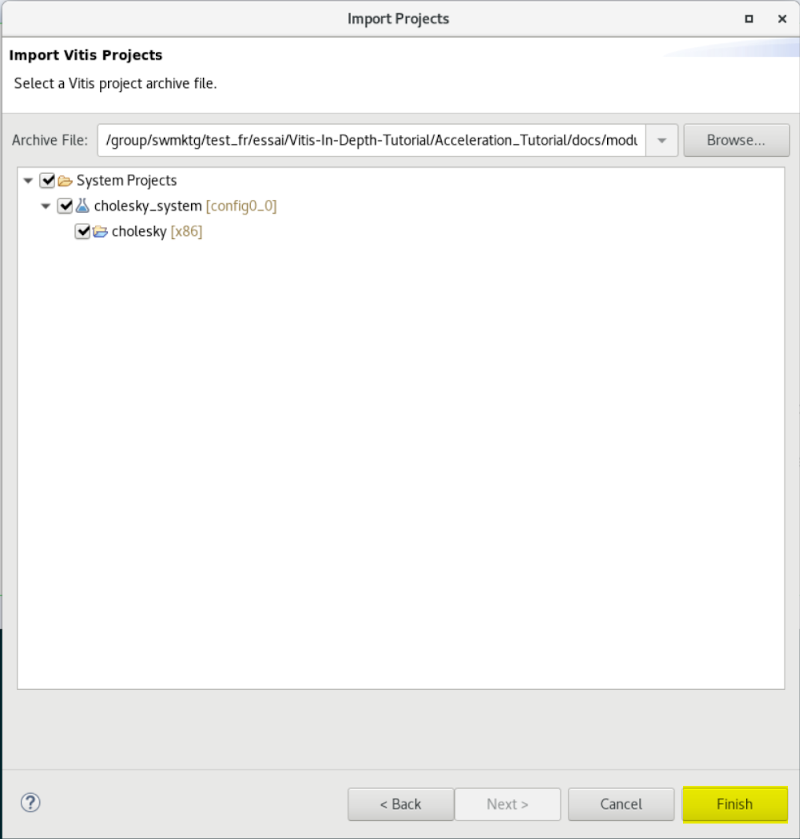
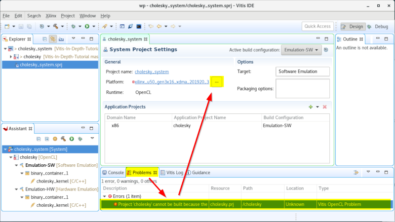

<table class="sphinxhide" width="100%">
 <tr width="100%">
    <td align="center"><h1>Vitis™ Hardware Acceleration Tutorials</h1>
    <a href="https://www.xilinx.com/products/design-tools/vitis.html">See Vitis™ Development Environment on xilinx.com</a>
    </td>
 </tr>
</table>

Code, files, and instructions for **Module 1**

> **_In this Module..._**  
>
>1. Review the OpenCL™ API for the host/kernel paradigm.  
>2. Run Vitis via the GUI or `make` to execute software and hardware emulation.  
>3. Run Vitis Analyzer to review the application timeline.  
>4. Run Vitis HLS to identify the throughput bottleneck.  
>5. Insert a testbench into HLS to iterate quickly and verify kernel code changes.

## Understanding Code Setup with Host and Kernel

The source code for each module is located under their local `./src` directory:

+ Take a look at the host code and notice the several APIs that are used. Notice how the data is transferred back and forth to the kernel and back. The execution model can be broken down into the following steps:
  + The host program writes the data needed by a kernel into the global memory of the attached device through the PCIe® interface on an AMD Alveo™ Data Center accelerator card or through the AXI bus on an embedded platform.
    + The host program sets up the kernel with its input parameters.
    + The host program triggers the execution of the kernel function on the FPGA.
    + The kernel performs the required computation while reading data from global memory, as necessary.
    + The kernel writes data back to global memory and notifies the host that it has completed its task.
    + The host program reads data back from global memory into the host memory and continues processing as needed.
  + Take a look at the kernel code. This code is compiled by the Vitis tools and transformed into an hardware description that the AMD Vivado™ tool implements onto AMD devices. Since the the host and kernel code are developed and compiled independently, wrap the kernel function declaration with the extern "C" linkage in the header file, or wrap the whole function in the kernel code.

    ```cpp
    extern "C" {
                 void kernel_function(int *in, int *out, int size);
               }
    ```

***

## Build and Emulate with Vitis

For each module of this tutorial, Vitis can be run via the GUI **or** at the command line (more efficient in the context of this tutorial):
<details>
  <summary><b>Click to expand! (<code>Vitis GUI</code> instructions)</b></summary>

### Using Vitis via the GUI

   >**TIP:** When following the links below, right-click "open in another tab" to avoid losing the context for these instructions.

   1. Open a terminal.
   2. Set up and launch Vitis.
   3. "File" menu -> "Import...".
      
   4. Accept the default of the Vitis project exported zip file, and click **Next**.
      
   5. Click **Browse** on the next window, and navigate to the `./docs/module1_baseline/project` directory.
      
   6. Select the `vitis_export_archive.ide.zip`, and click **OK**.
      
   7. In the next window, click **Finish**.
      

### Setting Up the Platform

   1. On the center window pane, click on the triple dot icon `...` right after the platform link.
      
   2. Navigate to specify the platform accessible from your system.

### Building and Emulating the Design

   Notice the "Assistant" window pane with its three main flow steps.

   1. `Emulation-SW`: Validate the design at the functional level.
   2. `Emulation-HW`: Compile the kernel into a cycle accurate representation to better gauge metrics.
   3. `Hardware`: Launch the full compilation and generate a bitstream.

 Run the software emulation (takes a couple of minutes).

 Run the hardware emulation (takes between 10 to 20 minutes).

 When hardware emulation has completed, go to the following Vitis Analyzer section.

</details>

***OR***

<details>
  <summary><b>Click to expand! (instructions for <code>make</code>)</b></summary>

### Using **make**

   1. Open a terminal.
   2. Set up Vitis.
   3. Navigate to `./build`.
   4. Run `make run TARGET=sw_emu` (for a functional emulation).
   5. Run `make run TARGET=hw_emu` (for a more detailed emulation — takes 10 minutes or more).
      + For now, do not run the `hw` target because it would take over an hour to run.

</details>

***

## Vitis Analyzer for Application End-to-end Timeline Analysis

Vitis Analyzer is a graphical tool which lets you browse many aspects of the design starting from the whole system down to the details of the kernel.

In the 2023.1 release, the `vitis_analyzer` command opens the Analysis view of the new Vitis Unified IDE and loads the specified summary files as described in [Working with the Analysis View](https://docs.xilinx.com/r/en-US/ug1393-vitis-application-acceleration/Working-with-the-Analysis-View). You can navigate to the various reports using the left pane of the Analysis view or by clicking the links provided in the summary report.

<details>
  <summary><b>Click to expand! (instructions for <code>Vitis Analyzer</code></b>)</summary>

   1. Open a terminal and set up Vitis.
   2. Change directory to `./build`.
   3. Run `vitis_analyzer xrt.run_summary`.
   4. Navigate around in Vitis Analyzer.

      Make sure to check:
      1. Profile summary
      2. Guidance reports — indicates area of improvement
      3. Timeline Trace — more information just below

The Timeline has the following structure:

+ _Host_

  + **OpenCL API Calls:** All OpenCL API calls are traced here. The activity time is measured from the host perspective.

  + **General:** All general OpenCL API calls such as clCreateProgramWithBinary, clCreateContext, and clCreateCommandQueue, are traced here.

  + **Queue:**
     OpenCL API calls that are associated with a specific command queue are traced here. This includes commands such as clEnqueueMigrateMemObjects, and clEnqueueNDRangeKernel. If the user application creates multiple command queues, then this section shows all the queues and activities.

  + **Data Transfer:** In this section, the direct memory access (DMA) transfers from the host to the device memory are traced. There are multiple DMA threads implemented in the OpenCL runtime, and there is typically an equal number of DMA channels. The DMA transfer is initiated by the user application by calling OpenCL APIs, such as clEnqueueMigrateMemObjects. These DMA requests are forwarded to the runtime which delegates to one of the threads. The data transfer from the host to the device appear under Write as they are written by the host, and the transfers from device to host appear under Read.

  + **Kernel Enqueues:** The kernels enqueued by the host program are shown here. The kernels here should not be confused with the kernels/compute units on the device. Here kernel refers to the NDRangeKernels and tasks created by the OpenCL commands `clEnqueueNDRangeKernels` and `clEnqueueTask`. These are plotted against the time measured from the host's perspective. Multiple kernels can be scheduled to be executed at the same time, and they are traced from the point they are scheduled to run until the end of the kernel execution. Multiple entries would be shown in different rows depending on the number of overlapping kernel executions.

+ _Device "name"_

   **Binary Container "name":** Simply the binary container name.

  + **Accelerator "name":** Name of the compute unit (also known as, the Accelerator) on the FPGA.

</details>

***

## Vitis HLS for Kernel Optimizations

The C++ kernels destined implemented onto the device look-up tables (LUTs) and flops (also known as, the "fabric") are automatically compiled with the high-level synthesis tool Vitis HLS. In this tutorial, you run Vitis HLS "manually" to gain additional insights about the underlying synthesis technology and the Cholesky kernel algorithm.

<details>
  <summary><b>Click to expand! (instructions for <code>Vitis HLS</code>)</b></summary>

   1. Open a terminal and set up Vitis.
   2. Navigate to `./build/cholesky_kernel_hw_emu/cholesky_kernel`.
      + There should be yet another `cholesky_kernel` directory at that level.
   3. Run `vitis_hls -p cholesky_kernel &` (to start the Vitis high-level synthesis GUI).
   4. Vitis HLS now shows the high-level synthesis report.
   5. In the GUI, expand the **Synthesis Summary Report** window.
   6. Expand the loops and function in the **Performance & Resources** section.
   7. Right click the **II violation**, and select **Goto Source**.

   >**NOTE:** You can restore the original Vitis HLS window layout via the "Window" menu -> "Reset Perspective".

### Initiation Interval

   You see an initiation interval (II) violation of eight for two loops in this function. One of them looks like this:

   ```cpp
   for (int k = 0; k < j; k++)
   {
       tmp += dataA[j][k] * dataA[j][k];
   }
   ```

Because this version of the algorithm uses double data types with an accumulation, the silicon needs eight cycles at 300 MHz to perform and complete the operation before starting the next. So you can only compute samples one after another by intervals of eight cycles. This is the first bottleneck that you will tackle in the next module.

#### Kernel Latency

 Look at the latency.

`cholesky_kernel/solution/syn/report/cholesky_kernel_csynth.rpt`

    * Loop:
    +--------------------+--------+---------+-------------+-----------+-----------+------------+----------+
    |                    | Latency (cycles) |  Iteration  |  Initiation Interval  |    Trip    |          |
    |       Loop Name    |  min   |   max   |   Latency   |  achieved |   target  |    Count   | Pipelined|
    +--------------------+--------+---------+-------------+-----------+-----------+------------+----------+
    |- VITIS_LOOP_32_..  |       ?|        ?|            3|          1|          1|           ?|    yes   |
    |- Loop_first_col    |       ?|        ?|           34|          1|          1|           ?|    yes   |
    |- Loop_col          |       ?|        ?|            ?|          -|          -|           ?|    no    |
    | + Loop_diag        |      17|  2097161|           18|          8|          1| 1 ~ 262144 |    yes   |
    | + Loop_row         |       ?|        ?| 61 ~ 2097205|          -|          -|           ?|    no    |
    |  ++ Loop_vec_mul   |      17|  2097161|           18|          8|          1| 1 ~ 262144 |    yes   |
    |- VITIS_LOOP_67_..  |       ?|        ?|            4|          1|          1|           ?|    yes   |
    +--------------------+--------+---------+-------------+-----------+-----------+------------+----------+

Notice that:

+ The `VITIS` prefixed loops: these are loops automatically labeled by Vitis HLS since none were applied in the source code for them. The other loops did have a label; it is shown in the table.
  + The question marks (?) denote a metric that cannot be calculated because dependent on scalar input to the function and indeed in this example the matrix size is configurable and latency will vary depending on the size.
  + The last "Pipeline" column indicates if a loop was constrained to process its inputs at each cycle. The simple loops or most inner nested loops are the ones generally "pipelined" automatically by the tool

 As an input to the Cholesky function, the user passes the size of the matrix N (in the example you ran, it was 64).

 The first loop requires N iterations at II=1 so it takes Nx3 to complete since the iteration latency is 3.
 The `Loop_first_col` loop takes Nx34. The `Loop_col` loop runs N times (`Loop_diag` is N x 18) + (`Loop_row` is N x (N + 18)). The last loop also requires N iterations like the first one.

You can roughly estimate the duration to be:
 `N(18N+N(18N+residual1)+residual2) = 18N<sup>3</sup> + (18+residual1)N<sup>2</sup> + residual2.N`.

So essentially the algorithm latency goes by the cube of N, the size of the matrix.

</details>

***

## Wrap-up for Module 1

**Key points:**

+ To accelerate an algorithm on an Alveo card, the program needs a host and a kernel design unit.
+ Vitis helps build the application, provides drivers to enable host-kernel communications.
+ Vitis provides an analyzer tool to help understand the sequence of operations.
+ Vitis HLS is a compiler technology that transforms the C code algorithm into an hardware language to implement onto the AMD device.

***

### Next

You can now proceed to [**Module 2**](../module2_pipeline/README.md).
***

<p class="sphinxhide" align="center"><sub>Copyright © 2020–2023 Advanced Micro Devices, Inc</sub></p>

<p class="sphinxhide" align="center"><sup><a href="https://www.amd.com/en/corporate/copyright">Terms and Conditions</a></sup></p>
