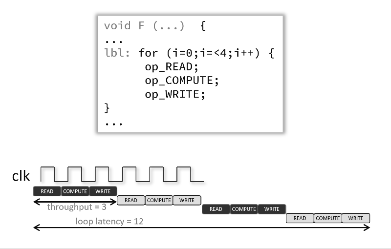

<table class="sphinxhide" width="100%">
 <tr width="100%">
    <td align="center"><h1>Vitis™ Hardware Acceleration Tutorials</h1>
    <a href="https://www.xilinx.com/products/design-tools/vitis.html">See Vitis™ Development Environment on xilinx.com</a>
    </td>
 </tr>
</table>

Code, files and instructions for **module 2** (same instructions as in [<b>module 1</b>](../module1_baseline) to setup and run the Vitis tools)

> **_In this module..._**  
_1> Pipeline for throughput_  
_2> General description of `PIPELINE`_  
_3> Introduction to the `INTERFACE` pragma_

This module is meant to focus on the `pipeline` pragma and go through the description below.
The kernel source code with the loops annotated with the pragma will produce the same results as in **module 1**, that's because since simple loops and inner loops (for nested loops) are automatically pipelined by the tool. This version also adds the <code>interface</code> pragma to explicitely describe the connectivity and settings for the C ports of the kernel.

### Pipelining for Throughput
High-level synthesis can be very conservative by default, for example loop body instructions are entirely executed at each iteration instead of executing in a staggered fashion.  That latter style of execution is explicitely enabled by the <code>PIPELINE</code> pragma, it then reduces the initiation interval (II) for a function or loop (here in this tutorial, it's applied on loops) by allowing the concurrent execution of the different operations.
A pipelined function or loop can then process new inputs every <N> clock cycles, where <N> is the II of the loop or function. The default II for the <code>PIPELINE</code> pragma is 1, which processes a new input every clock cycle. You can also specify the initiation interval through the use of the II option.

Pipelining a loop allows its operations to be implemented so that these operations execute concurrently as shown in the following animated figure below. In that example and by default there are 3 clock cycles between each input read (so II=3), and it requires 12 clock cycles fully execute the loop compared to 6 when the pragma is used.



If the Vitis high-level synthesis tool cannot create a design with the user-specified II, it issues a warning and creates a design with the lowest achievable II.
You can then analyze this design with the warning message to determine what steps must be taken to create a design that satisfies the required initiation interval.

To enable the pragma in the C source, insert it within the body of the function or loop.
```cpp
 #pragma HLS pipeline II=<int> enable_flush rewind
```
II=int specifies the desired number of clock cycles between each  initiation interval for the pipeline. The HLS tool tries to meet this request but based on data dependencies, the actual result might have a larger initiation interval. The enable_flush modifier is optional and keeps on pushing data out if the data valid at the input of the pipeline goes inactive. The rewind modifier is also optional and enables continuous loop pipelining with no pause between one loop iteration ending and the next iteration starting. Rewinding is effective only if there is one single loop (or a perfect loop nest) inside the top-level function.

In the following example function <code>foo</code> is pipelined with an initiation interval of 1:
```cpp
void foo { a, b, c, d} {
  #pragma HLS pipeline II=1
  ...
}
```
Take a look at the kernel source code and notice how the <code>PIPELINE</code> pragma/directive is applied for several loops in the code.
Since Vitis HLS automatically pipelines the most inner loops, the results won't be different compared to what was seen in the previous module (the baseline).

### The <code>INTERFACE</code> Pragma

The <code>INTERFACE</code> pragma specifies the physical adapters for the kernel C ports and how they attach to the platform during what's referred to as "interface synthesis" in HLS.

These physical adapters and their associated RTL implementation are derived from the following:

 - Any function-level protocol that is specified: Function-level protocols, also called block-level I/O protocols, provide signals to control when the function starts operation, and indicate when function operation ends, is idle, and is ready for new inputs. The implementation of a function-level protocol is: Specified by the <mode> values ap_ctrl_none, ap_ctrl_hs or ap_ctrl_chain. The ap_ctrl_hs block-level I/O protocol is the default. Are associated with the function name.
 - Function arguments: Each function argument can be specified to have its own port-level (I/O) interface protocol, such as valid handshake (ap_vld), or acknowledge handshake (ap_ack). Port-level interface protocols are created for each argument in the top-level function and the function return, if the function returns a value. The default I/O protocol created depends on the type of C argument. After the block-level protocol has been used to start the operation of the block, the port-level I/O protocols are used to sequence data into and out of the block.
 - Global variables accessed by the top-level function, and defined outside its scope:
 - If a global variable is accessed, but all read and write operations are local to the function, the resource is created in the RTL design. There is no need for an I/O port in the RTL. If the global variable is expected to be an external source or destination, specify its interface in a similar manner as standard function arguments. See the Examples below.

When the <code>INTERFACE</code> pragma is used on sub-functions, only the register option can be used. The <mode> option is not supported on sub-functions.
TIP: The Vivado High-Level Synthesis (HLS) tool automatically determines the I/O protocol used by any sub-functions. You cannot control these ports except to specify whether the port is registered.

**Specifying Burst Mode**

When specifying burst-mode for interfaces, using the max_read_burst_length or max_write_burst_length options (as described in the Syntax section) there are limitations and related considerations that are derived from the AXI standard:

The burst length should be less than, or equal to 256 words per transaction, because ARLEN & AWLEN are 8 bits; the actual burst length is AxLEN+1.
    In total, less than 4 KB is transferred per burst transaction.
    Do not cross the 4 KB address boundary.
    The bus width is specified as a power of 2, between 32-bits and 512-bits (i.e. 32, 64, 128, 256, 512 bits) or in bytes: 4, 8, 16, 32, 64.

Given the 4 KB limit, the maximum burst length for a single transaction for a bus width of:

 - 32-bits is 256 words for 1024 total bytes transferred per transaction.
 - 64-bits is 256 words for 2048 total bytes transferred per transaction.
 - 128-bits is 256 words for 4096 total bytes transferred per transaction.
 - 256-bits is 128 words for 4096 total bytes transferred per transaction.
 - 512-bits is 64 words for 4096 total bytes transferred per transaction.

> **Note**: The actual transactions are design dependent, for example, pipelined accesses from a for-loop of 100 iterations when max_read_burst_length or max_write_burst_length is set to 128, will not fill the max burst length. However, if accesses are longer than the specified maximum burst length, some accesses will be split into smaller bursts.  
For example, a pipelined for-loop with 100 accesses and max_read_burst_length or max_write_burst_length set to 64, will be split into 2 transactions, one of the max burst length (or 64) and one transaction of the remaining data (burst of length 36 words).

---

#### Next

You can now continue to [<b>module 3</b>](../module3_datatype/README.md) or run this version of the design to verify it behaves similarly to module 1.

<p align="center"><sup>Copyright&copy; 2020-2022 Xilinx</sup></p>
