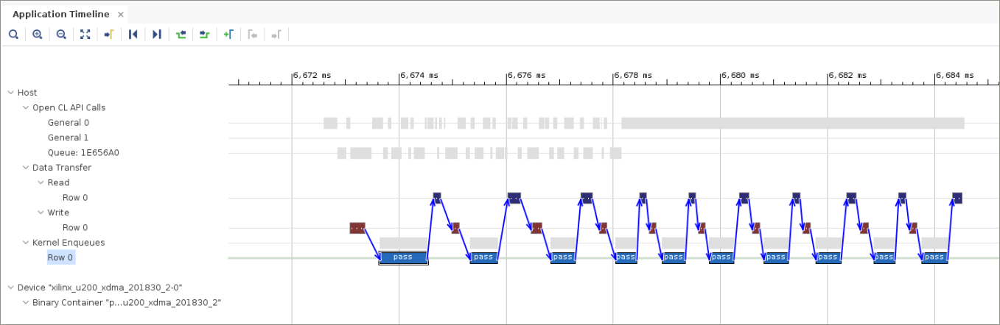
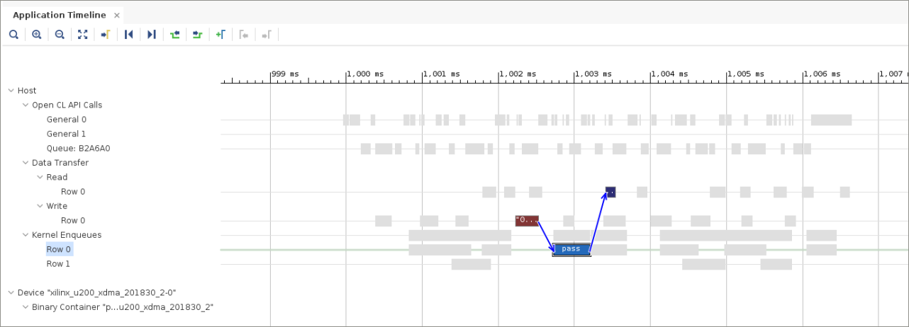
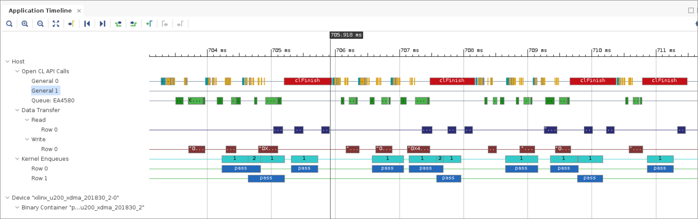
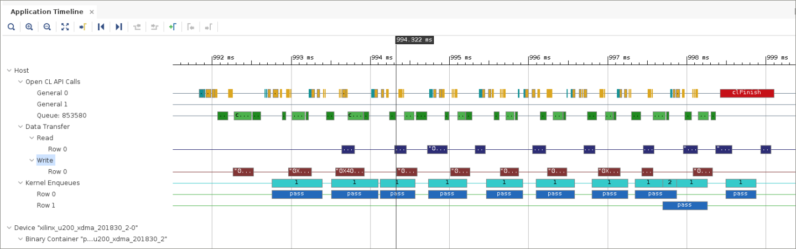
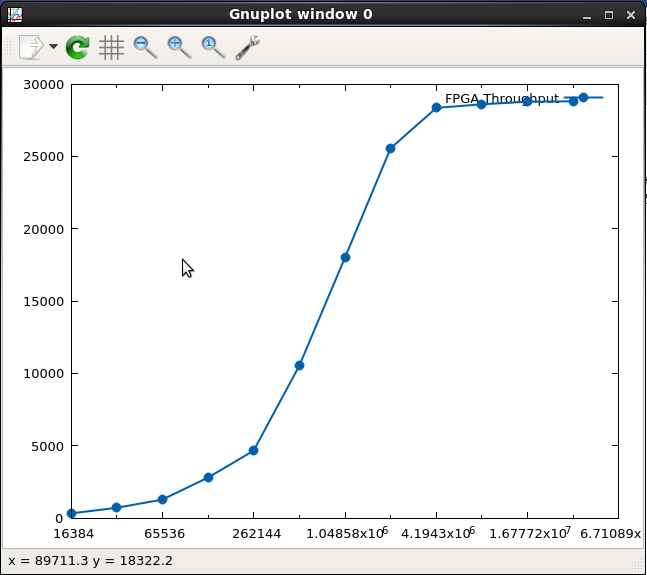

<table class="sphinxhide" width="100%">
 <tr width="100%">
    <td align="center"><h1>Vitis™ Hardware Acceleration Tutorials</h1>
    <a href="https://www.xilinx.com/products/design-tools/vitis.html">See Vitis™ Development Environment on xilinx.com</a>
    </td>
 </tr>
</table>

# Host Code Optimization

***Version: Vitis 2022.2***

## Introduction

This tutorial concentrates on performance tuning of the host code associated with an FPGA accelerated application. Host code optimization is only one aspect of performance optimization, which includes the following disciplines:

* Host program optimization
* Kernel code optimization
* Topological optimization
* Implementation optimization

## Tutorial Overview

In this tutorial, you operate on a simple, single, generic C++ kernel implementation. This allows you to eliminate any aspects of the kernel code modifications, topological optimizations, and implementation choices from the analysis of host code implementations.
>**NOTE:** The host code optimization techniques shown in this tutorial are limited to aspects for optimizing the accelerator integration. Additional common techniques, which allow for the usage of multiple CPU cores or memory management on the host code, are not part of this discussion. For more information, refer to [Profiling, Optimizing, and Debugging the Application](https://docs.xilinx.com/r/en-US/ug1393-vitis-application-acceleration/Profiling-Optimizing-and-Debugging-the-Application) in the Application Acceleration Development flow of the Vitis Unified Software Platform Documentation (UG1416).

The following sections focus on the following specific host code optimization concerns:

* Software Pipelining/Event Queue
* Kernel and Host Code Synchronization
* Buffer Size

## Before You Begin

This tutorial uses:

* BASH Linux shell commands
* 2022.2 Vitis core development kit release and the *xilinx_u200_gen3x16_xdma_2_202110_1* platform.  
If necessary, it can be easily ported to other versions and platforms.

>**IMPORTANT:**  
>
> * Before running any of the examples, make sure you have the Vitis core development kit as described in [Installation](https://docs.xilinx.com/r/en-US/ug1393-vitis-application-acceleration/Installation) in the Application Acceleration Development flow of the Vitis Unified Software Platform Documentation (UG1416).
>* If you run applications on Xilinx® Alveo™ Data Center accelerator cards, ensure the card and software drivers have been correctly installed by following the instructions on the [Alveo Portfolio page](https://www.xilinx.com/products/boards-and-kits/alveo.html).

### Accessing the Tutorial Reference Files

1. To access the reference files, type the following into a terminal: `git clone https://github.com/Xilinx/Vitis-Tutorials`.
2. Navigate to the `Hardware_Acceleration/Design_Tutorials/07-host-code-opt` directory, and then access the `reference-files` directory.

## Model

In this example, the kernel is created solely for host code optimization. It is designed to be static throughout this tutorial, which allows you to see the effects of your optimizations on the host code.  
<!--this could be better suited as a table-->

The C++ kernel has one input and one output port. These ports are 512-bits wide to optimally use the AXI bandwidth. The number of elements consumed by kernel per execution is configurable through the `numInputs` parameter. Similarly, the `processDelay` parameter can be used to alter the latency of the kernel. The algorithm increments the input value by the value for `ProcessDelay`. However, this increment is implemented by a loop executing `processDelay` times incrementing the input value by one each time. Because this loop is present within the kernel implementation, each iteration will end up requiring a constant amount of cycles, which can be multiplied by the `processDelay` number.

The kernel is also designed to enable AXI burst transfers. The kernel contains a read and a write process, executed in parallel with the actual kernel algorithm (`exec`) towards the end of the process.
The read and the write process initiates the AXI transactions in a simple loop and writes the received values into internal FIFOs or reads from internal FIFOs and writes to the AXI outputs. The Vitis compiler implements these blocks as concurrent parallel processes, because the DATAFLOW pragma was set on the surrounding `pass_dataflow` function.

## Building the Device Binary (xclbin)

>**NOTE**: In this tutorial, run all instructions from the `reference-files` directory.

Although some host code optimizations perform well with the hardware emulation, accurate runtime information and the running of large test vectors require the kernel to be executed on an actual accelerator card. Generally, the kernel is not expected to change during host code optimization, so the kernel only needs to be compiled to hardware once for this tutorial.

Run the following makefile command to compile the kernel to the specified accelerator card.

```
make TARGET=hw DEVICE=xilinx_u200_gen3x16_xdma_2_202110_1 xclbin
```

>**NOTE:** This build process can take several hours, but the kernel compilation must be completed before you can analyze the impact of optimizations on the host code performance.

## Host Code

Before examining different implementation options for the host code, view the structure of the code. The host code file is designed to let you focus on the key aspects of host code optimization.

The following three classes are provided through header files in the common source directory (`srcCommon`):

* `srcCommon/AlignedAllocator.h`: `AlignedAllocator` is a small struct with two methods. This struct is provided as a helper class to support memory-aligned allocation for the test vectors. On Alveo Data Center accelerator cards, memory-aligned blocks of data can be transferred much more rapidly, and the OpenCL™ API library will create warnings if the data transmitted is not memory-aligned.

* `srcCommon/ApiHandle.h`: This class encapsulates the main OpenCL API objects:
  * context
  * program
  * `device_id`
  * execution kernel
  * `command_queue`

   These structures are populated by the constructor, which steps through the default sequence of OpenCL API function calls. There are only two configuration parameters to the constructor:
  * A string containing the name of the bitstream (`xclbin`) to be used to program the FPGA.
  * A Boolean to determine if an out-of-order queue or a sequential execution queue should be created.

  The class provides accessory functions to the queue, context, and kernel required for the generation of buffers and the scheduling of tasks on the accelerator. The class also automatically releases the allocated OpenCL API objects when the ApiHandle destructor is called.

* `srcCommon/Task.h`: An object of class `Task` represents a single instance of the workload to be executed on the accelerator. Whenever an object of this class is constructed, the input and output vectors are allocated and initialized based on the buffer size to be transferred per task invocation. Similarly, the destructor will de-allocate any object generated during the task execution.
  >**NOTE:** This encapsulation of a single workload for the invocation of a module allows this class to _also_ contain an output validator function (`outputOk`).

   The constructor for this class contains two parameters:
  * `bufferSize`: Determines how many 512-bit values are transferred when this task is executed.
  * `processDelay`: Provides the similarly-named kernel parameter, and it is also used during validation.

  The most important member function of this class is the `run` function. This function enqueues three different steps for executing the algorithm:
  1. Writing data to the FPGA accelerator
  2. Setting up the kernel and running the accelerator
  3. Reading the data back from the FPGA accelerator

  To perform these operations, buffers are allocated on the DDR for the communication. Additionally, events are used to establish a dependency between the different commands (write before execute before read).

  In addition to the ApiHandle object, the `run` function has one conditional argument. This argument allows a task to be dependent on a previously-generated event. This allows the host code to establish task order dependencies, as illustrated later in this tutorial.

  None of the code in any of these header files is modified during this tutorial. All key concepts will be shown in different `host.cpp` files, as found in:

 * `src/pipeline_host.cpp`
 * `src/sync_host.cpp`
 * `src/buf_host.cpp`

  However, the main function in the `host.cpp` file follows a specific structure described in the following section.

### host.cpp Main Functions

The main function contains the following sections marked in the source accordingly.

1. **Environment / Usage Check**
2. **Common Parameters**:
   * `numBuffers`: Not expected to be modified. This parameter is used to determine how many kernel invocations are performed.
   * `oooQueue`: This boolean value is used to declare the kind of OpenCL event queue that is generated inside the ApiHandle.
   * `processDelay`: This parameter can be used to artificially delay the computation time required by the kernel. This parameter is not used in this version of the tutorial.
   * `bufferSize`: This parameter is used to declare the number of 512-bit values to be transferred per kernel invocation.
   * `softwarePipelineInterval`: This parameter is used to determine how many operations can be pre-scheduled before synchronization occurs.
3. **Setup**: To ensure that you are aware of the status of configuration variables, this section prints out the final configuration.
4. **Execution**: In this section, you can model several different host code performance issues. These are the lines you will focus on for this tutorial.
5. **Testing**: After execution has completed, this section performs a simple check on the output.
6. **Performance Statistics**: If the model is run on an actual accelerator card (not emulated), the host code will calculate and print the performance statistics based on system time measurements.

  >**NOTE:** The setup, as well as the other sections, can print additional messages recording the system status, as well as overall `PASS` or `FAIL` of the run.

### Lab 1: Pipelined Kernel Execution Using Out-of-Order Event Queue

In this first exercise, you will look at a pipelined kernel execution.

In this build you are only dealing with a single instance of the kernel, or compute unit (CU) running in the hardware. However, as previously described, the run of a kernel also requires the transmission of data to and from the CU. These activities should be pipelined to minimize the idle-time of the kernel working with the host application.

Open the host code, `src/pipeline_host.cpp`, and look at the execution loop starting at line 55.

  ```cpp
    // -- Execution -----------------------------------------------------------

    for(unsigned int i=0; i < numBuffers; i++) {
      tasks[i].run(api);
    }
    clFinish(api.getQueue());
  ```

In this case, the code schedules all the buffers and lets them execute. Only at the end does it actually synchronize and wait for completion.

1. Compile and run the host code (`srcPipeline/host.cpp`) using the following command.

   ```
   make TARGET=hw DEVICE=xilinx_u200_gen3x16_xdma_2_202110_1 LAB=pipeline
   ```

   Compared to the kernel compilation time, this build step takes very little time.

2. You are now ready to run the application.

   The runtime data is generated by the host program due to settings specified in the `xrt.ini` file, as described in [Enabling Profiling in Your Application](https://docs.xilinx.com/r/en-US/ug1393-vitis-application-acceleration/Enabling-Profiling-in-Your-Application). This file is found at `./reference-files/auxFiles/xrt.ini`, and is copied to the `runPipeline` directory by the `make run` command. 
   
   The `xrt.ini` file contains the following settings:
   ```
   [Debug]
   opencl_trace=true
   device_trace=coarse
   ```

   Use the following command to run the application.

   ```
   make run TARGET=hw DEVICE=xilinx_u200_gen3x16_xdma_2_202110_1 LAB=pipeline
   ```

   After the run completes, open the Application Timeline using the Vitis analyzer, then select the Application Timeline located in left side panel.

   ```
   vitis_analyzer runPipeline/pass.hw.xilinx_u200_gen3x16_xdma_2_202110_1.xclbin.run_summary
   ```

   The Application Timeline view illustrates the full run of the executable. The three main sections of the timeline are:

   * OpenCL API Calls
   * Data Transfer
   * Kernel Enqueues

3. Zoom in on the section illustrating the actual accelerator execution, and select one of the kernel enqueue blocks on `Row 0` to see an image similar to the following figure.


   The blue arrows identify dependencies, and you can see that every Write/Execute/Read task execution has a dependency on the previous Write/Execute/Read operation set. This effectively serializes the execution. In this case, the dependency is created by using an ordered queue. 
   
4. Open the file `src/pipeline_host.cpp` in a text editor. 
   
   In the **Common Parameters** section as shown at line 27 of the `pipeline_host.cpp`, the `oooQueue` parameter is set to `false`.

   ```cpp
    bool         oooQueue                 = false;
   ```

   You can break this dependency by changing the out-of-order parameter to `true`.

   ```cpp
    bool         oooQueue                 = true;
   ```

5. Recompile the application, rerun the program, and review the run_summary in Vitis analyze: 

   ```
   make run TARGET=hw DEVICE=xilinx_u200_gen3x16_xdma_2_202110_1 LAB=pipeline
   vitis_analyzer pipeline/pass.hw.xilinx_u200_gen3x16_xdma_2_202110_1.xclbin.run_summary
   ```

   If you zoom in on the Application Timeline, and click any kernel enqueue, you should see results similar to the following figure.


   If you select other pass kernel enqueues, you will see that all 10 are now showing dependencies only within the Write/Execute/Read group. This allows the read and write operations to overlap with the execution, and you are effectively pipelining the software write, execute, and read. This can considerably improve the overall performance because the communication overhead is occurring concurrently with the execution of the accelerator.

### Lab 2: Kernel and Host Code Synchronization

For this step, look at the source code in `src/sync_host.cpp` and examine the execution loop (line 55). This is the same code used in the previous section of this tutorial.

```cpp
  // -- Execution -----------------------------------------------------------

  for(unsigned int i=0; i < numBuffers; i++) {
    tasks[i].run(api);
  }
  clFinish(api.getQueue());
```

In this example, the code implements a free-running pipeline. No synchronization is performed until the end, when a call to `clFinish` is performed on the event queue. While this creates an effective pipeline, this implementation has an issue related to buffer allocation, as well as execution order. This is because it is only possible to release buffers after they are no longer needed, which implies a synchronization point.

For example, there could be issues if the `numBuffer` variable is increased to a large number, which would occur when processing a video stream. In this case, buffer allocation and memory usage can become problematic because the host memory is pre-allocated and shared with the FPGA. In such a case, this example will probably run out of memory.

Similarly, as each of the calls to execute the accelerator are independent and un-synchronized (out-of-order queue), it is likely that the order of execution between the different invocations is not aligned with the enqueue order. As a result, if the host code is waiting for a specific block to be finished, this might not occur until much later than expected. This effectively disables any host code parallelism while the accelerator is operating.

To alleviate these issues, the OpenCL framework provides two methods of synchronization.

* `clFinish` call
* `clWaitForEvents` call

1. Open the `src/sync_host.cpp` file in an editor, and look at the `Execution` region. To illustrate the behavior, make the following modifications to the execution loop.

     ```cpp
     // -- Execution -----------------------------------------------------------

     int count = 0;
     for(unsigned int i=0; i < numBuffers; i++) {
       count++;
       tasks[i].run(api);
       if(count == 3) {
         count = 0;
         clFinish(api.getQueue());
       }
     }
     clFinish(api.getQueue());
   ```

2. Compile and execute the `sync_host.cpp` code.

   ```
   make run TARGET=hw DEVICE=xilinx_u200_gen3x16_xdma_2_202110_1 LAB=sync
   ```

3. After the run completes, open the Application Timeline using the Vitis analyzer, then  click the Application Timeline located at left side panel.

   ```
   vitis_analyzer sync/pass.hw.xilinx_u200_gen3x16_xdma_2_202110_1.xclbin.run_summary
   ```
   
   If you zoom in on the Application Timeline, an image is displayed similar to the following figure.


   In the figure, the key elements are the red box named `clFinish` and the large gap between the kernel that enqueues every three invocations of the accelerator.

   The call to `clFinish` creates a synchronization point on the complete OpenCL command queue. This implies that all commands enqueued onto the given queue will have to be completed before `clFinish` returns control to the host program. As a result, all activities, including the buffer communication, need to be completed before the next set of three accelerator invocations can resume. This is effectively a barrier synchronization.

   While this enables a synchronization point where buffers can be released, and all processes are guaranteed to have completed, it also prevents overlap at the synchronization point.

4. Look at an alternative synchronization scheme, where the synchronization is performed based on the completion of a previous execution of a call to the accelerator. Edit the `sync_host.cpp` file to change the execution loop as follows.

   ```cpp
     // -- Execution -----------------------------------------------------------

     for(unsigned int i=0; i < numBuffers; i++) {
       if(i < 3) {
         tasks[i].run(api);
       } else {
         tasks[i].run(api, tasks[i-3].getDoneEv());
       }
     }
     clFinish(api.getQueue());
   ```

5. Recompile the application, rerun the program, and review the run_summary in Vitis analyze:

   ```
   make run TARGET=hw DEVICE=xilinx_u200_gen3x16_xdma_2_202110_1 LAB=sync
   vitis_analyzer sync/pass.hw.xilinx_u200_gen3x16_xdma_2_202110_1.xclbin.run_summary
   ```

   If you zoom in on the Application Timeline, an image is displayed similar to the following figure.


   In the later part of the timeline, there are five executions of pass executed without any unnecessary gaps. However, even more telling are the data transfers at the point of the marker. At this point, three packages were sent over to be processed by the accelerator, and one was already received back. Because you have synchronized the next scheduling of Write/Execute/Read on the completion of the first accelerator invocation, you now observe another write operation before the third pass has even completed. This clearly identifies an overlapping execution.

   In this case, you synchronized the full next accelerator execution on the completion of the execution scheduled three invocations earlier by using the following event synchronization in the `run` method of the class task.

   ```cpp
       if(prevEvent != nullptr) {
         clEnqueueMigrateMemObjects(api.getQueue(), 1, &m_inBuffer[0],
                                   0, 1, prevEvent, &m_inEv);
      } else {
        clEnqueueMigrateMemObjects(api.getQueue(), 1, &m_inBuffer[0],
                                   0, 0, nullptr, &m_inEv);
       }
   ```

   While this is the common synchronization scheme between enqueued objects in OpenCL, you can alternatively synchronize the host code by calling the following API.

   ```cpp
     clWaitForEvents(1,prevEvent);
   ```

   This allows for additional host code computation while the accelerator is operating on earlier enqueued tasks. This is not explored further here, but rather left to you as an additional exercise.

   >**NOTE:** Because this synchronization scheme allows the host code to operate after the completion of an event, it is possible to code up a buffer management scheme. This will avoid running out of memory for long running applications.  

### Lab 3: OpenCL API Buffer Size

In the final section of this tutorial, you will investigate how the buffer size impacts the total performance. In this section you will focus on the host code in `src/buf_host.cpp`. 

The execution loop is the same as it was at the end of the prior section. However, in the `src/buf_host.cpp` file the number of tasks to be processed has increased to 100. The goal of this change is to get 100 accelerator calls to transfer 100 buffers and read 100 buffers. This enables the tool to get a more accurate average throughput estimate per transfer.

A second command line option (`SIZE=`) has also been added to specify the buffer size for a specific run. The actual buffer size transferred during a single write or read is determined by calculating to the power of the specified argument (`pow(2, argument)`) multiplied by 512-bits.

1. Compile and run the host code.

   ```
   make run TARGET=hw DEVICE=xilinx_u200_gen3x16_xdma_2_202110_1 SIZE=14 LAB=buf
   ```

   The argument `SIZE` is used as a second argument to the host executable.
   >**NOTE**: If `SIZE` is not specified it defaults to `SIZE=14`. 
   
   This allows the code to execute the implementation with different buffer sizes and measure throughput by monitoring the total compute time. This number is calculated in the test bench and reported through the FPGA Throughput output.

3. After the run completes, open the Application Timeline using the Vitis analyzer, then  click the Application Timeline located at left side panel.

   ```
   vitis_analyzer buf/pass.hw.xilinx_u200_gen3x16_xdma_2_202110_1.xclbin.run_summary
   ```
    Examine the tmeline to review the operation. 

4. To ease the sweeping of different buffer sizes, an additional makefile target was created, wich can be run using the following command.

   ```
   make TARGET=hw DEVICE=xilinx_u200_gen3x16_xdma_2_202110_1 bufRunSweep
   ```
   >**NOTE**: The sweeping script (`auxFiles/run.py`) requires a Python installation, which is available in most systems. 
   
   Executing the sweep will run and record the FPGA throughput for buffer SIZE arguments from 8 to 19. The measured throughput values are recorded together with the actual number of bytes per transfer in the `buf/results.csv` file, which is printed at the end of the makefile execution.

   When analyzing these numbers, a step function similar to the following image should be displayed.  


   This image shows that the buffer size (x-axis, bytes per transfer) clearly impacts performance (y-axis, FPGA Throughput in MB/s), and starts to level out around 2 MB.
   >**NOTE**: This image is created through gnuplot from the `results.csv` file, and if found on your system, it will be displayed automatically after you run the sweep.

Concerning host code performance, this step function identifies a relationship between buffer size and total execution speed. As shown in this example, it is easy to take an algorithm and alter the buffer size when the default implementation is based on a small amount of input data. It does not have to be dynamic and runtime deterministic, as performed here, but the principle remains the same. Instead of transmitting a single value set for one invocation of the algorithm, you would transmit multiple input values and repeat the algorithm execution on a single invocation of the accelerator.

## Conclusion

This tutorial illustrated three specific areas of host code optimization:

* Pipelined Kernel Execution using an Out-of-Order Event Queue
* Kernel and Host Code Synchronization
* OpenCL API Buffer Size

Consider these areas when trying to create an efficient acceleration implementation. The tutorial showed how these performance bottlenecks can be analyzed and shows one way of how they can be improved.

In general, there are many ways to implement your host code and improve performance. This applies to improving host to accelerator performance and other areas such as buffer management. This tutorial did not cover all aspects related to host code optimization.

## Next Steps

For more information about tools and processes you can use to analyze the application performance in general, refer to the [Profiling, Optimizing, and Debugging the Application](https://docs.xilinx.com/r/en-US/ug1393-vitis-application-acceleration/Profiling-Optimizing-and-Debugging-the-Application) in the Application Acceleration Development flow of the Vitis Unified Software Platform Documentation (UG1416).
</br>
<hr/>

Licensed under the Apache License, Version 2.0 (the "License");
you may not use this file except in compliance with the License.
You may obtain a copy of the License at: http://www.apache.org/licenses/LICENSE-2.0

Unless required by applicable law or agreed to in writing, software
distributed under the License is distributed on an "AS IS" BASIS,
WITHOUT WARRANTIES OR CONDITIONS OF ANY KIND, either express or implied.
See the License for the specific language governing permissions and
limitations under the License.

<p class="sphinxhide" align="center"><sup>Copyright&copy; 2020–2022 Xilinx</sup><br><sup>XD018</sup></br></p>
