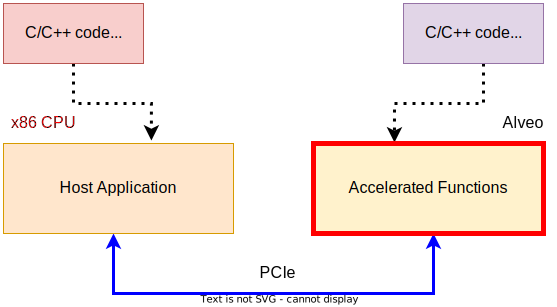

<table width="100%">
 <tr width="100%">
    <td align="center"><h1>Vitis™ Hardware Acceleration Tutorials</h1>
    <a href="https://www.xilinx.com/products/design-tools/vitis.html"> Vitis™ Development Environment</a>
    </td>
 </tr>
</table>

# Section 1 - Understanding the Workflow

> **_In this section:_**  _Quick overview of the Vitis Libraries flow and description of the host/kernel._

## Single Source Shortest Path kernel based on Vitis Graph Library L2

This tutorial uses the Vitis Graph Library to develop the main kernel for Shortest Path computing.

<details>  <summary><b> How does the Graph Library Work?</b></summary>  
 <br>
 
The Vitis Graph Library provides reference Vitis implementations for a set of graph processing algorithms that fits the Xilinx Alveo&trade; Series acceleration cards.
 
   - L3 APIs locate in the ``Vitis_Libraries/graph/L3/include`` directory. Pure software APIs are provided to customers who want a fast deployment of graph processing algorithms on Alveo Cards. These APIs provide a series of software designs to efficiently make use of resources in Alveo cards and deliver high-performance graph processing.
 
   - L2 APIs locate in the ``Vitis_Libraries/graph/L2/include`` directory. They are several compute-unit designs running on Alveo cards. These APIs provide a set of compute-unit designs implemented in HLS codes and should be compiled as OpenCL kernels. After the compilation, they will be called OpenCL APIs.
 
   - L1 APIs locate in the ``Vitis_Libraries/graph/L1/include`` directory. They are basic components that are used to compose compute units. The L1 APIs are all well-optimized HLS designs and can fit into various resource constraints.
</details>

You can find more information on how the Vitis Graph Library works [here](https://docs.xilinx.com/r/en-US/Vitis_Libraries/graph/tutorial.html_1).

The L2 APIs located in the ```Vitis_Libraries/graph/L2/include``` directory provide a pure FPGA-based graph accelerator. They are used in this tutorial. 

You can find more information on the internel design of the SSSP algorithm,including implementation, interface, and profiling [here](https://docs.xilinx.com/r/en-US/Vitis_Libraries/graph/guide_L2/kernels/ShortestPath.html).

<details>  <summary><b> Interface in shortest_path.hpp </b></summary>  
 <br>
 You can find this information in the L2/include/hw directory.

  <pre><code>  
  
 template <int WIDTH, int MAXOUTDEGREE>
 void singleSourceShortestPath(ap_uint<32>* config,
                              ap_uint<512>* offsetCSR,
                              ap_uint<512>* indexCSR,
                              ap_uint<512>* weightCSR,

                              ap_uint<512>* queue512,
                              ap_uint<32>* queue32,

                              ap_uint<512>* distance512,
                              ap_uint<WIDTH>* distance32,
                              ap_uint<512>* pred512,
                              ap_uint<32>* pred32,
                              ap_uint<8>* info) {
    xf::graph::internal::sssp::pred::shortestPathInner<WIDTH, MAXOUTDEGREE>(
        config, offsetCSR, indexCSR, weightCSR, queue512, queue32, distance512, distance32, pred512, pred32, info);
}
</code></pre> 

 <br>
  <pre><code>
  
 template <int WIDTH, int MAXOUTDEGREE>
 void singleSourceShortestPath(ap_uint<32>* config,
                              ap_uint<512>* offsetCSR,
                              ap_uint<512>* indexCSR,
                              ap_uint<512>* weightCSR,

                              ap_uint<512>* queue512,
                              ap_uint<32>* queue32,

                              ap_uint<512>* distance512,
                              ap_uint<WIDTH>* distance32,
                              ap_uint<8>* info) {
    xf::graph::internal::sssp::nopred::shortestPathInner<WIDTH, MAXOUTDEGREE>(
        config, offsetCSR, indexCSR, weightCSR, queue512, queue32, distance512, distance32, info);
}
</code></pre>

</details>

Following is an example of kernel codes for calling the API:

```
extern "C" void shortestPath_top(ap_uint<32>* config,
                                 ap_uint<512>* offset,
                                 ap_uint<512>* column,
                                 ap_uint<512>* weight,

                                 ap_uint<512>* ddrQue512,
                                 ap_uint<32>* ddrQue,

                                 ap_uint<512>* result512,
                                 ap_uint<32>* result,
                                 ap_uint<512>* pred512,
                                 ap_uint<32>* pred,
                                 ap_uint<8>* info) {
    const int depth_E = E;
    const int depth_V = V;

    xf::graph::singleSourceShortestPath<32, MAXOUTDEGREE>(config, offset, column, weight, ddrQue512, ddrQue, result512,result, pred512, pred, info);

}

```

The Shortest Path test case is located in the ```Vitis_Libraries/graph/L2/test/shortest_path_float_pred``` directory. You can run the test case.

## Designing other Kernels

Once you have used the SSSP kernel with no changes, proceed towards developing other kernels. Data processing is available on the hardware to reduce the transmission between the host and the hardware. 

### Using krnls_wa for Computing the weighted_average Weights

```
const float b = 0.15;
const unsigned int p = 4;

static void compute(float* cost,float* flow_free_time,float* Volume,float* capacity,float* weight, 
                    int size){

    for (int i =0; i < size; i++){
        weight[i] = 0.6 * cost[i] +  0.4 * flow_free_time[i]*(1 + b*powf(Volume[i]/capacity[i],p));
    }
}
extern "C" {

void weight_average(float* cost,float* flow_free_time,float* Volume,float* capacity,float* weight, 
                    int size) {

        compute(cost,flow_free_time,Volume,capacity,weight,size);
    
  }
}
```

### Using krnls_search for Results Query

```
const unsigned int num = 3;

extern "C"{

void search(float* result,float* longitude,float* latitude,float* out,int size){
    
	for (int i =0; i < size; i++){
		out[num*i] = longitude[i];
		out[num*i+1] = latitude[i];
		out[num*i+2] = result[i]; }
  }
}
```

## Programming the Host

1. Create the entire platform and OpenCL kernels.

    ````
    cl::Kernel krnls_wa;
    cl::Kernel krnls_sssp;
    cl::Kernel krnls_search;
    auto devices = xcl::get_xil_devices();  
    std::vector<cl::Memory> init_wa,init_sssp,init_search;
    cl::Context context(device, NULL, NULL, NULL, &fail);
    cl::CommandQueue q(context, device, CL_QUEUE_PROFILING_ENABLE,  &fail);
    cl::Program::Binaries bins = xcl::import_binary_file(xclbin_path);
    cl::Program program(context, devices, bins, NULL, &fail);
    krnls_wa = cl::Kernel(program,"weight_average", &fail);
    krnls_sssp = cl::Kernel(program, "shortestPath_top", &fail);
    krnls_search = cl::Kernel(program, "search", &fail);
    ```
    * Create Buffers and transfer data to FPGA devices
    ```
    std::vector<cl_mem_ext_ptr_t> mext_o(15);
    cl::Buffer offset_buf, column_buf, weight_buf, info_buf, ddrQue_buf, result_buf, config_buf, pred_buf;
    cl::Buffer cost_buf,flow_free_time_buf,Volume_buf,capacity_buf,out_buf,longitude_buf,latitude_buf; 
    std::vector<cl::Memory> init_wa,init_sssp,init_search;

    init_wa.push_back(cost_buf);
    init_wa.push_back(flow_free_time_buf);
    init_wa.push_back(Volume_buf);
    init_wa.push_back(capacity_buf);
    init_wa.push_back(weight_buf);
    init_wa.push_back(result_buf);
            
    init_sssp.push_back(config_buf);
    init_sssp.push_back(offset_buf);
    init_sssp.push_back(column_buf);
    init_sssp.push_back(info_buf);
            
    init_search.push_back(longitude_buf);
    init_search.push_back(latitude_buf);
    ```

2. Set arguments and run the tasks.

    ```
    krnls_wa.setArg(j++,cost_buf);
    krnls_wa.setArg(j++,flow_free_time_buf);
    krnls_wa.setArg(j++,Volume_buf);
    krnls_wa.setArg(j++,capacity_buf);
    krnls_wa.setArg(j++,weight_buf);
    krnls_wa.setArg(j++,size);

    q.enqueueTask(krnls_wa);

    ...

    krnls_sssp.setArg(j++, config_buf);
    krnls_sssp.setArg(j++, offset_buf);
    krnls_sssp.setArg(j++, column_buf);
    krnls_sssp.setArg(j++, weight_buf);
    krnls_sssp.setArg(j++, ddrQue_buf);
    krnls_sssp.setArg(j++, ddrQue_buf);
    krnls_sssp.setArg(j++, result_buf);
    krnls_sssp.setArg(j++, result_buf);
    krnls_sssp.setArg(j++, pred_buf);
    krnls_sssp.setArg(j++, pred_buf);
    krnls_sssp.setArg(j++, info_buf);

    q.enqueueTask(krnls_sssp);

    ...

    krnls_search.setArg(j++,result_buf);
    krnls_search.setArg(j++,longitude_buf);
    krnls_search.setArg(j++,latitude_buf);
    krnls_search.setArg(j++,out_buf);
    krnls_search.setArg(j++,size);

    q.enqueueTask(krnls_search);

    ```

3. Develop the ``main.cpp`` file.

    ```
    std::cout <<"\n---------------------" << city << " City Shortest Path from source 0----------------\n";
    std::cout << "The start point is: 0 " << "longitude: " << out[0] << " latitude: " << out[1] << std::endl;
    std::cout << "Please input your choice: " << std::endl;
    std::cout << "Input 0 : show all the result and exit."<< std::endl;
    std::cout << "Input point range in ( 1 to "<< numVertices-1 << " ): show the path from start point to the enter point."<<std::endl;
    std::cout << "Input y to exit !" << std::endl;
      
    int m;

    while(std::cin >> m){
      if(m==0)
        {
          ...

          break;	

        }
        else if (m>numVertices-1)
        {
          ...
        
        }
        else if (std::cin.get()=='y')
        {
          break;
        }

        else
        {
          ...
        }
      }
    ```
       
## Writing the Makefile

### Overview of the Host/Kernel Paradigm

* The host application is developed in C/C++ with OpenCL API calls.
* The hardware kernels are developed in C/C++ and the main kernel is based on Vitis Libraries.
  


### Introducing the Makefile

1. Run the hardware build by compiling the kernels with v++ and link to xclbin.

    ```
    ...
    COMMFLAGS +=  -I $(XFLIB_DIR)/L2/include -I $(CUR_DIR)/kernel -I $(XFLIB_DIR)/../database/L1/include/hw -I $(XFLIB_DIR)/../quantitative_finance/L1/include -I $(XFLIB_DIR)/../utils/L1/include -I $(XFLIB_DIR)/L2/include -I $(XFLIB_DIR)/../database/L1/include/hw -I $(XFLIB_DIR)/../quantitative_finance/L1/include -I $(XFLIB_DIR)/../utils/L1/include
    HLSCFLAGS := --compile $(COMMFLAGS)
    LINKFLAGS := --link --optimize 3 $(COMMFLAGS)
    ...
    XCLBIN_OBJ := shortpath_$(TARGET).xclbin

    weight_average.xo:  ./kernel/weight_average.cpp
      v++ $(HLSCFLAGS) --kernel weight_average --output $@ $^

    shortestPath_top.xo: ./kernel/shortestPath_top.cpp
      v++ $(HLSCFLAGS) $(VPP_FLAGS_shortestPath_top) --kernel shortestPath_top --output $@ $^

    search.xo: ./kernel/search.cpp
      v++ $(HLSCFLAGS) --kernel search --output $@ $^

    $(XCLBIN_OBJ): weight_average.xo shortestPath_top.xo search.xo
      v++ $(LINKFLAGS)   $(VPP_LDFLAGS_shortestPath_top) --output $@ weight_average.xo shortestPath_top.xo search.xo 
    ```
	
2. Host the build by compiling the main code with g++.
	
    ```
    ...
    CXXFLAGS +=  -I $(XFLIB_DIR)/L2/include -I $(CUR_DIR)/host -I $(CUR_DIR)/kernel -I $(XFLIB_DIR)/ext/xcl2 -I $(XFLIB_DIR)/../utils/L1/include -I $(XFLIB_DIR)/L2/include -I $(XFLIB_DIR)/../database/L1/include/hw -I $(XFLIB_DIR)/../quantitative_finance/L1/include -I $(XFLIB_DIR)/../utils/L1/include -I $(XFLIB_DIR)/ext/xcl2
    ...
    LDFLAGS := -pthread -L$(XILINX_XRT)/lib -L$(XILINX_HLS)/lnx64/tools/fpo_v7_0  -Wl,--as-needed -lOpenCL -lxrt_coreutil -lgmp -lmpfr -lIp_floating_point_v7_0_bitacc_cmodel
    ifeq (,$(findstring opencv,$(CXXFLAGS)))
    CXXFLAGS += $(XRT_CXXFLAGS)
    endif

    EXECUTABLE := shortpath

    HOST_SRCS := ./host/main.cpp
    HOST_SRCS += $(XFLIB_DIR)/ext/xcl2/xcl2.cpp 

    $(EXECUTABLE): $(HOST_SRCS)
      $(CXX) -o $(EXECUTABLE) $^ $(CXXFLAGS) $(LDFLAGS)
    ```


## Next

Proceed to [**Section 2**](../02-Setup_Environment/README.md).


<p class="sphinxhide" align="center"><sub>Copyright © 2020–2023 Advanced Micro Devices, Inc</sub></p>

<p class="sphinxhide" align="center"><sup><a href="https://www.amd.com/en/corporate/copyright">Terms and Conditions</a></sup></p>
