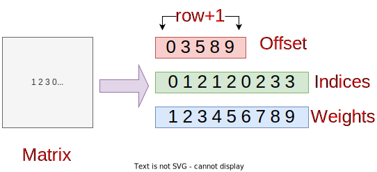

<table width="100%">
 <tr width="100%">
    <td align="center"><h1>Vitis™ Hardware Acceleration Tutorials</h1>
    <a href="https://www.xilinx.com/products/design-tools/vitis.html"> Vitis™ Development Environment</a>
    </td>
 </tr>
</table>

# Part 1: Processing the Data

## CSR Format

The compressed sparse row (CSR) represents a matrix by three (one-dimensional) arrays, that respectively contain nonzero values, the extents of rows, and column indices.



## Data Processing

Place the calculated required data set in ```csr_data/``` directory.

* Indices and weights information:

  * Put indices and weights in the same file. The first row shows the number of links (edges).
  * Each column of data represents cost, flow_free_time, volume, and capacity, respectively.

    ```
    76
    1 6.000816237 6 4494.657646 25900.20064
    2 4.00869075 4 8119.079948 23403.47319
    ...
    ...
    ```

 * Nodes information

   * Each column of data respresents longitude and latitude, respectively.

      ```
      -96.77041974 43.61282792
      -96.71125063 43.60581298
      ...
      ...
      ```

 * Offsets data

   * The first row shows the number of nodes (vertices) and the name of the city.

      ```
      24 Cityname
      0
      2
      ...
      ...
      ```

Follow these steps to run the coo2csr program to calculate the offset:

1. Put the COO format rows and columns information as file ```city.mtx``` in ```coo_data/```.

    * The first row shows the number of nodes, links, and city name.
    * Each column of data contains rows and indices.

      ```
      24 76 Cityname
      0 1
      0 2
      ...
      ```

2. Run the ```mkoffset.sh``` script to generate the offset.
   
   The first argument is the file name of ```city.mtx``` in ```coo_data/``` and the second argument is the offset name that you want to generate in the ```csr_data/``` folder.

    ```
      $ ./mkoffset.sh city.mtx offset_city.mtx
    ```

    The following information is displayed. You can find the ```offset.mtx``` in the ```csr_data/``` folder.

      ```
      Compiling...
      Compiled
      Offset is done!
      ```

## DataSets

Use the [City TransportationNetworks DataSets](https://github.com/bstabler/TransportationNetworks) for reference.

>**Note:** All data is currently donated. Data sets are for academic research purposes only.

## Next

Proceed to [**Part 2**](../docs/run_the_application.md).


<p class="sphinxhide" align="center"><sub>Copyright © 2020–2023 Advanced Micro Devices, Inc</sub></p>

<p class="sphinxhide" align="center"><sup><a href="https://www.amd.com/en/corporate/copyright">Terms and Conditions</a></sup></p>
