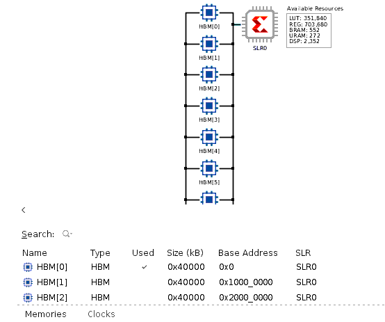
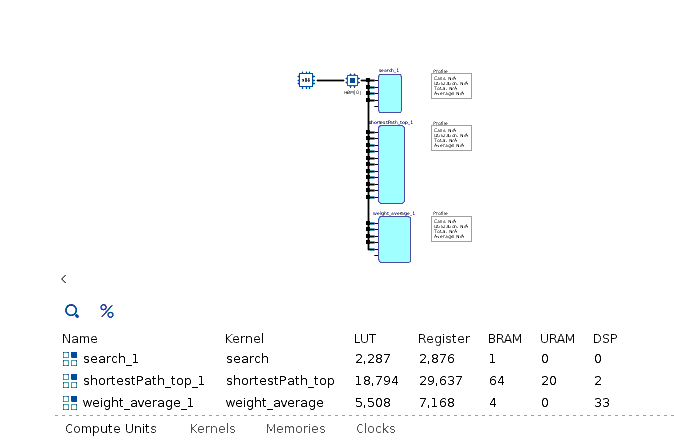
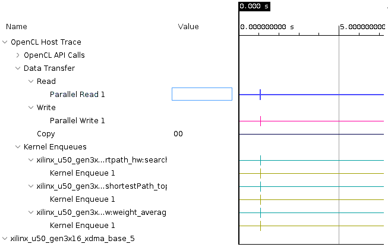

<table width="100%">
 <tr width="100%">
    <td align="center"><h1>Vitis™ Hardware Acceleration Tutorials</h1>
    <a href="https://www.xilinx.com/products/design-tools/vitis.html"> Vitis™ Development Environment</a>
    </td>
 </tr>
</table>

# Part 3: Profiling

The ```xrt.run_summary``` file is generated based on the ```xrt.ini``` file. Use vitis_analyzer to handle the results.

```bash
  $ vitis_analyzer xrt.run_summary
```

## System Diagrams



## Platform Diagrams



## Timeline Trace



## Next

Proceed to [**Part 4**](../docs/gui.md).


<p class="sphinxhide" align="center"><sub>Copyright © 2020–2023 Advanced Micro Devices, Inc</sub></p>

<p class="sphinxhide" align="center"><sup><a href="https://www.amd.com/en/corporate/copyright">Terms and Conditions</a></sup></p>
