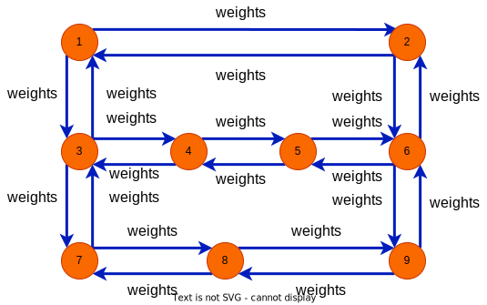
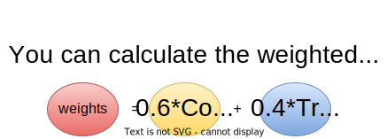
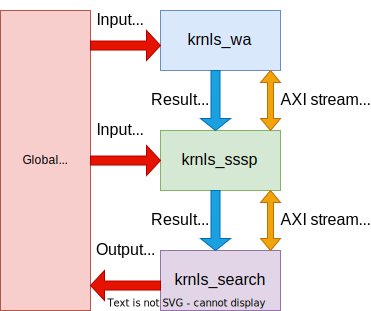

<table width="100%">
 <tr width="100%">
    <td align="center"><h1>Vitis™ Hardware Acceleration Tutorials</h1>
    <a href="https://www.xilinx.com/products/design-tools/vitis.html">See Vitis™ Development Environment on xilinx.com</a>
    </td>
 </tr>
</table>

# Single Source Shortest Path Application with Vitis Libraries for Acceleration

***Version: Vitis 2023.1***

Design your application using the optimized AMD Vitis&trade; accelerated libraries. Vitis libraries offer out-of-the-box acceleration with minimal to zero-code changes to your applications, accelerating your x86 host application code calling Vitis accelerated library APIs or developing accelerators on AMD platforms calling kernels in your code. You can work at an application level and focus your core competencies on solving problems by using the libraries in commonly-used programming languages and leveraging AMD platforms as an enabler in your application.

## Problem Description

In the field of transportation, many problems and algorithms are based on traffic network data. We assume the city traffic networks as weighted direct graph composed with nodes and links. The following is an example diagram：

 

This example shows how to calculate the distance from the source point to other points. The first node is taken as the source vertice.Weights may have a variety of formats, including cost and traveltime. 

* Calculate the traveltime according to the BPR function
  
  

 
* Calculate the weight average distance

  

* Compute the Shortest Path

  


## About This Tutorial

This tutorial introduces an application developed by a Single Source Shortest Path (SSSP) kernel ```krnls_sssp``` based on the Vitis Graph Library L2 APIs. The L2 SSSP API provides an HLS function that can be directly built into the Vitis compute-unit (OpenCL kernel). The application also includes other kernels, ```krnls_wa``` and ```krnls_search```, as well as the host-kernel interaction with OpenCL. The ```krnls_wa``` kernel prepares the weight average traffic weights data. The ```krnls_search``` kernel retrieves the results. The Vitis Library takes care of the heavy algorithm lifting so that you can focus on other kernels and host codes. 

> **Note**: All the steps in this tutorial except those needed to view system diagram and optional part shows the Vitis GUI flow use the command-line interface.



The AMD Alveo&trade; Data Center accelerator card U50 is the target platform for this tutorial. The following tasks are described in this tutorial:

* Using the Vitis Graph Library L2 design the Single Source Shortest Path kernel: ```krnls_sssp```
* Designing other kernels with C++: ```krnls_wa```, ```krnls_search``` 
* Programming the host with OpenCL APIs
* Writing the Makefile
* Preparing the dataset for running the application
* Using Vitis hardware to run the application

**Note**: This is not a detailed tools usage guideline, so only basic ideas and steps are shown. Refer to other documents for details.


### Tutorial Structure

This tutorial is divided into three sections.

* [**Section 1 - Workflow**](./01-Workflow/README.md)

  * UsIng the SSSP kernel based on Vitis Graph Library L2
  * Designing other kernels
  * Programming the host
  * Writing the Makefile
  
* [**Section 2 - Setup_Environment**](./02-Setup_Environment/README.md)
 
  * This section provides information on setting up the environment.

* [**Section 3 - Application**](./03-Application/README.md)

  * [Part 1](./03-Application/docs/data_processing.md): Preparing data, including the offset, indices, and weights, in the CSR format 
  * [Part 2](./03-Application/docs/run_the_application.md): Compiling codes and running the application
  * [Part 3](./03-Application/docs/profiling.md): Profiling with the Vitis tool
  * [Part 4](./03-Application/docs/gui.md): Creating a project with the Vitis GUI and debugging. Skip this part if you do not want to use GUI.

## Summary

This tutorial demonstrates how to expand your code with PL Vitis Libraries L2 APIs and describes the development flow based on the Vitis software platform. The purpose of this application in this example is to find the shortest path from the source node to others using city traffic networks as the direct weight graph. You can also develop applications with the other libraries using the same flow.

## Reference

Documents on [Vitis Libraries Docs](https://docs.xilinx.com/r/en-US/Vitis_Libraries).


<p class="sphinxhide" align="center"><sub>Copyright © 2020–2023 Advanced Micro Devices, Inc</sub></p>

<p class="sphinxhide" align="center"><sup><a href="https://www.amd.com/en/corporate/copyright">Terms and Conditions</a></sup></p>
