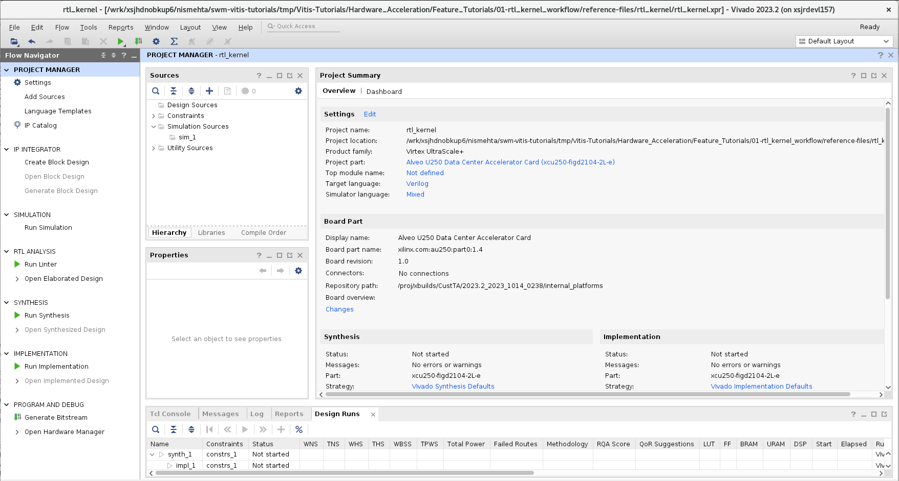
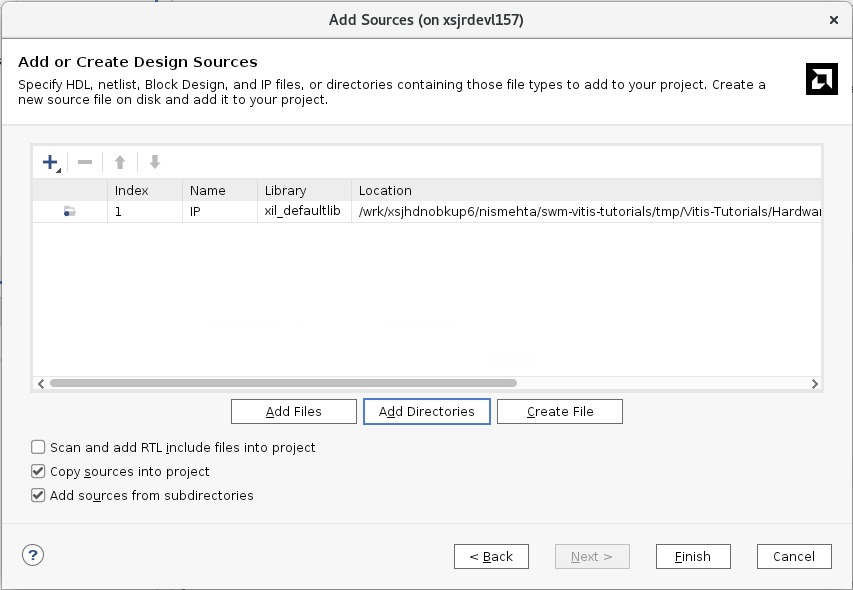
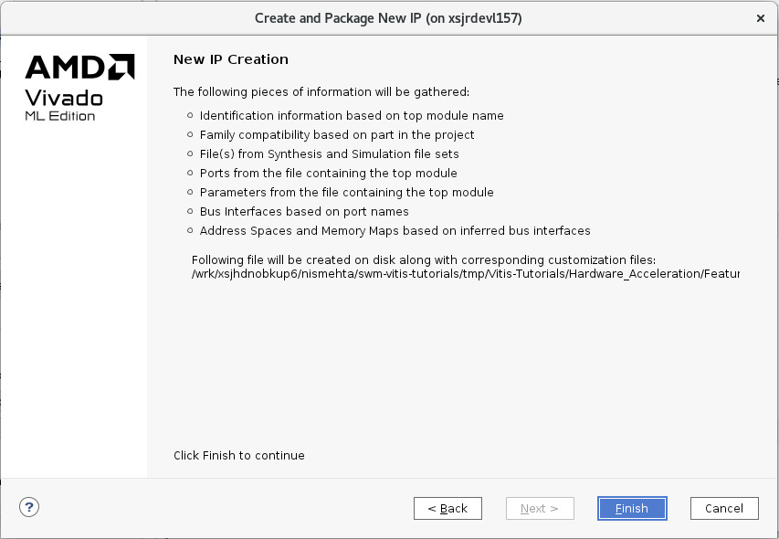
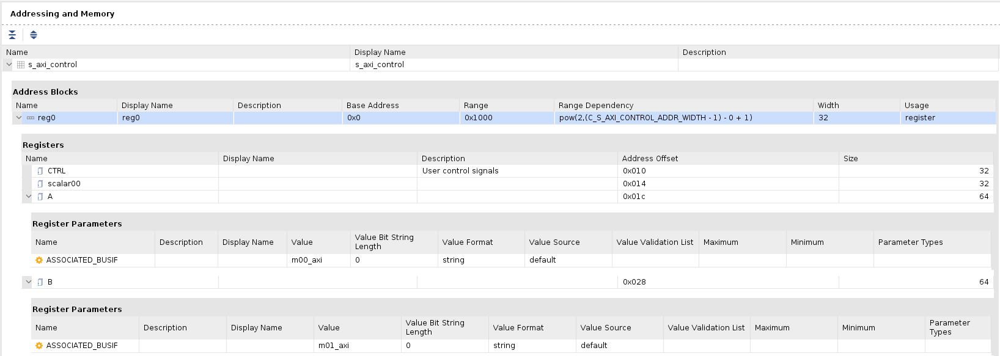

<table class="sphinxhide" width="100%">
 <tr width="100%">
    <td align="center"><h1>Hardware Acceleration Tutorials</h1>
    <a href="https://www.xilinx.com/products/design-tools/vitis.html">See Vitis™ Development Environment on xilinx.com</a>
    </td>
 </tr>
</table>

# Package IP/Package XO Flow

The process described in this lab follows the Package IP flow as described in the [RTL Kernel Development Flow](https://docs.xilinx.com/r/en-US/ug1393-vitis-application-acceleration/RTL-Kernel-Development-Flow) in the Vitis Application Acceleration Development Flow documentation (UG1393).

>**IMPORTANT:** Before running the tutorial commands, you must set up the tool environment by running the following commands, as described in [Setting up the Vitis Environment](https://docs.xilinx.com/r/en-US/ug1393-vitis-application-acceleration/Setting-Up-the-Vitis-Environment).
>
>   ```bash
>    #setup Xilinx Vitis tools. XILINX_VITIS and XILINX_VIVADO will be set in this step.
>    source <VITIS_install_path>/settings64.sh
>    #Setup Xilinx runtime. XILINX_XRT will be set in this step.
>    source <XRT_install_path>/setup.sh
>   ```

## Create a New Project

1. Change directory to the tutorial folder: `cd ./01-rtl_kernel_workflow`.
1. Launch the Vivado®  IDE, enter the `vivado` command in a terminal window.
2. Select **Create Project**, or  **File** > **Project** > **New**.

   The New Project wizard opens.
3. Click **Next**.
4. On the Project Name page of the New Project wizard, make the following selections:
   1. Specify a **Project name**, such as `rtl_kernel`, a **Project location**.
   2.  Enable the **Create project subdirectory** checkbox.
   3. Click **Next**.
5. On the Project Type page, make the following selections:  
   1. Select **RTL Project**
   2. Enable the **Do not specify sources at this time** checkbox.
   3. Click **Next**.
6. On the Default Part page select **Boards**, and enter `U200` in the Search field. 
      1. Select **Alveo U200 Data Center Accelerator Card**, and click **Next** to proceed.

      The New Project Summary page is displayed.
7. Examine it for details of the project, and click **Finish** to create the project.

   The Vivado IDE opens with the new project.

     

## Add Kernel Sources

You are ready to add RTL files into the project to package as an IP. The RTL files have been provided for you in this tutorial, but this is the point at which you would insert your own RTL code.

1. In the Sources view, click the **Add Sources** command (). The Add Sources window is displayed.
2. Click **Add or create design sources**, and then click **Next**.
3. Click **Add Directories**, browse to `reference-files/src`, and select the `IP` directory (which contains the RTL sources).

    >**NOTE**: To add your own RTL IP, specify the required folder or files.

     

4. Select the **Copy sources into project** and **Add sources from subdirectories**.
5. Click **Finish**.

   The files are added to the project, and the Vivado Design Suite automatically identifies the `Vadd_A_B.v` file as the top level of the design. This RTL module has an interface which is compatible with the **Hardware Interface Requirements** for RTL kernels as discussed in the [Introduction](./README.md). This can be seen in the `Vadd_A_B` module definition by double-clicking the file in the Sources view to open it in a Code Editor window.

   ````
   module Vadd_A_B #(
     parameter integer C_S_AXI_CONTROL_ADDR_WIDTH = 12 ,
     parameter integer C_S_AXI_CONTROL_DATA_WIDTH = 32 ,
     parameter integer C_M00_AXI_ADDR_WIDTH       = 64 ,
     parameter integer C_M00_AXI_DATA_WIDTH       = 512,
     parameter integer C_M01_AXI_ADDR_WIDTH       = 64 ,
     parameter integer C_M01_AXI_DATA_WIDTH       = 512
   )
   ````

## Open the IP Packager

With the files added to your project, you can package the IP for use as a kernel.

1. To start this process, select **Tools** > **Create and Package New IP**.
2. Click **Next**.
3. Select **Package your current project**, and click **Next**.
4. For IP location, take a look at the default location so you can see where your IP will be packaged. 
5. Click **Next**. 
   The Create and Package IP summary page is displayed. 
     

6. Examine the summary and click **Finish** to proceed. 

   The Package IP window is displayed.

     

## Specify the Control Protocol

1. Under Packaging Steps, select **Compatibility**.  
2. Enable **Package for Vitis**, and ensure that both **Package for IPI** and **Ignore Freq_Hz** are enabled as well. This lets you package the IP as a kernel object (.xo) for use in the Vitis tool flow, and also configures the specific Xilinx parts or device families compatible with your custom IP.

     

  Enabling the **Package for Vitis** checkbox lets you specify the **Control protocol** for the RTL kernel. The default is `ap_ctrl_hs`, but other protocols such as `user_managed` and `ap_ctrl_chain` are also suported as described in [Software Controllable Kernels](https://docs.xilinx.com/r/en-US/ug1393-vitis-application-acceleration/SW-Controllable-Kernels). 

3. Select `user_managed` for this tutorial. The tool sets required properties for the Vitis kernel. 

```
set_property sdx_kernel true [ipx::current_core]
set_property sdx_kernel_type rtl [ipx::current_core]
set_property ipi_drc {ignore_freq_hz true} [ipx::current_core]
set_property vitis_drc {ctrl_protocol user_managed} [ipx::current_core]
```

>**TIP**: Notice that the **Ports and Interfaces** tab now shows a DRC error because you have enabled the **Package for Vitis** checkbox. The error indicates that the Vitis compatible IP must have a defined register on the AXI-Lite interface (s_axilite), or at least one AXI-streaming (AXIS) interface. In this case you will be adding registers to the `s_axi_control` interface. 

## Edit Ports and Interfaces

1. Under Packaging Steps, select **Ports and Interfaces**. This displays the Ports and Interfaces window. 
2. Right-click the `m00_axi` interface and select **Associate Clocks**.

   The Associate Clocks dialog box displays the list of available clocks. In this case there is just the `ap_clk` interface to associate with the AXI interface. 

3. Select `ap_clk` and click **OK**.
4. Repeat the process to associate `ap_clk` with the `m01_axi` interface, and the `s_axi_control` interface.

## Add Control Registers and Address Offsets 

To fix the error in the Ports and Interfaces window, you must add at least one register to the `s_axilite` interface. This can be done through the **Addressing and Memory** section of the Package IP window.  The user-managed kernel requires a number of registers to be added with the following attributes.

Name | Description | Offset | Size (bits)
-----|-------------|--------|-----
USER_CTRL | Control Signals | 0x000 | 32
scalar00 | Scalar values | 0x010 | 32
A | pointer argument | 0x018 | 64
B | pointer argument | 0x024 | 64

1. Under Packaging Steps, select **Addressing and Memory**. 
   This displays the Addressing and Memory window. 
2. Under Address Blocks, right-click **reg0** and select **Add Reg**.
3. Enter the name of the register in the Add Register dialog box, and click **OK**. Notice that the error on the Ports and Interfaces section goes away as you define the registers for the RTL kernel. 

   >**TIP:** You will need to add the registers listed in the table above. You can also use the following Tcl commands in the Vivado Tcl Console to add the needed registers:
   >
   ```
      ipx::add_register CTRL [ipx::get_address_blocks reg0 -of_objects [ipx::get_memory_maps s_axi_control -of_objects [ipx::current_core]]]
      ipx::add_register scalar00 [ipx::get_address_blocks reg0 -of_objects [ipx::get_memory_maps s_axi_control -of_objects [ipx::current_core]]]
      ipx::add_register A [ipx::get_address_blocks reg0 -of_objects [ipx::get_memory_maps s_axi_control -of_objects [ipx::current_core]]]
      ipx::add_register B [ipx::get_address_blocks reg0 -of_objects [ipx::get_memory_maps s_axi_control -of_objects [ipx::current_core]]]
      ```

   After adding the registers to the Addressing and Memory window (as shown in the following figure), you will need to add the descriptions, offset, and size to the registers. 

    

4. For each register, click in the **Description** field of the register and enter the description from the table above. 
5. Click in the **Address Offset** field and enter the offset. 
6. Click in the **Size** field and enter the field.

   >**IMPORTANT:** Description is optional, but Offset and Size are required.

   After completing the addition of the various registers and their attributes in accordance with the table above, you must also associate an M_AXI interface with each of the pointer arguments. 

7. Select register `A` in the Registers table, and right-click and select **Add Register Parameter**. 
   1. In the Add Register Parameter dialog box, add the ASSOCIATED_BUSIF parameter, and click **OK**.  
      This parameter associates the bus interface with the register.
   2. Repeat the prior two steps for register `B`.
   3. In the Value field for ASSOCIATED_BUSIF enter `m00_axi` for register `A`, and `m01_axi` for register `B`.
   
   Your finished results should appear similar to the image below: 


## Check Integrity, Assign Properties, and Package IP

1. Under the Packaging Steps, Select **Review and Package**. 
   This displays the Review and Package window. You are now ready to package the IP. However, first check that an archive file will be generated when packaging the IP. This is the default behavior when **Package for Vitis** is enabled. 

2. Look in the **After Packaging** section of the Review and Package window. If you see that an archive will not be generated, then you should enable the archive by selecting **Edit packaging settings**. This displays the Settings dialog box with the IP Package section displayed.

  - Under the After Packaging section of the dialog box, enable **Create archive of IP** as shown below, and click **OK**.  You should see the **Review and Package** window change to reflect that an archive will now be created.

     

3. Click **Package IP**. 

   After packaging the IP you should see dialog box indicating that the IP packaged successfully. 

With **Package for Vitis** enabled, the tool automatically runs the `package_xo` command to create the Vitis kernel (`.xo`) file. The `package_xo` command also packages the IP files and the `kernel.xml` file into the generated `.xo` file. You can examine the Tcl Console window to see that the `package_xo` command has been run. 

   ```
   package_xo -xo_path <tutorial_path>/rtl_kernel/rtl_kernel.srcs/sources_1/imports/src/xo/Vadd_A_B.xo -kernel_name Vadd_A_B -ip_directory <tutorial_path>/rtl_kernel/rtl_kernel.srcs/sources_1/imports/src/IP -ctrl_protocol user_managed
   ```

   Where: 
   * **package_xo**: Command name to create a compiled object file (.xo) from the Vivado IP. 
   * -**xo_path**: Path and name of the xo file
   * -**kernel_name**: Name of the kernel to create, and should match the RTL module name. 
   * -**ip_directory**: Path to look for the packaged Vivado IP. 
   * -**ctrl_protocol**: Specifies the control protocol the kernel implements.

After the `package_xo` command returns, navigate to the `reference-files/rtl_kernel/rtl_kernel.srcs/sources_1/imports` folder where you can see the `IP` folder and the `xo` folder. Look at the `Vadd_A_B.xo` file in the `xo` folder. The `.xo` file contains the IP representation of the kernel, as well as the kernel.xml file used by the Vitis compiler to link the kernel into the device binary (`.xclbin`). 

You will use the `.xo` file in the Vitis application acceleration flow as explained later in this tutorial.

## Next Steps

Next, you will examine the [Host Application Coding](./host-code.md) required to integrate the user-managed RTL kernel into your accelerated application.
</br>
<hr/>
<p align="center" class="sphinxhide"><b><a href="/README.md">Return to Main Page</a> — <a href="./README.md">Return to Start of this Tutorial</a></b></p>

<p align="center" class="sphinxhide"><sup>Copyright&copy; 2021-2022 Xilinx</sup></p>

