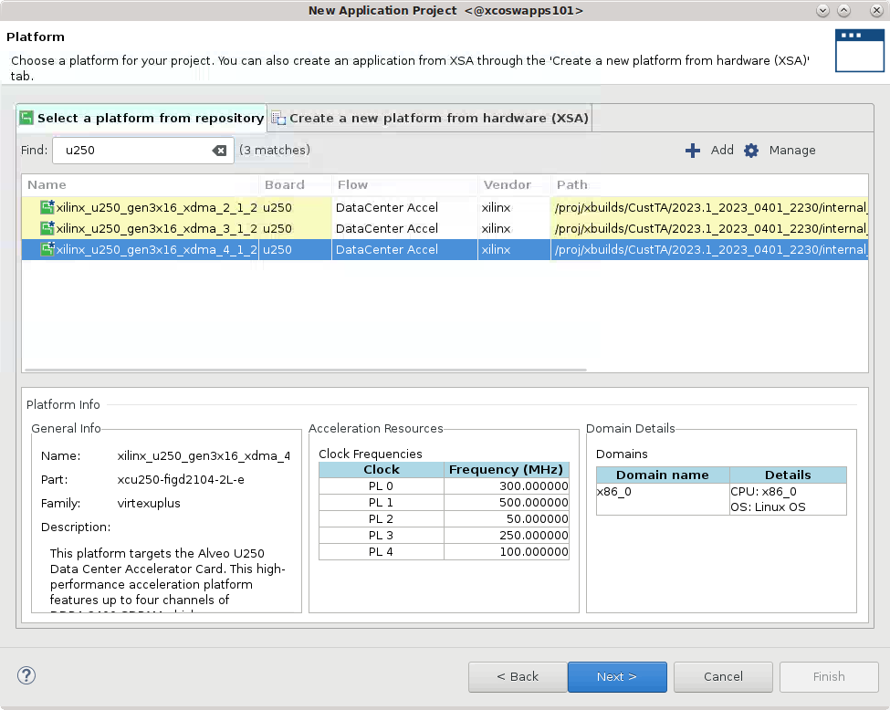
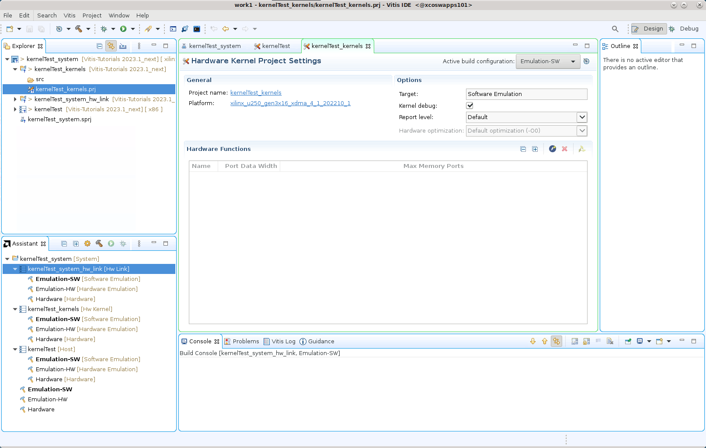

<table class="sphinxhide" width="100%">
 <tr width="100%">
    <td align="center"><h1>Hardware Acceleration Tutorials</h1>
    <a href="https://www.xilinx.com/products/design-tools/vitis.html">See Vitis™ Development Environment on xilinx.com</a>
    </td>
 </tr>
</table>

# Using the RTL Kernel in a Vitis IDE Project

1. Change directory to the tutorial folder: `cd ./01-rtl_kernel_workflow/reference_files`

1. Create a new workspace folder called `work1`


2. Launch the Vitis IDE, by entering the following command: 

```
vitis -workspace work1
```

3. The Vitis IDE opens. Select **File > New > Application Project**

The New Vitis Application Project window opens.  


4. The New Application Project wizard is displayed, with the overview page showing a brief overview of the process. Click **Next**.

5. The Plaform page is displayed. Select `xilinx_u200_gen3x16_xdma_2_202110_1`, and then click **Next** to proceed.



6. The Application Project Details page is displayed. Make the following selections:  

   1. Enter a project name, such as `kernelTest`.  
   2. Create New System Project is enabled, and the System project name is generated from the project name. You can edit it if needed.
   3. The Processor is selected automatically from the platform you selected. 
   4. Click **Next** to proceed.  


7.  The Templates page opens, showing application templates you can use to start your project. Select the **Empty Application (XRT Native API)** and click **Finish** to create your Vitis application project.  

The new project wizard closes and opens the Vitis IDE with your new project loaded.



## Add the Hardware Kernel (`.xo`)

You must add the recently generated user-managed RTL kernel (`Vadd_A_B.xo`) and host code (`user-host.cpp`) into the project. 

1. Select the `kernelTest_kernels` project in the **Explorer** view, and right-click and select the **Import Sources** command. Browse to the  `rtl_kernel/rtl_kernel.srcs/sources_1/imports/xo` folder and select the `Vadd_A_B.xo` kernel file to add to the project as shown below. Click **Finish** to close the dialog box and add the kernel. 


2. Select and open the `kernelTest_kernels.prj` project file in the **Hardware Kernel Project Settings** view, and select the **Add Hardware Function** command. Select the  `Vadd_A_B.xo` folder and select the `Vadd_A_B` kernel as shown in the image below. Click **OK** to close the dialog box and add the hardware function to the project. 

 

2. Select the `kernelTest` project in the **Explorer** view, and right-click and select the **Import Sources** command. Browse to the  `src/host` folder and select the `user-managed.cpp` file to add to the project as shown below. Click **Finish** to close the dialog box and add the host code. 

>**TIP:** There is also an xrt-host file that can be used to connect to an `ap_ctrl_hs` version of the RTL kernel. 

 


## Build the Project

With the host application code (`host.cpp`) and the RTL kernel code (`Vadd_A_B.xo`) added to the project, you are ready to build and run the project.

1. In the **Hardware Kernel Project Settings** view select the **Active build Configuration:** and set it to **Hardware Emulation**. The Hardware Emulation target is useful for:
   - Verifying the functionality of the logic that will go into the FPGA.
   - Retrieving the initial performance estimates of the accelerator and host application.

  Note that the RTL kernel does not support software emulation. 

>**IMPORTANT:** You can add a C-model for software emulation to XRT-managed kernels as explained at [Adding C-Models to RTL Kernels](https://docs.xilinx.com/r/en-US/ug1393-vitis-application-acceleration/Adding-C-Models-to-RTL-Kernels). However, this is not supported for user-managed kernels. 

1. In the Assistant view, select the top-level system project `kernelTest_system` and click the **Build** command  to build the active Emulation-HW build configuration. 

   The different elements of the Vitis application project are built: the processor code (`host.cpp`), the HW link project to link the RTL kernel (.xo) to the target platform, and the top-level system project to package the design.

    >**TIP**: Because the RTL kernel is imported as an `.xo` file, the kernel does not need to be compiled.  

2. In the Assistant view, select the **Run** button, and select **Run Configurations**.

3. Select the `System Project Debug` configuration and click the **New launch configuration** command  to create a new configuration for the run. 

   The `SystemDebugger_kernelTest_system` configuration is created. 
   
   The host program takes the `xclbin` file as an input argument, which you must provide in the Program Arguments list.
   
4. Select **Edit** next to `Program Arguments`. 

   The Vitis IDE can automatically search and include the `xclbin` file when the **Automatically update arguments** is enabled. 

5. Click **OK** to add the arguments. 

6. In the `Run Configurations` dialog box click **Apply** and then click **Run** to run the configuration, and then verify the results.

The Console window in the Vitis IDE displays **TEST PASSED**. You have built and run the application using your user-managed RTL kernel. 

### (Optional) Build and Run the Hardware on the Target Platform

1. In the Vitis Application Project Settings, change **Active build configuration** to **Hardware**.  
In the system configuration, the kernel code is implemented onto the FPGA, resulting in a binary that will run on the selected platform card.  

2. If you have an available hardware platform, build and run the hardware build, and then verify the results.

## Makefile Use

There is a Makefile included in the `01-rtl_kernel_workflow/reference-files` folder. You can use this file to make the following targets:

```
   make run TARGET=<hw_emu | hw> HOST=user
```

The Makefile will:
1. Build a Vivado project to package the RTL design IP, and package a user-managed kernel (`.xo`)
2. Use the Vitis compiler (`v++`) to link the kernel to the target platform and generate the `.xlcbin' file
3. Compile the XRT native API host application `./src/host/user-host.cpp`
4. If necessary generate the emulation platform and setup the emulation environment
5. Run the application and kernel

>**TIP:** You can use the Makefile `-n` option to generate the command lines without running the commands: `make run TARGET=hw_emu HOST=user -n`

# Summary

In this tutorial you have used the **Package IP/Package_XO** flow to create a user-managed RTL kernel. You packaged the RTL IP project into the compiled XO file needed by the Vitis compiler. You added the RTL kernel to an application project, coupled with the host code, and built and ran the Hardware Emulation configuration.  In the Vitis IDE, a binary container was created using the XO file, and a `xclbin` file was compiled.

</br>
<hr/>
<p align="center" class="sphinxhide"><b><a href="/README.md">Return to Getting Started Pathway</a> — <a href="./README.md">Return to Start of Tutorial</a></b></p>

<p align="center" class="sphinxhide"><sup>Copyright&copy; 2020-2022 Xilinx</sup></p>
