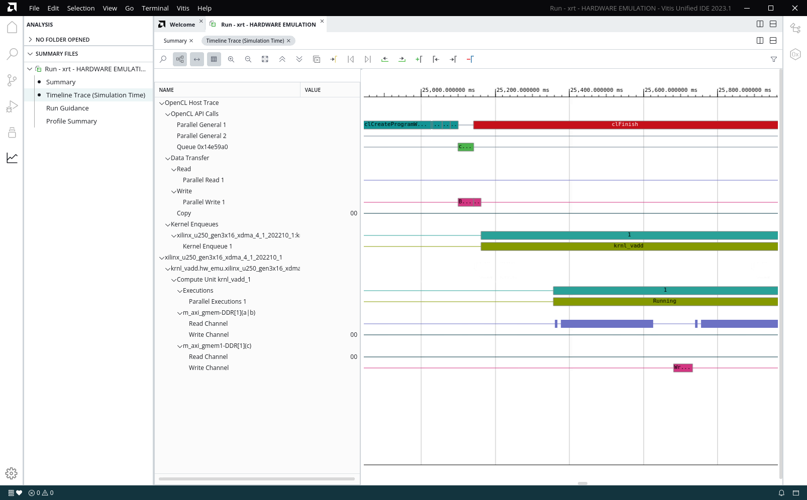
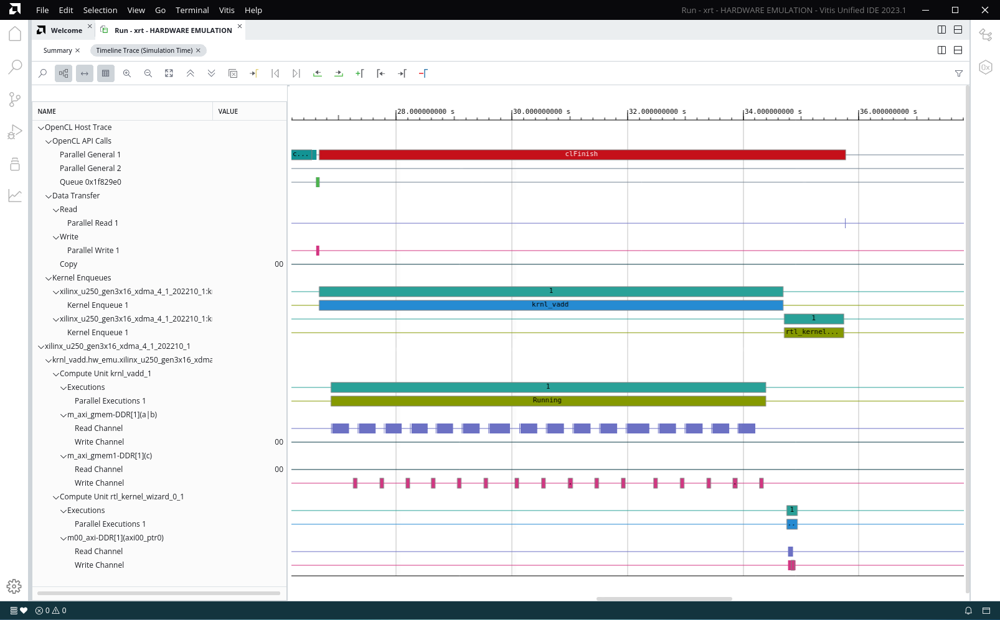

<table class="sphinxhide" width="100%">
 <tr width="100%">
    <td align="center"><h1>Hardware Acceleration Tutorials</h1>
    <a href="https://www.xilinx.com/products/design-tools/vitis.html">See Vitis™ Development Environment on xilinx.com</a>
    </td>
 </tr>
</table>

# Mixing C++ and RTL Kernels

***Version: Vitis 2022.1***

## Introduction

In the Vitis™ core development kit, an application program is split between a host application and hardware accelerated kernels. The host application is developed in C/C++ with OpenCL™ API calls. The hardware kernels, on the other hand, can be developed in C/C++, OpenCL C, or RTL. In fact, the Vitis core development kit applications can use any combination of kernels developed in the different languages. The host code is indifferent to how the kernel was developed; it uses the same function call.

## Tutorial Overview

This tutorial demonstrates an application using two kernels, one designed in C++ and the other designed in RTL, with the host code accessing the kernels in an identical manner.

This tutorial is split into two parts:

- In the first part, you will build an application (host and kernel) with one C++ based kernel. The host code, including the kernel function call, is reviewed.
- In the second part, an RTL-based kernel will be added to the application.  The updated host code, including the function call to the additional kernel, is reviewed.

During both parts, the application is built using a Makefile. Software emulation is run in step one and hardware emulation is run in step two. In both steps, the generated Application Timeline will be reviewed to highlight the kernels being called and run by the host application.

The host code and C++ kernel code are supplied. The RTL code will be generated using the RTL Kernel Wizard.

## Before You Begin

This tutorial uses:

- BASH Linux shell commands.
- 2021.2 Vitis core development release and the *xilinx_u200_gen3x16_xdma_2_202110_1* platform. If necessary, it can be easily extended to other versions and platforms.

>**IMPORTANT:**  
>
> * Before running any of the examples, make sure you have installed the Vitis core development kit as described in [Installation](https://docs.xilinx.com/r/en-US/ug1393-vitis-application-acceleration/Installation-Requirements) in the Application Acceleration Development flow of the Vitis Unified Software Platform Documentation (UG1393).
>* If you run applications on Xilinx® Alveo™ Data Center accelerator cards, ensure the card and software drivers have been correctly installed by following the instructions on the [Alveo Portfolio page](https://www.xilinx.com/products/boards-and-kits/alveo.html).

Before running any of the examples, ensure you have set up the Vitis core development kit by running the following commands.

  ```bash
    #setup Xilinx Vitis tools, XILINX_VITIS and XILINX_VIVADO will be set in this step. source <VITIS install path>/settings64.sh. for example:
    source /opt/Xilinx/Vitis/2022.1/settings64.sh
    #Setup runtime. XILINX_XRT will be set in this step
    source /opt/xilinx/xrt/setup.sh
  ```

### Accessing the Tutorial Reference Files

1. To access the reference files, type the following into a terminal: `git clone https://github.com/Xilinx/Vitis-Tutorials`.
2. Navigate to the `Hardware_Acceleration/Feature_Tutorials/02-mixing-c-rtl-kernels` directory, and then access the `reference-files` directory.

## Building an Application with C++ Based Kernel

In this step, you will build an application, consisting of host code and a C++ kernel using a makefile. For an overview on building an application, refer to the [Vitis Getting Started Tutorial](https://github.com/Xilinx/Vitis-Tutorials/tree/master/Getting_Started/Vitis) lab.

### C++ Based Kernel

The C++ based kernel adds two input vectors and generates the output result. The source code is found in the following directory.

```
./reference-files/src/kernel_cpp/
```

The makefile will build this kernel and add it to the hardware platform (`xclbin`), which can be accessed by the host code.

### Host Code

The host code for step 1 (`host_step1.cpp`) can be found in the following directory.

```
./reference-files/src/host/
```

It sets up the platform and defines global memory buffers and connections to the kernel. The following four important sets of OpenCL API calls in the host code are described. To view these calls, open the `host_step1.cpp` file.

- The first set of code, on lines 189-191, creates the program to execute. It uses the binary container, which contains only the C++ based kernel.

   ```
   cl::Program::Binaries bins;
   bins.push_back({buf,nb});
   cl::Program program(context, devices, bins);
   ```

- The second set of code, on line 195, gets the C++ krnl_vadd kernel object from the program, and assigns the name *krnl_vector_add.* It allows the kernel to be used by the host.

   ```
   cl::Kernel krnl_vector_add(program,"krnl_vadd");
   ```

- The third set of code, on lines 213-216, assigns the krnl_vector_add kernel arguments to the buffers.

   ```
   krnl_vector_add.setArg(0,buffer_a);
   krnl_vector_add.setArg(1,buffer_b);
   krnl_vector_add.setArg(2,buffer_result);
   krnl_vector_add.setArg(3,DATA_SIZE);
   ```

- The argument numbers 0, 1, 2, and 3 match the argument order in the `krnl_vadd` definition found in `krnl_vadd.cpp` as follows.

   >**NOTE:** Arguments `a` and `b` are inputs, and `c` is an output.

   ```
   void krnl_vadd(
                int* a,
                int* b,
                int* c,
                const int n_elements)
   ```

- Finally, on line 220, the following OpenCL API launches the krnl_vector_add kernel.

   ```
   q.enqueueTask(krnl_vector_add);
   ```

For complete details on host code programming, refer to [Developing Applications](https://docs.xilinx.com/r/en-US/ug1393-vitis-application-acceleration/Developing-Applications) in the Application Acceleration Development flow of the Vitis Unified Software Platform Documentation (UG1393).

### Build the Application

1. To build the application targeting software emulation, run the following makefile command from the `./reference-files` directory.

   ```bash
   make all TARGET=sw_emu LAB=run1
   ```

   This builds both the host software and hardware binary targeted to software emulation. The makefile will also generate the platform JSON emulation file to use during emulation.

### Run Emulation

During emulation, you gather application timeline data, consisting of host and device events, which can be reviewed after emulation has completed on a common timeline. The Application Timeline data collection must be enabled before running the emulation by setting *opencl_trace=true* option in an `xrt.ini` file found in the `./reference-files` directory.  

  ```
  [Debug]
  opencl_summary=true
  opencl_trace=true
  data_transfer_trace=fine
  ```

To run software emulation on the design, set the XCL_EMULATION_MODE environment variable and run the host application with the device binary:

   ```bash
   export XCL_EMULATION_MODE=sw_emu
   ./host krnl_vadd.sw_emu.xilinx_u200_gen3x16_xdma_2_202110_1.xclbin
   ```

   When the application successfully completes, the following message is displayed in the Console window.

   `TEST WITH ONE KERNEL PASSED`

### Review the Application Timeline

Review the Application Timeline generated during software emulation to visualize the host events and the kernel running.  

1. To view the Application Timeline, use the Vitis analyzer by running the following command from within the `run1` directory.

   ```
   vitis_analyzer xclbin.run_summary
   ```

2. Click on the **Application Timeline** option on the left to bring up the Application Timeline.
  

3. After reviewing, close the Application Timeline window.  
   >**NOTE:** A CU is an instantiation of the kernel on the FPGA.

#### Putting it All Together

For step 1, the following steps were performed. All commands are run in the `./reference-files` directory:

```bash
# Build the application
make all TARGET=sw_emu LAB=run1

# Set XCL_EMULATION_MODE environment variable for software emulation
export XCL_EMULATION_MODE=sw_emu

# Run software emulation
./host krnl_vadd.sw_emu.xilinx_u200_gen3x16_xdma_2_202110_1.xclbin

# View Application Timeline Trace in Vitis Analyzer
vitis_analyzer xclbin.run_summary
   ```

## Building an Application with C++ and RTL-Based Kernels

Now that you have successfully built and run an application with a C++ based kernel, update the application to include an RTL-based kernel.  

Similar to the previous section, you will build, emulate, and review the generated Application Timeline. Regardless of how the kernels were designed, as HLS C/C++ kernels or as RTL kernels, after the kernel has been built the host application accesses the accelerated kernels through the same function calls.

### RTL-Based Kernel

First, you will create and package an RTL-based kernel using the RTL Kernel Wizard. By default, the wizard creates a kernel to increment by one. This kernel will be used in this tutorial. Additionally, the wizard automates the steps needed to package the RTL design into a kernel object file (XO).

You will generate the RTL-based kernel by quickly going through the RTL Kernel Wizard steps (at a high-level). Review the [Getting Started with RTL Kernels](https://github.com/Xilinx/Vitis-Tutorials/tree/master/Hardware_Acceleration/Feature_Tutorials/01-rtl_kernel_workflow) tutorial for more information. For complete details refer to [RTL Kernels](https://docs.xilinx.com/r/en-US/ug1393-vitis-application-acceleration/RTL-Kernels) in the Application Acceleration Development flow of the Vitis Unified Software Platform Documentation (UG1393).

#### Create the Vitis Project

1. To open the Vitis IDE, enter `vitis` in the command line.
2. Select **./mixing-c-rtl-kernels/workspace** as the workspace directory, and click **Launch**.
3. From the `Welcome` screen select **Create Application Project** to open the `New Project` wizard.
4. The first page displays a summary of the process. Click **Next** to proceed. 
5. From the `Platform` page select the **xilinx_u200_gen3x16_xdma_2_202110_1** platform and click **Next**.
6. From the `Application Project Details` page, name your project `rtl_project` and click **Next**.
7. Under SW Acceleration Templates, select **Empty Application**, and click **Finish**. This creates a Vitis IDE project.

Next, generate an RTL-based kernel from within the Vitis IDE.

1. Select the menu command **Xilinx > Launch RTL Kernel Wizard > rtl_project_kernels**.  This opens the RTL Kernel Wizard Welcome page.
2. The first page is a summary of the process. Review it and click **Next**.
3. In the General Settings dialog box, keep all the default settings, and click **Next**.
4. In the Scalars dialog box, set the number of scalar arguments to `0`, and click **Next**.
5. In the Global Memory dialog box, keep all the default settings, and click **Next**.  
6. In the Streaming Interfaces dialog box, keep all the default settings, and click **Next**.  
The Summary dialog box is displayed and provides a summary of the RTL kernel settings and includes a function prototype which conveys what a kernel call would look like as a C function.  
7. Click **OK**.  

The RTL Kernel source files have now been created.

#### The Vivado Design Suite Project

At this point, the Vivado Design Suite opens a project automatically with the generated RTL code corresponding to the default `A = A + 1` function.  You can navigate to review the source files or even run RTL simulation.  However, for this tutorial, you will not be modifying the default RTL Kernel and will only package into an object file (`.xo`).

1. In Flow Navigator, click **Generate RTL Kernel**.  
  
2. In the **Generate RTL Kernel** dialog box, select the **Sources-only** packaging option.
3. For **Software Emulation Sources**, you can add a C++ model of the RTL kernel, which is used for Software Emulation. 
   
   The C++ model must be coded by the design engineer. Typically, there is no C++ model available, and Hardware Emulation is used to test the design. Because the RTL Wizard creates a C++ model of the vadd design, the steps to add this file are also provided below.

4. Click the **Browse** command (`...`).
5. Double-click the `imports` directory.
6. Select the `rtl_kernel_wizard_0_cmodel.cpp` file and click **OK**.
7. To generate the RTL kernel, click **OK**.
8.  After the RTL kernel has been generated successfully, click **Yes** to exit the Vivado Design Suite, and return to the Vitis IDE.
9.  A message window displays some information related to the generated RTL kernel. Review it and click **OK**.
10. Exit the Vitis IDE.

   At this point, you have packaged the RTL kernel into the following object file, `rtl_kernel_wizard_0.xo` found in the following directory.

   ```
   ./02-mixing-c-rtl-kernels/workspace/rtl_project_kernels/src/vitis_rtl_kernel/rtl_kernel_wizard_0
   ```

#### Host Code Updates

To access the RTL-based kernel, the host code needs to be updated. The updates have been done in the `host_step2.cpp` file located in the following directory.

```
./reference-files/src/host/
```

The updates includes additional OpenCL API calls briefly described below. The additional OpenCL API calls are identical to the ones used for the C++ based kernel with the arguments changed for the RTL-based kernel.

  ```
  cl::Program::Binaries bins;
  bins.push_back({buf,nb});
  cl::Program program(context, devices, bins);
  ```

The following code gets the `rtl_kernel_wizard_0` object from the program and assigns the name *krnl_const_add* on line 198. The `rtl_kernel_wizard_0` object name matches the name of the kernel you generated with the RTL Wizard.

```
cl::Kernel krnl_const_add(program,"rtl_kernel_wizard_0");
```

Next, define the krnl_const_add kernel arguments on line 219.
>**NOTE:** In the host code, the buffer `buffer_result` is passed directly from the C kernel to the RTL kernel through DDR without being moved back to the host memory.

```
krnl_const_add.setArg(0,buffer_result);
```

Launch the krnl_const_add kernel on line 222.

```
q.enqueueTask(krnl_const_add);
```  

#### Build and Emulation with C++ and RTL Based Kernels

With the RTL-based kernel added and host code updated, build the application, targeting hardware emulation through the updated makefile in the `run2` directory. The makefile has been updated to add both the CPP and RTL-based kernels to the hardware platform file (`xclbin`).

1. Navigate to the `./02-mixing-c-rtl-kernels/reference-files` directory.
2. To build the application targeting hardware emulation, run the following makefile from the `./reference-files` directory.  

   ```bash
   make all TARGET=hw_emu LAB=run2
   ```

   As before, run emulation, and generate and review the Application Timeline by running the following commands from within the `./reference-files` directory.

3. Set XCL_EMULATION_MODE environment variable for hardware emulation, and run the application.

   ```bash
   export XCL_EMULATION_MODE=hw_emu
   ./host krnl_vadd.hw_emu.xilinx_u200_gen3x16_xdma_2_202110_1.xclbin
   ```

5. View the **Application Timeline** report in the Vitis analyzer.

   ```
   vitis_analyzer xclbin.run_summary
   ```

6. Under **Device**>**Binary Container**, traverse along the timeline and zoom in.  
 You will now see both CUs, krnl_vadd_1 and rtl_kernel_wizard_0_1, show as *running*.  


7. After reviewing, close the Application Timeline, and exit Vitis analyzer.  

  Vitis core development kit applications can use any combination of kernels, regardless of the language they were developed in.

Because a CPP emulation file was packaged with the RTL Kernel (through the RTL Wizard), you can also run software emulation.  To run software emulation, you can use the following steps:

   ```bash
# Build the application
 make all TARGET=sw_emu

# Set XCL_EMULATION_MODE environment variable for software emulation
export XCL_EMULATION_MODE=sw_emu

# Run software emulation
./host krnl_vadd.sw_emu.xilinx_u200_gen3x16_xdma_2_202110_1.xclbin

# Open Vitis analyzer and view the timeline waveform
vitis_analyzer xrt.run_summary
   ```

## Next Steps

With the understanding that Vitis compiler can use kernels from a variety of build sources, perhaps you would be interested in seeing some special designs implemented using the Vitis application acceleration development flow. If so, proceed to [Hardware Accelerator Design Tutorials](https://github.com/Xilinx/Vitis-Tutorials/tree/master/Hardware_Acceleration/Design_Tutorials).

</br>
<hr/>
<p align="center" class="sphinxhide"><b><a href="/README.md">Return to Main Page</a></b></p>
<p align="center" class="sphinxhide"><sup>Copyright&copy; 2021-2022 Xilinx</sup></p>
