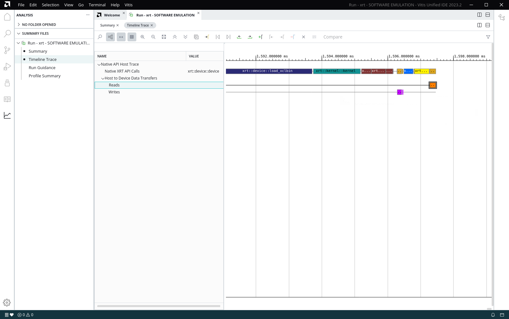
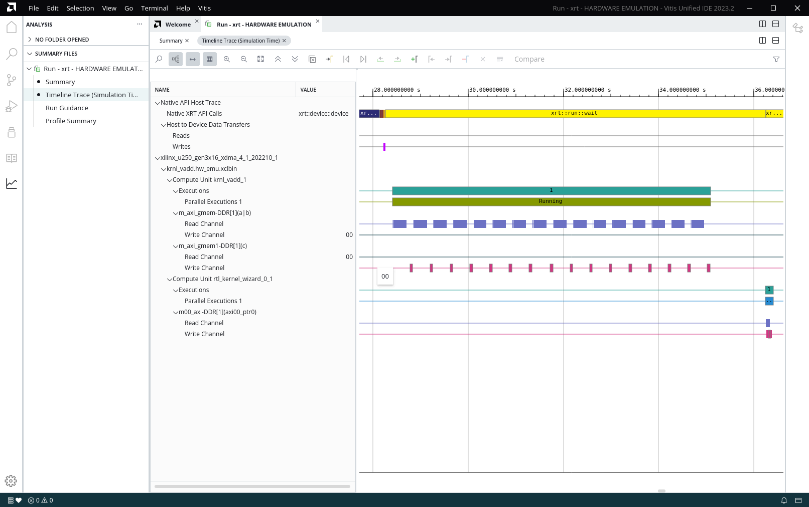

<table class="sphinxhide" width="100%">
 <tr width="100%">
    <td align="center"><h1>Hardware Acceleration Tutorials</h1>
    <a href="https://www.xilinx.com/products/design-tools/vitis.html">See Vitis™ Development Environment on xilinx.com</a>
    </td>
 </tr>
</table>

# Mixing C++ and RTL Kernels

***Version: Vitis 2023.2***

## Introduction

In the AMD Vitis™ core development kit, an application program is split between a host application and hardware accelerated kernels. The host application is developed in C/C++, while the hardware kernels can be developed in C/C++, or RTL. The host code is indifferent to how the kernel was developed; it uses the same function calls to engage with the hardware.

## Tutorial Overview

This tutorial demonstrates a System project using two kernels, one designed in C++ and the other designed in RTL, with the host code accessing the kernels in an identical manner.

This tutorial is split into two steps:

- In step one, you will build an application (host and kernel) with one C++ based kernel. The host code, including the kernel function call, is reviewed.
- In step two, an RTL-based kernel will be added to the application.  The updated host code, including the function call to the additional kernel, is reviewed.

During both steps, the application is built using a Makefile. Software emulation is run in step one and hardware emulation is run in step two. In both steps, the generated Application Timeline is reviewed to highlight the kernels being called and run by the host application.

The host code and C++ kernel code are supplied, the RTL kernel is separately developed.

## Before You Begin

This tutorial uses:

- BASH Linux shell commands.
- 2023.2 Vitis core development release and the *xilinx_u250_gen3x16_xdma_4_1_202210_1* platform. If necessary, it can be easily extended to other versions and platforms.

>**IMPORTANT:**  
>
> * Before running any of the examples, make sure that you have installed the Vitis core development kit as described in [Installation](https://docs.xilinx.com/access/sources/dita/topic?Doc_Version=2023.2%20English&url=ug1393-vitis-application-acceleration&resourceid=vhc1571429852245.html) in the Vitis Unified Software Platform Documentation (UG1393).
>* If you run applications on AMD Alveo™ Data Center accelerator cards, ensure that the card and software drivers have been correctly installed by following the instructions on the [Alveo Portfolio page](https://www.xilinx.com/products/boards-and-kits/alveo.html).

Before running any of the examples, ensure that you have set up the Vitis core development kit by running the following commands.

  ```bash
    #setup Xilinx Vitis tools, XILINX_VITIS and XILINX_VIVADO will be set in this step. source <VITIS install path>/settings64.sh. for example:
    source <install_dir>/Vitis/2023.2/settings64.sh
    #Setup runtime. XILINX_XRT will be set in this step
    source /opt/xilinx/xrt/setup.sh
  ```

### Accessing the Tutorial Reference Files

1. To access the reference files, type the following into a terminal: `git clone https://github.com/Xilinx/Vitis-Tutorials`.
2. Navigate to the `Hardware_Acceleration/Feature_Tutorials/02-mixing-c-rtl-kernels` directory, and then access the `reference-files` directory.

## Step 1: Building an Application with C++ Based Kernel

In this step, you will build an application, consisting of host code and a C++ kernel using a makefile. For an overview on building an application, refer to the [Vitis Getting Started Tutorial](https://github.com/Xilinx/Vitis-Tutorials/tree/master/Getting_Started/Vitis) lab.

### C++ Based Kernel

The C++ based kernel adds two input vectors and generates the output result. The source code is found in the following directory.

```
./reference-files/src/kernel_cpp/
```

The makefile builds this kernel and linking it with the hardware platform in the device binary (`xclbin`), which can be accessed by the host code.

### Host Code

The host code for step 1 (`xrt-host_step1.cpp`) can be found in the following directory.

```
./reference-files/src/host/
```

It sets up the platform and defines global memory buffers and connections to the kernel. The following four important sets of XRT API calls in the host code are described. To view these calls, open the `xrt-host_step1.cpp` file.

- The first set of code, on lines 20-29, define the device binary file (.xclbin) to load. This first lab uses the binary container that only contains the C++ based kernel. The struicture of this lets you speciy the .xclbin on the command line when running th ehost, or it is inferred from the default naming when no .xclbin is specified. 

   ```
    std::string binaryFile;
    std::cout << "argc = " << argc << std::endl;
    for(int i=0; i < argc; i++){
	      std::cout << "argv[" << i << "] = " << argv[i] << std::endl;
    }
    if (argc > 1) {
	      binaryFile = argv[1];
    } else {
	      binaryFile = "./krnl_vadd.sw_emu.xclbin";
    }
   ```

- The second set of code, on line 41, gets the C++ krnl_vadd kernel object from the program, and assigns the name *krnl* to the object. This allows the kernel to be used by the host.

   ```
   auto krnl = xrt::kernel(device, uuid, "krnl_vadd", xrt::kernel::cu_access_mode::exclusive);
   ```

- The third set of code, on lines 43-46, assigns the *krnl* kernel arguments to device side buffers to store data needed by, or generated by the kernel.

   ```
    std::cout << "Allocate Buffer in Global Memory\n";
    auto boIn1 = xrt::bo(device, vector_size_bytes, krnl.group_id(0)); //Match kernel arguments to RTL kernel
    auto boIn2 = xrt::bo(device, vector_size_bytes, krnl.group_id(1));
    auto boOut = xrt::bo(device, vector_size_bytes, krnl.group_id(2));
   ```

- The argument numbers 0, 1, and 2 match the argument order in the `krnl_vadd` definition found in `krnl_vadd.cpp` as follows.

   >**NOTE:** Arguments `a` and `b` are inputs, and `c` is an output.

   ```
   void krnl_vadd(
                int* a,
                int* b,
                int* c,
                const int n_elements)
   ```

- Finally, on line 70, the API runs the *krnl* object, and on line 71 it waits for the kernel object to complete.

   ```
    auto run = krnl(boIn1, boIn2, boOut, DATA_SIZE); //DATA_SIZE=size
    run.wait();
   ```

For complete details on host code programming, refer to [Writing the Software Application](https://docs.xilinx.com/access/sources/dita/topic?Doc_Version=2023.2%20English&url=ug1393-vitis-application-acceleration&resourceid=vpy1519742402284.html) in the Application Acceleration Development flow of the Vitis Unified Software Platform Documentation (UG1393).

### Build the Application

1. To build the application targeting software emulation, run the following makefile command from the `./reference-files` directory.

   ```bash
   make all TARGET=sw_emu LAB=run1
   ```

   This builds both the host software and hardware binary targeted to software emulation. The makefile also generates the platform JSON emulation file to use during emulation.

### Run Emulation

During emulation, you gather application timeline data, consisting of host and device events, which can be reviewed after emulation has completed on a common timeline. The Application Timeline data collection must be enabled before running the emulation by setting *opencl_trace=true* option in an `xrt.ini` file found in the `./reference-files` directory.  

  ```
  [Debug]
  opencl_trace=true
  device_trace=fine
  ```

To run software emulation on the design, set the XCL_EMULATION_MODE environment variable and run the host application with the device binary:

   ```bash
   export XCL_EMULATION_MODE=sw_emu
   ./host_1 krnl_vadd.sw_emu.xclbin
   ```

   When the application successfully completes, the following message is displayed in the Console window.

   `TEST WITH ONE KERNEL PASSED`

### Review the Application Timeline

Review the Timeline Trace generated during software emulation to visualize the host events and the kernel running.  

1. To view the Timeline Trace report use the Analysis view in the Vitis unified IDE by running the following command:

   ```
   vitis -a xrt.run_summary
   ```

2. Click on the **Timeline Trace** in the Analysis view as shown in the folowing figure to open the report.
  

3. After reviewing, close the Vitis unified IDE.  
   >**NOTE:** A CU is an instantiation of the kernel on the FPGA.

#### Putting it All Together

For step 1, the following steps were performed. All commands are run in the `./reference-files` directory:

```bash
# Build the application
make all TARGET=sw_emu LAB=run1

# Set XCL_EMULATION_MODE environment variable for software emulation
export XCL_EMULATION_MODE=sw_emu

# Run software emulation
./host_1 krnl_vadd.sw_emu.xclbin

# View Application Timeline Trace in Vitis Analyzer
vitis -a xrt.run_summary
   ```

## Step 2: Building an Application with C++ and RTL-Based Kernels

Now that you have successfully built and run an application with a C++ based kernel, update the hardware design to also include an RTL-based kernel. For this tutorial, the RTL kernel is a simple +1 adder. The packaged RTL kernel is provided for your use in the System project at `./src/rtl_kernel/rtl_kernel_wizard_0.xo`. Similar to the previous section, build, emulate, and review the generated Timeline Trace report. Regardless of how the kernels were designed, as HLS C/C++ kernels or as RTL kernels, the host application accesses the PL kernels through the same XRT native API calls.

For a tutorial on packaging an RTL kernel review the [Getting Started with RTL Kernels](https://github.com/Xilinx/Vitis-Tutorials/tree/master/Hardware_Acceleration/Feature_Tutorials/01-rtl_kernel_workflow) tutorial. For complete details refer to [Packaging RTL Kernels](https://docs.xilinx.com/access/sources/dita/topic?Doc_Version=2023.2%20English&url=ug1393-vitis-application-acceleration&resourceid=qnk1504034323350.html) in the Vitis Unified Software Platform Documentation (UG1393).

#### Host Code Updates

To access the RTL-based kernel, the host code needs to be updated. The updates have been done in the `xrt-host_step2.cpp` file located in the following directory.

```
./reference-files/src/host/
```

The updates includes additional XRT API calls briefly described below. The additional API calls are identical to the ones used for the C++ based kernel with the arguments changed for the RTL-based kernel.

  ```
    std::string binaryFile;
    std::cout << "argc = " << argc << std::endl;
    for(int i=0; i < argc; i++){
	std::cout << "argv[" << i << "] = " << argv[i] << std::endl;
    }
    if (argc > 1) {
	binaryFile = argv[1];
    } else {
	binaryFile = "./krnl_vadd.hw_emu.xclbin";
    }
  ```

The following code gets the `rtl_kernel_wizard_0` object from the device binary (`.xclbin`) and assigns the name *krnlRTL* on line 41. The `rtl_kernel_wizard_0` object name matches the name of the RTL kernel.

```
    auto krnlRTL = xrt::kernel(device, uuid, "rtl_kernel_wizard_0");
```

>**NOTE:** In the host code, the `boOut` buffer is passed directly from the C++ kernel to the RTL kernel through DDR without being moved back to the host memory. This results in better performance, and allows the buffer to be shared between the two kernels. This occurs when running the kernels as seen on lines 70 to 75. 

```
    std::cout << "Execution of the vadd kernel\n";
    auto run1 = krnl(boIn1, boIn2, boOut, DATA_SIZE); //DATA_SIZE=size
    run1.wait();
    std::cout << "Execution of the RTL  kernel\n";
    auto run2 = krnlRTL(boOut); 
    run2.wait();
```


#### Build and Emulation with C++ and RTL Based Kernels

With the RTL-based kernel added and host code updated, build the application, targeting hardware emulation through the updated makefile in the `run2` directory. The makefile has been updated to add both the CPP and RTL-based kernels to the hardware platform file (`xclbin`).

1. Navigate to the `./02-mixing-c-rtl-kernels/reference-files` directory.
2. To build the application targeting hardware emulation, run the following makefile from the `./reference-files` directory.  

   ```bash
   make all TARGET=hw_emu LAB=run2
   ```

   As before, run emulation and generate and review the Application Timeline by running the following commands from within the `./reference-files` directory.

3. Set XCL_EMULATION_MODE environment variable for hardware emulation, and run the application.

   ```bash
   export XCL_EMULATION_MODE=hw_emu
   ./host_2 krnl_vadd.hw_emu.xclbin
   ```

5. View the **Application Timeline** report in the Vitis analyzer.

   ```
   vitis -a xrt.run_summary
   ```

6. Under **Device**>**Binary Container**, traverse along the timeline and zoom in.  
 You will now see both CUs, krnl_vadd_1 and rtl_kernel_wizard_0_1, show as *running*.  


7. After reviewing, close the Analysis view and the Vitis unified IDE.  

  Vitis core development kit applications can use any combination of kernels, regardless of the language in which they were developed.

Because a CPP emulation file was packaged with the RTL Kernel (through the RTL Wizard), you can also run software emulation.  To run software emulation, use the following steps:

   ```bash
# Build the application
 make all TARGET=sw_emu LAB=run2

# Set XCL_EMULATION_MODE environment variable for software emulation
export XCL_EMULATION_MODE=sw_emu

# Run software emulation
./host krnl_vadd.sw_emu.xclbin

# Open Vitis analyzer and view the timeline waveform
vitis -a xrt.run_summary
   ```

## Next Steps

With the understanding that Vitis compiler can use kernels from a variety of build sources, perhaps you would be interested in seeing some special designs implemented using the Vitis application acceleration development flow. If so, proceed to [Hardware Accelerator Design Tutorials](https://github.com/Xilinx/Vitis-Tutorials/tree/master/Hardware_Acceleration/Design_Tutorials).

</br>
<hr/>
<p align="center" class="sphinxhide"><b><a href="/README.md">Return to Main Page</a></b></p>


<p class="sphinxhide" align="center"><sub>Copyright © 2020–2023 Advanced Micro Devices, Inc</sub></p>

<p class="sphinxhide" align="center"><sup><a href="https://www.amd.com/en/corporate/copyright">Terms and Conditions</a></sup></p>

