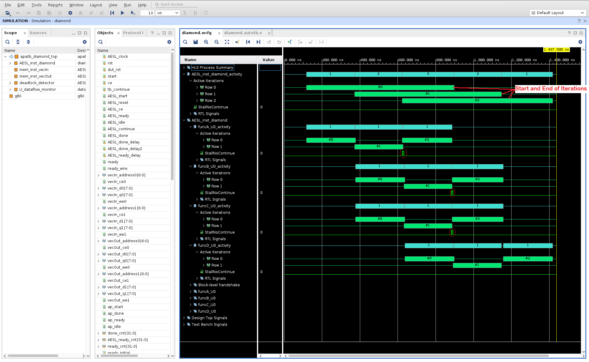

<table class="sphinxhide" width="100%">
 <tr width="100%">
    <td align="center"><h1>Hardware Acceleration Tutorials</h1>
    <a href="https://www.xilinx.com/products/design-tools/vitis.html">See Vitis™ Development Environment on xilinx.com</a>
    </td>
 </tr>
</table>

# 1. Dataflow Viewer Basics

The DATAFLOW optimization tries to create task-level parallelism between the various functions in the code on top of the loop-level parallelism where possible. The optimization is done in two parts — first, the compiler infers the parallel tasks and sets up the communication channels and the associated control; second, after the generated RTL design is simulated, you can analyze the performance of the DATAFLOW optimization. Due to this fact, the Dataflow viewer lets you see the dataflow structure inferred by the tool, inspect the channels (FIFO/PIPO), and examine the effect of channel depth on performance. Performance data is then back-annotated to the Dataflow viewer from the co-simulation results. The Dataflow viewer also displays a representation of the dataflow graph structure, showing the different processes and the underlying producer-consumer connections.

>**TIP:** You must apply the DATAFLOW pragma or directive to your design for the Dataflow viewer to be populated. You can apply dataflow to the top-level function, or specify regions of a function, or loops. For more information, refer to [set_directive_dataflow](https://docs.amd.com/r/en-US/ug1399-vitis-hls/set_directive_dataflow) in the Vitis HLS flow of the Vitis Unified Software Platform documentation (UG1416).

## Taking the tour

As the first exercise in this tutorial, you will synthesize the example design and bring up the Dataflow viewer to take a tour of the features of the viewer. In this lab, you will look at a simple [dataflow example](./reference-files/dataflow/diamond.cpp), found in the `reference-files/dataflow` folder.

In this lab, you will:

1. Learn how to bring up the Dataflow viewer for a given dataflow region.
2. Understand how to use the different features of the Dataflow viewer (both before and after cosimulation).

### First Lab

1. Change directory to the `03-dataflow_debug_and_optimization/reference-files/dataflow` directory, you can launch the Vitis HLS GUI by issuing the following command:

   ```C++
   vitis_hls -p script.tcl
   ```

   The Vitis HLS GUI will launch and create the project needed to synthesize the design but the GUI will stop short of executing the commands in the `script.tcl` file.

2. Click the green **Run** command () to synthesize the design.  

   After synthesizing your design, the GUI will automatically show the Synthesis Summary report (as shown in the following figure).

   

   In the Synthesis Summary report, the Dataflow icon () alongside the function indicates that a Dataflow viewer report is available.

   

3. Right-click on the top-level function name (diamond), and select the **Open Dataflow Viewer** command to open a new Dataflow viewer window for the function as shown below.

   

In the preceding figure there are four areas of interest:

#### Module Hierarchy View

First is the **Module Hierarchy** view, which shows the function hierarchy that is inside the top-level `diamond` function. In addition to displaying the module hierarchy, you can inspect the details of each sub-function in the hierarchy such as latency, II, and logic resource estimates.

#### The Dataflow Graph Pane

The second area of interest is the Dataflow Graph view which displays the connectivity between the functions inside the dataflow region in graph form. Ports of the dataflow region are represented by horizontal grey bars (see the figure for the `vecIn` and `vecOut` ports).

The nodes in the graph (shown as blue boxes) represent the functions or loops inside the dataflow region. Note that these might contain functions inferred by the compiler and not just functions defined by the user. These inferred functions will typically contain the suffix `_proc`.

The edges in the graph (shown as blue, green, or gold arrows) represent the communication between the functions:

* Blue edges represent data dependencies between the functions
* Green edges represent the inferred FIFO channels between the functions
* Gold edges represent the inferred PIPO channels

The Dataflow Graph view has several useful features like the `Zoom In/Out` commands (the scroll mouse button can also be used to zoom in and out), `Zoom Fit`, and `Zoom Full` commands, displayed on the toolbar menu. In addition, first in first out (FIFO) channels can be shown grouped or ungrouped in the graph as can PIPO channels using the `Group All` and `Ungroup All` commands. Individual channel groups can be expanded or grouped using the `+` or `-` commands. Finally, there is a `Legend` command that displays the color syntax used in the graph.

To the top right of the graph pane, the `Filter` icon lets you filter different channel subtypes such as stream/task level/scalar propagation FIFO as well as PIPO and stream of blocks.

#### Dataflow Properties Table

At the bottom part of the GUI is the Dataflow Properties table which shows various details about the dataflow processes (or functions) and the dataflow channels.

4. Click each process/function in the Dataflow Graph view, and see the corresponding process being highlighted in the Dataflow Properties table.

5. Right-click the selected process to see what else you can learn about this process and also understand what other viewers you can access.

6. Switch to the Channel table in the Dataflow Properties table. Click each green/gold arrows in the graph and see the corresponding channel being highlighted in the Channel table.

It is important to understand that the dataflow optimization is a dynamic optimization, unlike pipelining which is a static optimization. Because of this, while the compiler informs you of implementing the dataflow optimization, the effects of the optimization cannot be seen until after running RTL co-simulation. The process or channel details are marked as `N/A` as shown in the figure below until RTL co-simulation has generated performance data.

   

>**TIP:** You can open the Dataflow viewer before running RTL co-simulation, but the viewer will not be able to show the important simulation performance details such as read/write block times, co-sim depth, and stall times.

### Viewing the Dataflow Graph after RTL Co-Simulation

After synthesis, you must run co-simulation. For more information, refer to [C/RTL Co-Simulation in Vitis HLS](https://docs.amd.com/r/en-US/ug1399-vitis-hls/C/RTL-Co-Simulation-in-Vitis-HLS) in the Vitis HLS Flow of the Vitis Unified Software Platform Documentation (UG1416).

1. From the menu, select the **Solution > Run C/RTL Co-Simulation** command.
   The Co-simulation dialog box displays as shown in the folowing figure.

    

2. Enable the **Channel (PIPO/FIFO) Profiling** checkbox.
3. Click **OK**.

   After co-simulation completes, the tool opens the Co-simulation Report which reports whether your simulation testbench passed or not.

   In the case of Dataflow analysis, your testbench needs to call the synthesized function more than once to get the performance data from multiple iterations, and to make sure the design is flushing the FIFOs. When it comes to performance, one function call gives you latency, two or more calls to the function can give you the initiation interval (II).

4. After the co-simulation completes, select **Analysis** in the upper right hand corner of the screen to switch to the `Analysis` perspective.

   If the Dataflow Graph view is open, the report is updated (or back-annotated) with performance data generated by the RTL co-simulation, as shown in the following figure.

   **TIP:** If it is not open, right click the top-level `diamond` function in the Module Hierarchy view,  and select **Open Dataflow Viewer**.

      

   After running C/RTL co-simulation, the elements of the graph are filled out with performance data, and the Process and Channel tables beneath the graph are also filled out (as shown below). Without the performance data provided by RTL co-simulation, the graph and tables will have NA values to reflect the missing values. For more information, refer to [Dataflow Viewer](https://docs.amd.com/r/en-US/ug1399-vitis-hls/Dataflow-Viewer) in the Vitis HLS Flow of the Vitis Unified Software Platform Documentation (UG1416).

   

   Pay specific attention to the Dataflow Process Table (shown above). `Cosim Stalling Time` column indicates what percentage of the simulation time was spent stalling for this particular process. Additionally, `Cosim Read Block Time` or `Cosim Write Block Time` shows the percentage of time blocked from reading or writing to the process's channels. `Cosim Stall No Start` and `Cosim Stall No Continue` indicates forward and back pressure respectively:

   * Forward pressure implies that you are prevented from starting another execution iteration by the block handshaking protocols
   * Back pressure implies that a consumer process is still processing the data that this process has produced and is not yet ready for the next set of data.
  
   These are important indicators that point out potential problems inside the dataflow region and are indicative of the typical producer-consumer rate issues that can result in lower performance and/or in some cases, deadlock.

   

   Similarly, the channel table (shown above) also tracks the read block and write block times for each channel (and indicated by `Cosim Read Block Time` and `Cosim Write Block Time`). The channel table also shows the depth (`Depth`), type of channel (`Type`) and the maximum depth achieved during the simulation (`Cosim Max Depth`) by the channel. Typically, these data fields are useful for FIFO channels. The following sections will describe in more detail how these fields can be used to accurately size the FIFO depths and to resolve deadlocks due to incorrect FIFO sizing.

   Additionally, the `Cosim Category` column in the Process and Channel tables is used to categorize the processes/channels into one of the four possible self-explanatory states: "none", "read_block", "write_block" and "read_block and write_block."

### Viewing Dataflow Performance using Waveforms

The Dataflow viewer by design can only show you the static view of the dataflow optimization. The graph shows the call-graph like structure of the dataflow region (as shown below). In this graph, you can get a sense of the throughput of your design by observing the II and latency of each function along a given path.


It is difficult to see how the functions inside the dataflow region are executed in parallel and how the execution of the functions overlap. In order to visualize this dynamic timeline you can use the AMD Vivado™ XSIM simulator and waveform viewer.

To launch the simulator waveform viewer you need to re-run RTL co-simulation with a few new settings:

1. From the menu, select the **Solutions > Run C/RTL Co-Simulation** command.

   The Co-simulation dialog box displays as shown in the following figure.

    

2. Make the following selections:
   1. Ensure that the **Vivado XSIM** simulator is chosen.
   2. Select **all** for the **Dump Trace** option to trace all ports and signals. Note: This is a small design and so we can dump and trace all the signals. For a large design, this might cause an increased simulation run time as well as the creation of a large waveform database.
   3. Enable the **Wave Debug** option to interactive launch the XSIM waveform viewer during simulation.
   4. Enable the **Channel (PIPO/FIFO) Profiling** checkbox.
   5. Click **OK**.

At this point, the Vitis HLS GUI will reinvoke RTL co-simulation. The difference this time around is that when it is done with simulation, it will display the Vivado XSIM waveform viewer (due to the `Wave Debug` option), to let you inspect the waveforms generated during simulation (by the `Dump Trace` option). You will see something like the following figure:


To easily explain how the dataflow optimization executes the functions inside the dataflow region in parallel, the waveforms are analyzed to track process starts and stops and a summary of this activity is presented in the waveform viewer. In the above diagram, note the following details:

* The top function in the design is the `diamond` function. In the waveform viewer, this is shown as `AESL_inst_diamond`.
* Note that the first item in the `Name` column is the `HLS Process Summary`. This section show the activity traces (using cyan colored bars) of the dataflow region inside the `diamond` function. This is in fact, a replica of the activity traces found under the `AESL_inst_diamond_activity` item. The `HLS Process Summary` just brings together the function activity waveforms together in one section in the waveform viewer. The first line shows a summary of the number of active iterations of the diamond function that are executing in parallel at that particular time point (1, 2, 3, 2, 1).
* Expand this level to show the individual active invocations of the functions (`funcA, funcB, funcC, & funcD`). In the provided testbench for this test, the top level function `diamond` is called 3 times. So the activity traces for each function shows when each of the three calls to a function are executed. Also what is visible is the order in which the functions are executed inside the body of function `diamond`. First `funcA` starts followed by the parallel execution of `funcB` and `funcC` and once these functions are done, `funcD` starts executing. Small gaps in execution indicated by the yellow elipses can be situations where execution is stalled and worthy of a closer look. This view shows how the functions inside the dataflow region are executed in a pipelined manner — except that it is done in a dynamic pipeline instead of a static pipeline.
  
   

* Expand the `AESL_inst_diamond_activity` level to see a much more detailed view and to see how the three calls to the top level function are executed (#0, #1, #2). These are shown with green color bars. The iteration count starts at zero and ends at two for this particular testbench. You can compare the time take for each iteration to complete and you can also see how the iterations overlap in time. So even the multiple calls to the top level function are dynamically pipelined.

* You can investigate the activity traces for each of the sub-functions to see when each invocation of the sub-function starts and stops (shown by the green #0, #1, #2 bars while the cyan (1, 1, 1) bars just shows the active iterations at the given time point).
* Additional details such a `StallNoContinue` signal is shown to highlight any back pressure that can cause stalling of the function executions. In the above diagram, back pressure from `funcD` can be seen for `funcB` and `funcC` (highlighted on the various `StallNoContinue` waveforms by the red ellipses).
* The RTL level signals are also available for inspection when you expand the `RTL Signals` section.
* It should be noted that, in this default form of HLS dataflow (i.e., with PIPO channels only), successive communicating tasks in a kernel run do not overlap: `funcB` and `funcC` can only start once their buffer from `funcA` (ping or pong) is released. `funcB` and `funcC` could possibly start earlier, if FIFOs were used as an alternative channel to ping-pong buffers, when the data are consumed in the same order in which they are produced. PIPOs are generally used when data is written into the buffer in random order and therefore, the entire buffer is locked until all processing has been completed before releasing access to the buffer. FIFOs are generally used when you have a streaming type of application where data is consumed in the order that it is created. This allows for the consumer to start processing as soon as there is data in the FIFO.

## Next Step

1. [FIFO Sizing and Deadlocks](./fifo_sizing_and_deadlocks.md): Review how to use the deadlock detection feature in the GUI and how to resize FIFOs to avoid deadlocks and achieve better performance.

</br>
<hr/>
<p align="center"><b><a href="/docs/vitis-getting-started/">Return to Getting Started Pathway</a> — <a href="./README.md">Return to Start of Tutorial</a></b></p>


<p class="sphinxhide" align="center"><sub>Copyright © 2020–2023 Advanced Micro Devices, Inc</sub></p>

<p class="sphinxhide" align="center"><sup><a href="https://www.amd.com/en/corporate/copyright">Terms and Conditions</a></sup></p>
