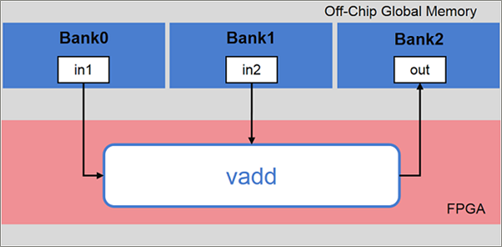
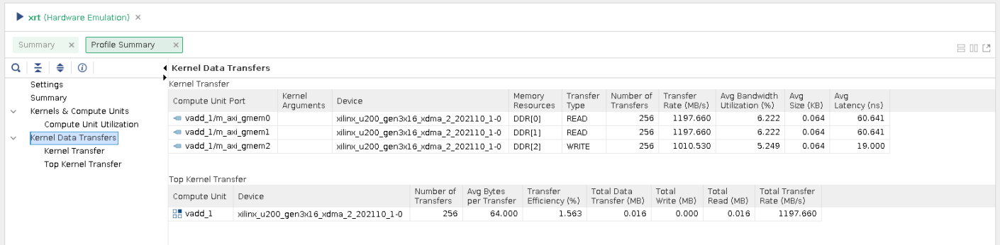

<table class="sphinxhide" width="100%">
 <tr width="100%">
    <td align="center"><h1>Hardware Acceleration Tutorials</h1>
    <a href="https://www.xilinx.com/products/design-tools/vitis.html">See Vitis™ Development Environment on xilinx.com</a>
    </td>
 </tr>
</table>


# Using Multiple DDR Banks

***Version: Vitis 2023.1***

## Introduction

By default, in the AMD Vitis™ core development kit, the data transfer between the kernel and the DDR is achieved using a single DDR bank. In some applications, data movement is a performance bottleneck. In cases where the kernels need to move large amounts of data between the global memory (DDR) and the FPGA, use multiple DDR banks. This enables the kernels to access multiple memory banks simultaneously. As a result, the application performance increases.

The System Port mapping option using the `v++` command allows the designer to map kernel ports to specific global memory banks, such as DDR, HBM, or PLRAM. This tutorial shows you how to map kernel ports to multiple DDR banks.

## Tutorial Overview

This tutorial uses a simple example of vector addition. It shows the `vadd` kernel reading data from `in1` and `in2` and producing the result, `out`.

In this tutorial, implement the vector addition application using three DDR banks.

Because the default behavior of the Vitis core development kit is to use a single DDR bank for data exchange between kernels and global memory, all data access through ports `in1`, `in2`, and `out` is done through the default DDR bank for the platform.


Assume that in the application, you want to access:

* `in1` through `Bank0`
* `in2` through `Bank1`
* `out` through `Bank2`



To achieve the desired mapping, instruct the Vitis core development kit to connect each kernel argument to the desired bank.

The example in this tutorial uses a C++ kernel; however, the steps described are also the same for RTL kernels.

## Before You Begin

The labs in this tutorial use:

* BASH Linux shell commands.
* 2023.1 Vitis core development kit release and the *xilinx_u250_gen3x16_xdma_4_1_202210_1* platform. If necessary, it can be easily extended to other versions and platforms.

>**IMPORTANT:**
>
> * Before running any of the examples, make sure that you have installed the Vitis core development kit as described in [Installation](https://docs.xilinx.com/r/en-US/ug1393-vitis-application-acceleration/Installation-Requirements) in the Application Acceleration Development flow of the Vitis Unified Software Platform Documentation (UG1416).
>* If you run applications on AMD Alveo™ Data Center accelerator cards, ensure that the card and software drivers have been correctly installed by following the instructions on the [Alveo Portfolio page](https://www.xilinx.com/products/boards-and-kits/alveo.html).

### Accessing the Tutorial Reference Files

1. To access the reference files, type the following into a terminal: `git clone https://github.com/Xilinx/Vitis-Tutorials`.
2. Navigate to the `Hardware_Acceleration/Feature_Tutorials/04-mult-ddr-banks` directory, and then access the `reference-files` directory.

### Tutorial Setup

Note: This tutorial showcases only hw_emu flow. If the user wants to run HW flow and has a server with multiple devices, they need to ensure that the correct `device_index` is used in the host code. 

   ```
   unsigned int device_index = 0;
   std::cout << "Open the device" << device_index << std::endl;
   auto device = xrt::device(device_index);
   ```

1. To set up the Vitis core development kit, run the following commands.

   ```bash
     #setup Xilinx Vitis tools, XILINX_VITIS and XILINX_VIVADO will be set in this step. source <VITIS install path>/settings64.sh. for example:
     source /opt/Xilinx/Vitis/2023.1/settings64.sh
     #Setup runtime. XILINX_XRT will be set in this step
     source /opt/xilinx/xrt/setup.sh
   ```

2. Execute the makefile to build the design for HW-Emulation.

   ```bash
   cd reference-files
   make all
   ```

   >**Makefile Options Descriptions**
   >
   >* `MODE := hw_emu`: Set the build configuration mode to HW Emulation
   >* `PLATFORM := xilinx_u250_gen3x16_xdma_4_1_202210_1`: Select the target platform
   >* `KERNEL_SRC := src/vadd.cpp`: List the kernel source files
   >* `HOST_SRC := src/host.cpp`: List the host source files

   As previously mentioned, the default implementation of the design uses a single DDR bank. Observe the messages in the Console view during the link step; you should see messages similar to the following.

   ```
   ip_name: vadd
   Creating apsys_0.xml
   INFO: [CFGEN 83-2226] Inferring mapping for argument vadd_1.in1 to DDR[1]
   INFO: [CFGEN 83-2226] Inferring mapping for argument vadd_1.in2 to DDR[1]
   INFO: [CFGEN 83-2226] Inferring mapping for argument vadd_1.out to DDR[1]
   ```

   This confirms that the mapping is automatically inferred by the Vitis core development kit for each of the kernel arguments in the absence of explicit [connectivity] options being specified.

3. Run HW-Emulation by executing the makefile with the `run` option.

   ```bash
   make run
   ```

   After the simulation is complete, the following memory connections for the kernel data transfer are reported.

   ```
   TEST PASSED
   INFO: [Vitis-EM 22] [Wall clock time: 22:51, Emulation time: 0.0569014 ms] Data transfer between kernel(s) and global memory(s)
   vadd_1:m_axi_gmem0-DDR[1]          RD = 0.391 KB               WR = 0.000 KB
   vadd_1:m_axi_gmem1-DDR[1]          RD = 0.391 KB               WR = 0.000 KB
   vadd_1:m_axi_gmem2-DDR[1]          RD = 0.000 KB               WR = 0.391 KB
   ```

Now, you will explore how the data transfers can be split across the following:

* `DDR Bank 0`
* `DDR Bank 1`
* `DDR Bank 2`

## Set v++ Linker Options

Instruct the `v++` Kernel Linker to connect the kernel arguments to the corresponding banks. Use the `sp` option to map kernel ports or kernel arguments.

* **Kernel args**:

     ```
       sp = <kernel_cu_name>.<kernel_arg>:<sptag>
     ```

  * `<kernel_cu_name>`: The compute unit (CU) based on the kernel name, followed by `_` and `index`, starting from the value `1`. For example, the computer unit name of the vadd kernel will be `vadd_1`
  * `<kernel_arg>`: The function argument of the CU. For the vadd kernel, the kernel argument can be found in the `vadd.cpp` file.
  * `<sptag>`: Represents a memory resource available on the target platform. Valid sptag names include DDR and PLRAM. In this tutorial, target `DDR[0]`, `DDR[1]`, and `DDR[2]`. You can also do ranges: `<sptag>[min:max]`.

1. Define the `sp` command options for the vadd kernel and add this to the Makefile.

   The kernel instance name will be: `vadd_1`.
   The arguments for the vadd kernel are specified in the `vadd.cpp` file. The kernel argument (`in1`, `in2`, and `out`) should be connected to `DDR[0]`, `DDR[1]`, and `DDR[2]`.
   Therefore, the `sp` options should be:

   ```
   sp = vadd_1.in1:DDR[0]
   sp = vadd_1.in2:DDR[1]
   sp = vadd_1.out:DDR[2]
   ```

   * Argument `in1` accesses DDR Bank0
   * Argument `in2` accesses DDR Bank1
   * Argument `out` accesses DDR Bank2.

   The three `sp` options are added in `connectivity.cfg` file.

2. Config file is added into `v++` linker options when we run the design with LAB=run2:

   ```
   ifneq ($(LAB),$(filter $(LAB),run1))
   VPP_LINK_OPTS := --config connectivity.cfg
   endif
   ```

   Using config files is a feature for the Vitis software platform. You can put options into different files and use `--config` to include them in a build.

3. Host-code remains the same even if you change the bank connection. Below lines infer the bank connection and create buffers in appropriate bank automatically from kernel.group_id(N). 

   ```
   auto bo0 = xrt::bo(device, vector_size_bytes, krnl.group_id(0));
   auto bo1 = xrt::bo(device, vector_size_bytes, krnl.group_id(1));
   auto bo_out = xrt::bo(device, vector_size_bytes, krnl.group_id(2));
   ```

4. Complete a clean build of the design with LAB=run2.

   ```bash
    make clean
    make all LAB=run2
    ```

   Again, observe the messages in the Console view during the link step; a message similar to the following displays.

   ```
   ip_name: vadd
   Creating apsys_0.xml
   INFO: [CFGEN 83-0] Port Specs:
   INFO: [CFGEN 83-0]   kernel: vadd_1, k_port: in1, sptag: DDR[0]
   INFO: [CFGEN 83-0]   kernel: vadd_1, k_port: in2, sptag: DDR[1]
   INFO: [CFGEN 83-0]   kernel: vadd_1, k_port: out, sptag: DDR[2]
   INFO: [CFGEN 83-2228] Creating mapping for argument vadd_1.in1 to DDR[0] for directive vadd_1.in1:DDR[0]
   INFO: [CFGEN 83-2228] Creating mapping for argument vadd_1.in2 to DDR[1] for directive vadd_1.in2:DDR[1]
   INFO: [CFGEN 83-2228] Creating mapping for argument vadd_1.out to DDR[2] for directive vadd_1.out:DDR[2]
   ```

   This confirms that the Vitis core development kit has correctly mapped the kernel arguments to the specified DDR banks from the `--sp` options provided.

5. Run HW-Emulation, and verify the correctness of the design.

   ```bash
   make run LAB=run2
   ```

 After the simulation is complete, you can see the memory connections for the kernel data transfer reported as follows.

```
TEST PASSED
INFO: [Vitis-EM 22] [Wall clock time: 23:15, Emulation time: 0.054906 ms] Data transfer between kernel(s) and global memory(s)
vadd_1:m_axi_gmem0-DDR[0]          RD = 0.391 KB               WR = 0.000 KB
vadd_1:m_axi_gmem1-DDR[1]          RD = 0.391 KB               WR = 0.000 KB
vadd_1:m_axi_gmem2-DDR[2]          RD = 0.000 KB               WR = 0.391 KB
```

  You can also open the `xrt.run_summary` and look at the Profile Summary to examine the **Kernel to Global Memory** section showing data transfers. 

   ```bash
   vitis_analyzer xrt.run_summary
   ```
 >**NOTE:** In the 2023.1 release, this command opens the Analysis view of the new Vitis Unified IDE and loads the run summary as described in [Working with the Analysis View](https://docs.xilinx.com/r/en-US/ug1393-vitis-application-acceleration/Working-with-the-Analysis-View). You can navigate to the various reports using the left pane of the Analysis view or by clicking on the links provided in the summary report.

You will see the DDR banks assigned to each of the kernel arguments along with the traffic on each of the interfaces during HW-Emulation.

  

### Conclusion

This tutorial showed you how to change the default mapping of ports `in1`, `in2`, and `out` of kernel vadd from a single DDR bank to multiple DDR banks. You also learned how to:

* Set `v++` linker options using the `--sp` switch to bind kernel arguments to multiple DDR banks.
* Build the application, and verify DDR mapping.
* Run HW-Emulation and observe the transfer rate and bandwidth utilization for each port.
</br>
<hr/>
<p align="center" class="sphinxhide"><b><a href="/README.md">Return to Main Page</a></b></p>

<p class="sphinxhide" align="center"><sub>Copyright © 2020–2023 Advanced Micro Devices, Inc</sub></p>

<p class="sphinxhide" align="center"><sup><a href="https://www.amd.com/en/corporate/copyright">Terms and Conditions</a></sup></p>

