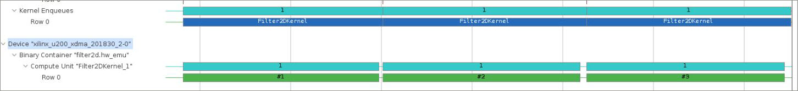
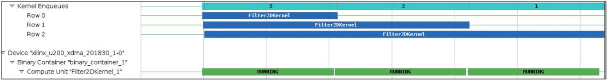
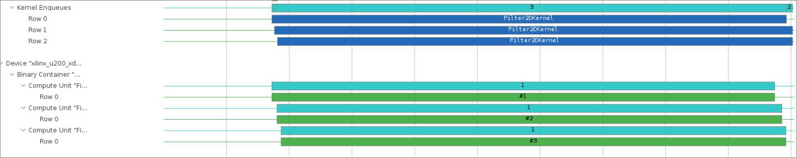

<table class="sphinxhide" width="100%">
 <tr width="100%">
    <td align="center"><h1>Hardware Acceleration Tutorials</h1>
    <a href="https://www.xilinx.com/products/design-tools/vitis.html">See Vitis™ Development Environment on xilinx.com</a>
    </td>
 </tr>
</table>

# Using Multiple Compute Units

***Version: Vitis 2023.1***

## Introduction

This tutorial demonstrates a flexible kernel linking process to increase the number of kernel instances on an FPGA. Each specified instance of a kernel is also known as a compute unit (CU). This process of increasing number of CU improves the parallelism in a combined host-kernel system.

## Tutorial Overview

By default, the AMD Vitis™ core development kit creates one CU for each kernel. A host program can use the same kernel multiple times for different sets of data. In these cases, it is useful to generate multiple CUs of the kernel to let those CUs run concurrently and improve the performance of the overall system.  

For more information, see [Creating Multiple Instances of a Kernel](https://docs.xilinx.com/r/en-US/ug1393-vitis-application-acceleration/Creating-Multiple-Instances-of-a-Kernel) in the Application Acceleration
Development flow of the Vitis Unified Software Platform Documentation (UG1416).

During this tutorial, you will:

1. Run hardware emulation and inspect the emulation report to identify multiple serial kernel executions.
2. Change the host code to enable out-of-order command executions.
3. Alter the kernel linking process to create multiple CUs of the same kernel.
4. Re-run the hardware emulation and confirm the parallel execution of the CUs.

This tutorial uses an image filter example to demonstrate the multiple CU feature. To keep this tutorial design simple, the host application uses random data for the pixel instead of a real image. By default, these three kernels run sequentially, using the same hardware resources because the FPGA only contains a single CU of the kernel. This tutorial demonstrates how to increase the number of CU, and then executing the kernel runs in parallel.

An OpenCV version of the host code is also provided in the source code directory `src/host/host_opencv.cpp`. However, the instructions to use the OpenCV version of the host code is not provided in this tutorial. The OpenCV version of the host-code can be used after installing OpenCV library and make necessary changes related to OpenCV settings in the `Makefile`. 

## Before You Begin

This tutorial uses:

* BASH Linux shell commands
* 2023.1 Vitis core development kit release and the *xilinx_u250_gen3x16_xdma_4_1_202210_1* platform.
If necessary, it can be easily extended to other versions and platforms.

>**IMPORTANT:**
>
>* Before to running any of the examples, make sure you have installed the Vitis core development kit as described in [Installation](https://docs.xilinx.com/r/en-US/ug1393-vitis-application-acceleration/Installation) in the Application Acceleration
Development flow of the Vitis Unified Software Platform Documentation (UG1416).
>* If you run applications on the AMD Alveo™ Data Center accelerator cards, ensure that the card and software drivers have been correctly installed by following the instructions on the [Alveo Portfolio page](https://www.xilinx.com/products/boards-and-kits/alveo.html).

### Accessing the Tutorial Reference Files

1. To access the reference files, enter the following in a terminal: `git clone http://github.com/Xilinx/Vitis-Tutorials`.
2. Navigate to `Hardware_Acceleration/Feature_Tutorials/05-using-multiple-cu` directory, and then access the `reference-files` directory.

## Makefile Flow

You can observe the Makefile used for this tutorial in `reference-files/Makefile`. The top-level settings include:

* **VPP**: Vitis compiler path to compile the kernel code.
* **EMCONFIGUTIL**: The path of the utility that creates emulation configuration file, `emconfig.json`.
* **DEVICE**: The target platform.
* **EXE_OPT**: The runtime options passed as command line arguments: Compiled kernel `xclbin` file.

### Run Hardware Emulation

Run hardware emulation with the following command.

   ```
   make run TARGET=hw_emu
   ```

For hardware emulation (`hw_emu`), the kernel code is compiled into a hardware model, which is run in a hardware simulator, while the rest of the system uses a C simulator. Building and running takes longer but provides a detailed, cycle-aware, view of kernel activity. This target is useful for testing the functionality of the logic that runs in the FPGA and for getting initial performance estimates.

>**NOTE:** For instructions on how to build the host software and hardware, refer to the [Vitis Getting Started](https://github.com/Xilinx/Vitis-Tutorials/tree/master/Getting_Started) tutorial.

### Inspect the Host Code

1. While the emulation run is executing, in another terminal, open the `src/host/host.cpp` file.

2. Inspect lines 234-236. You can see that the Filter function is called three times for the Y, U, and V channels.

   ```
   request[xx*3+0] = Filter(coeff.data(), y_src.data(), width, height, stride, y_dst.data());
   request[xx*3+1] = Filter(coeff.data(), u_src.data(), width, height, stride, u_dst.data());
   request[xx*3+2] = Filter(coeff.data(), v_src.data(), width, height, stride, v_dst.data());
   ```

   This function is described from line 78. Here, you can see kernel arguments are set, and the kernel is executed by the `clEnqueueTask` command.

   ```
    // Set the kernel arguments
    clSetKernelArg(mKernel, 0, sizeof(cl_mem),       &mSrcBuf[0]);
    clSetKernelArg(mKernel, 1, sizeof(cl_mem),       &mSrcBuf[1]);
    clSetKernelArg(mKernel, 2, sizeof(unsigned int), &width);
    clSetKernelArg(mKernel, 3, sizeof(unsigned int), &height);
    clSetKernelArg(mKernel, 4, sizeof(unsigned int), &stride);
    clSetKernelArg(mKernel, 5, sizeof(cl_mem),       &mDstBuf[0]);

   // Schedule the writing of the inputs
   clEnqueueMigrateMemObjects(mQueue, 2, mSrcBuf, 0, 0, nullptr,  &req->mEvent[0]);

   // Schedule the execution of the kernel
   clEnqueueTask(mQueue, mKernel, 1,  &req->mEvent[0], &req->mEvent[1]);
   ```

   All three `clEnqueueTask` commands are enqueued using a single in-order command queue (line 73). As a result, all the commands are executed sequentially in the order they are added to the queue.

   ```
   Filter2DDispatcher(
           cl_device_id     &Device,
           cl_context       &Context,
           cl_program       &Program )
     {
           mKernel  = clCreateKernel(Program, "Filter2DKernel", &mErr);
           mQueue   = clCreateCommandQueue(Context, Device, CL_QUEUE_PROFILING_ENABLE, &mErr);
           mContext = Context;
           mCounter = 0;
     }
   ```

### Emulation Result

Review the generated Timeline Trace report (`opencl_trace.csv`).

   ```
   vitis_analyzer xrt.run_summary
   ```

>**NOTE:** In the 2023.1 release, this command opens the Analysis view of the new Vitis Unified IDE and loads the run summary as described in [Working with the Analysis View](https://docs.xilinx.com/r/en-US/ug1393-vitis-application-acceleration/Working-with-the-Analysis-View). Navigate to the various reports using the left pane of the Analysis view or by clicking on the links provided in the summary report.

The run directory contains a file named `xrt.ini`. This file contains runtime options that generate additional reports such as the Profile Summary report and Timeline Trace.

   After the Vitis analyzer loads, click **Timeline Trace** located on the left side panel. The Application Timeline report collects and displays host and device events on a common timeline to help you understand and visualize the overall health and performance of your systems.

   * At the bottom of the timeline, you can see three blue bars, one for each kernel enqueing from the host. The host enqueues the kernel execution sequentially (in order) because it uses a single, in-order command queue.
   * After the blue bars, you can see three green bars, one for each kernel execution. They are working on the FPGA sequentially.
   

### Improve the Host Code for Concurrent Kernel Enqueuing

1. Edit the `src/host/host.cpp` host file to change line 73. Change this line to declare the command queue as an _out-of-order_ command queue.  

   Code before the change:
   ```
   mQueue   = clCreateCommandQueue(Context, Device, CL_QUEUE_PROFILING_ENABLE, &mErr);
   ```

   Code after the change:
   ```
   mQueue   = clCreateCommandQueue(Context, Device, CL_QUEUE_PROFILING_ENABLE | CL_QUEUE_OUT_OF_ORDER_EXEC_MODE_ENABLE, &mErr);
   ```

2. (*Optional*) Run the hardware emulation with the changed host code.

   If you choose to run the Hardware Emulation feature, use the Timeline Trace to observe that using the out-of-order queue enables the kernels requested to be executed at almost the same time as one another (the blue bars represent kernel enqueue requests scheduled by the host).  

   However, though the host scheduled all these executions concurrently, second and third execution requests are delayed as there is only one CU on the FPGA (the FPGA still executes the kernels sequentially).  
  
In the next step, increase the number of CU on the FPGA to allow three host kernel executions concurrently.

### Increasing the Number of CUs

Now, build the kernel xclbin again by altering the link step to generate three CUs of the same kernel.

Open the `link.cfg` file and change the `nk` setting.

```
nk = Filter2DKernel:3
```

### Run Hardware Emulation and Inspect the Change

1. Regenerate the `xclbin` file. You need to do `make clean` and `make` to delete the existing xclbin with one CU and to create a new xclbin with three kernel CUs.

   ```
   make clean
   make run TARGET=hw_emu
   ```

2. View the new `xrt.run_summary` in the Vitis analyzer.

  You can now see that the application takes advantage of the three CUs, and that the kernel executions overlaps and executes in parallel, speeding up the overall application.


## Conclusion

You have learned how to alter the kernel linking process to execute same kernel functions concurrently on an FPGA.
</br>
<hr/>
<p align="center" class="sphinxhide"><b><a href="/README.md">Return to Main Page</a></b></p>

<p class="sphinxhide" align="center"><sub>Copyright © 2020–2023 Advanced Micro Devices, Inc</sub></p>

<p class="sphinxhide" align="center"><sup><a href="https://www.amd.com/en/corporate/copyright">Terms and Conditions</a></sup></p>

