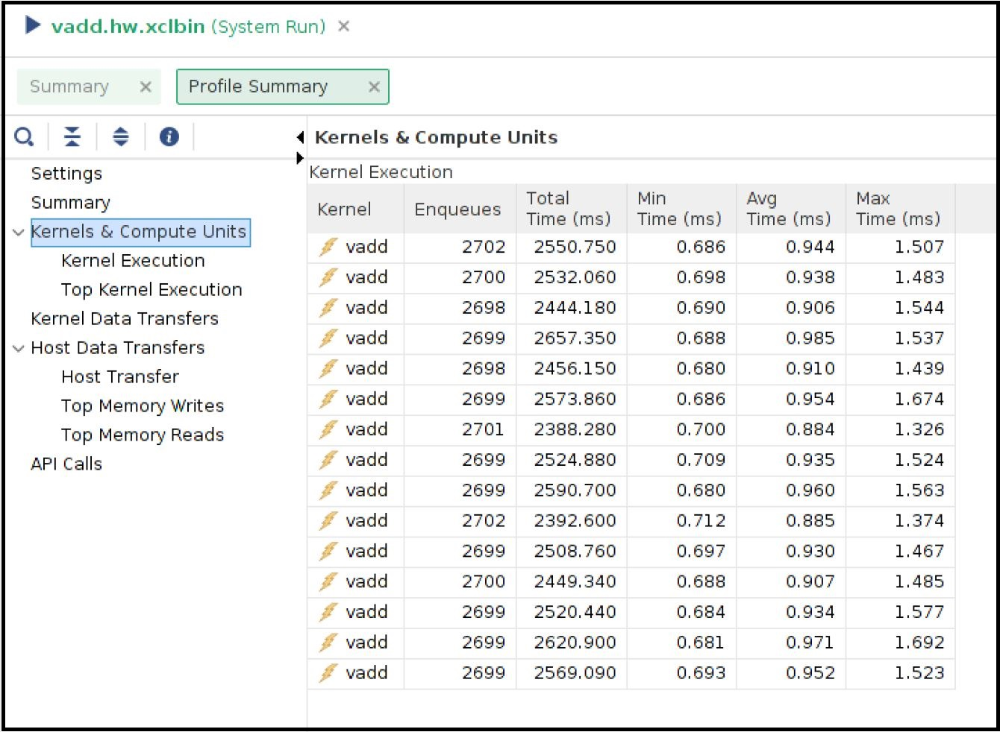
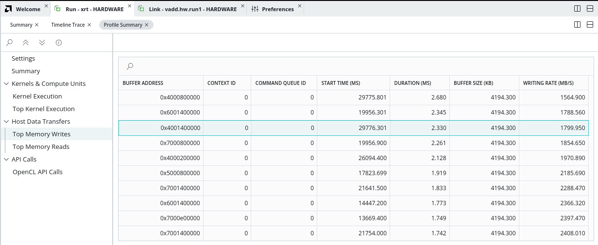
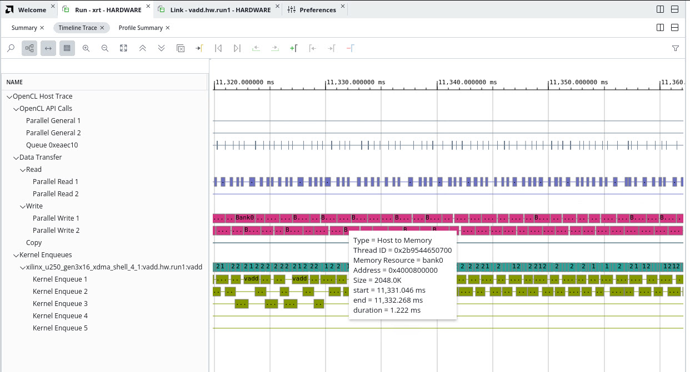
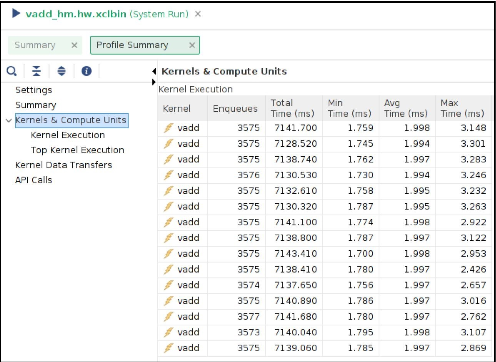
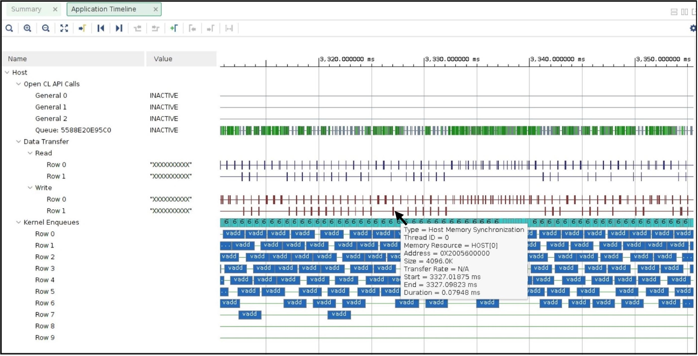

##############################################################################
Host Memory Access
##############################################################################

**Version:** Vitis 2023.1

Some of the recent Xilinx Platforms have an XDMA feature to bypass the DMA operation and allow the kernels to directly access the host memory. The direct host memory access provides an alternate data transfer mechanism compared to XDMA based data transfer and can be useful in some of the scenarios. 

- Custom kernel developers can use their already developed DMA engine as part of their kernel design. This specifically helps RTL kernel developers who are looking to reuse existing DMA IP. 
- A platform can be designed even without an XDMA, such as the latest U50-NoDMA platform, providing a thin fixed logic with more available FPGA resources for the user logic or kernels. 
- The data transfer burden can be freed from the host server. As a result, the host can spend time on other tasks that might even help in overall application performance. 

For more details about the host memory access feature, refer to `HM in XRT documentation <https://xilinx.github.io/XRT/master/html/hm.html>`_.

***********************************
XRT and Platform version
***********************************

The following XRT and U250 platform versions are used for this tutorial design.

**XRT Version**:    2023.1

**Platform**: xilinx_u250_gen3x16_xdma_4_1_202210_1   

***********************************
Tutorial Description
***********************************

This tutorial attempts to demonstrate a scenario where adopting a host memory access data transfer scheme helped to improve overall performance. This is not a full-fledged application, rather a small example showing potential performance benefit by letting direct host memory access by the kernels. 

A word of caution is that the performance numbers can greatly varied from one host server to another host server, so performance numbers demonstrated in this example should only be used as sample data that may not match when you are running this tutorial.  

Kernel structure
========================

This tutorial is created from a simple vector-add kernel. The vector-add kernel has 15 CUs on the FPGA. As the U250 card contains four SLRs, the 15 CUs are distributed in the following manner

============  =====================
 SLR           Number of CUs
============  =====================
 SLR0                4
 SLR1                3
 SLR2                4
 SLR3                4
============  =====================

Host code
========================
The functionality of the host code is described as below: 
    
- Creates dedicated 15 CU handles for 15 CUs
- Submits 15 CU execution requests 
- When a CU is finished, it is executed again. In this way, all 15 CUs kept running. 
- The above process continues for a certain time, in this example for 20 seconds. 
- After 20 seconds host code calculates the total number of completed CU executions. 
      
The greater number of CU executions in a given time interval signifies the more work done with increased throughput. 

As a side note, for brevity, the host code is simplified by using the same data input per CU execution. As the host code is solely focusing on CU execution, it is a simplified version without implementing other typical host functionalities such as verification of returned data from the CUs, error checking, etc.
 
Kernel compilation
========================

All the tutorial design files are self-contained inside the ``reference-files`` directory. 

This tutorial needs two kernel XCLBINs with different connectivities. 

- XCLBIN 1: All the AXI master ports are connected to DDR banks 
- XCLBIN 2: All the AXI master ports are connected to the host memory 
         
Note and compare the kernel link configuration files for the above two cases.  The kernel link configuration file is the only difference between the two kernel compilation flows. The top portion of the .cfg files (``./src/link.cfg`` and ``./src/link_hm.cfg``) is the same where 15 CUs are named and placed in different SLRs. However, the bottom half of the .cfg files are different as shown below

The bottom half of the v++ link file ``./src/link.cfg`` for DDR connected CUs

.. code:: 

   [connectivity]
   ....
   sp=vadd_1.m_axi_gmem:DDR[0]
   sp=vadd_2.m_axi_gmem:DDR[0]
   sp=vadd_3.m_axi_gmem:DDR[0]
   sp=vadd_4.m_axi_gmem:DDR[0]
   sp=vadd_5.m_axi_gmem:DDR[1]
   sp=vadd_6.m_axi_gmem:DDR[1]
   sp=vadd_7.m_axi_gmem:DDR[1]
   sp=vadd_8.m_axi_gmem:DDR[2]
   sp=vadd_9.m_axi_gmem:DDR[2]
   sp=vadd_10.m_axi_gmem:DDR[2]
   sp=vadd_11.m_axi_gmem:DDR[2]
   sp=vadd_12.m_axi_gmem:DDR[3]
   sp=vadd_13.m_axi_gmem:DDR[3]
   sp=vadd_14.m_axi_gmem:DDR[3]
   sp=vadd_15.m_axi_gmem:DDR[3]

The bottom half of the v++ link file ``./src/link_hm.cfg`` for host memory connected CUs

.. code:: 

   [connectivity]
   ....
   sp=vadd_1.m_axi_gmem:HOST[0]
   sp=vadd_2.m_axi_gmem:HOST[0]
   sp=vadd_3.m_axi_gmem:HOST[0]
   sp=vadd_4.m_axi_gmem:HOST[0]
   sp=vadd_5.m_axi_gmem:HOST[0]
   sp=vadd_6.m_axi_gmem:HOST[0]
   sp=vadd_7.m_axi_gmem:HOST[0]
   sp=vadd_8.m_axi_gmem:HOST[0]
   sp=vadd_9.m_axi_gmem:HOST[0]
   sp=vadd_10.m_axi_gmem:HOST[0]
   sp=vadd_11.m_axi_gmem:HOST[0]
   sp=vadd_12.m_axi_gmem:HOST[0]
   sp=vadd_13.m_axi_gmem:HOST[0]
   sp=vadd_14.m_axi_gmem:HOST[0]
   sp=vadd_15.m_axi_gmem:HOST[0]

The Makefile is using ``./src/link.cfg`` file by default. To build the DDR connected kernel XCLBIN simply do

.. code:: 

    make xclbin
    
Upon completion, you will get the XCLBIN file ``vadd.hw.run1.xclbin``. The Makefile specifies LAB=run1 as the default flow.

Next, to change v++ configuration file simply run LAB=run2 as shown below:

.. code::

    make xclbin LAB=run2
    
Upon completion, you will get the XCLBIN file ``vadd.hw.run2.xclbin``. 

Once you have two XCLBINs ready you can simply focus on running the application for the rest of this tutorial. 

***********************************
Running the application 
***********************************

**DDR Based Run**

You will start with the DDR-based application to see the result. 

Compile and run the host code

.. code:: 

      make exe
      ./host.exe vadd.hw.run1.xclbin

The run will take around 20+ seconds as this application is running for 20 seconds and counting the total number of CU executions during this time interval.  You will see an output similar below

.. code:: 
    
   Buffer Inputs 2 MB
   kernel[0]:2702
   kernel[1]:2699
   kernel[2]:2700
   kernel[3]:2700
   kernel[4]:2699
   kernel[5]:2702
   kernel[6]:2701
   kernel[7]:2699
   kernel[8]:2698
   kernel[9]:2699
   kernel[10]:2698
   kernel[11]:2699
   kernel[12]:2699
   kernel[13]:2699
   kernel[14]:2699
   Total Kernel execution in 20 seconds:40493

   Data processed in 20 seconds: 4MB*total_kernel_executions:161972 MB

   Data processed/sec (GBPs)= 8.0986 GBPs
   TEST SUCCESS

    
Please note that the number of exact kernel executions can be varied depending on the host server capability and you may see different numbers from the above. In the sample run above it shows that each CUs are executed almost same number of times (~2700) during the 20 second time interval. The total number of CU executions is around 40K. 

The host code also calculates the application throughput that depends on the number of total CU executions. As each CU processed 4MB of data the throughput of the application as calculated above is approximately 8GBPs

You will invoke the ``vitis_analyzer`` by using the .run_summary file. 

.. code::
    
    vitis_analyzer xrt.run_summary
    
In the Profile Report tab, select **Profile Summary** from the left panel followed by **Kernel and Compute Units** section. You can see all the CU and their execution numbers that you have already seen from the stdout from the host application run. The following snapshot also shows every CU's average execution time close to 1ms. 

You can also review the **Host Transfer** section that shows the transfer rate between Host and Global Memory. The host code is transferring 4 MB of data before every CU execution and transferring back 2 MB of data after every CU execution.

Now select the **Application Timeline** section from the left panel. The application timeline also shows the large data transfers initiated by the host server that supposed to keep the host server busy. As shown below hovering the mouse on one of the data transfers showing a typical DMA writes for 4MB data from the host is taking approximately 1ms.  

This is also interesting to note the number of parallel requests by the host to submit the CU execution commands. For example, the above Application timeline snapshot shows 4 such parallel execution command requests (under **Kernel Enqueues** Row 0, Row 1, Row 2, and Row 3). 

**Host Memory Based Run**

The host code used for the host memory-based run is ``host_hm.cpp``. The only host code change is specifying the buffers as host memory buffers as below. The host code sets ``cl_mem_ext_ptr_t.flag`` to ``XCL_MEM_EXT_HOST_ONLY`` to denote a host memory buffer. 

.. code:: c++

        cl_mem_ext_ptr_t host_buffer_ext;
        host_buffer_ext.flags = XCL_MEM_EXT_HOST_ONLY;
        host_buffer_ext.obj = NULL;
        host_buffer_ext.param = 0;

        in1 = clCreateBuffer(context,CL_MEM_READ_ONLY|CL_MEM_EXT_PTR_XILINX,bytes,&host_buffer_ext
        throw_if_error(err,"failed to allocate in buffer");
        in2 = clCreateBuffer(context,CL_MEM_READ_ONLY|CL_MEM_EXT_PTR_XILINX,bytes,&host_buffer_ext
        throw_if_error(err,"failed to allocate in buffer");
        io = clCreateBuffer(context,CL_MEM_WRITE_ONLY|CL_MEM_EXT_PTR_XILINX,bytes,&host_buffer_ext
        throw_if_error(err,"failed to allocate io buffer");

Before running the host memory-based application ensure that you have preconfigured and preallocated the host memory for CU access. For this testcase setting a host memory size of 1G is sufficient. 

.. code:: 
   
     sudo /opt/xilinx/xrt/bin/xbutil host_mem --enable --size 1G
     
Compile and run the host code

.. code:: 

      make exe LAB=run2
      ./host.exe vadd.hw.run2.xclbin

A sample output from the run as below

.. code::
   
      Buffer Inputs 2 MB
      kernel[0]:3575
      kernel[1]:3573 
      kernel[2]:3575
      kernel[3]:3577
      kernel[4]:3575
      kernel[5]:3575
      kernel[6]:3575
      kernel[7]:3575
      kernel[8]:3575
      kernel[9]:3576
      kernel[10]:3575
      kernel[11]:3575
      kernel[12]:3575
      kernel[13]:3574
      kernel[14]:3575
      Total Kernel execution in 20 seconds:53625

      Data processed in 20 seconds: 4MB*total_kernel_executions:214500 MB

      Data processed/sec (GBPs)= 10.725 GBPs
      TEST SUCCESS
     

As you can see from a sample run above the number of kernel executions has been increased in host memory setup thus increasing the throughput of the application to 10.7 GBPs
   
Open the vitis_analyzer using the newly generated ``.run_summary`` file. 

.. code::
    
    vitis_analyzer xrt.run_summary
    
In the **Kernel and Compute Units** section you can see average CU execution times are now increased compared to the DDR-based run. Now CU takes more time as accessing the remote memory on the host machine is always slower than accessing on-chip memory on the FPGA card.  However, increasing CU time is not appearing as an overall negative result as the number of CU executions is increased for each CU. In a host memory-based application, the host CPU is not performing any data transfer operation. This can free up CPU cycles which can then otherwise used to increase the overall application performance. In this example, the free CPU cycles helped in processing more CU execution requests resulting in more accomplished data processing within the same period. 

Unlike DDR-based applications, you cannot see the **Host Transfer** section inside the Profile report. As there are no data transfers initiated by the host machine, this report is not populated.  
 
You can review Application timeline as below

Hovering the mouse on one of the data transfers shows the type of Data transfer is **Host Memory Synchronization**. This signifies the data transfer is merely a cache synchronization operation from the host operation perspective. As this cache invalidate/flush is very fast it has very little overhead on the host machine. The snapshot also shows under the **Kernel Enqueues** section there are now a greater number of rows (ROW0 to ROW9) signifying the host is now able to submit more kernel execution requests in parallel.  

***********************************
Summary 
***********************************

In summary, you have reviewed the following takeaways in this tutorial

- Easy migration from a DDR based application to a host memory-based application  
     
1. Kernel linking switch change 
2. Host code change 
  
- Comparing and understanding Profile and Application timeline
- A host memory-based paradigm can help to eliminate the data transfer burden from the host. In some use cases this might help to boost overall application performance. 

-----------------------------------------------------

Copyright © 2020-2023 Advanced Micro Devices, Inc

`Terms and Conditions <https://www.amd.com/en/corporate/copyright>`_
