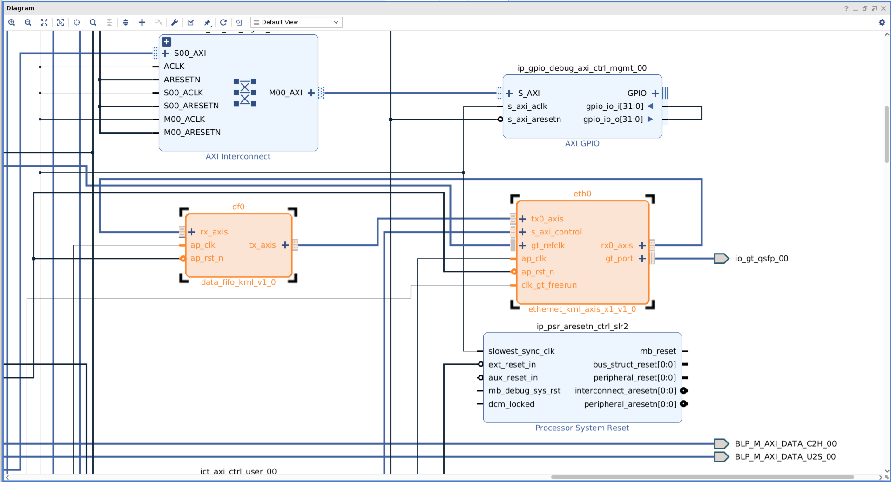

<table class="sphinxhide" width="100%">
 <tr>
   <td align="center"><h1>Vitis™ Application Acceleration Development Flow Tutorials</h1>
   </td>
 </tr>
 <tr>
 <td>
 </td>
 </tr>
</table>

# Using GT Kernel in Alveo with Vitis Flow

***Version: Vitis 2023.2***

The AMD Alveo™ Data Center accelerator cards provide networking connectivity such as one or two QSFP28 ports depending on the card. The QSFP28 interface can support a variety of Ethernet configurations including 10 GbE, 25 GbE, 40 GbE, and 100 GbE. Multiple instances of a single lane Ethernet protocol is also possible. With Vitis flow and the latest platforms, users can create register transfer level (RTL) kernels containing GTY transceivers, provide streaming connection to other kernels including high-level synthesis (HLS) compute units, datapath buffering into direct random access memory (DRAM) memories, and driver access for moving data between the host and FPGA by the Vitis tools to implement of full integrated design.

This simple tutorial illustrates the steps to include GTY transceivers in a RTL kernel and integrate it in top-level hardware overlay design with Vitis. The Alveo U200 card is used as example platform, and you could apply similar steps to other Alveo cards easily. Note the example design in this tutorial has no realistic functions and is just used for methodology explaination. Two lane number configurations (x1 and x4) are provided here.

To finish the example design steps in this tutorial, you will need at least two license keys: **xxv_eth_mac_pcs** and **x_eth_mac**. You can refer to [10G/25G Ethernet Subsystem Ordering Instructions](https://www.xilinx.com/products/intellectual-property/ef-di-25gemac/ef-di-25gemac-order.html) for more information.

## Features and Design Overview

The following figure shows a block diagram of the design, which consists of two RTL kernels:

* **ethernet_krnl_axis_x1/4**: This kernel includes one single-channel or four-channel 10G ethernet sub-system IP, one AXI control slave, and two or eight AXI stream data first in first out (FIFO) modules. The data to/from GT transciever is streamed to the AXI stream data FIFO and connected outside. The kernel use XRT *ap_ctrl_hs* execution model. The host program can control the ethernet IP via an AXI control slave.

* **data_fifo_krnl**: This kernel just includes two AXI stream data FIFO modules, which are connected together to form the loopback datapath to externel AXI stream ports. The kernel use XRT *ap_ctrl_none*.

In the top level hardware topology, these two or five kernels (depends on lane number) are stitched via an AXI stream connection. The AXI control slave of kernel **ethernet_krnl_axis_x1/4** is also connected to the platform. Necessary reset and clock signals including those for GT transceivers are connected to relevant resources provided by the platform.

As mentioned earlier, there is no meaningful functions from this design topology, so no host program code is provided.

## Design Flow and Tutorial Steps

First, see the following important files of this tutorial:

~~~
.
├── connectivity_x1/4.cfg                 Vitis linking configuration file
├── gen_ip_x1/4.tcl                       AMD Vivado™ script to generate IP                     
├── Makefile                              Makefile for every steps
├── pack_data_fifo_kernel.tcl             Vivado script to pack data fifo kernel
├── pack_eth_x1/4_kernel.tcl              Vivado script to pack ethernet kernel
└── rtl/                                  RTL sources code for two kernels
~~~

RTL wrapper files for these two kernels are provided in the `./rtl` directory. All steps are executed in command line interface, and the *Makefile* is used to control the flow. In the `Makefile`, the following lines designate Alveo U200 as the target card for the design, and you could modify this for other Alveo cards. Also, you can modify the lane number setting (default is 1).

~~~Makefile
# Target hardware setting, uncomment appropriate lines
BOARD    := u200
PLATFORM := xilinx_u200_gen3x16_xdma_2_202110_1
PART     := xcu200-fsgd2104-2-e
~~~

Now, enter the root path of the tutorial and go over the tutorial step by step.

### 1. Generate the IP

As explained previously, two IPs are needed in the design: ethernet sub-system (**xxv_ethernet**) and AXI stream FIFO (**axis_data_fifo**). They can be generated by either Vivado GUI mode or batch mode via Tcl script. Here you just use the following command to use the Vivado batch mode to generate them.

~~~
make gen_ip
~~~

This will start Vivado to execute the Tcl script `gen_ip.tcl`. The generated IP will reside in the created directory `ip_generation`. You can review the Tcl script to infer the dialog setting if using Vivado GUI mode. Note some setting for the IP **xxv_ethernet** is related to the target Alveo card you are using.

### 2. Package Kernels

Here because you have already got the RTL design files in the `./rtl` directory, you need to package them along with the IP (`.xci` files) into two Vitis kernels (`.xo` files). Again, you can use the Vivado GUI version of *IP packager* to finish the IP packaging, but you will use command line and Tcl scripts to finish this. Use following command to package the kernels, then two kernel files (`ethernet_krnl_axis_x1.xo` and `data_fifo_krnl.xo`) will be generated in currently for following Vitis linking jobs.

~~~
make pack_kernel
~~~

You can review Tcl scripts `pack_eth_kernel.tcl` and `pack_data_fifo_kernel.tcl` to get the kernel packaging setting, which corresponds to the Vivado GUI mode dialogs. In the packaging steps for ethernet kernel, you can see that in addition to standard AXI bus interfaces, two additional bus interfaces are created for later Vitis `v++` automatic connection feature: `gt_port` for GT transceivers data bus and `gt_refclk` for GT transceivers differential clock.

### 3. Vitis Linking

Here you use Vitis `v++` tool to finish hardware linking and generate the `.xclbin` file. Execute following command:

~~~
make build_hw
~~~

This will execute `v++` command with `connectivity_x1.cfg` as the linking configuration file. Find the following lines in the configuration file which instruct Vitis to connect GT transceivers specific signals for the **xilinx_u200_gen3x16_xdma_1_202110_1** platform.

~~~
# For xilinx_u200_gen3x16_xdma_1_202110_1 platform
connect=eth0/clk_gt_freerun:ss_ucs/aclk_kernel_00
connect=io_clk_qsfp_refclka_00:eth0/gt_refclk
connect=eth0/gt_port:io_gt_qsfp_00
~~~

If you are using other cards or platforms, the signal/port names might be different, and you need to modify this accordingly. You can refer to the platform information reported by the  `platforminfo` command for these platform specific GT signal/port naming. For example:

~~~
platforminfo -p xilinx_u200_gen3x16_xdma_1_202110_1 -v
~~~

After the `v++` linking job finishes, you can use the Vivado GUI to open the Vivado project `./_x/link/vivado/vpl/prj/prj.xpr`, then open the block design **ulp**. You can see that all the signals for the two kernels (with instance names **df0** and **eth0**), especially those GT transceivers signals have been connected correctly, like following screenshot.

When `v++` linking finishes, you will get the XCLBIN file `top_level.xclbin`. You could also use Vivado to open the project `./_x/link/vivado/vpl/prj/prj.xpr`, and open the finally implemented design to review the reports and silicon floorplan.

## Summary

Using GTY transceivers in an Alveo card with the Vitis flow is very simple and straightforward. You just need to handle it as ordinary RTL kernels with some extra configuration for GT transceivers specific signals. Vitis provides powerful and flexible capabilities to help you to finish the integration efficiently.

Copyright © 2020–2023 Advanced Micro Devices, Inc

<a href="https://www.amd.com/en/corporate/copyright">Terms and Conditions</a>

