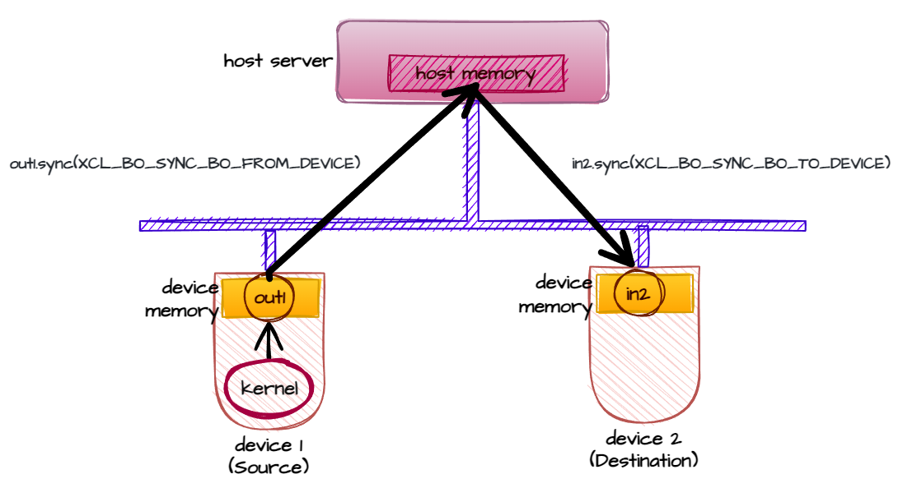
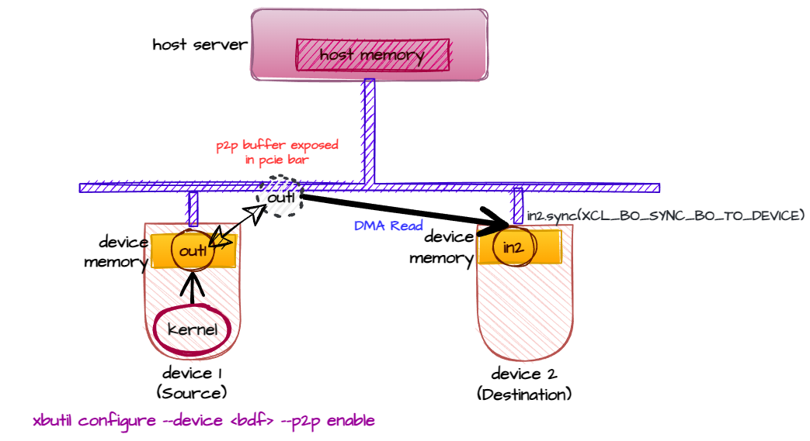
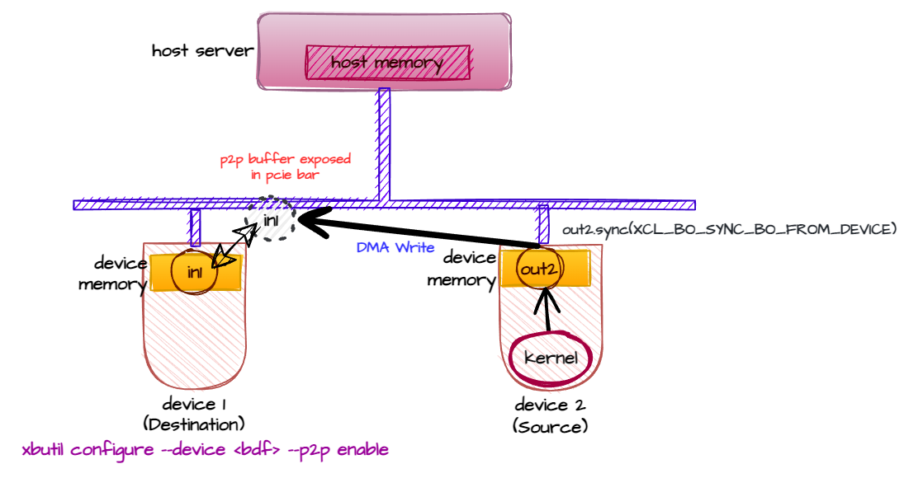

~~~~~~~~~~~~~~~~~~~~~~~~~~~~~~~~~~~~~~~~~~~~~~~~~~~~~~~~~~~
Enabling FPGA to FPGA P2P Transfer using Native XRT C++ API
~~~~~~~~~~~~~~~~~~~~~~~~~~~~~~~~~~~~~~~~~~~~~~~~~~~~~~~~~~~

**Version: Vitis 2023.1**

XRT and Platform Version
========================

The following XRT and platform versions are used for this tutorial design.

**XRT Version**: 2023.1

**Platform**: ``xilinx_u50_gen3x16_xdma_5_202210_1 and xilinx_u200_gen3x16_xdma_2_202110_1``

Introduction
============

This tutorial demonstrates how to enable p2p transfer from one FPGA device to another using XRT API host code. The following devices have been used to demonstrate the data transfer:

    - First Device: U50, used as a source 
    - Second Device: U200, used as a destination 
    
To transfer data from one device to another, only one device must support the p2p feature. The other device may or may not have the p2p feature. However, the other device must have a DMA engine. The fundamental mechanism of p2p transfer is stated as below:

  * One of the devices needs to expose its memory content into the PCIe® Bar (hence exercising p2p feature)
  * The other device can act either as a source device (writes directly to the first device's exposed memory location) or destination device (reads directly from the first device's exposed memory location), hence exercising DMA capability. 

In this tutorial, the p2p feature of only the source device is enabled. The destination device remains p2p-disabled. This setup is used throughout this tutorial to demonstrate how to transfer data between a p2p-enabled device and a device that does not support p2p (or p2p is kept disabled). The tutorial demonstrates the following workflow:

 - Transferring data from the source device to the destination device without p2p. At this time p2p is kept disabled on both devices. 
 - Changing the host-code to enable p2p transfer.
 - Changing the source device setting to enable p2p feature. The destination device will remain p2p disabled.
 - Transferring data from the source device to the destination device with p2p.

.. note:: The appendix demonstrates how to transfer the data in the reverse direction, i.e., source and destination devices will be swapped. However, the p2p setting will remain the same, thus p2p is enabled in destination device. This would demonstrate how to transfer data from a p2p unsupported device to a p2p supported device.

.. note:: Though not shown in this tutorial, you can enable p2p in both devices (assuming both devices support p2p), thus providing more coding flexibility for the host-code developer. A note explaining this has been added in the appendix. 

This tutorial has the following steps:

1. Understanding the original (non-p2p) version of the host code
2. Running original (non-p2p) version of the host code
3. Understanding the changes required to enable p2p transfer
4. Running the p2p version of the host code
5. Appendix: Understanding and reviewing the design to reverse dataflow direction with the same setup

Step 1: Understanding the Original (non-p2p) Version of the Host Code
=====================================================================

The first step is to understand the flow of data transfer using the non-p2p version of the host code ``host.cpp``. A simple increment kernel is used for the source device which takes an input buffer and generates an output buffer. 

   out1 = in1 + scalar 
   
The input buffer of the destination device is ``in2``. Data has to be transferred from ``out1`` to ``in2``. For that purpose, the mapped pointer of ``out1``, ``out1_ptr`` is used to create the buffer ``in2``. 

   **Fig 1**: Dataflow without p2p from source device to destination device using two buffers

.. code:: cpp

     // Output buffer of the device1
     auto out1 = xrt::bo(device1, vector_size_bytes, xrt::bo::flags::normal, krnl.group_id(1));
     //Mapped pointer
     auto out1_map = out1.map<int*>();
     //Input buffer of device2, created using mapped-pointer of device1's output buffer
     auto in2 = xrt::bo(device2, out1_map, vector_size_bytes, 0);

After the kernel on source device finishes its execution, the out1 buffer is updated inside the source device's global memory. In order to transfer the data into the destination device's global memory, the following DMA transfers are required:
   
    - DMA from source device global memory to host-memory by performing device-to-host sync on ``out1``
    - DMA from host memory to destination device global memory by performing host-to-device sync on ``in2``
      
.. code:: c++

    out1.sync(XCL_BO_SYNC_BO_FROM_DEVICE);
    in2.sync(XCL_BO_SYNC_BO_TO_DEVICE);

.. note:: This test case measures the throughput of the above two sync operations by executing them for a number of times. Similar throughput calculation in the p2p version of the design can be seen later in this tutorial. The throughput number can vary depending on the buffer size. Because the purpose of this tutorial is not to demonstrate a p2p performance, a small buffer is used. The throughput number can also widely vary depending on several hardware aspects such as:
    
    - PCIe slot used for two cards, whether the cards are under same switch
    - CPU architecture of the server, specifically how PCIe transactions are routed between root ports on the CPU busses
    - Whether DMA Read or DMA Write is used to transfer the p2p buffer content 

.. note:: This tutorial only shows data transfer from the source device to the destination device. After the data reaches the destination device's global memory, a kernel can be executed on the destination device to use the transferred data. However, the second kernel execution on the destination device is not shown in this tutorial. 

Finally, the test case shows the destination buffer (``in2``) content is checked for correctness. 

2. Running an Original (non-p2p) Version of the Design
=======================================================

1. Change the host code to pick the devices. In this tutorial, host code picks two devices by their BDF. 

   .. code:: c++
     :number-lines: 30

      auto device1_bdf= "0000:65:00.1"; // Device1 BDF, P2P should be enabled for this device
      auto device2_bdf= "0000:b3:00.1"; // Device2 BDF, This device doing DMA-READ or DMA-WRITE, P2P enablement is not required

   You must change the above lines to pick the right devices as per your setup. You may use ``xbutil examine`` which shows bdf of the devices. 

2. Load pre-built XCLBIN for the destination device. For the destination device, you can transfer the data without performing any operations, but you must load a kernel so that one or more memory banks become visible by runtime.

    You can run ``xbutil validate`` memory bandwidth test that loads a pre-built kernel so that all memory banks become visible by XRT
        
    .. code:: 
        
        xbutil validate --device 0000:b3:00.1 -r mem-bw
    
3. Compile the XCLBIN containing increment kernel for the source device.

    .. code::
    
        make xclbin

4. Compile the host-code

    .. code::
    
        make exe    

5. Execute the host-code

    .. code:: bash
    
       ./host.exe
   
   You will see an output like below

    .. code::

        Execution of the kernel on source device
        Buffer = 16384 Iterations = 1024
        Throughput= 0.39GB/s
        TEST PASSED
  
  
3. Understanding the Changes Required for p2p Transfer
=======================================================

The key essence of p2p is that the data is not needed to transfer from the source device to the host server. The destination device can directly DMA read through the PCIe bar. For that reason, the first sync operation, which is transferring the data from the source device to the host is not required. 

**Optional step**: You may try changing `host.cpp` by commenting out the first sync operation as shown below, compile and execute again:

.. code:: c++

       // out1.sync(XCL_BO_SYNC_BO_FROM_DEVICE);
       in2.sync(XCL_BO_SYNC_BO_TO_DEVICE);

You will see the test case fails. It is because p2p is not enabled yet, and hence transferring the data from source device to host remains a necessary step. 

Steps required for p2p Data Transfer
------------------------------------

To transfer the data through p2p, follow these steps: 

1. Enable the p2p of the source device.

    .. code:: 

        sudo /opt/xilinx/xrt/bin/xbutil configure --device 0000:65:00.1 --p2p enable
   
    After the warm reboot (``sudo reboot now``) check the p2p enablement status through ``xbutil examine``:
 
    .. code:: 

        xbutil examine -d 0000:65:00.1 -r platform

        ----------------------------------------------------
        1/1 [0000:65:00.1] : xilinx_u50_gen3x16_xdma_base_5
        ----------------------------------------------------
        Platform
            ...
            ...
            P2P Status             : enabled

2. Declare the source buffer ``out1`` as p2p buffer.
   
   The final p2p version of the host code is ``host_p2p.cpp``. There are only two differences:

   - Output buffer of the source device is declared as p2p buffer
    
        .. code:: c++ 
            
            auto out1 = xrt::bo(device1, vector_size_bytes, xrt::bo::flags::p2p, krnl.group_id(1));
   
   - Output buffer synchronization of the source device is commented out ``out1.sync(XCL_BO_SYNC_BO_FROM_DEVICE)``
   
        .. code:: c++

            for (int i = 0; i < loop; i++) {
                //out1.sync(XCL_BO_SYNC_BO_FROM_DEVICE);
                in2.sync(XCL_BO_SYNC_BO_TO_DEVICE);
            }

4. Running the p2p Version of the Design
========================================
    
1. Change the Makefile to pick ``host_p2p.cpp`` instead of ``host.cpp``

    .. code-block::
    
        #HOST_SRC := host.cpp
        HOST_SRC := host_p2p.cpp

2. Delete ``host.exe`` and recreate 

    .. code-block::
    
        rm -rf host.exe
        make app

3. Run as before

    .. code-block::

        ./host.exe

        Execution of the kernel on device1
        Buffer = 16384 Iterations = 1024
        Throughput= 0.78GB/s
        TEST PASSED

Appendix: Understanding and review7ing the Design to Reverse the Dataflow Direction with the Same Setup
========================================================================================================

This tutorial demonstrated transferring data from a p2p device to a non-p2p device (or p2p disabled device). The p2p-enabled device exposes its memory content to the PCIe and the non-p2p device exercises DMA-READ to transfer data directly from the PCIe Bus. 

   **Fig 2**: P2P Dataflow from p2p-enabled source device to destination device exercising DMA-Read of destination device

In case the data is needed to be transferred from a non-p2p device (or p2p disabled device) to p2p enabled device, the technique will almost remain the same. The p2p-enabled device still needed to expose its memory content to the PCIe bar, and the non-p2p device needed to exercise DMA-WRITE to send the data into the p2p device.

   **Fig 3**: P2P Dataflow from source device to p2p-enabled destination device exercising DMA-Write of source device

A sample test case doing p2p transfer by exercising DMA-WRITE is provided inside the directory ``reference-files/design2``. 

**DMA-Read vs DMA-Write**: If both the devices have p2p enabled, then the user has a choice whether to use DMA-READ or DMA-WRITE to transfer the p2p buffer or in other words which device's buffer to be declared as p2p. In that case transferring via DMA-WRITE can potentially show performance improvement over DMA-READ, hence you may choose the destination device's buffer to be declared as p2p. 

Support
=======

GitHub issues will be used for tracking requests and bugs. For questions go to `Forum <http://forums.xilinx.com/>`_.

-----------------------------------------------------

Copyright © 2020-2023 Advanced Micro Devices, Inc

`Terms and Conditions <https://www.amd.com/en/corporate/copyright>`_
