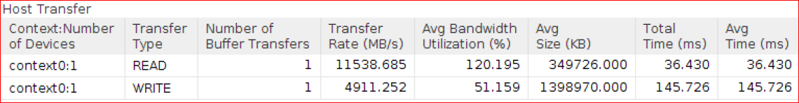

<table class="sphinxhide">
 <tr>
   <td align="center"><h1>2020.1 Vitis™ Application Acceleration Development Flow Tutorials</h1>
   <a href="https://github.com/Xilinx/Vitis-Tutorials/branches/all">See 2019.2 Vitis Application Acceleration Development Flow Tutorials</a>
   </td>
 </tr>
 <tr>
 <td>
 </td>
 </tr>
</table>

# Implementing the Kernel

In this lab, you will create an optimized kernel with 4, 8, and 16 words to be processed in parallel. All 100,000 documents worth 1.4 GB are sent from the host CPU to the kernel using a single buffer from the host CPU. 

## Bloom4x: Kernel Implementation Using 4 Words in Parallel

Processing 4 words in parallel will require 32-bits*4 = 128-bits in parallel, but you should access the DDR with 512-bits because the data is contiguous. This will require smaller number of memory accesses.

Use the following interface requirements to create kernel:

- Read multiple words stored in the DDR as a 512-bit DDR access, equivalent of reading 16 words per DDR access. 
- Write multiple flags to the DDR as a 512-bit DDR access, equivalent of writing 32 flags per DDR access.
- Compute 4 words to be computed in parallel with each word requiring two `MurmurHash2` functions 
- Compute the hash (two `MurmurHash2` functions) functions for 4 words every cycle. 

Refer to [Methodology for Accelerating Applications with the Vitis Software](https://www.xilinx.com/cgi-bin/docs/rdoc?v=2020.1;t=vitis+doc;d=methodologyacceleratingapplications.html) in the in the Application Acceleration Development flow of the Vitis Unified Software Platform Documentation (UG1416).

### Macro Architecture Implementation

Navigate to the function `runOnfpga` in `bloom/cpu_src/compute_score_fpga_kernel.cpp`.

The algorithm has been updated to receive 512-bits of words from the DDR with the following arguments:

- `input_words`: 512-bit input data.
- `output_flags`: 512-bit output data.
- Additional arguments:
  - `bloom_filter`: Pointer of array with Bloom coefficients.
  - Total number of words to be computed
  - `load_filter`: Enable or disable of loading coefficients. This only needs to be loaded one time.

1. The first step of the kernel development methodology requires structuring the kernel code into the Load-Compute-Store pattern. This means creating a top-level function, `runOnfpga` with:
    - Added sub-functions in the `compute_hash_flags_dataflow` for Load, Compute and Store.
    - Local arrays or `hls::stream` variables to pass data between these functions.
2. The source code has the following INTERFACE pragmas for `input_words`, `output_flags` and `bloom_filter`.

    ``` cpp
    #pragma HLS INTERFACE m_axi port=output_flags bundle=maxiport0   offset=slave 
    #pragma HLS INTERFACE m_axi port=input_words  bundle=maxiport0   offset=slave 
    #pragma HLS INTERFACE m_axi port=bloom_filter bundle=maxiport1   offset=slave 
    ```

      where:
      - `m_axi`: Interface pragmas are used to characterize the AXI Master ports.
      - `port`: Specifies the name of the argument to be mapped to the AXI4 interface.
      - `offset=slave`: Indicates that the base address of the pointer is made available through the AXI4-Lite slave interface of the kernel.
      - `bundle`: Specifies the name of the `m_axi` interface. In this example, the `input_words` and `output_flags` are mapped to a `maxiport0` and `bloom_filter` argument is mapped to `maxiport1`.
  
    The function `runOnfpga` loads the Bloom filter coefficients and calls the `compute_hash_flags_dataflow` function which has the main functionality of the Load, Compute and Store functions. 

    Refer to the function `compute_hash_flags_dataflow` in  the `bloom/cpu_src/compute_score_fpga_kernel.cpp` file. The following block diagram shows how the compute kernel connects to the device DDR memories and how it feeds the compute hash block processing unit. 

    

    The kernel interface to the DDR memories is an AXI interface that is kept at its maximum width of 512 at the input and output. The `compute_hash_flags` function input can have a width different than 512, managed through “PARALLELIZATION”. To deal with these variations on the processing element boundaries, "Resize" blocks are inserted that adapt between the memory interface width and the processing unit interface width. Essentially, blocks named "Buffer" are memory adapters that convert between streams, and the AXI and “Resize” blocks adapt to interface widths as it depends on PARALLELIZATION factor chosen for the given configuration.

3. The input of the `compute_hash_flags_dataflow` function, `input_words` are read as 512-bit burst reads from the global memory over an AXI interface and `data_from_gmem`, the stream of 512-bit values are created. 

    ```
    hls_stream::buffer(data_from_gmem, input_words, total_size/(512/32));
     ```

4. The stream of parallel words, `word_stream` (equals PARALLELIZATION words) are created from `data_from_gmem` as `compute_hash_flags` requires 128-bit for 4 words to process in parallel.

    ```
    hls_stream::resize(word_stream, data_from_gmem, total_size/(512/32));
    ```

5. The function `compute_hash_flags_dataflow` calls the `compute_hash_flags` function for computing hash of parallel words.  

6. With `PARALLELIZATION=4`, the output of the `compute_hash_flags`, `flag_stream` is 4*8-bit = 32-bit parallel words, which will be used to create the 512-bit values of stream as `data_to_mem`. 

    ```
    hls_stream::resize(data_to_gmem, flag_stream, total_size/(512/8));
    ```

7. The stream of 512-bit values, `data_to_mem` is written as 512-bit values to the global memory over an AXI interface using `output_flags`.
  
    ```
    hls_stream::buffer(output_flags, data_to_gmem, total_size/(512/8));
    ```

8. The `#pragmas HLS DATAFLOW` is added to enable task-level pipelining. This enables DATAFLOW and will instruct the Vitis High-Level Synthesis (HLS) compiler to run all the functions simultaneously, creating a pipeline of concurrently running tasks.

    ```cpp
    void compute_hash_flags_dataflow(
          ap_uint<512>*   output_flags,
          ap_uint<512>*   input_words,
          unsigned int    bloom_filter[PARALLELIZATION][bloom_filter_size],
          unsigned int    total_size)
    {
    #pragma HLS DATAFLOW

        hls::stream<ap_uint<512> >    data_from_gmem;
        hls::stream<parallel_words_t> word_stream;
        hls::stream<parallel_flags_t> flag_stream;
        hls::stream<ap_uint<512> >    data_to_gmem;
        . . . . 
    }
    ```

### Micro Architecture Implementation

Now that you have the top-level function, `runOnfpga` updated with the proper datawidths and interface types, you need to identify the loops to optimize to improve latency and throughput.

1. The `runOnfpga` function reads the Bloom filter coefficients from the DDR using `maxiport1` and saves the coefficients into the `bloom_filter_local` local array. This only needs to be read one time.

    ```cpp
      if(load_filter==true)
      {
        read_bloom_filter: for(int index=0; index<bloom_filter_size; index++) {
        #pragma HLS PIPELINE II=1
        unsigned int tmp = bloom_filter[index];
        for (int j=0; j<PARALLELISATION; j++) {
        bloom_filter_local[j][index] = tmp;
      }
    ```

    - `#pragma HLS PIPELINE II=1` is added to initiate the burst DDR accesses and read the Bloom filter coefficients every cycle.
    - The expected latency is about 16,000 cycles because the `bloom_filter_size` is fixed to 16,000. You should confirm this after you run HLS Synthesis.
2. Within the `compute_hash_flags` function, the `for` loop is rearchitected as nested for the loop to compute 4 words in parallel. 

    ```cpp
    void compute_hash_flags (
        hls::stream<parallel_flags_t>& flag_stream,
        hls::stream<parallel_words_t>& word_stream,
        unsigned int                   bloom_filter_local[PARALLELISATION][bloom_filter_size],
        unsigned int                   total_size)
        {
          compute_flags: for(int i=0; i<total_size/PARALLELISATION; i++)
          {
            #pragma HLS LOOP_TRIPCOUNT min=1 max=10000
            parallel_words_t parallel_entries = word_stream.read();
            parallel_flags_t inh_flags = 0;

            for (unsigned int j=0; j<PARALLELISATION; j++)
            {
              #pragma HLS UNROLL
              unsigned int curr_entry = parallel_entries(31+j*32, j*32);
              unsigned int frequency = curr_entry & 0x00ff;
              unsigned int word_id = curr_entry >> 8;
              unsigned hash_pu = MurmurHash2(word_id, 3, 1);
              unsigned hash_lu = MurmurHash2(word_id, 3, 5);
              bool doc_end= (word_id==docTag);
              unsigned hash1 = hash_pu&hash_bloom;
              bool inh1 = (!doc_end) && (bloom_filter_local[j][ hash1 >> 5 ] & ( 1 << (hash1 & 0x1f)));
              unsigned hash2=(hash_pu+hash_lu)&hash_bloom;
              bool inh2 = (!doc_end) && (bloom_filter_local[j][ hash2 >> 5 ] & ( 1 << (hash2 & 0x1f)));

              inh_flags(7+j*8, j*8) = (inh1 && inh2) ? 1 : 0;
            }

            flag_stream.write(inh_flags);
        }
    }
    ```

    - Added `#pragma HLS UNROLL`
        - Unrolls internal loop to make four copies of the Hash functionality.
    - Vitis HLS will try to pipeline the outer loop with `II=1`. With the inside loop unrolled, you can initiate the outer loop every clock cycle, and compute 4 words in parallel.
    - Added `#pragma HLS LOOP_TRIPCOUNT` min=1 max=3500000`
        - Reports the latency of the function after HLS Synthesis.

### Build the Kernel Using the Vitis Tool Flow

Now, build the kernel using the Vitis compiler. The Vitis compiler will call the Vitis HLS tool to synthesize the C++ kernel code into an RTL kernel. You will also review the reports to confirm if the kernel meets the latency/throughput requirements for your performance goals.

1. Use the following command to build the kernel.

    ```
    cd $LAB_WORK_DIR/makefile; make build STEP=single_buffer PF=4 TARGET=hw_emu
    ```

    This command will call the `v++` compiler which then calls the Vitis HLS tool to translate the C++ code into RTL code that can be used to run Hardware Emulation.

   >**NOTE**: For purposes of this tutorial, the number of input words used is only 100 because it will take a longer time to run the Hardware Emulation. 

2. Then, use the following commands to visualize the HLS Synthesis Report in the Vitis analyzer.

    ```
    vitis_analyzer ../build/single_buffer/kernel_4/hw_emu/runOnfpga_hw_emu.xclbin.link_summary
    ```

     

    - The `compute_hash_flags` latency reported is 875,011 cycles. This is based on total of 35,000,000 words, computed with 4 words in parallel. This loop has 875,000 iterations and including the `MurmurHash2` latency, the total latency of 875,011 cycles is optimal.
    - The `compute_hash_flags_dataflow` function has `dataflow` enabled in the Pipeline column. This function is important to review and indicates that the task-level parallelism is enabled and expected to have overlap across the sub-functions in the `compute_hash_flags_dataflow` function.
    - The latency reported for `read_bloom_filter` function is 16,385 for reading the Bloom filter coefficients from the DDR using the `bloom_filter maxi` port. This loop is iterated over 16,000 cycles reading 32-bits data of from the Bloom filter coefficients.

3. The HLS reports confirm that the latency of the function meets your target. You still need to ensure the functionality is correct when communicating with the host. In the next section, you will walk through the initial host code and run the software and hardware emulation.

### Review the Initial Host Code

The initial version of the accelerated application code structure follows the structure of the original software version. The entire input buffer is transferred from the host to the FPGA in a single transaction. Then, the FPGA accelerator performs the computation. Finally, the results are read back from the FPGA to the host before being post-processed.

The following figure shows the sequential process of the host writing data on the device, compute by the accelerator on the FPGA, and read flags back to host, implemented in this first step. The Profile score is calculated sequentially on CPU after all the flags are received by the host. 

  

The FPGA accelerator computes the hash values and flags for the provided input words.

The functionality of the different inputs passed to the accelerator kernel is as follows:

* `input_doc_words`: Input array that contains the 32-bit words for all the documents.
* `bloom_filter`: Bloom filter array that contains the inserted search array hash values.
* `total_size`: Unsigned `int` that represents the total size processed by the FPGA when called.
* `load_weights`: Boolean that allows the `bloom_filter` array to load only once to the FPGA in the case of multiple kernel invocations.

The output of the accelerator is as follows:

* `output_inh_flags`: Output array of 8-bit outputs where each bit in the 8-bit output indicates whether a word is present in the Bloom filter, that is then used for computing score in the CPU.

### Run Software Emulation, Hardware Emulation and Hw

1. To ensure the application passes Software Emulation with your changes, run the following command.

   ``` 
   cd $LAB_WORK_DIR/makefile; make run STEP=single_buffer TARGET=sw_emu 
    ```

    Make sure that the Software Emulation is passing.

2. Next, to verify the functionality is intact, use the following command to run Hardware Emulation.

    ```
    cd $LAB_WORK_DIR/makefile; make run STEP=single_buffer TARGET=hw_emu 
    ```

    - The commands show that the SIMULATION is PASSED. This ensures that the generated hardware is functionally correct. However, you have not run the hardware on the FPGA. .
  
   > **NOTE**: This tutorial is provided with `xclbin` files in the `$LAB_WORK_DIR/xclbin_save` directory. The `SOLUTION=1` option can be added to the make target for using these `xclbin` files for `hw` runs. These `xclbin` files were generated for Alveo U200 cards only. You must generate new `xclbin` files for every platform used in this tutorial.

4. Run the following steps to execute the application on hardware. 

    You are using 100,000 documents compute on the hardware.

    ```
    cd $LAB_WORK_DIR/makefile; make run STEP=single_buffer ITER=1 PF=4 TARGET=hw
    ```

    * If you are using an `xclbin` provided as part of solution in this tutorial, then use the following command.

      ```
      cd $LAB_WORK_DIR/makefile; make run STEP=single_buffer ITER=1 PF=4 TARGET=hw SOLUTION=1
      ```

    * To use four words in parallel, `PF=4` will set the PARALLELIZATION macro to 4 in `$LAB_WORK_DIR/reference_files/compute_score_fpga_kernel.cpp`. 
    * `ITER=1` indicates buffer sent using single iteration (using a single buffer).

     The following output displays.

      ```
     Loading runOnfpga_hw.xclbin
      Processing 1398.903 MBytes of data
        Running with a single buffer of 1398.903 MBytes for FPGA processing
    --------------------------------------------------------------------
      Executed FPGA accelerated version  |   838.5898 ms   ( FPGA 447.964 ms )
    Executed Software-Only version     |   3187.0354 ms
    --------------------------------------------------------------------
    Verification: PASS
      ```

    - Total FPGA time is 447 ms. This includes the host to DDR transfer, Total Compute on FPGA and DDR to host transfer. 
    - Total time of computing 100,000 documents is about 838 ms.

At this point, review the Profile reports and Timeline Trace to extract information, such as how much time it takes to transfer the data between host and kernel and how much time it takes to compute on the FPGA.

### Visualize the Resources Utilized

Use the Vitis analyzer to visualize the HLS Synthesis Report. You will need to build the kernel without `SOLUTION=1` to `generate link_summary` as this is not provided as part of tutorial. You can skip this step as well. 

``` 
vitis_analyzer $LAB_WORK_DIR/build/single_buffer/kernel_4/hw/runOnfpga_hw.xclbin.link_summary
```

The HLS Synthesis Report shows the number of LUTs, REG, and BRAM utilized for the Bloom4x kernel implementation.

 

### Review Profile Reports and Timeline Trace

Use the Vitis analyzer to visualize the `run_summary` report.

  ``` 
  vitis_analyzer $LAB_WORK_DIR/build/single_buffer/kernel_4/hw/runOnfpga_hw.xclbin.run_summary
   ```

The Profile Summary and Timeline Trace reports are useful tools to analyze the performance of the FPGA-accelerated application.

### Review Profile Summary Report

* *Kernels & Compute Unit: Kernel Execution* indicates that the Total Time by kernel enqueue is about 292 ms.

     

    - 4 words in parallel are computed. The accelerator is architected at 300 MHz. In total, you are computing 350,000,000 words (3,500 words/document * 100,000 documents).
    - Number of words/(Clock Freq * Parallelization factor in kernel) = 350M/(300M*4) = 291.6 ms. The actual FPGA compute time is almost same as your theoretical calculations.

*  *Host Data Transfer: Host Transfer* shows that the Host Write Transfer to DDR is 145 ms and the Host Read Transfer to DDR is 36 ms.
   

    - Host Write transfer using a theoretical PCIe bandwidth of 9GB should be 1399 MB/9GBps = 154 ms 
    - Host Read transfer using a theoretical PCIe bandwidth of 12GB should be 350 MB/12 GBps = 30 ms 
    - Reported number indicates that the PCIe transfers are occurring at the maximum bandwidth 

* *Kernels & Compute Unit: Compute Unit Stalls* confirms that there are almost no "External Memory Stalls" 
   

### Review the Timeline Trace

  The Timeline Trace shows the data transfer from the host to the FPGA and back to the host as they appear. The Timeline Trace can be visualized so that the transfer from the host to the FPGA and the FPGA compute and transfer from the FPGA to host occur sequentially.

   

  - There is a sequential execution of operations starting from the data transferred from the host to the FPGA, followed by compute in the FPGA and transferring back the results from the FPGA to the host. 
  - At any given time, either the host or FPGA has access to the DDR. In other words, there is no memory contention between the host and kernel accessing the same DDR. 
  - Using a single buffer will create a kernel itself with lowest latency and most optimized performance.

### Throughput Achieved

Based on the results, the throughput of the application is 1399 MB/838 ms = approx 1.66 GBs. This is your first attempt to run the application on hardware, and you have four times the performance results compared to the software-only version.

### Opportunities for Performance Improvements

Because there is no external memory access contention for accessing memory, this is the best possible performance for the Kernel computing four words in parallel.

* The kernel is reading 512-bits of data, but only 128-bits are used to compute 4 words in parallel. The kernel has the potential to compute more words because you have resources available on the FPGA. You can increase the number of words to be processed in parallel and can experiment with 8 words and 16 words in parallel. 
* Also note, even though the kernel is operating at its best performance, the kernel has to wait until the complete transfer is done by the host. Usually, it is recommended that you send a larger buffer from the host to DDR, but a very large buffer will add a delay before the kernel can start, impacting overall performance.

You will continue this lab and create a kernel with 8 words to be computed in parallel. In the next lab, [Analyze Data Movement Between Host and Kernel](./5_data-movement.md), you will experiment with splitting the buffer into multiple chunks, and observe how this affects the performance later in this tutorial.

## Bloom8x: Kernel Implementation Using 8 Words in Parallel

For config Bloom4x, you read 512-bit input values from the DDR and computed 4 words in parallel which uses only 128-bit input values. This steps enables you to run 8 words in parallel.

You can achieve this by using `PF=8` on the command line. Use the following steps to compute 8 words in parallel.

### Run Hardware on the FPGA 

Use the following command to run the hardware on the FPGA.

```
cd $LAB_WORK_DIR/makefile; make run STEP=single_buffer ITER=1 PF=8 
```

The following output displays.

```
Single_Buffer: Running with a single buffer of 1398.903 MBytes for FPGA processing
--------------------------------------------------------------------
 Executed FPGA accelerated version  |   739.4475 ms   ( FPGA 315.475 ms )
 Executed Software-Only version     |   3053.9516 ms
--------------------------------------------------------------------
 Verification: PASS
```

- The Total FPGA time is 315 ms. This includes the Host to DDR transfer, Total Compute on FPGA and DDR to Host transfer. 
- As expected, when computing 8 words in parallel, the total FPGA Time that includes the data transfer between the host and device, has reduced from 447 ms to 315 ms.

### Visualize the Resources Utilized

Use the Vitis analyzer to visualize the HLS Synthesis Report. You will need to build the kernel without `SOLUTION=1` to generate link_summary; this is not provided as part of tutorial. You can skip this step. 

``` 
vitis_analyzer $LAB_WORK_DIR/build/single_buffer/kernel_8/hw/runOnfpga_hw.xclbin.link_summary
```

From the HLS Synthesis Report, you can see that the number of resources increased for LUTs, REG, and BRAM compared to the Bloom4x kernel implementation.

 

### Review Profile Summary Report and Timeline Trace

Use the Vitis analyzer to visualize the run_summary report.

```
vitis_analyzer $LAB_WORK_DIR/build/single_buffer/kernel_8/hw/runOnfpga_hw.xclbin.run_summary
```

Review the profile reports and compare the metrics with configuration Bloom4x

1. *Kernels & Compute Unit:Kernel Execution* reports 146 ms compared to the 292 ms. This is exactly half the time as now 8 words are computed in parallel instead of 4 words. 
2. *Host Data Transfer: Host Transfer* section reports the same delays.
3. The overall gain in the application overall gain is only because that kernel now is processing 8 words in parallel compared to 4 words in parallel.

    

### Throughput Achieved

- Based on the results, the throughput of the application is 1399 MB/739 ms = approximately 1.9 GBs. You have now 4x performance results compared to software-only version.

## Bloom16x : Kernel Implementation Using 16 Words in Parallel

In the previous step, you read 512-bit input values from the DDR and computed 8 words in parallel. You can compute 16 words in parallel by setting `PF=16` on the command line. Use the following steps to compute 16 words in parallel.

### Run Hardware on the FPGA 

```
cd $LAB_WORK_DIR/makefile; make run STEP=single_buffer ITER=1 PF=16
```

The following output displays.

```
Processing 1398.903 MBytes of data
 Single_Buffer: Running with a single buffer of 1398.903 MBytes for FPGA processing
--------------------------------------------------------------------
 Executed FPGA accelerated version  |   694.6162 ms   ( FPGA 270.275 ms )
 Executed Software-Only version     |   3052.5701 ms
--------------------------------------------------------------------
 Verification: PASS
 ```

As previous steps, you can also review profile and timeline trace reports. This is left out as an homework exercise. 

### Opportunities for Performance Improvements

In this lab, you focused on building on an optimal kernel with 4, 8 and 16 words in parallel using a single buffer and reviewed the reports. As you observed from the Timeline Report that the kernel cannot start until the whole buffer is transferred to the DDR, which is about 145 ms when the single buffer is used. This is a substantial time delay considering the `Kernel execution time` is even smaller than the total host transfer time.

## Next Steps

In the next lab, you [explore sending documents in multiple buffers](./5_data-movement.md) rather than sending all of the documents at once from the host and explore how this improves the overall application performance. You will also use the configuration `Bloom8x` kernel and `Bloom16x` kernel for exploration in the next step.

<hr/>
<p align="center" class="sphinxhide"><b><a href="/docs/vitis-getting-started/README.md">Return to Getting Started Pathway</a> — <a href="docs/bloom/README.md">Return to Start of Tutorial</a></b></p>

<p align="center" class="sphinxhide"><sup>Copyright&copy; 2020 Xilinx</sup></p>
