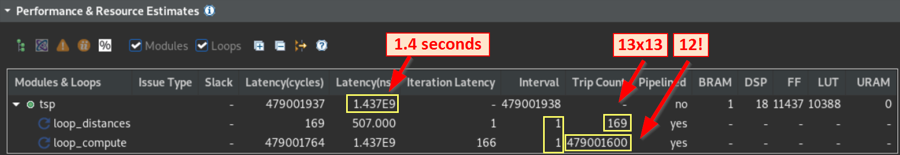


> **In this section...**   
Perform C synthesis to create an RTL representation of the design and discuss the compiler hints (pragmas) used... 

<table width=100%>
 <tr width=50%>
    <td align="center"><h2>2020.2 Vitis™ - The Traveler Salesman Problem - Tutorial</h2>
    <a href="https://www.xilinx.com/products/design-tools/vitis.html">See Vitis™ Development Environment on xilinx.com</a>
    </td>
 </tr>
</table>

## Run Vitis HLS C Synthesis
In the previous phase, the C simulation, the code execution was purely C based and although special libraries are used for streams, no RTL was yet involved.
In C synthesis, the top function `tsp` is analyzed and compiled based on the hints (called pragma or directives) passed to the HLS compiler.  Once the operations are scheduled and mapped onto hardware constructs, the final code is generated in RTL (with both Verilog and VHDL).

The code uses 3 of these "hints":
- `PIPELINE`: Requests execution of the main loop (labeled `loop_compute`) at each clock cycle as specified by the `II=1` option
- `INLINE`: Dissolves a sub-function for better optimization results.  This is used for the `compute` function
- `INTERFACE`: Specifies a protocol for a given top function argument.  This is optional and only to demonstrate how AXI-Stream can be added to an HLS stream
- `BIND_STORAGE`: Assigns an array to a specific type of on-chip memory.  Here the `distance` array is mapped onto a RAM with 1 write port and multiple read ports to allow simultaneous access to multiple city to city distances and calculate the full route quicker

Open `tsp.h` and set `N` to **13** for the number of cities: from the `tsp.cpp` file, you could hover the mouse over the `#include "tsp.h"` and press CTRL while clicking.  This would open `tsp.h` in the Vitis HLS GUI.

To run HLS synthesis from the GUI:  
Use the same shortcut as we used for C simulation earlier and select 'Run C Synthesis' or...  
Via the main menu, `Project` -> `Run C Synthesis` - > `C Synthesis`

Once synthesis has completed, the main window shows "Performance and Resource Estimates":  
(collapse the "General Information" and "Timing Estimates" sections by clicking on their title to make more room if necessary)   
  
This "Performance and Resource Estimates" section shows a table in which we see the main function `tsp` and the main loops and since we gave them a label in the source code it's easy to know which they are.  
- The full latency for the `tsp` function is 479,001,957 (close to half a billion clock cycles) mainly contributed by `loop_compute`
- That latency of 479,001,600 is exactly factorial 12 (12!) which corresponds to the the scenario with 13 cities (N=13) given that the first city (the route starting point) is fixed, so the permutations are applied on the 12 remaining cities.

## Next

* [Run the RTL/C cosimulation](./cosim.md)
