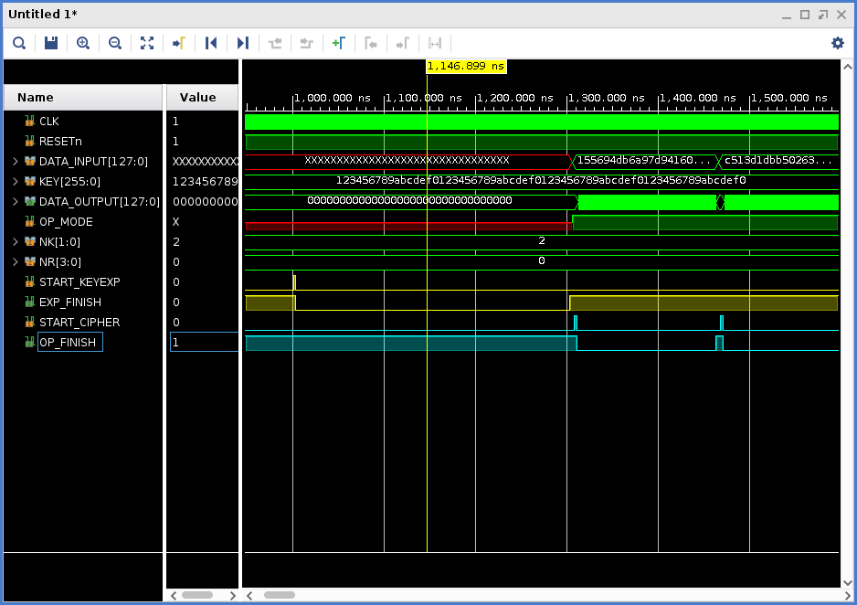

# RTL Module: Aes

## About the AES Encryption Algorithm

The AES algorithm is a commonly used symmetric-key encryption algorithm, meaning that the same key is used for both encrypting and decrypting the data. The input and output data blocks for the AES algorithm are 16-bytes blocks (128-bits). AES has three key length types: 128-bit, 192-bit, and 256-bit. Before AES encryption and encryption operation, a operation called key-expansion must be run when a key is given. The AES algorithm includes lots of bit-wise and byte-wise operations, so it is very suitable to be implemented with the hardware accelerator.

<div align="center">

</div>

In applications, AES has five widely used usage models:

 * Electronic codebook (ECB)
 * Cipher block chaining (CBC)
 * Cipher feedback (CFB)
 * Output feedback (OFB)
 * Counter (CTR)

In this tutorial, we only involve ECB and CBC. The following figures provide explanations for these models.
**Notes**: Figures are from Wikipedia ([wikipedia.org](wikipedia.org)).

#### AES-ECB Encryption
<div align="center">

</div>

#### AES-ECB Decryption
<div align="center">

</div>

#### AES-CBC Encryption
<div align="center">

</div>

#### AES-CBC Decryption
<div align="center">

</div>

## RTL Module Aes

The RTL module ```Aes``` is the core module of AES encryption/decryption module. It uses native RTL ports interface. You can find the Verilog source code in the **~/aes/rtl** directory. The signal descriptions are as follows.

|Name       |Width (bits)   |Direction  |Description|
|----       |----           |----       |----       |
|CLK        |1              |in         |Clock input|
|RESETn     |1              |in         |Active low reset input|
|DATA_INPUT |128            |in         |Input data block for encrytion or decryption|
|KEY        |256            |in         |AES key for encryption or decryption, when using 128/192 bit key, aligned to MSB (complement 0s to LSB)|
|DATA_OUTPUT|128            |out        |Output data block for encryption or decryption|
|NK         |2              |in         |AES Key length: 2'b00=128bit, 2'b01=192bit, 2'b10=256bit|
|NR         |4              |in         |Reserved, tie to 4'b0000 for common AES operation|
|START_CIPHER|1             |in         |When given one cycle active high trigger, cipher operation is executed (encryption or decryption).|
|START_KEYEXP|1             |in         |When given one cycle active high trigger, AES key expansion operation is executed.|
|OP_FINISH  |1              |out        |When the encryption or decryption job is in progress, OP_FINISH will keep low. OP_FINISH will keep high in idle state.|
|EXP_FINISH |1              |output     |When the key expansion job is in progress, EXP_FINISH will keep low. EXP_FINISH will keep high in idle state.|

## Testbench

A simple native Verilog testbench is provided in the **~/aes/tbench** directory. The testbench uses a pre-generated random dataset by a Perl script as the stimulus, and the output result is compared with the reference dataset generated by the OpenSSL utility. The shell script **~/aes/runsim_aes_xsim.sh** is used to generate the input stimulus and output reference, and to run the simulation with Vivado XSIM.

## Usage

A Makefile is provided here to run the simulation. Use following command to run the Verilog simulation:

```
cd ~/aes
make runsim
```

The simulation is executed with 256 input words (128-bit) along with pre-defined KEY. You can modified the simulation options in the **~/aes/runsim_aes_xsim.sh** file. After simulation finishes, a waveform dump file called **work.tb_aes.wdb** is generated, in which you can view the interface waveform. The following image shows an example interface waveform.

<div align="center">

</div>

---

Now that you have the necessary information about the Aes module, you can start to add the necessary AXI interfaces and IPs to make it a usable kernel for the Vitis flow. This is described in the next section: [RTL Kernel: krnl_aes](./krnl_aes.md).
