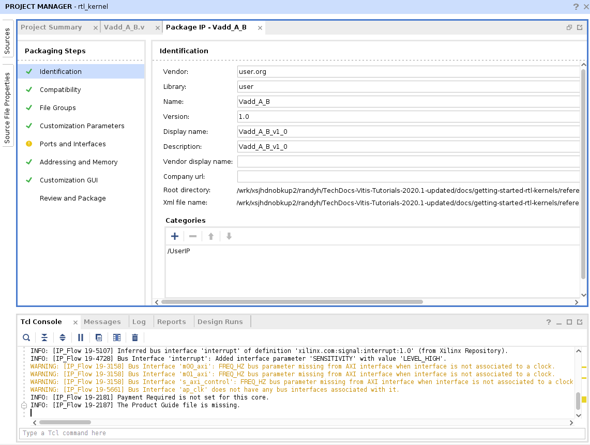

<table class="sphinxhide">
 <tr>
   <td align="center"><h1>2020.1 Vitis™ Application Acceleration Development Flow Tutorials</h1>
   <a href="https://github.com/Xilinx/Vitis-Tutorials/branches/all">See 2019.2 Vitis Application Acceleration Development Flow Tutorials</a>
   </td>
 </tr>
 <tr>
 <td>
 </td>
 </tr>
</table>

# Package IP/Package XO Flow

The process described in this lab follows the Package IP/Package XO flow as described in the [RTL Kernel Development Flow](https://www.xilinx.com/cgi-bin/docs/rdoc?v=2020.1;t=vitis+doc;d=devrtlkernel.html;a=rzv1504034325561) in the Application Acceleration Development flow of the Vitis Unified Software Platform Documentation (UG1416).

>**IMPORTANT:** Before running the tutorial commands, you must set up the tool environment by running the following commands, as described in [Setting up the Vitis Environment](https://www.xilinx.com/cgi-bin/docs/rdoc?v=2020.1;t=vitis+doc;d=vhc1571429852245.html) in the Application Acceleration Development flow of the Vitis Unified Software Platform Documentation (UG1416).
>
>   ```bash
>    #setup Xilinx Vitis tools. XILINX_VITIS and XILINX_VIVADO will be set in this step.
>    source <VITIS_install_path>/settings64.sh
>    #Setup Xilinx runtime. XILINX_XRT will be set in this step.
>    source <XRT_install_path>/setup.sh
>   ```

## Create a New Project

1. To launch the Vivado®  IDE, enter the `vivado` command in a terminal window.
2. Select **Create Project**, or  **File** > **Project** > **New**.

   The New Project wizard opens.
3. Click **Next**.
4. On the Project Name page of the New Project wizard, make the following selections:
   1. Specify a **Project name**, such as `rtl_kernel`, a **Project location**.
   2.  Enable the **Create project subdirectory** checkbox.
   3. Click **Next**.
5. On the Project Type page, make the following selections:  
   1. Select **RTL Project**
   2. Enable the **Do not specify sources at this time** checkbox.
   3. Click **Next**.
6. On the Default Part page select **Boards**, and enter `U200` in the Search field. 
      1. Select **Alveo U200 Data Center Accelerator Card**, and click **Next** to proceed.

      The New Project Summary page is displayed.
7. Examine it for details of the project, and click **Finish** to create the project.

   The Vivado IDE opens with the new project.

     

## Add Kernel Sources

You are ready to add RTL files into the project to package as an IP. The RTL files have been provided for you in this tutorial, but this is the point at which you would insert your own RTL code.

1. In the Sources view, click the **Add Sources** command (). The Add Sources window is displayed.
2. Click **Add or create design sources**, and then click **Next**.
3. Click **Add Directories**, browse to `reference-files/src`, and select the `IP` directory (which contains the RTL sources).

    >**NOTE**: To add your own RTL IP, specify the required folder or files.

     

4. Select the **Copy sources into project** and **Add sources from subdirectories**.
5. Click **Finish**.

   The files are added to the project, and the Vivado Design Suite automatically identifies the `Vadd_A_B.v` file as the top level of the design. This RTL module has an interface which is compatible with the **Hardware Interface Requirements** for RTL kernels as discussed in the [Introduction](./README.md). This can be seen in the `Vadd_A_B` module definition by double-clicking the file in the Sources view to open it in a Code Editor window.

   ````
   module Vadd_A_B #(
     parameter integer C_S_AXI_CONTROL_ADDR_WIDTH = 12 ,
     parameter integer C_S_AXI_CONTROL_DATA_WIDTH = 32 ,
     parameter integer C_M00_AXI_ADDR_WIDTH       = 64 ,
     parameter integer C_M00_AXI_DATA_WIDTH       = 512,
     parameter integer C_M01_AXI_ADDR_WIDTH       = 64 ,
     parameter integer C_M01_AXI_DATA_WIDTH       = 512
   )
   ````

## Open the IP Packager

With the files added to your project, you can package the IP for use as a kernel.

1. To start this process, select **Tools** > **Create and Package New IP**.
2. Click **Next**.
3. Select **Package your current project**, and click **Next**.
4. For IP location, take a look at the default location so you can see where your IP will be packaged. The specified location will be needed when running the `package_xo` command in a later step.
5. Click **Next**. 
   The Create and Package IP summary page is displayed. 
     

6. Examine the summary and click **Finish** to proceed. 

   The Package IP window is displayed.

     

## Edit Ports and Interfaces

1. Under Packaging Steps, select **Ports and Interfaces**. This displays the Ports and Interfaces window. 
2. Right-click the `m00_axi` interface and select **Associate Clocks**.

   The Associate Clocks dialog box displays the list of available clocks. In this case there is just the `ap_clk` interface to associate with the AXI interface. 

3. Select `ap_clk` and click **OK**.
4. Repeat the process to associate `ap_clk` with the `m01_axi` interface, the `s_axi_control` interface.

   Next you will add `FREQ_HZ` parameter to `ap_clk`. 

5. Expand the **Clock and Reset Signals** in the Ports and Interfaces window. 
      1. Right-click the `ap_clk` interface and select the **Edit Interface** command. This displays the Edit Interface dialog box. 
      2. Select the **Parameters** tab. 
      3. Expand the **Requires User Setting** category on the left side of the dialog box, select the `FREQ_HZ` parameter, and select the **Move selected parameters to the right** command, as shown in the following figure. 

     

   6. Click **OK** to close the Edit Interface dialog box.
6. The RTL kernel also requires the `value_resolve_type` property on the `FREQ_HZ` parameter to define how the tool should resolve value conflicts. In the Tcl Console, use the following command to define the property with a value of `user`.
 
   ```
   set_property value_resolve_type user [ipx::get_bus_parameters -of [::ipx::get_bus_interfaces -of [ipx::current_core] *clk*] "FREQ_HZ"]
   ```

## Add Control Registers and Address Offsets 

You must also add the control registers and address offsets for the interfaces in the design. This can be done through the Addressing and Memory section of the Package IP window.  This requires a number of control registers to be added with the following attributes.

Name | Description | Offset | Size (bits)
-----|-------------|--------|-----
CTRL | Control Signals | 0x000 | 32
GIER | Global Interrupt Enable Register | 0x004 | 32
IP_IER | IP Interrupt Enable Register | 0x008 | 32
IP_ISR | IP Interrupt Status Register | 0x00C | 32
scalar00 | Scalar values | 0x010 | 32
A | pointer argument | 0x018 | 64
B | pointer argument | 0x024 | 64

1. Under Packaging Steps, select **Addressing and Memory**. 
   This displays the Addressing and Memory window. 
2. Under Address Blocks, right-click **reg0** and select **Add Reg**.
3. Enter the name of the register in the Add Register dialog box, and click **OK**.

   >**TIP:** You will need to add registers for CTRL, GIER, and all the registers listed in the table above. You can also use the following Tcl commands in the Vivado Tcl Console to add the needed registers:
   >
   ```
      ipx::add_register CTRL [ipx::get_address_blocks reg0 -of_objects [ipx::get_memory_maps s_axi_control -of_objects [ipx::current_core]]]
      ipx::add_register GIER [ipx::get_address_blocks reg0 -of_objects [ipx::get_memory_maps s_axi_control -of_objects [ipx::current_core]]]
      ipx::add_register IP_IER [ipx::get_address_blocks reg0 -of_objects [ipx::get_memory_maps s_axi_control -of_objects [ipx::current_core]]]
      ipx::add_register IP_ISR [ipx::get_address_blocks reg0 -of_objects [ipx::get_memory_maps s_axi_control -of_objects [ipx::current_core]]]
      ipx::add_register scalar00 [ipx::get_address_blocks reg0 -of_objects [ipx::get_memory_maps s_axi_control -of_objects [ipx::current_core]]]
      ipx::add_register A [ipx::get_address_blocks reg0 -of_objects [ipx::get_memory_maps s_axi_control -of_objects [ipx::current_core]]]
      ipx::add_register B [ipx::get_address_blocks reg0 -of_objects [ipx::get_memory_maps s_axi_control -of_objects [ipx::current_core]]]
      ```

   After adding the registers to the Addressing and Memory window (as shown in the following figure), you will need to add the descriptions, offset, and size to the registers. 

    

4. For each register, click in the **Description** field of the register and enter the description from the table above. 
5. Click in the **Address Offset** field and enter the offset. 
6. Click in the **Size** field and enter the field.

   >**TIP:** Description is optional, but Offset and Size are required.

   After completing the addition of the various registers and their attributes in accordance with the table above, you must also assign an M_AXI interface to each of the pointer arguments. 

7. Select register `A` in the Registers table, and right-click and select **Add Register Parameter**. 
   1. In the Add Register Parameter dialog box, add the ASSOCIATED_BUSIF parameter, and click **OK**.  
      This parameter associates the bus interface with the register.
   2. Repeat the prior two steps for register `B`.
   3. In the Value field for ASSOCIATED_BUSIF enter `m00_axi` for register `A`, and `m01_axi` for register `B`.

## Check Integrity, Assign Properties, and Package IP

1. Under the Packaging Steps, Select **Review and Package**. 
   This displays the Review and Package window.

3. Use the following commands in the Tcl Console to add these properties.

    ```
    set_property xpm_libraries {XPM_CDC XPM_MEMORY XPM_FIFO} $core
    set_property sdx_kernel true $core
    set_property sdx_kernel_type rtl $core
    ```

4. After setting these properties you can optionally rerun the **check_integrity** command, and your IP should pass the check. 

   You are now ready to package the IP. However, first check that an archive file will be generated when packaging the IP. 
5. Look in the After Packaging section of the Review and Package window. If you see that an archive will not be generated, then you should enable the archive: 

6. In the Review and Package window, select **Edit packaging settings**.This displays the Settings dialog box with the IP Package section displayed.
7. Under the After Packaging section of the dialog box, enable **Create archive of IP** as shown below, and click **OK**.

     

   You should see the Review and Package window change to reflect that an archive will now be created.

7. Click **Package IP**. 

## Create the Kernel with package_xo

With the Vivado IP packaged, you can now run the **package_xo** command to create the Vitis kernel (`.xo`) file. The `package_xo` command also packages the IP files and the `kernel.xml` file into the generated `.xo` file. 

1. In the Tcl Console, enter the following command.

   ```
   package_xo  -force -xo_path <tutorial_path>/reference-files/rtl_kernel/rtl_kernel.srcs/sources_1/imports/Vadd_A_B.xo -kernel_name Vadd_A_B -ip_directory <tutorial_path>/reference-files/rtl_kernel/rtl_kernel.srcs/sources_1/imports/IP
   ```

   Where: 
   * **package_xo**: Command name to create a compiled object file (.xo) from the Vivado IP. 
   * -**force**: overwrites existing kernel file if one exists. 
   * -**xo_path**: Path and name of the xo file
   * -**kernel_name**: Name of the kernel to create, and should match the RTL module name. 
   * -**ip_directory**: Path to look for the packaged Vivado IP. 

   >**TIP:** The `package_xo` command also has a -`kernel_xml` option to specify an existing `kernel.xml` file if desired. 

2. After the package_xo command returns, navigate to the `reference-files/rtl_kernel/rtl_kernel.srcs/sources_1/imports` folder and look at the `Vadd_A_B.xo` file. You can use this file in Vitis application acceleration flow as explained later in this tutorial.

## Next Steps

Next, you will work through the [RTL Kernel Wizard Flow](./vitis_ide.md) flow. This recreates the Vitis kernel (`.xo`) file you just created, but you will use an alternative approach.
</br>
<hr/>
<p align="center" class="sphinxhide"><b><a href="/README.md">Return to Main Page</a> — <a href="./README.md">Return to Start of this Tutorial</a></b></p>

<p align="center" class="sphinxhide"><sup>Copyright&copy; 2020 Xilinx</sup></p>

