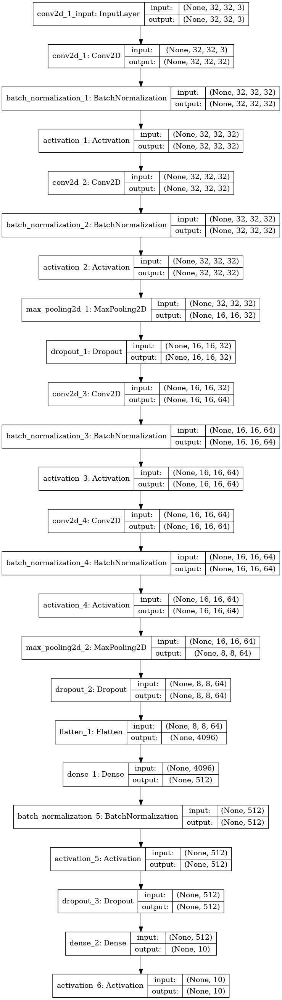
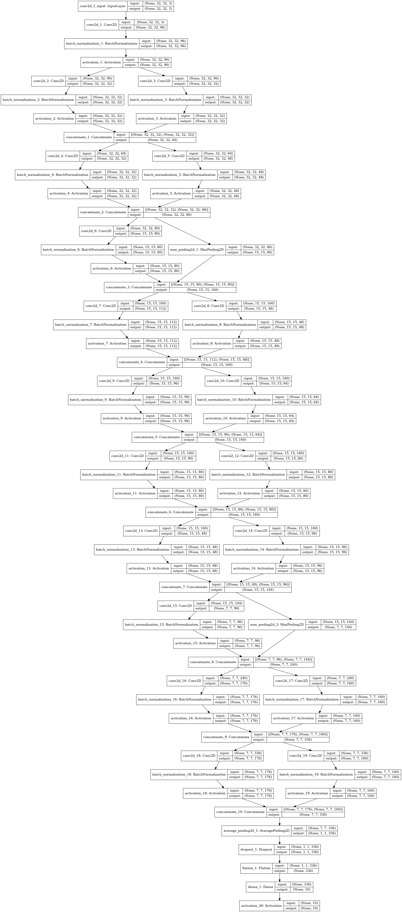
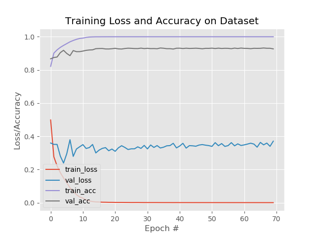
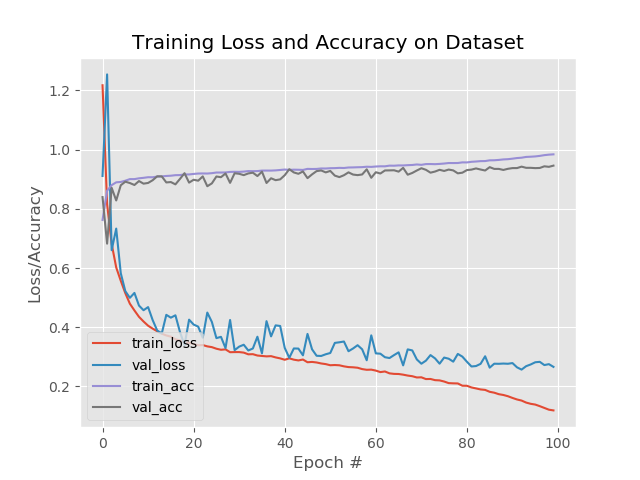
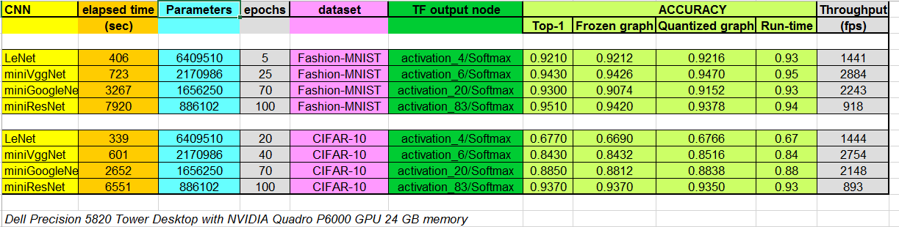

<div style="page-break-after: always;"></div>
<table style="width:100%">
  <tr>
    <th width="100%" colspan="6"><h1>Deep Learning with Custom GoogleNet and ResNet in Keras and Xilinx Vitis AI</h1>
</th>
  </tr>
</table>
</div>

### Current status

1. Tested with Vitis AI 1.2

2. Tested in hardware on ZCU102 and ZCU104


# 1 Introduction

In this Deep Learning (DL) tutorial, you will quantize in fixed point some custom Convolutional Neural Networks (CNNs) and deploy them on the Xilinx&reg; [ZCU102](https://www.xilinx.com/products/boards-and-kits/ek-u1-zcu102-g.html) or [ZCU104](https://www.xilinx.com/products/boards-and-kits/zcu104.html) boards using [Vitis AI](https://developer.xilinx.com/en/get-started/ai.html), which is a set of optimized IP, tools libraries, models and example designs valid for AI inference on both Xilinx edge devices and Alveo cards.

This tutorial includes:
- four custom CNNs, from the simplest ``LeNet`` and ``miniVggNet`` to the intermediate ``miniGoogleNet`` and the more complex ``miniResNet``, as described in the [custom_cnn.py](files/code/custom_cnn.py) file;
- two different datasets, ``Fashion-MNIST`` and ``CIFAR-10``, each one with 10 classes of objects.

Once the selected CNN has been correctly trained in Keras, the [HDF5](https://www.hdfgroup.org/solutions/hdf5/) file of weights is converted into a TF checkpoint and inference graph file, such frozen graph is then quantized by the Vitis AI Quantizer that creates an INT8 ``pb`` file from which the Vitis AI Compiler generates the ``elf`` file of micro instructions for the Deep Processor Unit (DPU) of the Vitis AI platform. The final C++ application is executed at run time on the ZCU102 target board, which is the default one adopted in this tutorial, see the Appendix for the ZCU104. The top-1 accuracy of the predictions computed at run time is measured and compared with the simulation results.

# 2 Prerequisites

- An Ubuntu 16.04 host PC with Python 3.6  and its package ``python3.6-tk`` installed (this last one installed with ``sudo apt-get install python3.6-tk``);

- [Vitis AI stack release 1.2](https://github.com/Xilinx/Vitis-AI) from [www.github.com/Xilinx](https://www.github.com/Xilinx). In particular, refer to the [Vitis AI User Guide UG1414 v1.2](https://www.xilinx.com/support/documentation/sw_manuals/vitis_ai/1_2/ug1414-vitis-ai.pdf) for the installation guidelines and note that you need to download the container available from [docker hub](https://hub.docker.com/r/xilinx/vitis-ai/tags) with tag ``vitis-ai:1.2.82``. Note also that UG1414 explains how to build your own container with GPU support;

- Vitis AI Evaluation board [ZCU102](https://www.xilinx.com/products/boards-and-kits/ek-u1-zcu102-g.html) with its [image file](https://www.xilinx.com/bin/public/openDownload?filename=xilinx-zcu102-dpu-v2020.1-v1.2.0.img.gz), which contains a pre-built working design for the ZCU102 with the [DPU-v2](https://github.com/Xilinx/Vitis-AI/tree/master/DPU-TRD).

- Familiarity with Deep Learning principles.


### Dos-to-Unix Conversion

In case you might get some strange errors during the execution of the scripts, you have to pre-process -just once- all the``*.sh`` shell and the python ``*.py`` scripts with the [dos2unix](http://archive.ubuntu.com/ubuntu/pool/universe/d/dos2unix/dos2unix_6.0.4.orig.tar.gz) utility.


### Vitis AI 1.0

If you need to use the older Vitis AI 1.0 release, just replace this ``README.md`` file with the one placed in the subfolder
``vai_1v0`` and go on in following the instructions on that file


# 3 Before starting with Vitis AI 1.2

In the following of this document, it is assumed that you have cloned the [Vitis AI stack release 1.2](https://github.com/Xilinx/Vitis-AI) in your working directory ``<WRK_DIR>``, for example a folder named ``~/ML/Vitis-AI-1v2``.

To list the currently available docker images run:
```bash
docker images # to list the current docker images available in the host pc
```
and you should see something like in the following text:
```text
REPOSITORY            TAG                               IMAGE ID            CREATED             SIZE
xilinx/vitis-ai-gpu   latest                            1bc243fc037a        41 minutes ago      19GB
xilinx/vitis-ai       1.1.56                            798f6eaea389        3 months ago        9.5GB
xilinx/vitis-ai       tools-1.0.0-gpu                   544c80c56313        3 months ago        20.7GB
xilinx/vitis-ai       runtime-1.0.0-cpu                 af058b4c48b3        7 months ago        11.9GB
```

To launch the docker container with Vitis AI tools - to do all the steps from CNN training to generation of the ELF file for the DPU - based on CPU (or GPU), execute the following commands from the ``<WRK_DIR>`` folder:

```bash
cd <WRK_DIR> # you are now in Vitis_AI subfolder
./docker_run.sh xilinx/vitis-ai-gpu:latest
```

Note that the container maps the shared folder ``/workspace`` with the file system of the Host PC from where you launch the above command, which is ``<WRK_DIR>`` in your case.
This shared folder enables you to transfer files from the Host PC to the docker container and vice versa.

The docker container do not have any graphic editor, so it is recommended that you work with two terminals and you point to the same folder, in one terminal you use the docker container commands and in the other terminal you open any graphic editor you like.

Note that docker does not have an automatic garbage collection system as of now. You can use this command to do a manual garbage collection:
```
docker rmi -f $(docker images -f "dangling=true" -q)
```


## 3.1 Install Missing Packages on the Vitis AI Tools Container

This tutorial requires some packages that were not included in the original Vitis AI tools container. Here are the commands to include such packages:
```bash
./docker_run.sh xilinx/vitis-ai-gpu:latest     
sudo su # you must be root
conda activate vitis-ai-tensorflow # as root, enter into Vitis AI TF (anaconda-based) virtual environment
conda install seaborn
conda install pycairo==1.18.2
conda install keras==2.2.4
# you cannot install next packages with conda, so use pip instead
pip install imutils==0.5.1
conda deactivate
exit # to exit from root
conda activate vitis-ai-tensorflow # as normal user, enter into Vitis AI TF (anaconda-based) virtual environment
```

Note that if you exit from the current Docker Vitis AI tools image you will lose all the installed packages, so to save all changes in a new docker image open a new terminal and run the following commands:

```bash
sudo docker ps -l # To get the Docker CONTAINER ID
```
you will see the following text (the container ID might have a different number):

```text
CONTAINER ID        IMAGE                        COMMAND                CREATED             STATUS              NAMES
7c9927375b06        xilinx/vitis-ai-gpu:latest   "/etc/login.sh bash"   30 minutes ago      Up 30 minutes       heuristic_lamport
```
now save the modified docker image:

```bash
sudo docker commit -m"comment" 7c9927375b06 xilinx/vitis-ai-gpu:latest
```

Assuming you have renamed this project ``VAI-Keras-GoogleNet-ResNet`` and placed it in the directory named ``<WRK_DIR>/tutorials/`` so that it is two levels below the ``Vitis-AI-1v2`` folder, you can launch the modified tools container by running the following commands:
```bash
cd <WRK_DIR>
./docker_run.sh xilinx/vitis-ai-gpu:latest
cd /workspace/tutorials/VAI-Keras-GoogleNet-ResNet
conda activate vitis-ai-tensorflow
```

## 3.2 Target Board SD Card and Cross-compilation Environment

The [README.md](https://github.com/Xilinx/Vitis-AI/tree/master/mpsoc/README.md) document contains all the necessary information to to prepare the SD card content of your target board and to setup the cross-compilation environment.


Once you have executed all the instructions, you should see on your target board terminal something as illustrated in the screenshot of Figure 1:


*Figure 1: Screenshot of ZCU102 terminal with folders copied from the runtime container.*

Note  that the folder [target_zcu102/common](files/target_zcu102/common) of this repository is a copy of the folder [mpsoc/vitis_ai_dnndk_samples/common](https://github.com/Xilinx/Vitis-AI/tree/master/mpsoc/vitis_ai_dnndk_samples/common), just for your comfort.

Starting from Vitis AI 1.1 release there is no more Docker Runtime Container, and you can cross compile the ``elf`` files directly from the Xilinx ``petalinux`` environment on your host PC to the target board.
In the following of this tutorial it is assumed that ``petalinux`` is installed into ``/opt/petalinux/2020.1`` of your host PC.


# 4 The Main Flow

The main flow is composed of seven major steps. The first six steps are executed from the tools container on the host PC by launching one of the scripts [run_all.sh](files/run_all.sh). The seventh step can be executed directly on the target board.
Here is an overview of each step:


1. Organize the data into folders, such as ``train`` for training, ``val`` for validation during the training phase, ``test`` for testing during the inference/prediction phase, and ``cal`` for calibration during the quantization phase, for each dataset. See [Organize the Data](#41-organize-the-data) for more information. From the host PC, run the following command:
```bash
source ./0_generate_images.sh # generate images of both datasets
```
2. Train the CNNs in Keras and generate the HDF5 weights model. See [Train the CNN](#42-train-the-cnn) for more information. From the host PC, run the following  commands:
```bash
source ./1_fmnist_train.sh  #only for Fashion-MNISTxilinx/vitis-ai-gpu             latest
source ./1_cifar10_train.sh #only for CIFAR-10
```
3. Convert into TF checkpoints and inference graphs. See [Create TF Inference Graphs from Keras Models](#43-create-tf-inference-graphs-from-keras-models) for more information. From the host PC, run the following  commands:
```bash
source ./2_fmnist_Keras2TF.sh
source ./2_cifar10_Keras2TF.sh
```

4. Freeze the TF graphs to evaluate the CNN prediction accuracy as the reference starting point. See [Freeze the TF Graphs](#44-freeze-the-tf-graphs) for more information. From the host PC, run the following commands:
```bash
source ./3a_fmnist_freeze.sh
source ./3b_fmnist_evaluate_frozen_graph.sh
source ./3a_cifar10_freeze.sh
source ./3b_cifar10_evaluate_frozen_graph.sh
```

5. Quantize from 32-bit floating point to 8-bit fixed point and evaluate the prediction accuracy of the quantized CNN. See [Quantize the Frozen Graphs](#45-quantize-the-frozen-graphs) for more information. From the host PC, run the following commands:
```bash
source ./4a_fmnist_quant.sh
source ./4b_fmnist_evaluate_quantized_graph.sh
source ./4a_cifar10_quant.sh
source ./4b_cifar10_evaluate_quantized_graph.sh
```

6. Write the C++ application and then crosscompile the hybrid applicatio ``elf`` file for the ZCU102 target board. See [Compile the Quantized Models](#46-compile-the-quantized-models) for more information. From the host PC, run the following commands:
```bash
source ./5_fmnist_vai_compile.sh
source ./5_cifar10_vai_compile.sh
```

7. Crosscompile the hybrid application (in the ``petalinux`` host environment), composed of the [fps_main.cc](files/target_zcu102/fcn8/src/fps_main.cc) file and the ``.elf`` DPU kernel generated by Vitis AI compiler in the previous step.  The application is called "hybrid" because the ARM CPU is executing some software routines while the DPU hardware accelerator is running the FC, CONV, ReLU, and BN layers of the CNN. Assuming you have transferred the ``zcu102.tar`` archive from the host to the target board with ``scp`` utility, now you can run the hybrid application. See [Build and Run on the ZCU102 Target Board](#47-build-and-run-on-the-zcu102-target-board) for more information. From the target board, run the following command:
```bash
cd target_zcu102
source ./run_on_zcu102.sh
```


>**:pushpin: NOTE** All explanations in the following sections are based only on the Fashion-MNIST dataset; the commands for the CIFAR-10 dataset are very similar: just replace the sub-string "fmnist" with "cifar10".

>**:pushpin: WARNING** Once launched the shell scripts, sometimes you might get the error:
``` $'\r': command not found```. In that case run the following commands from your Ubuntu host PC (out of the Vitis AI docker images):
```bash
sudo apt-get install dos2unix
cd <WRK_DIR>
for file in $(find . -name "*.sh"); do
  dos2unix ${file}
done
```


## 4.1 Organize the Data

As Deep Learning deals with image data, you have to organize your data in appropriate folders and apply some pre-processing to adapt the images to  the hardware features of the Vitis AI Platform. The script [0_generate_images.sh](files/0_generate_images.sh) creates the sub-folders: ``train``, ``val``, ``test``, and ``cal`` that are located in the ``dataset/fashion-mnist`` and ``dataset/cifar10`` directories and fills them with 50000 images for training, 5000 images for validation, 5000 images for testing (taken from the 10000 images of the original test dataset), and 1000 images for the calibration process (copied from the training images).

All the images are 32x32x3 in dimensions so that they are compatible with the two different datasets.


### 4.1.1 Fashion MNIST

The [MNIST](http://yann.lecun.com/exdb/mnist/) dataset is considered the ``hello world`` of DL because it is widely used as a first test to check the deployment flow of a vendor of DL solutions. This small dataset takes relatively less time in the training of any CNN. However, due to the poor content of all its images, even the most shallow CNN can easily achieve from 98% to 99% of top-1 accuracy in Image Classification.

To solve this problem, the [Fashion-MNIST](https://github.com/zalandoresearch/fashion-mnist) dataset has been recently created for the paper [Fashion-MNIST: a Novel Image Dataset for Benchmarking Machine Learning Algorithms](arxiv.org/abs/1708.07747). It is identical to the MNIST dataset in terms of training set size, testing set size, number of class labels, and image dimensions, but it is more challenging in terms of achieving high top-1 accuracy values.

Usually, the size of the images is 28x28x1 (gray-level), but in this case they have been converted to 32x32x3 ("false" RGB images) to be compatible with the "true" RGB format of CIFAR-10.

### 4.1.2 CIFAR-10

The [CIFAR-10](https://www.cs.toronto.edu/~kriz/cifar.html) dataset is composed of 10 classes of objects to be classified. It contains 60000 labeled RGB images that are 32x32 in size and thus, this dataset is more challenging than the MNIST and Fashion-MNIST datasets. The CIFAR-10 dataset was developed for the paper [Learning Multiple Layers of Features from Tiny Images](https://www.cs.toronto.edu/~kriz/learning-features-2009-TR.pdf).

## 4.2 Train the CNN

Irrespective of the CNN type, the data is processed, using the following Python code, to normalize it from 0 to 1. Such code has to be mirrored in the C++ application that runs in the ARM&reg; CPU of ZCU102 target board.

```Python
# scale data to the range of [0, 1]
x_train = x_train.astype("float32") / cfg.NORM_FACTOR
x_test  = x_test.astype("float32") / cfg.NORM_FACTOR

# normalize
x_train = x_train -0.5
x_train = x_train *2
x_test  = x_test  -0.5
x_test  = x_test  *2
```


### 4.2.1 LeNet

The model scheme of ```LeNet``` has 6,409,510 parameters as shown in the following figure:


Once the training is complete, you will get the average top-1 accuracy as reported in the
[logfile_host_run_all.txt](files/rpt/logfile_host_run_all.txt) logfile.

For more details about this custom CNN and its training procedure, read the "Starter Bundle" of the [Deep Learning for Computer Vision with Python](https://www.pyimagesearch.com/deep-learning-computer-vision-python-book/) books by Dr. Adrian Rosebrock.

### 4.2.2 miniVggNet

`miniVggNet` is a less deep version of the original `VGG16` CNN customized for the smaller Fashion-MNIST dataset instead of the larger [ImageNet-based ILSVRC](https://machinelearningmastery.com/introduction-to-the-imagenet-large-scale-visual-recognition-challenge-ilsvrc/). For more information on this custom CNN and its training procedure, read [Adrian Rosebrock's post](https://www.pyimagesearch.com/2019/02/11/fashion-mnist-with-keras-and-deep-learning/) from the PyImageSearch Keras Tutorials. ``miniVggNet`` is also explained in the "Practitioner Bundle" of the [Deep Learning for CV with Python](https://www.pyimagesearch.com/deep-learning-computer-vision-python-book/) books.

The model scheme of `miniVggNet` has 2,170,986 parameters as shown in the following figure:



Once the training is complete, you will get the average top-1 accuracy as reported in the
[logfile_host_run_all.txt](files/rpt/logfile_host_run_all.txt) logfile and also illustrated by the learning curves:


### 4.2.3 miniGoogleNet

`miniGoogleNet` is a customization of the original `GoogleNet` CNN. It is suitable for the smaller Fashion-MNIST dataset, instead of the larger ImageNet-based ILSVRC.

For more information on ``miniGoogleNet``, read the "Practitioner Bundle" of the [Deep Learning for CV with Python](https://www.pyimagesearch.com/deep-learning-computer-vision-python-book/) books by Dr. Adrian Rosebrock.

The model scheme of ```miniGoogleNet``` has 1,656,250 parameters, as shown in the following figure:



Once the training is complete, you will get the average top-1 accuracy as reported in the
[logfile_host_run_all.txt](files/rpt/logfile_host_run_all.txt) logfile and also illustrated by the learning curves:




### 4.2.4 miniResNet

`miniResNet` is a customization of the original `ResNet-50` CNN. It is suitable for the smaller Fashion-MNIST small dataset, instead of the larger ImageNet-based ILSVRC.

For more information on ``miniResNet``, read the "Practitioner Bundle" of the [Deep Learning for CV with Python](https://www.pyimagesearch.com/deep-learning-computer-vision-python-book/) books.

The model scheme of ```miniResNet``` has  886,102 parameters, as shown in the following figure:


Once the training is complete, you will get the average top-1 accuracy as reported
in the [logfile_host_run_all.txt](files/rpt/logfile_host_run_all.txt) logfile
and also reported by the learning curves:



## 4.3 Create TF Inference Graphs from Keras Models

The script [2_fmnist_Keras2TF.sh](files/2_fmnist_Keras2TF.sh) gets the computation graph of the TF backend representing the Keras model which includes the forward pass and training related operations.

The output files of this process, ``infer_graph.pb`` and ``float_model.chkpt.*``, will be stored in the folder [tf_chkpts](files/tf_chkpts/) (actually empty to save disk space). The generated logfile in the [rpt](files/rpt) folder also contains the TF input and output names that will be needed for [Freeze the TF Graphs](#freeze-the-tf-graphs). For example, in the case of ``miniVggNet``, such nodes are named ``conv2d_1_input`` and ``activation_6/Softmax`` respectively, as reported in the [logfile_host_run_all.txt](files/rpt/logfile_host_run_all.txt) file.

## 4.4 Freeze the TF Graphs

The inference graph created in [Create TF Inference Graphs from Keras Models](#create-tf-inference-graphs-from-keras-models) is first converted to a [GraphDef protocol buffer](https://www.tensorflow.org/guide/extend/model_files), then cleaned so that the subgraphs that are not necessary to compute the requested outputs, such as the training operations, can be removed. This process is called "freezing the graph".

The following commands generate the frozen graph and use it to evaluate the accuracy of the CNN by making predictions on the images in the `test` folder:
```bash
source ./3a_fmnist_freeze.sh
source ./3b_fmnist_evaluate_frozen_graph.sh
```
It is important to apply the correct ``input node`` and ``output node`` names in all the shell scripts, as shown in the following example with parameters when related to the ``miniVggNet`` case study:
```
--input_node  conv2d_1_input --output_node activation_6/Softmax
```
This information can be captured by the following python code:
```Python
# Check the input and output name
print ("\n TF input node name:")
print(model.inputs)
print ("\n TF output node name:")
print(model.outputs)
```

With the Fashion-MNIST dataset, the frozen graphs evaluation generates top-1 prediction accuracy as reported in the file [logfile_host_run_all.txt](files/rpt/logfile_host_run_all.txt).

## 4.5 Quantize the Frozen Graphs

The following commands generate the quantized graph and use it to evaluate the accuracy of the CNN by making predictions on the images in the `test` folder:
```bash
source ./4a_fmnist_quant.sh
source ./4b_fmnist_evaluate_quantized_graph.sh
```

With the Fashion-MNIST dataset, the quantized graphs evaluation generates top-1 prediction accuracy as reported in the file [logfile_host_run_all.txt](files/rpt/logfile_host_run_all.txt).


## 4.6 Compile the Quantized Models

The following command generates the ``elf`` file for the embedded system composed by the ARM CPU and the DPU accelerator in the ZCU102 board:
```bash
source ./5_fmnist_vai_compile.sh
```
This file has to be linked with the C++ application directly on the target board OS environment. For example, in case of ``LeNet`` for Fashion-MNIST, the ``elf`` file is named ``dpu_LeNet_0.elf``. A similar nomenclature is applied for the other CNNs.

Note that the Vitis AI Compiler tells you the names of the input and output nodes of the CNN that will be effectively implemented as a kernel in the DPU, therefore whatever layer remains out of such nodes it has to be executed in the ARM CPU as a software kernel.
This can be easily understood looking at the logfile of this step, for example [logfile_host_run_all.txt](files/rpt/logfile_host_run_all.txt) in case of `LeNet` CNN:
```text
Input Node(s)             (H*W*C)
conv2d_2_convolution(0) : 32*32*3

Output Node(s)      (H*W*C)
dense_2_MatMul(0) : 1*1*10
```

## 4.7 Build and Run on ZCU102 Target Board

This section reports only the results related to Fashion-MNIST dataset. The results for CIFAR-10 are similar.

You have to crosscompile the hybrid (CPU + DPU) application from the host side with [crosscompile_target.sh](files/target_zcu102/crosscompile_target.sh) shell script.
  ```bash
  unset LD_LIBRARY_PATH   
  sh /opt/petalinux/2020.1/environment-setup-aarch64-xilinx-linux # set petalinux environment of Vitis AI 1.1
  cd <WRK_DIR>/tutorials/VAI-Keras-GoogleNet-ResNet/files
  cd target_zcu102
  sh ./crosscompile_fmnist.sh
  sh ./crosscompile_cifar10.sh
  cd ..
  tar -cvf target_zcu102.tar ./target_zcu102 # to be copied on the SD card
  ```

Assuming you have transferred the ``target_zcu102.tar`` archive from the host to the target board with the ``scp`` utility, you can now run the following command directly on the target board:
  ```bash
  tar -xvf target_zcu102.tar
  cd target_zcu102
  sh ./run_fmnist.sh
  sh ./run_cifar10.sh
  ```

The purpose of [run_on_zcu102.sh](files/target_zcu102/run_on_zcu102.sh) shell script is
1. to create proper soft links to the test images;
2. to launch the Python DPU API and measure at run time the effective ``Mean IoU`` prediction accuracy on the same test images applied in all the previous steps and stored in the ``test.tar.gz`` archive;
3. to run the C++ executable in order of measuring the effective fps performance.  


### 4.7.1 The C++ Application

The C++ code for image classification is almost independent of the CNN type, the only differences being the names of the kernel and the input/output nodes.

For example, in the case of ``miniVggNet``, you have the following fragment of C++ code from [top5_tf_main.cc](files/target_zcu102/fmnist/miniVggNet/src/top5_tf_main.cc):

```c++
#define KERNEL_CONV "miniVggNet_0"
#define CONV_INPUT_NODE "conv2d_1_convolution"
#define CONV_OUTPUT_NODE "dense_2_MatMul"
```

whereas for the ``miniGoogleNet``, the C++ code looks like this:

```c++
#define KERNEL_CONV "miniGoogleNet_0"
#define CONV_INPUT_NODE "conv2d_1_convolution"
#define CONV_OUTPUT_NODE "dense_1_MatMul"
```

``LeNet`` and ``miniResNet`` also have their respective codes, which are:

```c++
#define KERNEL_CONV "LeNet_0"
#define CONV_INPUT_NODE "conv2d_2_convolution"
#define CONV_OUTPUT_NODE "dense_2_MatMul"

#define KERNEL_CONV "miniResNet_0"
#define CONV_INPUT_NODE "batch_normalization_1_FusedBatchNorm_1_add"
#define CONV_OUTPUT_NODE "dense_1_MatMul"
```


It is very important that the C++ code for pre-processing the images executes the same operations that you applied in the Python code of the training procedure. This is illustrated in the following C++ code fragments:

```c++
void normalize_image(const Mat& image, int8_t* data, float scale, float* mean)
{
  for(int i = 0; i < 3; ++i) {
    for(int j = 0; j < image.rows; ++j) {
      for(int k = 0; k < image.cols; ++k) { //BGR  
	       data[j*image.rows*3+k*3+i] = (float(image.at<Vec3b>(j,k)[i])/255.0 - 0.5)*2 * scale;
      }
     }
   }
}

inline void set_input_image(DPUTask *task, const string& input_node, const cv::Mat& image, float* mean)
{
  //Mat cropped_img;
  DPUTensor* dpu_in = dpuGetInputTensor(task, input_node.c_str());
  float scale = dpuGetTensorScale(dpu_in);
  int width = dpuGetTensorWidth(dpu_in);
  int height = dpuGetTensorHeight(dpu_in);
  int size = dpuGetTensorSize(dpu_in);
  int8_t* data = dpuGetTensorAddress(dpu_in);
  normalize_image(image, data, scale, mean);
}
```

>**:pushpin: NOTE** The DPU API apply [OpenCV](https://opencv.org/) functions to read an image file (either ``png`` or ``jpg`` or whatever format) therefore the images are seen as BGR and not as native RGB. All the training and inference steps done in this tutorial threats images as BGR, which is true also for the above C++ normalization routine. If the training was done in the effective RGB format, the C++ code should be changed as:
```cpp
 . . .
      for(int k = 0; k < image.cols; ++k) { //RGB
            data[j*image.rows*3+k*3+2-i] = (float(image.at<Vec3b>(j,k)[i])/255.0 - 0.5)*2 * scale;
     }
 . . .
```


A mismatch at this level would prevent the computation of the correct predictions at run time on the target board.

The following is the C++ code fragment to perform the images classification task:

```c++
vector<string> kinds, images;

void run_CNN(DPUTask *taskConv, Mat img)
{
  // Get channel count of the output Tensor
  int channel = dpuGetOutputTensorChannel(taskConv, CONV_OUTPUT_NODE);

  float *softmax = new float[channel];
  float *FCresult = new float[channel];
  float mean[3] = {0.0f, 0.0f, 0.0f};

  // Set image into Conv Task with mean value
  set_input_image(taskConv, CONV_INPUT_NODE, img, mean);

  //cout << "\nRun MNIST CONV ..." << endl;
  _T(dpuRunTask(taskConv));

  // Get FC result and convert from INT8 to FP32 format
  _T(dpuGetOutputTensorInHWCFP32(taskConv, CONV_OUTPUT_NODE, FCresult, channel));

  // Calculate softmax on CPU and show TOP5 classification result
  CPUCalcSoftmax(FCresult, channel, softmax);
  TopK(softmax, channel, 5, kinds);

  delete[] softmax;
  delete[] FCresult;
}

void classifyEntry(DPUKernel *kernelConv)
{

  /*Load all image names */
  ListImages(baseImagePath, images);
  if (images.size() == 0) {
    cerr << "\nError: Not images exist in " << baseImagePath << endl;
    return;
  } else {
    cout << "total image : " << images.size() << endl;
  }

  /*Load all kinds words.*/
  LoadWords(baseImagePath + "labels.txt", kinds);
  if (kinds.size() == 0) {
    cerr << "\nError: Not words exist in labels.txt." << endl;
    return;
  }

  thread workers[threadnum];
  auto_start = system_clock::now();

  for (auto i = 0; i < threadnum; i++)
  {
  workers[i] = thread([&,i]()
  {

    /*Create DPU Tasks for CONV*/
    DPUTask *taskConv = dpuCreateTask(kernelConv, DPU_MODE_NORMAL); //profiling not enabled

    for(unsigned int ind = i  ;ind < images.size();ind+=threadnum) {
      cout << "\nLoad image : " << images.at(ind) << endl;
      Mat img = imread(baseImagePath + images.at(ind)); //OpenCV read image as BGR!
      run_CNN(taskConv, img);
    }
    // Destroy DPU Tasks & free resources
    dpuDestroyTask(taskConv);
  });
  }

  // Release thread resources.
  for (auto &w : workers) {
    if (w.joinable()) w.join();
  }  

  auto _end = system_clock::now();
  auto duration = (duration_cast<microseconds>(_end - _start)).count();
  cout << "[Time]" << duration << "us" << endl;
  cout << "[FPS]" << images.size()*1000000.0/duration  << endl;

}
```
The only difference between the two C++ files, [top5_tf_main.cc](files/target_zcu102/fmnist/LeNet/src/top5_tf_main.cc) and [fps_tf_main.cc](files/target_zcu102/fmnist/LeNet/src/fps_tf_main.cc), is that in [top5_tf_main.cc](files/target_zcu102/fmnist/LeNet/src/top5_tf_main.cc), the ``printf`` instructions are not commented to allow the prediction accuracies to be printed at run time and captured into a logfile, for example, ``logfile_top5_LeNet.txt`` that will later be post-processed by the python script, ``check_runtime_top5_fashionmnist.py``, to generate the final logfile, for example, ``top5_accuracy_fmnist_LeNet.txt`` with the average top-5 accuracy over the test images dataset.

On the other hand, in [fps_tf_main.cc](files/target_zcu102/fmnist/LeNet/src/fps_tf_main.cc) all the ``printf`` are commented so that the elapsed time of the Vitis AI Platform can be measured accurately. The effective fps throughput depends on the amount of threads set at runtime. The script [run_fps_LeNet.sh](files/target_zcu102/fmnist/LeNet/run_fps_LeNet.sh) tries from one to eight threads and prints the effective fps that is stored in a logfile, for example, in ``fps_fmnist_LeNet.txt``.

>**:pushpin: NOTE** This number is a worst case as the images are loaded and preprocessed by the ARM CPU, which is slower in comparison to the Vitis AI Platform. In a real design, the images would be loaded by a sensor and pre-processed by a low-latency HW accelerator (for more information see the Xilinx&reg; [xfOpenCV](https://github.com/Xilinx/xfopencv) optimized library).

### 4.7.2 Running the four CNNs   


Turn on your target board and establish a serial communication with a ``putty`` terminal from Ubuntu or with a ``TeraTerm`` terminal from your Windows host PC.

Ensure that you have an Ethernet point-to-point cable connection with the correct IP addresses to enable ``ssh`` communication in order to quickly transfer files to the target board with ``scp`` from Ubuntu or ``pscp.exe`` from Windows host PC. For example, you can set the IP addresses of the target board to be ``192.168.1.100`` while the host PC is  ``192.168.1.101`` as shown in the following figure:


Once a ``tar`` file of the [target_zcu102](files/target_zcu102) folder has been created, copy it from the host PC to the target board. For example, in case of an Ubuntu PC, use the following command:
```
scp target_zcu102.tar root@192.168.1.100:/root/
```

From the target board terminal, run the following commands:
```bash
tar -xvf target_zcu102.tar
cd target_zcu102
source ./run_fmnist.sh
```

With this command, the ``fmnist_test.tar`` file with the 5000 test images will be uncompressed.
For each CNN, the whole application is then built with the ``make`` utility and finally launched, the effective top-5 classification accuracy is checked a python script like [check_runtime_top5_fashionmnist.py](files/target_zcu102/fmnist/LeNet/check_runtime_top5_fashionmnist.py).
Another script like [run_target.sh](files/target_zcu102/fmnist/LeNet/run_target.sh) then re-compiles the C++ code to measure the effective fps by calling, under the hood, a script like [run_fps_LeNet.sh](files/target_zcu102/fmnist/LeNet/run_fps_LeNet.sh) script.

The  [logfile_fmnist_target.txt](files/rpt/logfile_fmnist_target.txt) contains all the top-1 accuracy and fps performance of the four CNNs on the ZCU102 board.


# 5 Summary

The following [Excel table](files/doc/summary_results.xlsx) summarizes the CNN features for each dataset and for each network in terms of:

- elapsed CPU time for the training process
- number of CNN parameters and number of epochs for the training processed
- TensorFlow output node names
- top-1 accuracies estimated for the TF frozen graph and the quantized graph
- top-1 accuracies measured on ZCU102 at run time execution
- frames per second (fps) -measured on ZCU102 at run time execution- including reading the images with OpenCV function from ARM CPU (while in the real life case these images will be stored into DDR memory and so their access time should be negligible as seen from the DPU IP core).



Note that in the case of CIFAR-10 dataset, being more sophisticated than the Fashion-MNIST, the top-1 accuracies of the four CNNs are quite different with ``miniResNet`` being the most accurate.


# 6 References
- https://www.pyimagesearch.com/2019/02/11/fashion-mnist-with-keras-and-deep-learning/
- https://www.pyimagesearch.com/deep-learning-computer-vision-python-book/
- https://github.com/Xilinx/Edge-AI-Platform-Tutorials/tree/master/docs/MNIST_tf
- https://www.dlology.com/blog/how-to-convert-trained-keras-model-to-tensorflow-and-make-prediction/
- https://github.com/Tony607/keras-tf-pb
- https://towardsdatascience.com/image-classifier-cats-vs-dogs-with-convolutional-neural-networks-cnns-and-google-colabs-4e9af21ae7a8
- https://blog.keras.io/building-powerful-image-classification-models-using-very-little-data.html
- https://machinelearningmastery.com/how-to-develop-a-convolutional-neural-network-to-classify-photos-of-dogs-and-cats/
- https://medium.com/datadriveninvestor/keras-imagedatagenerator-methods-an-easy-guide-550ecd3c0a92
- https://stats.stackexchange.com/questions/263349/how-to-convert-fully-connected-layer-into-convolutional-layer
- https://www.tensorflow.org/guide/extend/model_files


# Acknowledgements

- Thanks to Dr. Adrian Rosebrock, from [PyImageSearch](https://www.pyimagesearch.com/), for his permission (see [PyImageSearch Permission](#pyimagesearch-permission) Appendix)
to use his python code available in the "Starter Bundle" and "Practitioner Bundle" books of the [Deep Learning for CV with Python](https://www.pyimagesearch.com/deep-learning-computer-vision-python-book/) series.

- Thanks to the ladies Mohana Das and Erin Truax, my fantastic editors.

- Thanks to my colleagues Jane Guo, Parisa Rahimian and Jeff Rizzo, for their final check before publication.

- Thanks to my colleague Andy Luo, sponsor and reviewer of this project.

- Thanks to my colleague Yue Gao for her very-detailed review of this project, which really helped me a lot.

- Thanks to my colleagues Mark Harvey, Giovanni Guasti, Eddy De Waegeneer, Sophie Lemarie, Shuai Zhang, Xiaoming Sun, Fei Liu, Yi Shan, Fan Jiang, Xiao Sheng, Lu Tan, for their support during the development of this project.

[Daniele Bagni](mailto:danieleb@xilinx.com)


# Appendix

## A1 Build and Run on the ZCU104 Target Board

The ``elf`` files generated for ZCU104 are necessarily different from the ones of ZCU102, because the DPU of the first board is smaller than the DPU of the second board. No changes to the C++ files are needed for these four CNN examples.

Working with ZCU104 board requires just to adopt the [5_cifar10_vai_compile_zcu104.sh](files/[5_cifar10_vai_compile_zcu104.sh) instead of the ZCU102 default one ([5_cifar10_vai_compile.sh](files/[5_cifar10_vai_compile.sh)).

Make a ``tar`` file of the [target_zcu104](files/target_zcu104) folder, copy it from the host PC to the target ZCU104 board. For example, in case of an Ubuntu PC, use the following command (assuming the board IP address is always the same):
```
scp target_zcu104.tar root@192.168.1.100:/root/
cd target_zcu104
source ./run_cifar10.sh
source ./run_fmnist.sh
```
The  [logfile_cifar10_target.txt](files/target_zcu104/logfile_cifar10_target.txt) file contains all the top-1 accuracy and fps performance of the four CNNs trained with the CIFAR-10 dataset, whereas [logfile_fmnist_target.txt](files/target_zcu104/logfile_fmnist_target.txt) is related to Fashion-MNIST dataset.


## A2 PyImageSearch Permission

```
From: Adrian at PyImageSearch [mailto:a.rosebrock@pyimagesearch.com]
Sent: Thursday, February 20, 2020 12:47 PM
To: Daniele Bagni <danieleb@xilinx.com>
Subject: Re: URGENT: how to cite / use your code in my new DL tutorials

EXTERNAL EMAIL
Hi Daniele,

Yes, the MIT license is perfectly okay to use. Thank you for asking :-)

All the best,


From: Adrian at PyImageSearch <a.rosebrock@pyimagesearch.com>
Sent: Friday, April 12, 2019 4:25 PM
To: Daniele Bagni
Cc: danny.baths@gmail.com

Subject: Re: how to cite / use your code in my new DL tutorials

Hi Daniele,
Thanks for reaching out, I appreciate it! And yes, please feel free to use the code in your project.
If you could attribute the code to the book that would be perfect :-)
Thank you!
--
Adrian Rosebrock
Chief PyImageSearcher

On Sat, Apr 6, 2019 at 6:23 AM EDT, Daniele Bagni <danieleb@xilinx.com> wrote:

Hi Adrian.

...

Can I use part of your code in my tutorials?
In case of positive answer, what header do you want to see in the python files?

...


With kind regards,
Daniele Bagni
DSP / ML Specialist for EMEA
Xilinx Milan office (Italy)
```


<hr/>
<p align="center"><sup>Copyright&copy; 2019 Xilinx</sup></p>
