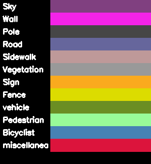
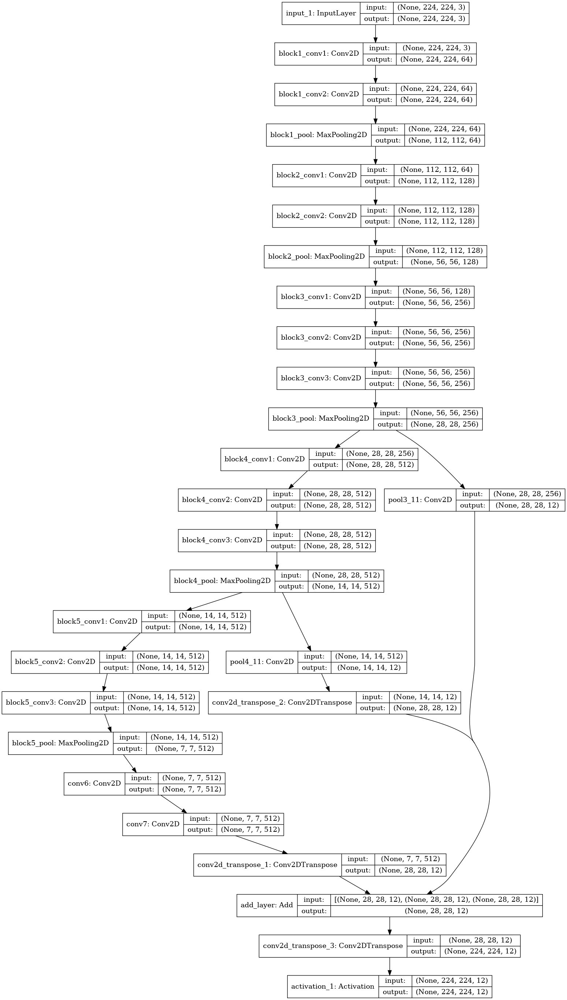
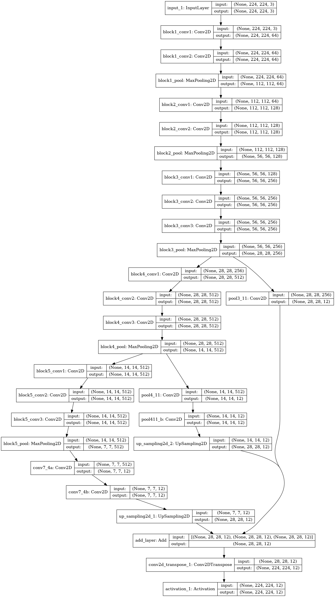
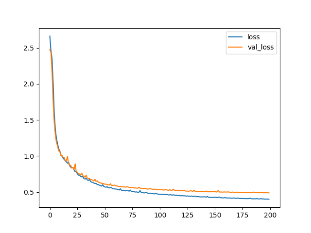
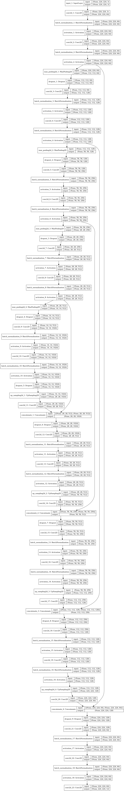
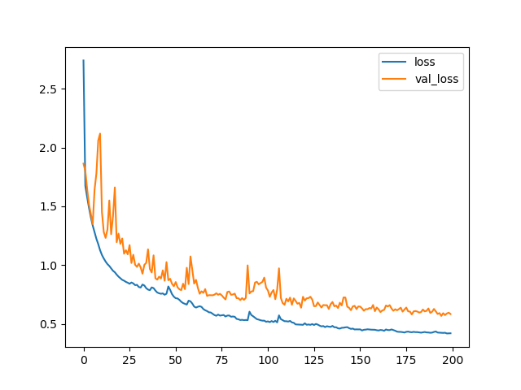
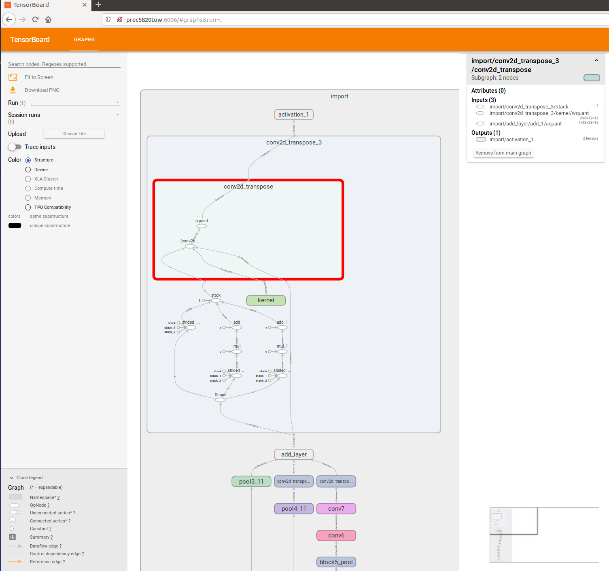
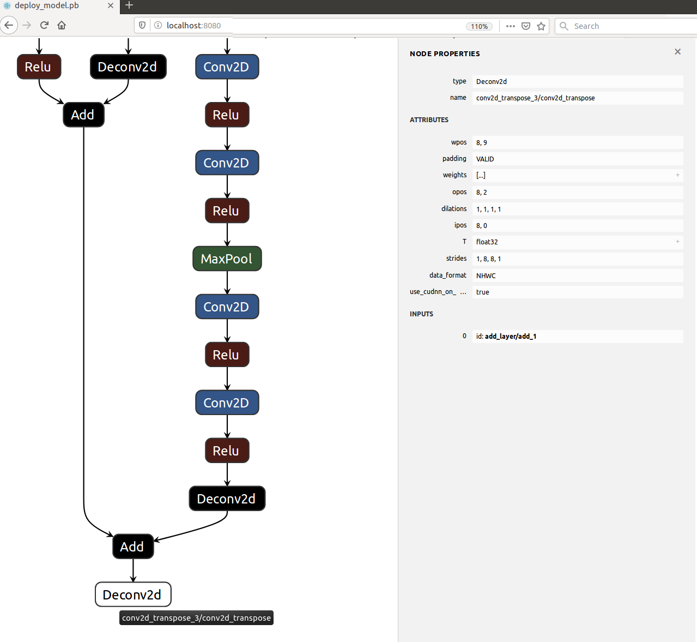

<!--
Copyright 2021 Xilinx Inc.

Licensed under the Apache License, Version 2.0 (the "License");
you may not use this file except in compliance with the License.
You may obtain a copy of the License at

http://www.apache.org/licenses/LICENSE-2.0

Unless required by applicable law or agreed to in writing, software
distributed under the License is distributed on an "AS IS" BASIS,
WITHOUT WARRANTIES OR CONDITIONS OF ANY KIND, either express or implied.
See the License for the specific language governing permissions and
limitations under the License.

Author: Daniele Bagni, Xilinx Inc
-->


<div style="page-break-after: always;"></div>
<table style="width:100%">
  <tr>
    <th width="100%" colspan="6"><h1>FCN8 and UNET Semantic Segmentation with Keras and Xilinx Vitis AI</h1>
</th>
  </tr>
</table>
</div>


### Current status

1. Tested with Vitis AI 1.3.2 (with [April 2021 Patch](https://github.com/Xilinx/Vitis-AI/blob/master/docs/quick-start/install/Vitis%20AI%201.3.2%20April%202021%20Patch.md)) on an Ubuntu 16.04.7 Desktop PC.

2. Tested in hardware on ZCU102 and ZCU104 boards respectively with  ``xilinx-zcu102-dpu-v2020.2-v1.3.1.img.gz`` and ``xilinx-zcu104-dpu-v2020.2-v1.3.1.img.gz`` sd cards.

3. Tested in hardware with Depth-Wise Convolution enabled on XVDPU TRD with VCK190 ES1 in Vitis 2020.2 environment.


#### Date: 17 May 2021


# 1 Introduction

In this Deep Learning (DL) tutorial, you will train the [FCN8](http://deeplearning.net/tutorial/fcn_2D_segm.html) and [UNET](https://towardsdatascience.com/understanding-semantic-segmentation-with-unet-6be4f42d4b47) Convolutional Neural Networks (CNNs) for Semantic Segmentation in Keras adopting a small custom dataset, then you will quantize the floating point weights files to an 8-bit fixed point  representation to finally deploy them on the Xilinx&reg; target board using Vitis&trade; AI, which is a set of optimized IP, tools libraries, models and example designs valid for AI inference on both Xilinx edge devices and Alveo cards. See the [Vitis AI Product Page](https://developer.xilinx.com/en/get-started/ai.html) for more information.

Once the selected CNN has been correctly trained in Keras, the [HDF5](https://www.hdfgroup.org/solutions/hdf5/) file of weights is converted into a TF checkpoint and inference graph file, such frozen graph is then quantized by the Vitis AI Quantizer that creates an INT8 ``pb`` file from which the Vitis AI Compiler generates the ``xmodel`` file of micro instructions for the Deep Processor Unit (DPU) of the Vitis AI platform. The final application is executed at run time - via Python APIs - on the target board to make predictions that can be compared against the simulation reference results.


# 2 Prerequisites

- Ubuntu 16.04 host PC with Python 3.6.

- The entire repository of [Vitis AI stack release 1.3](https://github.com/Xilinx/Vitis-AI) from [www.github.com/Xilinx](https://www.github.com/Xilinx).

-  Accurate reading of [Vitis AI User Guide UG1414 v1.3](https://www.xilinx.com/support/documentation/sw_manuals/vitis_ai/1_3/ug1414-vitis-ai.pdf). In particular:

  1. "Vitis AI Overview" in Chapter 1 with DPU naming and guidelines to download the tools container available from [docker hub](https://hub.docker.com/r/xilinx/vitis-ai/tags) and the Runtime Package for edge (MPSoC) devices.
    2. "Installation and Setup" instructions of Chapter 2 for both host and target, it is recommended you build a GPU-based docker image.
  3. "Quantizing the Model" in Chapter 4 and "Compiling the Model" in Chapter 5.
  4. "Programming with VART" APIs in Chapter 6.


- A Vitis AI Evaluation board such as the [ZCU102](https://www.xilinx.com/products/boards-and-kits/ek-u1-zcu102-g.html) with its [image file](https://www.xilinx.com/bin/public/openDownload?filename=xilinx-zcu102-dpu-v2020.2-r1.3.0.2.0.img.gz), which contains a pre-built working design for the ZCU102 with the DPUCZDX8G (renamed shortly as "DPUv2"), or the [ZCU104](https://www.xilinx.com/products/boards-and-kits/ek-u1-zcu104-g.html) with its [image file](https://www.xilinx.com/bin/public/openDownload?filename=xilinx-zcu104-dpu-v2020.2-r1.3.0.2.0.img.gz).

- Alternatively to such boards you can use also the VCK190, yThe [VCK190](https://www.xilinx.com/products/boards-and-kits/vck190.html) evaluation board with its image file, which contains a pre-built working design for the VCK190 with the DPUCVDX8G_DW, renamed shortly as "XVDPU" in the following of this document.

- Familiarity with Deep Learning principles.


### Dos-to-Unix Conversion

In case you might get some strange errors during the execution of the scripts, you have to pre-process -just once- all the``*.sh`` shell and the python ``*.py`` scripts with the [dos2unix](http://archive.ubuntu.com/ubuntu/pool/universe/d/dos2unix/dos2unix_6.0.4.orig.tar.gz) utility.
In that case run the following commands from your Ubuntu host PC (out of the Vitis AI docker images):
```bash
sudo apt-get install dos2unix
cd <WRK_DIR> #your working directory
for file in $(find . -name "*.sh"); do
  dos2unix ${file}
done
```

### Working Directory

In the following of this document it is assumed you have installed Vitis AI 1.3.2 somewhere in your file system and this will be your working directory ``<WRK_DIR>``, for example in my case ``<WRK_DIR>`` is set to
``~/ML/Vitis-AI.1.3.2``.  You have also created a folder named ``tutorials`` under such ``<WRK_DIR>`` and you have copied this tutorial there and renamed it ``VAI-KERAS-FCN8-SEMSEG``:

```text
Vitis-AI-1.3.2   # your WRK_DIR
   ├── data
   ├── demo
   ├── docs
   ├── dsa
   ├── examples
   ├── external
   ├── models
   │   └── AI-Model-Zoo
   ├── setup
   │   ├── alveo
   │   ├── docker
   │   └── mpsoc
   ├── tools
   │   ├── Vitis-AI-* # different subfolders
   └── tutorials      # created by you
       ├── 08-tf2_flow
       ├── 09-mnist_pyt-master
       ├── VAI-KERAS-FCN8-SEMSEG # this repo
           ├── files
               ├── application
               ├── build
                   ├── ref_log
               ├── doc
```  

Note that for your comfort the reference log files for each step of the flow are placed in the [ref_log.zip](files/log/ref_log.zip) archive.  


# 3 The Docker Tools Image

You have to know few things about [Docker](https://docs.docker.com/) in order to run the Vitis AI smoothly on your host environment.

## 3.1 Installing Docker Client/Server

To [install docker client/server](https://docs.docker.com/engine/install/ubuntu/)  for Ubuntu, execute the following commands:

```shell
sudo apt-get remove docker docker-engine docker.io containerd runc
sudo apt-get update
sudo apt-get install apt-transport-https ca-certificates curl gnupg lsb-release
curl -fsSL https://download.docker.com/linux/ubuntu/gpg | sudo gpg --dearmor -o /usr/share/keyrings/docker-archive-keyring.gpg
echo "deb [arch=amd64 signed-by=/usr/share/keyrings/docker-archive-keyring.gpg] https://download.docker.com/linux/ubuntu $(lsb_release -cs) stable" | sudo tee /etc/apt/sources.list.d/docker.list > /dev/null
sudo apt-get update
sudo apt-get install docker-ce docker-ce-cli containerd.io
sudo docker run hello-world
docker version
```

Once done, in my case, I could see the following:
```
Client: Docker Engine - Community
 Version:           20.10.5
 API version:       1.41
 Go version:        go1.13.15
 Git commit:        55c4c88
 Built:             Tue Mar  2 20:18:15 2021
 OS/Arch:           linux/amd64
 Context:           default
 Experimental:      true

Server: Docker Engine - Community
 Engine:
  Version:          20.10.5
  API version:      1.41 (minimum version 1.12)
  Go version:       go1.13.15
  Git commit:       363e9a8
  Built:            Tue Mar  2 20:16:12 2021
  OS/Arch:          linux/amd64
  Experimental:     false
 containerd:
  Version:          1.4.4
  GitCommit:        05f951a3781f4f2c1911b05e61c160e9c30eaa8e
 runc:
  Version:          1.0.0-rc93
  GitCommit:        12644e614e25b05da6fd08a38ffa0cfe1903fdec
 docker-init:
  Version:          0.19.0
  GitCommit:        de40ad0
```

## 3.2 Build the Docker GPU Image

Download the [Vitis AI 1.3.2](https://github.com/Xilinx/Vitis-AI/tree/v1.3.2) and execute the [docker_build_gpu.sh](https://github.com/Xilinx/Vitis-AI/blob/v1.3.2/setup/docker/docker_build_gpu.sh) script.

Once done that, to list the currently available docker images run:
```bash
docker images # to list the current docker images available in the host pc
```
and you should see something like in the following text:
```text
REPOSITORY            TAG                               IMAGE ID       CREATED         SIZE
xilinx/vitis-ai-gpu   latest                            7623d3de1f4d   6 hours ago     27.9GB
```

Note that docker does not have an automatic garbage collection system as of now. You can use this command to do a manual garbage collection:
```
docker rmi -f $(docker images -f "dangling=true" -q)
```

## 3.3 Install Packages and Patches on the Vitis AI Tools Container  

According to the [April 2021 Patch](https://github.com/Xilinx/Vitis-AI/blob/master/docs/quick-start/install/Vitis%20AI%201.3.2%20April%202021%20Patch.md), Vitis AI 1.3.2 requires some new packages to be installed in all the conda virtual environments of the docker tools container.

For example, in the case of pytorch (which applies python 3.6) you would have to execute the following commands:

```bash
cd <WRK_DIR>
./docker_run.sh xilinx/vitis-ai-gpu:latest     
sudo su # you must be root
conda activate vitis-ai-tensorflow # as root, enter into Vitis AI PyTorch (anaconda-based) virtual environment
sudo env PATH=/opt/vitis_ai/conda/bin:$PATH
CONDA_PREFIX=/opt/vitis_ai/conda/envs/vitis-ai-pytorch
conda install unilog-1.3.2-h7b12538_35.tar.bz2
conda install target_factory-1.3.2-hf484d3e_35.tar.bz2
conda install xir-1.3.2-py36h7b12538_47.tar.bz2
#conda install xir-1.3.2-py37h7b12538_47.tar.bz2 # good only for python 3.7
conda install xcompiler-1.3.2-py36h7b12538_53.tar.bz2
#conda install xcompiler-1.3.2-py37h7b12538_53.tar.bz2 # good only for python 3.7
conda install xnnc-1.3.2-py36_48.tar.bz2
#conda install xnnc-1.3.2-py37_48.tar.bz2 # good only for python 3.7
```

This tutorial requires also some packages that were not included in the original Vitis AI tools container.
Following the previous commands, here are the further commands to include such packages:
```bash
pip install seaborn
conda deactivate
exit # to exit from root
conda activate vitis-ai-tensorflow # as normal user, enter into Vitis AI TF (anaconda-based) virtual environment
```

Note that if you exit from the current Docker Vitis AI tools image you will lose all the installed packages, so to save all changes in a new docker image open a new terminal and run the following commands:

```bash
sudo docker ps -l # To get the Docker CONTAINER ID
```
you will see the following text (the container ID might have a different number):

```text
CONTAINER ID        IMAGE                        COMMAND                CREATED             STATUS              NAMES
7c9927375b06        xilinx/vitis-ai-gpu:latest   "/etc/login.sh bash"   30 minutes ago      Up 30 minutes       heuristic_lamport
```
now save the modified docker image:

```bash
sudo docker commit -m"comment" 7c9927375b06 xilinx/vitis-ai-gpu:latest
```


## 3.4 Launch the Docker Image

To launch the docker container with Vitis AI tools, execute the following commands from the ``<WRK_DIR>`` folder:

```bash
cd <WRK_DIR> # you are now in Vitis_AI subfolder
./docker_run.sh xilinx/vitis-ai-gpu:latest
conda activate vitis-ai-tensorflow
cd /workspace/tutorials/
cd VAI-KERAS-FCN8-SEMSEG/files #your working directory
```

Note that the container maps the shared folder ``/workspace`` with the file system of the Host PC from where you launch the above command, which is ``<WRK_DIR>`` in your case.
This shared folder enables you to transfer files from the Host PC to the docker container and vice versa.

The docker container does not have any graphic editor, so it is recommended that you work with two terminals and you point to the same folder, in one terminal you use the docker container commands and in the other terminal you open any graphic editor you like.


# 4 The Main Flow

The main flow is composed of seven major steps. The first six steps are executed from the tools container on the host PC by launching one of the scripts [run_fcn8.sh](files/run_fcn8.sh) or [run_fcn8ups.sh](files/run_fcn8ups.sh) or [run_unet.sh](files/run_unet.sh) -respectively for FCN8, FCN8UPS (a custom, modified version of FCN8) and UNET CNNs- with commands:
```bash
source run_fcn8.sh     # FCN8 CNN
source run_fcn8ups.sh  # FCN8UPS CNN
source run_unet.sh     # UNET CNN
```
The seventh step can be executed either directly on the target board or in your ``petalinux_sdk`` cross-compilation host environment.

Here is an overview of each step.

1. For each dataset, organize the data into proper folders, such as ``train`` (for training), ``val`` (for validation during the training phase), ``test`` (for testing during the inference/prediction phase) and ``calib`` (for calibration during the quantization phase). See [Organize the Data](#41-organize-the-data) for more information.

2. Train the CNNs in Keras and generate the HDF5 weights model. See [Train the CNN](#42-train-the-cnn) for more information.

3. Convert the Keras model into TF checkpoint and inference graph. See [Create TF Inference Graphs from Keras Models](#43-create-tf-inference-graphs-from-keras-models) for more information.

4. Freeze the TF graph to evaluate the CNN prediction accuracy as the reference starting point. See [Freeze the TF Graphs](#44-freeze-the-tf-graphs) for more information.

5. Quantize from 32-bit floating point to 8-bit fixed point and evaluate the prediction accuracy of the quantized CNN. See [Quantize the Frozen Graphs](#45-quantize-the-frozen-graphs) for more information.

6. Run the compiler to generate the ``xmodel`` file for the target board from the quantized ``pb`` file. See [Compile the Quantized Models](#46-compile-the-quantized-models) for more information.

7. Use either VART C++ or Python APIs to write the hybrid application for the ARM CPU, then cross-compile it in the ``petalinux_sdk`` host environment.  The application is called "hybrid" because the ARM CPU is executing some software routines while the DPU hardware accelerator is running the FC, CONV, ReLU, and BN layers of the CNN that were coded in the ``xmodel``file.

8. Assuming you have archived the ``target_zcu102`` folder and transferred the related ``target_zcu102.tar`` archive from the host to the target board with ``scp`` utility, now you can run the hybrid application.
 See [Build and Run on the ZCU102 Target Board](#47-build-and-run-on-the-zcu102-target-board) for more information.


>**:pushpin: NOTE** Steps 1 and 2 are based on Yumi's blog titled [Learn about Fully Convolutional Networks for semantic segmentation](https://fairyonice.github.io/Learn-about-Fully-Convolutional-Networks-for-semantic-segmentation.html). For more background information about Semantic Segmentation have a look at the [Appendix](#appendix).


## 4.1 Organize the Data

You have to download the data from [here](https://drive.google.com/file/d/0B0d9ZiqAgFkiOHR1NTJhWVJMNEU/view) and save the file ``dataset1.zip`` (of size ~120MB) in the folder [files](files) at the same level of other sub-folders like [code](files/code).

The subroutine ``1_generate_images()`` within the script [run_fcn8.sh](files/run_fcn8.sh) calls the [prepare_data.py](files/code/prepare_data.py) python module and creates the sub-folders: ``img_train``, ``img_valid``, ``img_test``, and ``img_calib`` that are located in the ``dataset1`` directory and fills them with 311 images for training, 56 images for validation (taken from the images of the original training dataset), 101 images for testing (all the images of the original testing dataset), and 104 images for the calibration process (copied from the training images).

All the images are resized to 224x224x3 before being stored into their folders.

This tutorial applies only 12 classes in the dataset: "Sky", "Wall", "Pole", "Road", "Sidewalk", "Vegetation", "Sign", "Fence", "vehicle", "Pedestrian", "Bicyclist", "miscellanea"; these classes are coded with the colors reported in Figure 2, which was generated with commented code from the [fcn_config.py](files/code/config/fcn_config.py) script.

The following two lines of code from [prepare_data.py](files/code/prepare_data.py)
```python
cnn.plot_image_with_classes(dir_train_seg_inp, dir_train_img_inp)
cnn.plot_some_images(dir_train_seg_inp, dir_train_img_inp)
```
allow you to plot an image and its segmentation labels for each of the 12 classes (first line), and also to plot some examples of segmented images with their classes coded in colors (second line).




*Figure 2: Examples of segmentation labels on the top. Colors (right) to encode the Segmentation Classes (left) on the bottom.*


## 4.2 Train the CNN

The input data are pre-processed using the following python code to normalize their values from 0 to 1. Such code has to be mirrored in the C++ or Python application that runs in the ARM&reg; CPU of ZCU102 target board.

```Python
x_train = x_train.astype("float32") / 127.5
x_test  = x_test.astype("float32") / 127.5
x_train = x_train -1
x_test  = x_test  -1
```

### 4.2.1 FCN8 (two models)

This tutorial proposes two variances of FCN8:
1. the original model of Yumi's blog -named FCN8- with the scheme illustrated in Figure 3 and with ~28 Millions of parameters,
2. my modified model -named FCN8UPS- with the scheme of Figure 4 and with ~15 Millions of parameters,
where in the second model the first two ``Conv2DTrans`` layers are replaced by ``UpSampling2D`` layers.

Both models include a VGG16 CNN backbone, you have to download the HDF5 weights file from [fchollet's GitHub](https://github.com/fchollet/deep-learning-models/releases/download/v0.1/vgg16_weights_tf_dim_ordering_tf_kernels_notop.h5) and put it in the subfolder [keras_model](files/keras_model).

From the ``2_fcn8_train()`` subroutine within the  [run_fcn8.sh](files/run_fcn8.sh) script you can call the [fcn8_training.py](files/code/fcn8_training.py) module with the flag either ``upscale="False"`` to get the original FCN8 model or ``upscale="True"`` to get the second model. All the related files and folders names will contain the substrings either ``fcn8`` or ``fcn8ups`` respectively. Similarly, whatever FCN8 model you need, just use one of the two commands below to run  the six steps of the deployment process from the host PC:
```bash
source run_fcn8.sh     # original FCN8
#source run_fcn8ups.sh  # FCN8 with UpSampling2D
```

Once the training is completed, the [fcn8_make_predictions.py](files/code/fcn8_make_predictions.py) module makes predictions on both the test and validation datasets and you should get the  ``Mean IoU`` accuracy reported in the log files. The learning curves are illustrated in Figure 5.

Note that, being the training dataset pretty small (only 311 images), the prediction accuracy is not very good (in that case it should be at least ``Mean IoU >= 0.5``), as reported in the following text fragment of the logfile, in fact some classes are not even predicted (i.e. the classes 02, 06, 09 and 10). All in all the purpose of this tutorial is to show you what steps are needed to go from the ``.pb`` weight file of a trained FCN8 CNN to the run time execution on the FPGA device of the target board.  

``` text
cclass ( 0)          Sky: #TP= 433991, #FP=  51314, #FN=  21982, IoU=0.856
class ( 1)         Wall: #TP=1087042, #FP= 232633, #FN= 216904, IoU=0.707
class ( 2)         Pole: #TP=     19, #FP=    686, #FN=  36401, IoU=0.001
class ( 3)         Road: #TP=1372356, #FP=  66189, #FN= 102663, IoU=0.890
class ( 4)     Sidewalk: #TP= 386992, #FP= 152063, #FN=  61441, IoU=0.644
class ( 5)   Vegetation: #TP= 773301, #FP= 128493, #FN=  53244, IoU=0.810
class ( 6)         Sign: #TP=     54, #FP=   7802, #FN=  53338, IoU=0.001
class ( 7)        Fence: #TP=  20348, #FP=  25736, #FN= 136055, IoU=0.112
class ( 8)      vehicle: #TP=  73103, #FP= 130003, #FN=  20957, IoU=0.326
class ( 9)   Pedestrian: #TP=     82, #FP=   4144, #FN=  36783, IoU=0.002
class (10)    Bicyclist: #TP=   1007, #FP=   1152, #FN= 109965, IoU=0.009
class (11)  miscellanea: #TP=  18851, #FP= 100415, #FN=  50897, IoU=0.111
_________________
Mean IoU: 0.372
```



*Figure 3: Block diagram of the original FCN8 CNN.*



*Figure 4: Block diagram of FCN8UPS CNN (with UpSampling2D replacing first two Conv2DTrans layers).*




*Figure 5: Training curves for FCN8UPS (top) and FCN8 (bottom) CNNs.*


### 4.2.2 UNET (three models)

There are three variants of UNET, as proposed in the [code/config/unet.py](files/code/config/unet.py) file. The complete process is managed by the script  [run_unet.sh](files/run_unet.sh), similarly to what done for the two FCN8 CNNs.
Learning curves and block diagram of UNET-v2 model are illustrated in Figures 6 and 7.




*Figure 6: Block diagram of a UNET-v2 CNN.*



*Figure 7: Training curves for a UNET-v2 CNN.*

## 4.3 Create TF Inference Graphs from Keras Models

The subroutine ``3_fcn8_Keras2TF()`` within the  [run_fcn8.sh](files/run_fcn8.sh) script gets the computation graph of the TF backend representing the Keras model and generates the output files named ``infer_graph.pb`` and ``float_model.chkpt.*`` which are then placed in the folder ``./workspace/tf_chkpts/fcn8``. The generated log file also contains the TF names of the  input and output nodes that are needed to [Freeze the TF Graphs](#freeze-the-tf-graphs). For example, in the case of FCN8, such nodes are called ``input_1`` and ``activation_1/truediv `` respectively.


## 4.4 Freeze the TF Graphs

The inference graph created in [Create TF Inference Graphs from Keras Models](#create-tf-inference-graphs-from-keras-models) is first converted to a [GraphDef protocol buffer](https://www.tensorflow.org/guide/extend/model_files), then cleaned so that the subgraphs that are not necessary to compute the requested outputs, such as the training operations, can be removed. This process is called "freezing the graph".

The subroutines ``4a_fcn8_freeze()`` and ``4b_fcn8_eval_graph()`` of [run_fcn8.sh](files/run_fcn8.sh) script generate the frozen graph and use it to evaluate the accuracy of the CNN by making predictions on the images in the ``img_test`` folder.

It is important to apply the correct ``input node`` and ``output node`` names in all the shell scripts. This information can be captured by this  python code fragment:
```python
# Check the input and output name
print ("\n TF input node name:")
print (model.inputs)
print ("\n TF output node name:")
print (model.outputs)
```

The frozen graphs evaluation with [eval_graph.py](files/code/eval_graph.py) generate the ``Mean IoU`` prediction accuracy reported in the log files.


## 4.5 Quantize the Frozen Graphs

The subroutines ``5a_fcn8_quantize()`` and ``5b_fcn8_eval_quantized_graph()`` within the  [run_fcn8.sh](files/run_fcn8.sh) script generate the quantized graph and use it to evaluate the accuracy of the CNN by making predictions on the images from the ``img_test`` folder.

The quantized graphs evaluation with [eval_quantized_graph.py](files/code/eval_quantized_graph.py) produces a ``Mean IoU`` prediction accuracy again of 0.407 and 0.404, for the first and second variant of FCN8 CNN, as reported respectively in the logfile.

The prediction accuracy of the quantized network can be evaluated by few changes to the original python module [eval_graph.py](files/code/eval_graph.py) illustrated in the following code fragment:

```python
import tensorflow.contrib.decent_q
from tensorflow.python.platform import gfile

def softmax_predict(logits): #DB: added
	prediction = tf.nn.softmax(logits, name='prediction')
	return prediction

  def graph_eval(input_graph_def, input_node, output_node):
      #Reading images and segmentation labels
      x_test, y_test = cnn.get_images_and_labels(IMG_TEST_DIR, SEG_TEST_DIR, cfg.NUM_CLASSES, cfg.WIDTH, cfg.HEIGHT)

      # load graph
      tf.import_graph_def(input_graph_def,name = '')

      # Get input & output tensors
      x = tf.compat.v1.get_default_graph().get_tensor_by_name(input_node+':0')
      y = tf.compat.v1.get_default_graph().get_tensor_by_name(output_node+':0')

      # Create the Computational graph
      with tf.compat.v1.Session() as sess:

          sess.run(tf.compat.v1.initializers.global_variables())

          feed_dict={x: x_test}
          #y_pred = sess.run(y, feed_dict) # original code

          logits = sess.run(y, feed_dict)  # new code
          pred_DB = softmax_predict(logits) #new code
          y_pred = pred_DB.eval() #new code

      # Calculate intersection over union for each segmentation class
      y_predi = np.argmax(y_pred, axis=3)
      y_testi = np.argmax(y_test, axis=3)
      cnn.IoU(y_testi,y_predi)

```
These changes are implemented into the new script called [eval_quantized_graph.py](files/code/eval_quantized_graph.py).

Note that the output node names must be different, as illustrated by the below fragment of code in the  [run_fcn8.sh](files/run_fcn8.sh) script:
```bash
OUTPUT_NODE="activation_1/truediv" # output node of floating point CNN
Q_OUTPUT_NODE="conv2d_transpose_2/conv2d_transpose" # output node of quantized CNN
```

This is due to the fact that the ``Softmax`` classifier layer has to be computed in software by the ARM CPU out of the DPU core.

In order to find the name of the output node, you have to use one of these two tools: either ``netron`` or ``tensorboard``. The first has to be installed from your python virtual environment with the command ``pip install netron`` (I am using version 3.4.6), the second comes automatically with the TF release inside Vitis AI tools image.
For example, taking FCN8 as reference, run the [open_pb_graph_in_tensorBoard.sh](files/open_pb_graph_in_tensorBoard.sh) script with the following command to use ``tensorboard``:
```
source open_pb_graph_in_tensorBoard.sh ./workspace/quantize_results/fcn8/quantize_eval_model.pb
```
and then with a browser you will see what illustrated in Figure 8.
Alternatively you can load the final graph ``./workspace/quantize_results/fcn8/deploy_model.pb`` directly with ``netron`` and you will see in your browser what illustrated in Figure 9.



*Figure 8: Final part of the FCN8 graph, as it appears in TensorBoard.*



*Figure 9: Final part of FCN8 graph, as it appears in Netron.*

If you enable the following fragment of code from [fcn8_make_predictions.py](files/code/fcn8_make_predictions.py)
```python
#Visualize the model performance
cnn.visualize_model_performance(X_test, y_pred1_i, y_test1_i, N_CLASSES, UPSCALE)
```
you can visualize the predicted segmented images and so you can note the difference between the ideal (ground truth) segmented image (left) and the prediction from the floating point graph (centre) and from the quantized graph (right) as shown in Figure 10:


*Figure 10: Segmentation comparison between ground truth (left), floating point model (centre) and quantized model (roght).*

You will realize that the prediction is not really completely accurate and suffers a lot of "blocking" artifacts, due to the last layer which does an upscale of 8 in both directions, which is a limitation of FCN8 CNN architecture itself.


## 4.6 Compile the Quantized Models

The subroutine ``6_compile_vai_zcu102()``  within the [run_fcn8.sh](files/run_fcn8.sh) script generates the ``xmodel`` file for the embedded system composed by the ARM CPU and the DPU accelerator in the ZCU102 board.

This file has to be loaded by the C++ application file [main.cc](files/target_zcu102/code/src/main.cc) at runtime, for example, in case of FCN8 and FCN8UPS the ``xmodel`` files are named respectively ``fcn8.xmodel`` and ``fcn8ups.xmodel``.

If you use the Python VART APIs instead of the C++ APIs, to interact with the DPU core the first lines of the script [app_mt.py](files/target_zcu102/code/src/app_mt.py)  must contain:
```python
import vart
import xir
```


## 4.7 Build and Run on ZCU102 Target Board

In this design, you will use C++ to measure the performance in terms of fps and the Python APIs to get the prediction accuracy.
Note that a subset of the ``petalinux_sdk`` environment is also available directly on the SD card target board, so you can compile the application directly from there. In fact this is what the script ``run_all_target.sh`` indeed does, once you will launch it from the target board.  

Assuming you have transferred the ``target_zcu102.tar`` archive from the host to the target board with the ``scp`` utility, you can now run the following command directly on the target board:
  ```bash
  tar -xvf target_zcu102.tar
  cd target_zcu102
  bash ./run_all_target.sh
  ```

The purpose of [run_all_target.sh](files/target_zcu102/run_all_target.sh) shell script is
1. to extract the test images from the ``test.tar.gz``  archive;
2. to launch the ``app_mt.py`` application based on VART Python APIs and measure the effective fps performance at run time;
3. to run the C++ executable in order of creating images with segmentation results overlapped, as a post-processing operation (which you can skip if you like). Note that the code to compute the effective ``Mean IoU`` prediction accuracy is still missing, but you should be easily derive it from  the python scripts of the training process. Being compiled instead of interpreted, the appliction in C++ is fatser than in Python and therefore the fps performance is better.


# 5  C++ Multi-threading Code

The file [main_mt.cc](files/targte_zcu102/code/src/main_mt.cc) contains fragments of code to execute up to 6 threads in parallel, differently from the original [main.cc](https://github.com/Xilinx/Vitis-AI/blob/master/demo/VART/resnet50/src/main.cc) code provided in the Vitis-AI demo VART examples, which is just a single thread. The user can select from 1 to 6 threads (for more threads you have to change the code).

The code is organized in three main parts: 1) pre-processing, 2) multithreading execution and throughput computation in terms of fps, 3) post-processing.
The entire pre-processing is done on the whole list of input images, then the pre-processed images are split in chunks of equal size (multiple of the batch size) assigned to each thread. Finally, the post-processing is applied to compute the top-1 average prediction accuracy.


## 5.1 Pre-processing

The images to be sent to the DPU are in BGR format, because the training was originally done with OpenCV reading the images in BGR, thanks to the ``0+c`` fragment in the C++ code. If you replace it with just ``2-c`` (to convert in RGB) you will incur in severe degradation of the average prediction accuracy.

```cpp
vector<Mat> imageList;
float* imageInputs = new float[(num_of_images)*inSize];
float* FCResult    = new float[(num_of_images)*outSize];

// preprocess all images at once
for (unsigned int n = 0; n < num_of_images; n++)
{
    Mat image = imread(baseImagePath + image_filename[n]);
    Mat image2 = cv::Mat(inHeight, inWidth, CV_8SC3);
    resize(image, image2, Size(inHeight, inWidth), 0, 0, INTER_LINEAR); //0);
    for (int y = 0; y < inHeight; y++) {
      for (int x = 0; x < inWidth; x++) {
        for (int c = 0; c < 3; c++) {
          //imageInputs[n*inSize + 3*(y*inWidth+x) + 2-c] = ((float)image2.at<Vec3b>(y,x)[c])/127.5 -1.0; //RGB conversion
            imageInputs[n*inSize + 3*(y*inWidth+x) + 0+c] = ((float)image2.at<Vec3b>(y,x)[c])/127.5 -1.0; //BGR format
        }
      }
    }
    imageList.push_back(image2);
}
// split images in chunks, each chunks for its own thead
// avoid pointing to wrong memory locations
float *imagesInput0 = imageInputs+ inSize*(num_threads==1 ? 0*num_images_x_thread : 0);
float *imagesInput1 = imageInputs+ inSize*(num_threads==2 ? 1*num_images_x_thread : 0);
float *imagesInput2 = imageInputs+ inSize*(num_threads==3 ? 2*num_images_x_thread : 0);
float *imagesInput3 = imageInputs+ inSize*(num_threads==4 ? 3*num_images_x_thread : 0);
float *imagesInput4 = imageInputs+ inSize*(num_threads==5 ? 4*num_images_x_thread : 0);
float *imagesInput5 = imageInputs+ inSize*(num_threads==6 ? 5*num_images_x_thread : 0);

float *FCResult0    = FCResult+   outSize*(num_threads==1 ? 0*num_images_x_thread : 0);
float *FCResult1    = FCResult+   outSize*(num_threads==2 ? 1*num_images_x_thread : 0);
float *FCResult2    = FCResult+   outSize*(num_threads==3 ? 2*num_images_x_thread : 0);
float *FCResult3    = FCResult+   outSize*(num_threads==4 ? 3*num_images_x_thread : 0);
float *FCResult4    = FCResult+   outSize*(num_threads==5 ? 4*num_images_x_thread : 0);
float *FCResult5    = FCResult+   outSize*(num_threads==6 ? 5*num_images_x_thread : 0);
```


## 5.2 Multi-threading and Throughput

The next fragment of code illustrates the multi-threading part. I was not able to find a method to create a dynamic list of ``runners``, so I had to
write it in this way (if you can suggest a more elegant solution, you are welcome).

```cpp
#include <thread>
thread workers[num_threads];
t_start = system_clock::now();

for (auto i = 0; i < num_threads; i++)
{
    if (i == 0) workers[i] = thread(runResnet50, runner.get(),   ref(imagesInput0), ref(FCResult0) );
    if (i == 1) workers[i] = thread(runResnet50, runner1.get(),  ref(imagesInput1), ref(FCResult1) );
    if (i == 2) workers[i] = thread(runResnet50, runner2.get(),  ref(imagesInput2), ref(FCResult2) );
    if (i == 3) workers[i] = thread(runResnet50, runner3.get(),  ref(imagesInput3), ref(FCResult3) );
    if (i == 4) workers[i] = thread(runResnet50, runner4.get(),  ref(imagesInput4), ref(FCResult4) );
    if (i == 5) workers[i] = thread(runResnet50, runner5.get(),  ref(imagesInput5), ref(FCResult5) );
}
// Release thread resources.
for (auto &w : workers) {
  if (w.joinable()) w.join();
}

t_end = system_clock::now();
auto duration = (duration_cast<microseconds>(t_end - t_start)).count();
cout << "\n" << endl;
cout << "[Time] " << duration << "us" << endl;
cout << "[FPS ] "  << num_of_images*1000000.0/duration  << endl;
cout << "\n" << endl;
```

The throughput is computed  using the ``chrono`` C++ library:

```cpp
#include <chrono>
using namespace std::chrono;
//using std::chrono::system_clock;
system_clock::time_point t_start, t_end;
```


## 5.3 Post-processing

In the post-processing part you can use OpenCV functions to show the segmented images  on the display of the target board (or of your host PC if you are using X11 forwarding):

```
if (use_post_processing==1)
{
  for (unsigned int n = 0; n < num_of_images; n ++)
  {
      cout << "\nImage : " << image_filename[n] << endl;
      Mat image3 = imageList[n].clone();

      Mat segMat(outHeight, outWidth, CV_8UC3);
      Mat showMat(inHeight,  inWidth, CV_8UC3);
      float *OutData = &FCResult[n * outSize];
      for (int row = 0; row < outHeight; row++) {
        for (int col = 0; col < outWidth; col++) {
          int ii = row * outWidth * num_of_classes + col * num_of_classes;
          auto max_ind = max_element(OutData + ii, OutData + ii + num_of_classes);
          int posit = distance(OutData + ii, max_ind);
          segMat.at<Vec3b>(row, col) = Vec3b(colorB[posit], colorG[posit], colorR[posit]);
        }
      }
      for ( int ii = 0; ii < showMat.rows * showMat.cols * 3; ii++) {
        showMat.data[ii] = segMat.data[ii]; //copy SegMat into showMat
        image3.data[ii] = image3.data[ii] * 0.4 + showMat.data[ii] * 0.6;
      }
      if (n<20)
      {
        char s[20]; sprintf(s, "image %03d", n);
        // putText(image3, s, Point(10,10), FONT_HERSHEY_PLAIN, 1.0, CV_RGB(0,255,0), 2.0);

        Mat dst;            
        cv::hconcat(imageList[n], image3, dst); // horizontal
        cv::imshow(s, dst);
        cv::waitKey(1000);
        cv::imwrite(format("%03d.png",n), image3);
        cv::destroyAllWindows();
      }
  }
  imageList.clear();
}
```

You will see something like this (the picture was generated by UNET CNN):


# 6 Summary

In this tutorial you have seen how to implement on the Xilinx [ZCU102](https://www.xilinx.com/products/boards-and-kits/ek-u1-zcu102-g.html) board some CNNs suitable for Semantic Segmentation with a small custom dataset of few hundreds of images taken from [here](https://drive.google.com/file/d/0B0d9ZiqAgFkiOHR1NTJhWVJMNEU/view).

Taking FCN8 CNN as an example, the Xilinx [Vitis AI stack release 1.3](https://github.com/Xilinx/Vitis-AI) has quantized the ``ep200_trained_fcn8_224x224hdf5`` 32-bit floating point weights file (of ~224MB size) generated by the training process in Keras, into an 8-bit fixed point ``deploy_model.pb`` file (of ~112MB size) and such ``pb`` file is then transformed into the ``fcn8.xmodel`` (of ~65MB size) file for the DPU accelerator.

The advantage of this small dataset is that it makes the training process in Keras short enough, but the ``Mean IoU`` prediction accuracy is only ~0.38 also due to a certain level of unbalancing among the classes. To get a larger value you probably need a larger and more balanced dataset, as the [MS COCO](http://cocodataset.org/#home) or the [Cityscapes](https://www.cityscapes-dataset.com/), although this would probably need to re-architect the deepness of FCN8 to make it suitable to images of size 1920x1080, instead of 224x224 as in this case study.

Despite that, you have seen how easy is to control the DPU core from the embedded Linux Ubuntu OS on the ZC102 board via the **DPU Python VART APIs** with the [app_mt.py](files/target_zcu102/code/src/app_mt.py) script. The traditional C++ programming of the embedded system composed by the ARM CPU and the DPU accelerator is also available in the [main_mt.cc](files/target_zcu102/code/src/main_mt.cc) application file.


The [Excel table](files/doc/summary_results.xlsx) summarizes the CNN features for each network in terms of mean IoI (mIoU) and frames per second (fps).
The second is measured on all the three target boards at run time execution and it includes reading the images with OpenCV function from ARM CPU (while in the real life case these images will be stored into DDR memory and so their access time should be negligible as seen from the DPU IP core).


# Appendix

## A1 Semantic Segmentation Background

**Image classification** is the task of predicting labels or categories. **Object detection** is the task
of predicting bounding boxes: each bounding box may have objects other than the detected object inside it.
**Semantic segmentation** is the task of predicting pixelwise labels: for example the labels can be the sky, trees, persons, mountains, etc and are assigned to each pixel.
The task of segmenting every instance with a different pixel-wise label (for example each person in a picture is labeled with a different value) is called **instance segmentation**.

The most adopted datasets in the latest years are [PASCAL](https://pjreddie.com/projects/pascal-voc-dataset-mirror/), [Cityscapes](https://www.cityscapes-dataset.com/) and [MS COCO](http://cocodataset.org/#home). New algorithms are usually benchmarked against the MS COCO dataset. Creating training data for semantic segmentation is expensive as it requires proper CV tools for annotating the datasets.

Usually the decoded image is of the same size of the input.

Each pixel of the output of the CNN is compared with the corresponding pixel in the **ground truth** segmentation image (also called **masks**). Standard **cross entropy loss** is computed on each pixel. For the segmentation masks do not use **jpg** format being it lossy, use **bmp** or **png** instead.

The most adopted CNNs for semantic segmentation are:

- **FCN** (Fully Convolutional Network): it is an Image classification CNN in which neither Max-Pooling nor Fully-Connected (FC) layers are used. For many applications, choosing a model pre-trained on ImageNet is the best choice, similarly to Transfer Learning, for example VGG could be converted to a FCN by making the last FC layers 1x1 Convolutions.  The three variants are FCN8, FCN16 and FCN32. In FCN8 and FCN16, **skip connections** architecture is also adopted.

- **SegNet**: tries to improve the FCN coarse outputs by using an encoder-decoder approach, with the encoder and decoder layers symmetrical to each other. The features are reduced in dimensions in the encoder stage via **dilated convolution** - also called **strided convolution** (it is a convolution with ``stride >=2``) - and then upsampled again in the decoder stage with either the  **transposed convolution** - also called **deconvolution** or **upconvolution** - or the **Max Unpooling** (which uses positions from pooling layers).
SegNet does not applies skip connections.

- **UNet**: this architecture adopts an encoder-decoder framework with skip connections. Like SegNet, the encoder and decoder layers are symmetrical to each other.

- **PSPNet**: The Pyramid Scene Parsing Network is optimized to learn better global context representation of a scene. First, the image is passed to the base network to get a feature map. The the feature map is downsampled to different scales. Convolution is applied to the pooled feature maps. After that, all the feature maps are upsampled to a common scale and concatenated together. Finally a another convolution layer is used to produce the final segmentation outputs. Here, the smaller objects are captured well by the features pooled to a high resolution, whereas the large objects are captured by the features pooled to a smaller size.

Most of this section was based on R. Shanmugamani's "Deep Learning for Computer Vision (Expert techniques to train advanced neural networks using TensorFlow and Keras)" book, 2018 Packt Publishing.

### A1.1 Intersection over Union (IoU)
Both Semantic Segmentation and Object Detection measure the prediction accuracy in terms of "Intersection over Union" or ``IoU``. You can read this nice [IoU PyImageSearch tutorial](https://www.pyimagesearch.com/2016/11/07/intersection-over-union-iou-for-object-detection/) to learn more about it.

### A1.2 MS COCO dataset
The [MS COCO](http://cocodataset.org/#home) dataset contains 91 object categories with 82 of them having more than 5000 labeled instances, as explained in this paper titled [MicroSoft COCO: Common Objects in COntext](https://arxiv.org/pdf/1405.0312.pdf).

The datasets can be downloaded [here](http://cocodataset.org/#download). The [COCO API](https://github.com/cocodataset/cocoapi) are available both in MATLAB and Python.


### A1.3 Reference tutorials

There are some nice tutorials on Semantic Segmentation with Keras/TensorFlow, here are my preferred ones:
1. [A Beginner's guide to Deep Learning based Semantic Segmentation using Keras](https://divamgupta.com/image-segmentation/2019/06/06/deep-learning-semantic-segmentation-keras.html) and related [GitHub project files](https://github.com/divamgupta/image-segmentation-keras)
2. PyImageSearch' [Semantic segmentation with OpenCV and deep learning](https://www.pyimagesearch.com/2018/09/03/semantic-segmentation-with-opencv-and-deep-learning/)
3. [A Keras Pipeline for Image Segmentation](https://towardsdatascience.com/a-keras-pipeline-for-image-segmentation-part-1-6515a421157d)
4. [Semantic Segmentation of Small Data using Keras on an Azure Deep Learning Virtual Machine](https://www.microsoft.com/developerblog/2018/07/18/semantic-segmentation-small-data-using-keras-azure-deep-learning-virtual-machine/)
5. [TensorFlow Image Segmentation: Two Quick Tutorials](https://missinglink.ai/guides/deep-learning-frameworks/tensorflow-image-segmentation-two-quick-tutorials/)
6. [A Non-Expert’s Guide to Image Segmentation Using Deep Neural Nets](https://medium.com/@hanrelan/a-non-experts-guide-to-image-segmentation-using-deep-neural-nets-dda5022f6282)
7. [How to inspect a pre-trained TensorFlow model](https://medium.com/@daj/how-to-inspect-a-pre-trained-tensorflow-model-5fd2ee79ced0)
8. [http://www.immersivelimit.com/tutorials/create-coco-annotations-from-scratch](http://www.immersivelimit.com/tutorials/create-coco-annotations-from-scratch)
9. [https://www.udemy.com/creating-coco-datasets/?couponCode=SUPPORTER](https://www.udemy.com/creating-coco-datasets/?couponCode=SUPPORTER)
10. [https://commecica.com/2018/07/18/starting-with-darknet-yolo-coco/](https://commecica.com/2018/07/18/starting-with-darknet-yolo-coco/)
11. [https://www.youtube.com/watch?v=h6s61a_pqfM](https://www.youtube.com/watch?v=h6s61a_pqfM)
12. [https://gluon-cv.mxnet.io/build/examples_datasets/mscoco.html](https://gluon-cv.mxnet.io/build/examples_datasets/mscoco.html)
13. [https://github.com/nightrome/cocostuff#setup](https://github.com/nightrome/cocostuff#setup)
14. [Fully Convolutional Networks (FCN) for 2D segmentation](http://deeplearning.net/tutorial/fcn_2D_segm.html)
15. [Learn about Fully Convolutional Networks for semantic segmentation](https://fairyonice.github.io/Learn-about-Fully-Convolutional-Networks-for-semantic-segmentation.html)
16. [Official seaborn tutorial](https://seaborn.pydata.org/tutorial.html)
17. [Evaluating Image Segmentation Models](https://www.jeremyjordan.me/evaluating-image-segmentation-models/)
18. [Motion-based Segmentation and Recognition Dataset](http://mi.eng.cam.ac.uk/research/projects/VideoRec/CamVid/)


## A2 Build and Run on VCK190 Target Board

Alternatively to ZCU102, you can also use the [VCK190](https://www.xilinx.com/products/boards-and-kits/vck190.html) available only from the [Versal ML EA Lounge](https://www.xilinx.com/member/versal-ml-ea.html#versal-dpu) (you need to be registered to it to get access to its content).

The sd card was generated with Depth-Wise Convolution enabled on [Versal DPU TRD](https://www.xilinx.com/member/versal-ml-ea.html#versal-dpu-trd) with VCK190 ES1 in Vitis 2020.2 environment (you need to be registered at the Versal ML Early Access Lounge), using architecture ``DPUCVDX8G_ISA0_B8192C32B3_DW``; you might need to edit manually the ``/opt/vitis_ai/compiler/arc/DPUCVDX8G/VCK190/arch.json`` file
of your Vitis AI conda environment to enable it, as in the following:
```
{
      "target": "DPUCVDX8G_ISA0_B8192C32B3_DW"
}
```
then the file was renamed as ``arch_dw.json`` and used accordingly in the ``compile_vck190()`` routine from the ``run_*.sh`` shell scripts.


The ``xmodel`` files generated for VCK190 are necessarily different from the ones of ZCU102, because the DPU architecture of the first board is different from the DPU of the second board. No changes to the C++ or Python files are needed for these four CNN examples.

Working with VCK190 board requires just to adopt the ``6_compile_vai_vck190()`` routine from the script [run_fcn8.sh](files/[run_fcn8.sh), instead of the ``6_compile_vai_zcu102()`` which is related to ZCU102.

Make a ``tar`` file of the ``target_vck190``  folder, copy it from the host PC to the target VCK190 board. For example, in case of an Ubuntu PC, use the following command (assuming the board IP address is always the same):
```
scp target_vck190.tar root@192.168.1.100:/root/
tar -xvf target_vck1980.tar
cd target_vck190
bash -x ./run_all_target.sh
```


## A3 Build and Run on ZCU104 Target Board

Working with ZCU104 board requires just to adopt the ``6_compile_vai_zcu104()`` routine from the script [run_fcn8.sh](files/[run_fcn8.sh), instead of the ``6_compile_vai_zcu102()`` which is related to ZCU102.

Make a ``tar`` file of the ``target_zcu104``  folder, copy it from the host PC to the target ZCU104 board. For example, in case of an Ubuntu PC, use the following command (assuming the board IP address is always the same):
```
scp target_zcu104.tar root@192.168.1.100:/root/
tar -xvf target_zcu104.tar
cd target_zcu104
bash -x ./run_all_target.sh
```


<hr/>
<p align="center"><sup>Copyright&copy; 2019 Xilinx</sup></p>
