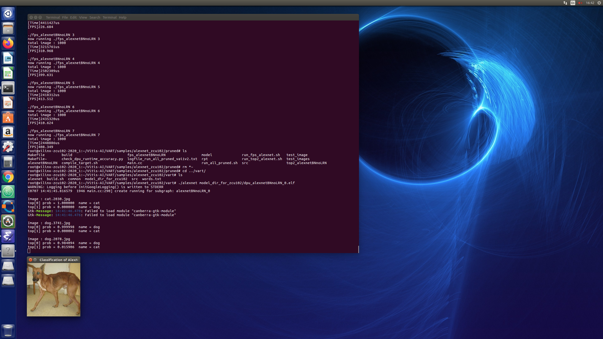
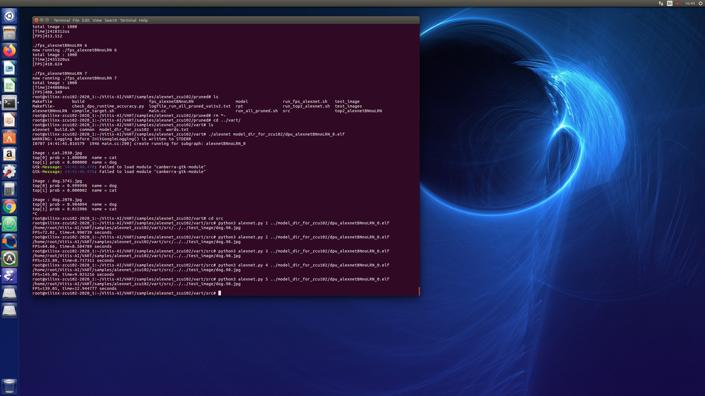

<table>
 <tr>
   <td align="center"><h1>Vitis AI Tutorials</h1>
   </td>
 </tr>
 <tr>
 <td align="center"><h3> Profiling a CNN Using DNNDK or VART with Vitis AI</h3>
 </td>
 </tr>
</table>

# Current Status

* Tested with Vitis AI 1.2
* Tested in hardware on ZCU102


# 1.0 Introduction

This tutorial shows you how to profile a CNN application running on the ZCU102 target board with Vitis&trade; AI, which is a set of optimized IP, tools, libraries, models and example designs valid for AI inference on both Xilinx edge devices and Alveo&trade; Data Center accelerator cards.

For more information, see the following sites:
* [Vitis AI product page](https://developer.xilinx.com/en/get-started/ai.html)
* [AI Edge Platform product page](https://www.xilinx.com/products/design-tools/ai-inference/edge-ai-platform.html)
* [Alveo Data Center Accelerator Card product page](https://www.xilinx.com/products/boards-and-kits/alveo.html)

In order to follow this tutorial, you must have already trained and quantized your CNN, whether you selected Caffe or TensorFlow. In fact compiling, running and debugging the C++ application on the embedded system composed by the Deep Processor Unit (DPU) and the ARM CPU is almost independent from the adopted ML framework.

# 2.0 Setup Requirements

To complete this tutorial, you must have the following:

* An Ubuntu 16.04 host PC with Python 3.6 and its package ``python3.6-tk`` installed. (This package is installed with ``sudo apt-get install python3.6-tk``.)

- [Vitis AI stack release 1.2](https://github.com/Xilinx/Vitis-AI). For installation instructions, refer to the *Vitis AI User Guide* ([UG1414](https://www.xilinx.com/html_docs/vitis_ai/1_0/zkj1576857115470.html)).

- Vitis AI Evaluation board [ZCU102](https://www.xilinx.com/products/boards-and-kits/ek-u1-zcu102-g.html) with its [image file](https://www.xilinx.com/bin/public/openDownload?filename=xilinx-zcu102-dpu-v2020.1-v1.2.0.img.gz), which contains a pre-built working design for the ZCU102 with the [DPU-v2](https://github.com/Xilinx/Vitis-AI/tree/master/DPU-TRD).

- Familiarity with one of these Vitis AI Tutorials:
  - [FCN8 and UNET Semantic Segmentation with Keras and Xilinx Vitis AI](https://github.com/Xilinx/Vitis-AI-Tutorials/tree/VAI-KERAS-FCN8-SEMSEG)
  - [Quantization and Pruning of AlexNet CNN trained in Caffe with Cats-vs-Dogs dataset](https://github.com/Xilinx/Vitis-AI-Tutorials/tree/VAI-Caffe-ML-CATSvsDOGS)

- Familiarity with Deep Learning principles.


## 2.1 Dos-to-Unix Conversion

To prevent errors during the execution of the scripts, you must first pre-process all of your ``*.sh`` shell and python ``*.py`` scripts with the [dos2unix](http://archive.ubuntu.com/ubuntu/pool/universe/d/dos2unix/dos2unix_6.0.4.orig.tar.gz) utility. This only has to be done once.

## 2.2 Setup

Before you start the tutorial, you must do the following:

- Follow and execute the Vitis AI instructions for [Setting Up the Evaluation Boards](https://www.xilinx.com/html_docs/vitis_ai/1_2/yjf1570690235238.html).

- Follow the instructions of [Legacy DNNDK examples](https://www.xilinx.com/html_docs/vitis_ai/1_2/ump1570690283280.html) to setup ``petalinux/2020.1`` and all the DNNDK application files and libraries, so that you can finally run everything on your target board.

- Execute the [VART Quick Start for Edge](https://github.com/Xilinx/Vitis-AI/tree/master/VART#quick-start-for-edge) instructions related to installing and testing VART.

- Install ``petalinux`` into the ``/opt/petalinux/2020.1`` directory of your host PC.

- Set up a working directory where you can save this tutorial, such as ``${HOME}/tutorials/``. This will be referred to as ``${WRK_DIR}`` throughout the tutorial.

**Important**: In GitHub you cannot store a file larger than 25MB, so all the ``.elf`` and ``.so`` files were compressed with ``gzip``. Before running any script, you must manually uncompress those files.


# 3.0 Q&A about Profiling and Multithreading

<details><summary>Does the multithreading execution of kernels running in parallel deliver deterministic results?</summary>
</p>
  The latency through the DPU (assuming it has data available and the system is not memory bound) should be somewhat deterministic. The latency from when you start a thread to the time when it completes is not necessarily deterministic as it may depend on the number of threads launched, system utilization, and other settings. There is also the capability with the DNNDK APIs to set ``core affinity`` (which DPU will execute which task) as well as ``priority`` (which task takes priority), so if you have a higher priority task, you can set the priority higher for that task.</details>
</p>
<details><summary>Is there any other way to find out the optimum number of threads or only testing?</summary>
</p>
 It seems that most of the time, for the 3 B4096 DPUs on the ZCU102 board, 6 threads is a good number.  That said, it depends on the number of DPUs available, the time it takes to execute the model, and the software loading of the system.  Once you have the multithreaded application setup, it should be pretty easy to vary this number at runtime.</details>
</p>
<details><summary>What does one "kernel" mean?</summary>
</p>
  A kernel is the instantiation of a task (for example a certain CNN) on the DPU.</details>
</p>
<details><summary>How do the kernels communicate to each other, or do they run completely independent to each other?</summary>
</p>
  The kernels are totally independent from each other.</details>
</p>
<details><summary>How are the overall processing steps divided up in kernels?</summary>
</p>
  The kernel or DPU task (or "runner") is the CNN model.  When you compile the model it becomes a kernel, so the processing steps are those contained within the model.</details>
</p>
<details><summary>Does one frame map to one kernel, or is one frame processed by multiple kernels?</summary>
</p>
  One frame maps to one kernel, though perhaps it is possible that you could have multiple inputs to a CNN model and you could possibly be inputting multiple frames or other data to the various inputs. It is also possible that you could segment a model into multiple kernels, though you would need to compile each one individually, then take the output from that kernel and feed it to the next. You could theoretically create a pipeline in this case that uses multiple DPUs, each which execute a portion of the model and are fed by the output of the previous kernel.</details>
</p>
<details><summary>Is there any method to define what is being processed within one kernel?</summary>
</p>
  You have the ability to define what is in the CNN model. If you want to only process a portion of the model, then make that the output layer or input layer when you quantize it with ``vai_q_*`` and compile it with ``vai_c_*`` (where ``*`` means either ``caffe`` or ``tensorflow``).</details>
</p>
<details><summary>What can I do with the profiling results?</summary>
</p>
  Once the fine-grained profiling is done over one specific CNN model, the Vitis AI compiler (``vai_c_*``) does not currently offer open parameters/options for the CNN performance tuning in the ``elf`` file. However, if you are not satisfied with the performance delivered by the DPU core, you can try to modify the DPU configurations in order to obtain better performance. For example, you can try applying more advanced DPU architectures from B1152 to B4096, or applying ``high RAM usage``.  Refer to [Configurate the DPU](https://github.com/Xilinx/Vitis-AI/blob/master/DPU-TRD/prj/Vivado/README.md#53-configurate-the-dpu) for more details. Otherwise, if the DPU core offers enough performance, you can try to modify the DPU configurations with lower logic resources, which will be beneficial for other subsystems to be implemented later in the FPGA.</details>


# 4.0 DPU Profiling with DNNDK C++ APIs

There are at least three possible **profiling methods** to measure the throughput performance of the embedded system composed by the ARM CPU and the DPU IP core:
* Manually profiling only the CNN APIs called by the ARM CPU
* Automatically profiling all the CNN layers running on the DPU IP core (which is called **fine-grained profiling**)
* Manually computing the elapsed time - with image pre-processing and data loading operation included

The first and third profiling methods require a different compilation flag from the second method: ``--options    "{'mode':'normal'}"`` (for methods 1 and 3) and  ``--options    "{'mode':'debug'}"`` (for method 2) in the ``vai_c`` script used to generate the DPU ``elf`` file from the quantized CNN. This is illustrated in the following fragments of code, respectively for a CNN quantized with ``vitis-ai-caffe`` or ``vitis-ai-tensorflow`` anaconda environments:

```bash
# conda activate vai_caffe
vai_c_caffe  --prototxt=${model_dir}/deploy.prototxt     \
     --caffemodel=${model_dir}/deploy.caffemodel \
     --output_dir=${output_dir}                  \
     --net_name=${CNN}                           \
     --arch /opt/vitis_ai/compiler/arch/dpuv2/ZCU102/ZCU102.json \
     --options    "{'mode':'normal', 'save_kernel':''}"
#    --options    "{'mode':'debug'}"

# conda activate vai_tensorflow
vai_c_tensorflow \
       --frozen_pb=${model_dir}/deploy_model.pb \
       --output_dir=${output_dir}               \
       --net_name=${CNN}                        \
       --arch /opt/vitis_ai/compiler/arch/dpuv2/ZCU102/ZCU102.json \
       --options    "{'mode':'normal'}"
#      --options    "{'mode':'debug'}"       
```

In both the first and second methods, the image preprocessing CPU overhead is not taken in account. In fact, in the current application, the ARM CPU runs the preprocessing in software, which is surely not an efficient solution being it very slow. In real life scenario an hardware accelerator would do that in the MPSoC fabric with much smaller latency, typically using
the [Vitis Vision library](https://github.com/Xilinx/Vitis_Libraries/tree/master/vision) based on Open-CV functions optimized for the FPGA (look at [Xilinx xfOpenCV](https://github.com/Xilinx/xfopencv) and [Vivado HLS](https://www.xilinx.com/products/design-tools/vivado/integration/esl-design.html) for more details).

While the results measured by method 1 and 2 should be quite in agreement (note that method 2 is the most precise), the results of method 3 should be worst because of the overhead of the ARM CPU (running in software the tasks of file I/O operations). Note also that all those results must be measured with a single thread execution.

## 4.1 Profiling AlexNet CNN for Image Classification

In the following of this Section you will see how profiling the ``AlexNet`` CNN trained with Caffe on the ``Dogs vs. Cats`` dataset for image classification with RGB images of size 227x227x3, as illustrated in the [UG1336](https://github.com/Xilinx/Vitis-AI-Tutorials/tree/VAI-Caffe-ML-CATSvsDOGS).The same concepts are valid also for any other CNN.

To save time, you can run profiling using only one input image, as its results do not depend on the amount of input images. Due to that the folder ``test_image`` contains only one image, differently from the archive ``test_images.tar.gz``.

All the results of next subsections were obtained by running the following commands:

- Host PC side
  ```bash
  # set petalinux on your host PC
  unset LD_LIBRARY_PATH
  sh  /opt/petalinux/2020.1/environment-setup-aarch64-xilinx-linux
  # go to your working directory
  cd ${WRK_DIR}/VAI-Profiling/files/alexnet_zcu102
  sh ./crosscompile.sh
  cd ..
  tar -cvf alexnet_zcu102.tar ./alexnet_zcu102
  ```

- Now copy the ``alexnet_zcu102.tar`` archive and transfer it to your ZCU102 target board with ``scp`` utility. For example, assuming your Host PC and the target board have static IP address values respectively of ``192.168.1.100`` and ``192.168.1.40``, the command will be ``scp ./alexnet_zcu102.tar root@192.168.1.40:~/`` (password is ``root``)

- target board side
  ```bash
  tar -xvf alexnet_zcu102.tar
  cd alexnet_zcu102
  gzip -v -r -d *.elf.gz
  cd baseline
  sh ./run_all.sh
  cd ../pruned
  sh ./run_all_pruned.sh  
  ```

Log files have been captured for your comfort and placed in the ``alexnet_zcu102/log/`` folder.

Finally, regarding crosscompilation, in reality you can compile the applications also directly on the target board, just by launching there ``crosscompile.sh``, but if you work on the board you have to modify the ``Makefiles``
by commenting the ``$CROSS_COMPILE`` and ``$SYSROOT`` variables as reported in the following lines (you do not need such modifications if you crosscompile from the host):

```
# If need to compile the model on the board directly, just comment these lines
#override CROSS_COMPILE := /opt/petalinux/2020.1/sysroots/x86_64-petalinux-linux/usr/bin/aarch64-xilinx-linux/aarch64-xilinx-linux-
#override SYSROOT := /opt/petalinux/2020.1/sysroots/aarch64-xilinx-linux
```

### 4.1.1 First Method

In the first profiling method the DPU elapsed time is measured "manually" with the following fragment of C++ code in the ``run_CNN()`` subroutine from [fps_main_method1.cc](files/alexnet_zcu102/baseline/src/fps_main_method1.cc):
```
#define SHOWTIME

#ifdef SHOWTIME
#define _T(func)                                                              \
        auto _start = system_clock::now();                                    \
        func;                                                                 \
        auto _end = system_clock::now();                                      \
        auto duration = (duration_cast<microseconds>(_end - _start)).count(); \
        string tmp = #func;                                                   \
        tmp = tmp.substr(0, tmp.find('('));                                   \
        cout << "[TimeTest]" << left << setw(30) << tmp;                      \
        cout << left << setw(10) << duration << "us" << endl;                 \
#else
#define _T(func) func;
#endif

...
void run_CNN(DPUTask *taskConv, Mat img)
{
  // Get the output Tensor
  int8_t *outAddr = (int8_t *)dpuGetOutputTensorAddress(taskConv, CONV_OUTPUT_NODE);
  // Get size of the output Tensor
  int size = dpuGetOutputTensorSize(taskConv, CONV_OUTPUT_NODE);
  // Get channel count of the output Tensor
  int channel = dpuGetOutputTensorChannel(taskConv, CONV_OUTPUT_NODE);
  // Get scale of the output Tensor
  float out_scale = dpuGetOutputTensorScale(taskConv, CONV_OUTPUT_NODE);
  ...
  _T(dpuSetInputImage2(taskConv, CONV_INPUT_NODE, img));
  ...
  _T(dpuRunTask(taskConv));
  ...
  // Calculate softmax on CPU and show TOP5 classification result
  _T(dpuRunSoftmax(outAddr, softmax, channel, size/channel, out_scale));
  TopK(softmax, channel, 5, kinds);
  ...
}

...

void classifyEntry(DPUKernel *kernelConv)
{

...
#define DPU_MODE_NORMAL 0
#define DPU_MODE_PROF   1
#define DPU_MODE_DUMP   2

    /* Create DPU Tasks for CONV  */
    DPUTask *taskConv = dpuCreateTask(kernelConv, DPU_MODE_NORMAL); // profiling not enabled
    //DPUTask *taskConv = dpuCreateTask(kernelConv, DPU_MODE_PROF); // profiling enabled
    //enable profiling
    //int res1 = dpuEnableTaskProfile(taskConv);
    //if (res1!=0) printf("ERROR IN ENABLING TASK PROFILING FOR CONV KERNEL\n");

...
}
```

Be sure to have generated the ``dpu_*.elf`` file -after the CNN quantization process- with the ``vai_c_caffe`` compiler using the following flag ``--options "{'mode':'normal'}"``, then you can crosscompile on your Ubuntu Host PC the embedded application.

As reported in the [logfile_target_dnndk_baseline.txt](files/alexnet_zcu102/log/logfile_target_dnndk_baseline.txt), at run time execution you will see something like this for each input image (1 us = 1e-6 s):

```text
./fps_alexnetBNnoLRN_method1 1
now running ./fps_alexnetBNnoLRN_method1 1
total image : 1
[TimeTest]dpuSetInputImage              468       us
[TimeTest]dpuRunTask                    14113     us
[TimeTest]dpuRunSoftmax                 243       us
[TimeTest]TopK                          24        us
```
summing all together this is equivalent to 14.84ms, which corresponds to a frame rate of 67.34Hz.


### 4.1.2 Second Method

The second profiling method is explained in Chapter 8 at Section "Fine-Grained Profiling" on the [Vitis AI User Guide UG1414 v1.2](https://www.xilinx.com/support/documentation/sw_manuals/vitis_ai/1_2/ug1414-vitis-ai.pdf).

This is indeed the real profiling and it requires the ``dpu_*.elf`` file to be generated by the ``vai_c_caffe`` compiler with the following flag ``--options "{'mode':'debug'}"``.  Furthermore, you have to modify the C++ code
in the ``classifyEntry()`` subroutine as illustrated in the next fragment take from [fps_main_method2.cc](files/alexnet_zcu102/baseline/src/fps_main_method2.cc) file:

```
//#define SHOWTIME

void classifyEntry(DPUKernel *kernelConv)
{
...

    //DPUTask *taskConv = dpuCreateTask(kernelConv, DPU_MODE_NORMAL); // profiling not enabled
    DPUTask *taskConv = dpuCreateTask(kernelConv, DPU_MODE_PROF); // profiling enabled
    int res1 = dpuEnableTaskProfile(taskConv);
    if (res1!=0) printf("ERROR IN ENABLING TASK PROFILING FOR CONV KERNEL\n");
...
}
```

After having cross compiled the application and running it on the target board, as reported in the [logfile_run_fps_profile.txt](files/alexnet_zcu102/baseline/rpt/logfile_run_fps_profile.txt), at run time execution you will see something like this
(which is similar to a [gprof](https://web.eecs.umich.edu/~sugih/pointers/gprof_quick.html) report):

```
text
[DNNDK] Performance profile - DPU Kernel "alexnetBNnoLRN_0" DPU Task "alexnetBNnoLRN_0-0"
=====================================================================================================
  ID                       NodeName Workload(MOP) Mem(MB) RunTime(ms) Perf(GOPS) Utilization    MB/S
   1                          conv1       210.830    0.26       1.059      199.1        16.2%   244.2
   2                          conv2       895.795    0.70       0.960      933.1        75.9%   729.6
   3                          conv3       299.041    0.95       0.349      856.9        69.7%  2735.6
   4                          conv4       448.561    1.40       0.516      869.3        70.7%  2708.3
   5                          conv5       299.041    0.92       0.358      835.3        68.0%  2569.2
   6                            fc6        75.497   36.09       7.485       10.1         0.8%  4821.2
   7                            fc7        33.554   16.08       3.192       10.5         0.9%  5037.6
   8                            fc8         0.016    0.01       0.018        0.9         0.1%   657.6

                Total Nodes In Avg:
                                All      2262.336   59.15      13.937      162.3        13.2%  4244.1
=====================================================================================================```

The runtime execution is aligned with method1 -although more accurate (having less overhead)- and shows a runtime execution of 13.3ms, which corresponds to a frame rate of 75.18Hz.

Note also that this fine-grained profiling shows you the following parameters:
- ``Workload(MOP)``: Computation workload (MAC indicates two operations);
- ``Mem(MB)``: Memory size for code, parameter, and feature map for this DPU node;
- ``RunTime(ms)``: The execution time in unit of millisecond (ms);
- ``Perf(GOPS)``: The DPU performance in unit of GOP per second, given by ``Workload(MOP)/RunTime(ms)``
- ``Utilization``: The DPU utilization in percent (%);
- ``MB/S``: The average DDR memory access bandwidth, given by ``Mem(MB)/Runtime(ms)``.
```

### 4.1.3 Third Method

In the third method the DPU elapsed time - including image preprocessing running on ARM CPU - is measured with the following fragment of C++ code in the ``classifyEntry()`` subroutine from [fps_main_method3.cc](files/alexnet_zcu102/baseline/src/fps_main_method3.cc):

```cpp
//#define SHOWTIME

...

#include <chrono>
auto _start = system_clock::now(); //timers
for (auto i = 0; i < threadnum; i++){
workers[i] = thread([&,i]() {

  /* Create DPU Tasks for CONV  */
  DPUTask *taskConv = dpuCreateTask(kernelConv, DPU_MODE_NORMAL); // profiling not enabled

  for(unsigned int ind = i  ;ind < images.size();ind+=threadnum)
    {

      Mat img = imread(baseImagePath + images.at(ind)); //OpenCV read image
      run_CNN(taskConv, img); //this contains the image pre-processing
    }
  // Destroy DPU Tasks & free resources
  dpuDestroyTask(taskConv);
});
}

// Release thread resources.
for (auto &w : workers) {
  if (w.joinable()) w.join();
}

auto _end = system_clock::now();
auto duration = (duration_cast<microseconds>(_end - _start)).count();
cout << "[Time]" << duration << "us" << endl;
cout << "[FPS]" << images.size()*1000000.0/duration  << endl;

...

DPUTask *taskconv = dpuCreateTask(kernelconv, DPU_MODE_NORMAL); // profiling not enabled
//DPUTask *taskconv = dpuCreateTask(kernelconv, DPU_MODE_PROF); // profiling enabled
//enable profiling
//int res1 = dpuEnableTaskProfile(taskconv);
//if (res1!=0) printf("ERROR IN ENABLING TASK PROFILING FOR CONV KERNEL\n");

```

As reported in the [logfile_target_dnndk_baseline.txt](files/alexnet_zcu102/log/logfile_target_dnndk_baseline.txt), at run time execution you will see something like this:
```text
...
[Time]19122us
[FPS]52.2958
...
```
The effective frame rate is now 52.29Hz, as it includes also the ARM CPU cycles spent for executing SW routines.


## 4.2 Increasing AlexNet Performance in Terms of FPS

### 4.2.1 Multithreading

The code adopted for method 3 [fps_main_method3.cc](files/alexnet_zcu102/src/fps_main_method3.cc) is the most efficient to try multithreading experiments, adding more images in input to the DPU, with the hope to increase the data rate in terms of "frames-per-second" or "fps" shortly.

As reported in the  [logfile_target_dnndk_baseline.txt](files/alexnet_zcu102/log/logfile_target_dnndk_baseline.txt), and illustrated in the following fragment:

```
./fps_alexnetBNnoLRN 1
now running ./fps_alexnetBNnoLRN 1
total image : 1000
[Time]17293421us
[FPS]57.8255

./fps_alexnetBNnoLRN 2
now running ./fps_alexnetBNnoLRN 2
total image : 1000
[Time]8717640us
[FPS]114.71

./fps_alexnetBNnoLRN 3
now running ./fps_alexnetBNnoLRN 3
total image : 1000
[Time]7697964us
[FPS]129.904

./fps_alexnetBNnoLRN 4
now running ./fps_alexnetBNnoLRN 4
total image : 1000
[Time]6862416us
[FPS]145.721

./fps_alexnetBNnoLRN 5
now running ./fps_alexnetBNnoLRN 5
total image : 1000
[Time]6579195us
[FPS]151.994

./fps_alexnetBNnoLRN 6
now running ./fps_alexnetBNnoLRN 6
total image : 1000
[Time]6567963us
[FPS]152.254
```

The best performance achieves ~152fps with 6 threads in parallel. This happens because the DPU multithreading environment will instantiate 6 kernels running in parallel and loading images at a different time, thus using the DPU architecture in a more efficient way. This is almost a factor of 3 in terms of performance increase.


### 4.2.2 Pruning

Some CNNs - as ``AlexNet`` - have naturally a high level of redundancy and so they can be optimized with a "pruning" technique, as explained in [UG1336](https://github.com/Xilinx/Vitis-AI-Tutorials/tree/VAI-Caffe-ML-CATSvsDOGS), which means the amount of operations can be greatly reduced by pruning the CNN without detriment of its prediction accuracy. However, there are other CNNs -like ``MobileNet`` - which cannot be further pruned otherwise their intelligence could be destroyed.

When running the "pruned" ``AlexNet`` with 6 threads the frame rate increases to 389.78Hz, as reported in the [logfile_target_dnndk_pruned.txt](files/alexnet_zcu102/log/logfile_target_dnndk_pruned.txt)

```
/fps_alexnetBNnoLRN 6
now running ./fps_alexnetBNnoLRN 6
total image : 1000
[Time]2426202us
[FPS]412.167
```

whereas the average top-1 accuracy is 0.95 (it was 0.94 in the baseline, not-pruned, CNN):

```
number of total images predicted  999
number of top1 false predictions  47
number of top1 right predictions  952

top1 accuracy = 0.95
```


## 4.3 Profiling FCN8 CNN for Semantic Segmentation


In the following of this Section you will see how profiling the ``FCN8`` CNN for Semantic Segmentation trained with Keras/TensorFlow on a small dataset (which is part of the [CamVid](http://mi.eng.cam.ac.uk/research/projects/VideoRec/CamVid/))  with RGB images of size 224x224x3, as illustrated in the [UG1445](https://github.com/Xilinx/Vitis-AI-Tutorials/tree/VAI-KERAS-FCN8-SEMSEG).

To save time, you can run profiling using only one input image, as its results do not depend on the amount of input images. Due to that the archive ``test1.tar`` contains only one image, differently from the archive ``test_images.tar.gz``.

All the results of next subsections were obtained by running the following commands:

- Host PC side
  ```bash
  # set petalinux on your host PC
  unset LD_LIBRARY_PATH
  sh  /opt/petalinux/2020.1/environment-setup-aarch64-xilinx-linux
  # go to your working directory
  cd ${WRK_DIR}/VAI-Profiling/files/fcn8_zcu102
  sh ./crosscompile.sh
  cd ..
  tar -cvf fcn8_zcu102.tar ./fcn8_zcu102
  ```

- Now copy the ``fcn8_zcu102.tar`` archive and transfer it to your ZCU102 target board with ``scp`` utility. For example, assuming your Host PC and the target board have static IP address values respectively of ``192.168.1.100`` and ``192.168.1.40``, the command will be ``scp ./fcn8_zcu102.tar root@192.168.1.40:~/`` (password is ``root``)

- target board side
  ```bash
  tar -xvf fcn8_zcu102.tar
  cd fcn8_zcu102
  cd baseline
  sh ./run_on_zcu102.sh
  ```

A log file has been captured for your comfort and placed in the ``fcn8_zcu102/rpt`` folder.

There are two CNN models, the original ``fcn8`` and its variant ``fcn8ups`` in which two ``transposed_convolution`` layers were replaced by ``upsampling`` layers in an attempt to reduce the amount of operations of the original CNN.


### 4.3.1 Profiling results with method2

An alternative  way to implement the method2 (fine grained profiling), which is also simpler than what done for ``alexnet`` example, is to avoid using the following lines of code (from the [fps_main.cc](files/fcn8_zcu102/fcn8/src/fps_main.cc) C++ application file):

```cpp
DPUTask *taskConv = dpuCreateTask(kernelConv, DPU_MODE_PROF); // profiling enabled
//enable profiling
int res1 = dpuEnableTaskProfile(taskConv);
if (res1!=0) printf("ERROR IN ENABLING TASK PROFILING FOR CONV KERNEL\n");
```

and just use only the following line:

```cpp
DPUTask *taskConv = dpuCreateTask(kernelConv, DPU_MODE_NORMAL); // profiling not enabled
```

then you enable the ``mode = profile`` with the ``dexplorer`` DNNDK utility (running on the target board), as illustrated in this fragment of code taken from the [run_on_zcu102.sh](files/fcn8_zcu102/run_on_zcu102.sh) shell script, and just lunch the application:

```bash
dexplorer -m profile # enable profiling
./dbg_fcn8 1         # launch the application
```

As already done previously for the ``alexnet`` example, the ``dbg_dpu_fcn8.elf`` file was generated by the ``vai_c_tensorflow`` compiler with the flag ``--options "{'mode':'debug'}"``.

After having cross compiled the application and running it on the target board, as reported in the [logfile_target_fcn8.txt](files/fcn8_zcu102/log/logfile_target_fcn8.txt), at run time execution of ``fcn8``
you will see something like this:

```text
[DNNDK] Performance profile - DPU Kernel "fcn8" DPU Task "fcn8-0"
=====================================================================================================
  ID                       NodeName Workload(MOP) Mem(MB) RunTime(ms) Perf(GOPS) Utilization    MB/S
   1       block1_conv1_convolution       173.408    3.22       0.754      230.0        18.7%  4267.6
   2       block1_conv2_convolution      3699.376    3.88       3.254     1136.9        92.5%  1192.4
   3       block2_conv1_convolution      1849.688    2.37       1.650     1121.0        91.2%  1439.3
   4       block2_conv2_convolution      3699.376    2.07       3.255     1136.5        92.5%   634.9
   5       block3_conv1_convolution      1849.688    1.44       1.652     1119.7        91.1%   870.3
   6       block3_conv2_convolution      3699.376    2.11       3.261     1134.4        92.3%   646.8
   7       block3_conv3_convolution      3699.376    1.53       3.257     1135.8        92.4%   470.9
   8       block4_conv1_convolution      1849.688    1.71       1.877      985.4        80.2%   912.0
   9       block4_conv2_convolution      3699.376    3.04       3.729      992.1        80.7%   814.6
  10       block4_conv3_convolution      3699.376    2.75       3.730      991.8        80.7%   737.1
  11           pool4_11_convolution         2.408    0.10       0.036       66.9         5.4%  2903.2
  12       block5_conv1_convolution       924.844    2.45       0.967      956.4        77.8%  2536.1
  13 conv2d_transpose_2_*                   0.226    0.01       0.022       10.3         0.8%   581.9
  14       block5_conv2_convolution       924.844    2.45       0.965      958.4        78.0%  2541.4
  15           pool3_11_convolution         4.817    0.21       0.057       84.5         6.9%  3765.4
  16       block5_conv3_convolution       924.844    2.38       0.963      960.4        78.2%  2471.9
  17              conv6_convolution      1258.815   12.31       4.088      307.9        25.1%  3011.4
  18              conv7_convolution        25.690    0.31       0.091      282.3        23.0%  3373.7
  19 conv2d_transpose_1_*                   9.634    0.13       0.056      172.0        14.0%  2280.6
  20                add_layer_add_1         0.000    0.03       0.029        0.0         0.0%   998.3
  21 conv2d_transpose_3_*                   14.451    0.61       0.322       44.9         3.7%  1893.5

                Total Nodes In Avg:
                                All     32009.303   47.31      34.015      941.0        76.6%  1390.9
=====================================================================================================
```

Similarly, at run time execution of ``fcn8ups`` you will see something like this:

```text
[DNNDK] Performance profile - DPU Kernel "fcn8ups" DPU Task "fcn8ups-0"
=====================================================================================================
  ID                       NodeName Workload(MOP) Mem(MB) RunTime(ms) Perf(GOPS) Utilization    MB/S
   1       block1_conv1_convolution       173.408    3.22       0.753      230.3        18.7%  4273.2
   2       block1_conv2_convolution      3699.376    3.88       3.251     1137.9        92.6%  1193.5
   3       block2_conv1_convolution      1849.688    2.37       1.651     1120.3        91.2%  1438.4
   4       block2_conv2_convolution      3699.376    2.07       3.254     1136.9        92.5%   635.1
   5       block3_conv1_convolution      1849.688    1.44       1.650     1121.0        91.2%   871.3
   6       block3_conv2_convolution      3699.376    2.11       3.262     1134.1        92.3%   646.6
   7       block3_conv3_convolution      3699.376    1.53       3.257     1135.8        92.4%   470.9
   8       block4_conv1_convolution      1849.688    1.71       1.876      986.0        80.2%   912.5
   9       block4_conv2_convolution      3699.376    3.04       3.729      992.1        80.7%   814.6
  10       block4_conv3_convolution      3699.376    2.75       3.731      991.5        80.7%   736.9
  11           pool4_11_convolution         2.408    0.10       0.036       66.9         5.4%  2903.2
  12       block5_conv1_convolution       924.844    2.45       0.967      956.4        77.8%  2536.1
  13          pool411_b_convolution         0.056    0.01       0.017        3.3         0.3%   313.7
  14       block5_conv2_convolution       924.844    2.45       0.964      959.4        78.1%  2544.0
  15 up_sampling2d_2_Resize*                0.000    0.01       0.019        0.0         0.0%   305.0
  16       block5_conv3_convolution       924.844    2.38       0.963      960.4        78.2%  2471.9
  17 up_sampling2d_2_ResizeBilinear         0.000    0.01       0.020        0.0         0.0%   638.0
  18           conv7_4a_convolution        29.503    0.31       0.125      236.0        19.2%  2496.5
  19           pool3_11_convolution         4.817    0.21       0.058       83.0         6.8%  3700.5
  20           conv7_4b_convolution         0.014    0.00       0.015        0.9         0.1%   114.7
  21 up_sampling2d_1_Resize*                0.000    0.00       0.016        0.0         0.0%   113.5
  22 up_sampling2d_1_ResizeBilinear         0.000    0.01       0.025        0.0         0.0%   466.6
  23                add_layer_add_1         0.000    0.03       0.028        0.0         0.0%  1033.9
  24 conv2d_transpose_1_*                  14.451    0.61       0.321       45.0         3.7%  1899.4

                Total Nodes In Avg:
                                All     30744.512   34.30      29.988     1025.2        83.4%  1143.9
=====================================================================================================
```

As you can see, by comparing ``fcn8`` and ``fcn8ups``, the first needs more RunTime (32ms vs. 28ms) more workload (32009MOP vs. 30744MOP) and more bandwidth (1475MB/S vs. 1218MB/S), thus the efficiency is lower (81.2% vs. 88.9%).

However this ``fcn8ups`` better performance at runtime is paid by a minor mean IoU (): only 0.394 (``fcn8ups``) vs. 0.413 (``fcn8``) as illustrated in the [logfile_target_fcn8.txt](files/fcn8_zcu102/log/logfile_target_fcn8.txt).

# 5 Experiments with VART Python and C++ APIs

Vitis AI Run Time - shortly named VART - enables applications to use the unified high-level runtime API for both cloud and edge. In fact the DNNDK API are necessary to support the Legacy DNNDK examples for edge and are not portable at all on the cloud (at the time there was not yet any Vitis AI). If you use VART, the same application - as it is - can be targeted to either an edge or an Alveo card. Furthermore - and much more important - VART API abstract the CNN features at much higher level than the DNNDK API, which means a much simpler C++ code to be managed.  

The first action you have to do about VART is reading the instructions of [Vitis AI VART README.md](https://github.com/Xilinx/Vitis-AI/blob/master/VART/README.md).

## 5.1 AlexNet CNN

In this tutorial the VART items related to AlexNet CNN are in the folder [VART](files/alexnet_zcu102/VART).
Note that its subfolder [common](VART/common) was just copied from the folder ``VART/samples/common`` of the Vitis AI repository, for your comfort. Note also that the files in the two folders ``common`` are different and must not be mixed: [common](files/alexnet_zcu102/common) contains header files needed for the DNNDK API whereas [common](files/alexnet_zcu102/VART/common) contains files needed for the VART API.


### 5.1.1 AlexNet with VART C++ APIs


You can crosscompile AlexNet with VART for image classification and run it on the target board, by executing the following commands.
Note that the crosscompilation can be done also directly on the target board without any changes to the ``build.sh`` script.

- host PC side
  ```bash
  # set petalinux on your host PC
  unset LD_LIBRARY_PATH
  sh  /opt/petalinux/2020.1/environment-setup-aarch64-xilinx-linux
  # go to your working directory
  cd ${WRK_DIR}/VAI-Profiling/files/alexnet_zcu102/VART
  sh ./build.sh
  mv ./VART ./alexnet
  cd ../..
  tar -cvf alexnet_zcu102.tar ./alexnet_zcu102
  ```

- Now copy the ``alexnet_zcu102.tar`` archive and transfer it to your ZCU102 target board with ``scp`` utility. For example, assuming your Host PC and the target board have static IP address values respectively of ``192.168.1.100`` and ``192.168.1.40``, the command will be ``scp ./alexnet_zcu102.tar root@192.168.1.40:~/`` (pssword is ``root``)


- target board side
  ```bash
  cd
  tar -xvf alexnet_zcu102.tar
  cd alexnet_zcu102
  cd VART
  ln -nsf ../test_images ./test_images
  ./alexnet ../baseline/model/arm64_4096/dpu_alexnetBNnoLRN_0.elf
  ```

For the sake of clarity, [build.sh](files/alexnet_zcu102/VART/build.sh) is the same script you can find in the original ``VART/samples/resnet50/`` of Vitis AI repository, just modified to point to the correct ``common`` folder.

Also [main.cc](files/alexnet_zcu102/VART/src/main.cc) is the same application file you can find in the original ``VART/samples/resnet50/src/main.cc``, there are only few cosmetic changes in the following fragments:

```cpp

const string baseImagePath = "../test_images/"; //DB

...

//  float mean[3] = {104, 107, 123}; // DB
float mean[3] = {106, 116, 124};

...

TopK(softmax, outSize, 2, kinds); //DB: there are only two classes
cv::imshow("Classification of AlexNet", imageList[i]); //DB
```

having replaced the string ``Resnet50`` with ``AlexNet``.

Note how different is this [main.cc](files/alexnet_zcu102/VART/src/main.cc) file with VART API from the [main.cc](files/alexnet_zcu102/baseline/src/top2_main.cc) file with the Legacy DNNDK API.
The first file has a much higher abstraction level then the second.


Once you have launched the ``alexnet`` command you will see the image classification process on your host PC screen as illustrated in the top part of Figure 1; note that you have to ``ssh -X root@192.168.1.40`` to your target board (assuming having static IP address 192.168.1.40) and be sure to have the following settings into your ``/etc/ssh/ssh_config`` file to enable X11 forwarding on your host PC:

```bash
#   ForwardAgent       no
#   ForwardX11        yes
#   ForwardX11Trusted yes
```


### 5.1.2 AlexNet with VART Python APIs

If you want to play with the VART Python APIs, you can execute the following commands:

```bash
cd src
# baseline CNN
python3 alexnet.py 1 ../../baseline/model/arm64_4096/dpu_alexnetBNnoLRN_0.elf
python3 alexnet.py 2 ../../baseline/model/arm64_4096/dpu_alexnetBNnoLRN_0.elf
python3 alexnet.py 3 ../../baseline/model/arm64_4096/dpu_alexnetBNnoLRN_0.elf
# pruned CNN
python3 alexnet.py 1 ../../pruned/model/arm64_4096/dpu_alexnetBNnoLRN_0.elf
python3 alexnet.py 2 ../../pruned/model/arm64_4096/dpu_alexnetBNnoLRN_0.elf
python3 alexnet.py 3 ../../pruned/model/arm64_4096/dpu_alexnetBNnoLRN_0.elf
```

where the number represents the amount of threads, and you will see something like what illustrated in the bottom part of Figure 1.






*Figure 1: AlexNet image classification run with C++ (top) and Python (bottom) APIs.*


The [logfile_target_vart.txt](files/alexnet_zcu102/log/logfile_target_vart.txt) reports the whole process. Note that the best performance for baseline and pruned CNN models are respectively 144fps (with 4 threads) and 394fps (with 6 threads).  


## 5.2 FCN8 CNN

What done with VART for AlexNet can be done also for FCN8.

**WARNING: Note that the ``fcn8.py`` and the ``main.cc`` are still a work in progress and are here shown only to give you an example**

### 5.2.1 FCN8 with VART C++ APIs

- Cross compile the application from the host PC side:

  ```bash
  # set petalinux on your host PC
  unset LD_LIBRARY_PATH
  sh  /opt/petalinux/2020.1/environment-setup-aarch64-xilinx-linux
  # go to your working directory
  cd ${WRK_DIR}/VAI-Profiling/files/fcn8_zcu102/VART
  sh ./build.sh
  mv ./VART ./fcn8
  cd ../..
  tar -cvf fcn8_zcu102.tar ./fcn8_zcu102
  ```

- Now copy the ``fcn8_zcu102.tar`` archive and transfer it to your ZCU102 target board with ``scp`` utility. For example, assuming your Host PC and the target board have static IP address values respectively of ``192.168.1.100`` and ``192.168.1.40``, the command will be ``scp ./fcn8_zcu102.tar root@192.168.1.40:~/`` (pssword is ``root``)


- target board side
  ```bash
  cd
  tar -xvf fcn8_zcu102.tar
  cd fcn8_zcu102
  ln -nsf ./fcn8/model/dpu_alexnetBNnoLRN_0.elf ./fcn8/VART/dpu_fcn8.elf
  cd VART
  ./fcn8 dpu_fcn8.elf  
  ```


### 5.2.2 FCN8 with VART Python APIs

If you want to play with the VART Python APIs, you can execute the following commands:

```bash
cd src
# baseline CNN
python3 fcn8.py 1 ../dpu_fcn8.elf
python3 fcn8.py 2 ../dpu_fcn8.elf
python3 fcn8.py 3 ../dpu_fcn8.elf
```


# Acknowledgements

I would like to thank:

1) Andy Luo, the sponsor of this project;

2) Jonathan Cory who helped me with the profiling and multithreading Q&A section.

3) Kay Migge for his review of this document.

4) Erin Truax, my fantastic technical editor.

5) Last but not least a very special "thank you" goes to Shuai Zhang and Xiaoming Sun (from Beijing) for their continuous help and support.  
