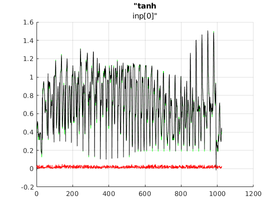
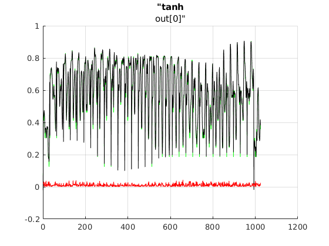
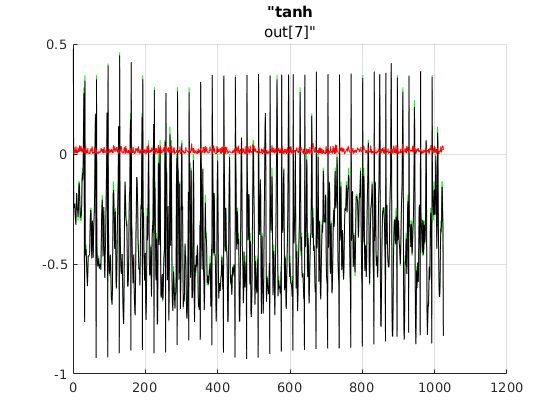
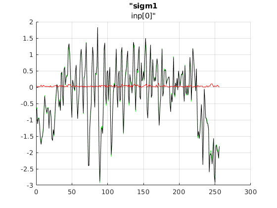
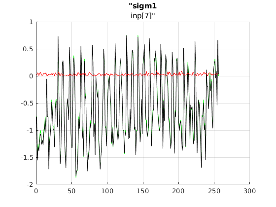

<!--
Copyright 2021 Xilinx Inc.

Licensed under the Apache License, Version 2.0 (the "License");
you may not use this file except in compliance with the License.
You may obtain a copy of the License at

http://www.apache.org/licenses/LICENSE-2.0

Unless required by applicable law or agreed to in writing, software
distributed under the License is distributed on an "AS IS" BASIS,
WITHOUT WARRANTIES OR CONDITIONS OF ANY KIND, either express or implied.
See the License for the specific language governing permissions and
limitations under the License.

Author: Daniele Bagni, Xilinx Inc
-->


<div style="page-break-after: always;"></div>
<table style="width:100%">
  <tr>
    <th width="100%" colspan="6"><h1> Partitioning Vitis AI SubGraphs on CPU/DPU </h1>
</th>
  </tr>
</table>
</div>

### Current status

1. Tested with Vitis AI 1.3.2 (with [April 2021 Patch](https://github.com/Xilinx/Vitis-AI/blob/master/docs/quick-start/install/Vitis%20AI%201.3.2%20April%202021%20Patch.md)) on an Ubuntu 16.04.7 Desktop PC.

2. Tested in hardware on ZCU102 and ZCU104 boards respectively with  ``xilinx-zcu102-dpu-v2020.2-v1.3.1.img.gz`` and ``xilinx-zcu104-dpu-v2020.2-v1.3.1.img.gz`` sd cards.

3. Tested in hardware with Depth-Wise Convolution enabled on XVDPU TRD with VCK190 ES1 in Vitis 2020.2 environment.


**date: 7 May 2021**


### Acknowledgements

Thanks to the support I have received from  my colleagues [Eddy DW](mailto@eddydw.xilinx.com) (SSH remote debugging with VSC), [Giovanni Guasti]((mailto@gguasti.xilinx.com) (PyTorch background material), [Jon Cory](mailto@jcory.xilinx.com) (Yolov4 subgraphs internal design) and [Mark Harvey](mailto@mharvey.xilinx.com) ([pytorch tutorial](https://github.com/Xilinx/Vitis-Tutorials/tree/master/Machine_Learning/Design_Tutorials/09-mnist_pyt-master) and subgraphs).  
In particular, most of the python code of this tutorial comes from  [Mark Harvey](mailto@mharvey.xilinx.com)'s pytorch tutorial for the host side and from [Jon Cory](mailto@jcory.xilinx.com) 's pioneering subgraphs work on the target side, in both cases I have modified the code accordingly to my needs.


# 1 Introduction

In this Deep Learning (DL) tutorial, you will learn how to deploy a CNN on
the Xilinx&reg; [VCK190](https://www.xilinx.com/products/boards-and-kits/vck190.html) board using Vitis&trade; AI, which is a set of
optimized IP, tools libraries, models and example designs valid for AI inference on both Xilinx edge devices
and [Alveo](https://www.xilinx.com/products/boards-and-kits/alveo.html) cards.

The Vitis AI deployment process requires to quantize the floating point CNN model into INT8 (8-bit) fixed point and then compile the application and run it on the
embedded system composed by the Deep Processor Unit (DPU) and the ARM CPU of the target board.
In particular the VCK190 board applies the DPUCVDX8G IP soft core.

The CNN of this example has some layers not yet supported by the DPU, therefore the Vitis AI compiler has to split the CNN into subgraphs and the user has to manually partition such subgraphs among the ARM CPU and the DPU tasks. This tutorial aims to illustrate the procedure to create and test the target board application with such CPU/DPU subgraphs partitioning.

The training is done using the PyTorch virtual environment inside  Vitis AI, in order to correctly classify two similar objects - ``automobile`` and ``truck`` - taken from the [CIFAR10](https://www.cs.toronto.edu/~kriz/cifar.html)  dataset, a collection of 32x32x3 RGB images with ten different classes.

This repository is organized in the following folders:
- [doc](files/doc): it  contains the figures of this README.md file;
- [build](files/build): it holds the outputs produced at any step of the Vitis AI flow, there is also the pre-trained CNN floating point model, named ``cnn_float.pt``, and placed in the subfolder [data](files/build/data), in case you want to skip the training process to save time;
- [application](files/application):  the application to be launched on the target board.


# 2 Prerequisites

- Ubuntu 16.04.7 host PC.

- The entire repository of [Vitis AI stack release 1.3.2](https://github.com/Xilinx/Vitis-AI) from [www.github.com/Xilinx](https://www.github.com/Xilinx).

-  Accurate reading of [Vitis AI User Guide UG1414 v1.3](https://www.xilinx.com/support/documentation/sw_manuals/vitis_ai/1_3/ug1414-vitis-ai.pdf). In particular:

  1. "Vitis AI Overview" in Chapter 1 with DPU naming and guidelines to download the tools container available from [docker hub](https://hub.docker.com/r/xilinx/vitis-ai/tags) and the Runtime Package for edge (MPSoC) devices.
  2. "Installation and Setup" instructions of Chapter 2 for both host and target, it is recommended you build a GPU-based docker image.
  3. "Quantizing the Model" in Chapter 4 and "Compiling the Model" in Chapter 5.
  4. "Programming with VART" APIs in Chapter 6.


- The [VCK190](https://www.xilinx.com/products/boards-and-kits/vck190.html) evaluation board with its image file, which contains a pre-built working design for the VCK190 with the DPUCVDX8G, renamed shortly as "XVDPU" in the following of this document.

- Alternatively to VCK190, you can also use the [ZCU102](https://www.xilinx.com/products/boards-and-kits/ek-u1-zcu102-g.html) with its [image file](https://www.xilinx.com/bin/public/openDownload?filename=xilinx-zcu102-dpu-v2020.2-r1.3.0.2.0.img.gz), which contains a pre-built working design for the ZCU102 with the DPUCZDX8G (renamed shortly as "DPUv2"), or the [ZCU104](https://www.xilinx.com/products/boards-and-kits/ek-u1-zcu104-g.html) with its [image file](https://www.xilinx.com/bin/public/openDownload?filename=xilinx-zcu104-dpu-v2020.2-r1.3.0.2.0.img.gz).

- (Optional) Either [MATLAB](https://uk.mathworks.com/products/matlab.html) or [GNU Octave](https://www.gnu.org/software/octave/index) just to launch the only ``*.m`` script in this repository.

- (Optional) [Visual Studio Code](https://code.visualstudio.com) (shortly VSC), for SSH remote debugging the application on the target board from the host PC.

- Familiarity with Deep Learning principles.


### Dos-to-Unix Conversion

In case you might get some strange errors during the execution of the scripts, you have to pre-process -just once- all the``*.sh`` shell and the python ``*.py`` scripts with the [dos2unix](http://archive.ubuntu.com/ubuntu/pool/universe/d/dos2unix/dos2unix_6.0.4.orig.tar.gz) utility.
In that case run the following commands from your Ubuntu host PC (out of the Vitis AI docker images):
```bash
sudo apt-get install dos2unix
cd <WRK_DIR> #your working directory
for file in $(find . -name "*.sh"); do
  dos2unix ${file}
done
```

### Working Directory

In the following of this document it is assumed you have installed Vitis AI 1.3.2 somewhere in your file system and this will be your working directory ``<VAI_DIR>``, for example in my case ``<VAI_DIR>`` is set to
``~/ML/Vitis-AI.1.3.2``.  You have also created a folder named ``tutorials`` under such ``<VAI_DIR>`` and you have copied this tutorial there and renamed it ``VAI-SUBGRAPHS``:

```text
Vitis-AI-1.3.2   # your VAI_DIR
   ├── data
   ├── demo
   ├── docs
   ├── dsa
   ├── examples
   ├── external
   ├── models
   │   └── AI-Model-Zoo
   ├── setup
   │   ├── alveo
   │   ├── docker
   │   └── mpsoc
   ├── tools
   │   ├── Vitis-AI-* # different subfolders
   └── tutorials      # created by you
       ├── 08-tf2_flow
       ├── 09-mnist_pyt-master
       ├── VAI-SUBGRAPHS # this repo
           ├── files
               ├── application
               ├── build
                   ├── ref_log
               ├── doc
```  

Note that for your comfort the reference log files for each step of the flow are placed in the [ref_log](files/build/ref_log) folder.  


# 3 The Docker Tools Image

You have to know few things about [Docker](https://docs.docker.com/) in order to run the Vitis AI smoothly on your host environment.

## 3.1 Installing Docker Client/Server

To [install docker client/server](https://docs.docker.com/engine/install/ubuntu/)  for Ubuntu, execute the following commands:

```shell
sudo apt-get remove docker docker-engine docker.io containerd runc
sudo apt-get update
sudo apt-get install apt-transport-https ca-certificates curl gnupg lsb-release
curl -fsSL https://download.docker.com/linux/ubuntu/gpg | sudo gpg --dearmor -o /usr/share/keyrings/docker-archive-keyring.gpg
echo "deb [arch=amd64 signed-by=/usr/share/keyrings/docker-archive-keyring.gpg] https://download.docker.com/linux/ubuntu $(lsb_release -cs) stable" | sudo tee /etc/apt/sources.list.d/docker.list > /dev/null
sudo apt-get update
sudo apt-get install docker-ce docker-ce-cli containerd.io
sudo docker run hello-world
docker version
```

Once done, in my case, I could see the following:
```
Client: Docker Engine - Community
 Version:           20.10.5
 API version:       1.41
 Go version:        go1.13.15
 Git commit:        55c4c88
 Built:             Tue Mar  2 20:18:15 2021
 OS/Arch:           linux/amd64
 Context:           default
 Experimental:      true

Server: Docker Engine - Community
 Engine:
  Version:          20.10.5
  API version:      1.41 (minimum version 1.12)
  Go version:       go1.13.15
  Git commit:       363e9a8
  Built:            Tue Mar  2 20:16:12 2021
  OS/Arch:          linux/amd64
  Experimental:     false
 containerd:
  Version:          1.4.4
  GitCommit:        05f951a3781f4f2c1911b05e61c160e9c30eaa8e
 runc:
  Version:          1.0.0-rc93
  GitCommit:        12644e614e25b05da6fd08a38ffa0cfe1903fdec
 docker-init:
  Version:          0.19.0
  GitCommit:        de40ad0
```

## 3.2 Build the Docker GPU Image

Download the [Vitis AI 1.3.2](https://github.com/Xilinx/Vitis-AI/tree/v1.3.2) and execute the [docker_build_gpu.sh](https://github.com/Xilinx/Vitis-AI/blob/v1.3.2/setup/docker/docker_build_gpu.sh) script.

Once done that, to list the currently available docker images run:
```bash
docker images # to list the current docker images available in the host pc
```
and you should see something like in the following text:
```text
REPOSITORY            TAG                               IMAGE ID       CREATED         SIZE
xilinx/vitis-ai-gpu   latest                            7623d3de1f4d   6 hours ago     27.9GB
```

Note that docker does not have an automatic garbage collection system as of now. You can use this command to do a manual garbage collection:
```
docker rmi -f $(docker images -f "dangling=true" -q)
```


## 3.3 Install Packages and Patches on the Vitis AI Tools Container  

According to the [April 2021 Patch](https://github.com/Xilinx/Vitis-AI/blob/master/docs/quick-start/install/Vitis%20AI%201.3.2%20April%202021%20Patch.md), Vitis AI 1.3.2 requires some new packages to be installed in all the conda virtual environments of the docker tools container.
For example, in the case of pytorch (which applies python 3.6) you would have to execute the following commands:

```bash
cd <WRK_DIR>
./docker_run.sh xilinx/vitis-ai-gpu:latest     
sudo su # you must be root
conda activate vitis-ai-pytorch # as root, enter into Vitis AI PyTorch (anaconda-based) virtual environment
sudo env PATH=/opt/vitis_ai/conda/bin:$PATH
CONDA_PREFIX=/opt/vitis_ai/conda/envs/vitis-ai-pytorch
conda install unilog-1.3.2-h7b12538_35.tar.bz2
conda install target_factory-1.3.2-hf484d3e_35.tar.bz2
conda install xir-1.3.2-py36h7b12538_47.tar.bz2
#conda install xir-1.3.2-py37h7b12538_47.tar.bz2 # good only for python 3.7
conda install xcompiler-1.3.2-py36h7b12538_53.tar.bz2
#conda install xcompiler-1.3.2-py37h7b12538_53.tar.bz2 # good only for python 3.7
conda install xnnc-1.3.2-py36_48.tar.bz2
#conda install xnnc-1.3.2-py37_48.tar.bz2 # good only for python 3.7
```

This tutorial requires also some packages that were not included in the original Vitis AI tools container.
Following the previous commands, here are the further commands to include such packages:
```bash
pip install torchsummary
conda deactivate
exit # to exit from root
conda activate vitis-ai-pytorch # as normal user, enter into Vitis AI TF (anaconda-based) virtual environment
```

Note that if you exit from the current Docker Vitis AI tools image you will lose all the installed packages, so to save all changes in a new docker image open a new terminal and run the following commands:

```bash
sudo docker ps -l # To get the Docker CONTAINER ID
```
you will see the following text (the container ID might have a different number):

```text
CONTAINER ID        IMAGE                        COMMAND                CREATED             STATUS              NAMES
7c9927375b06        xilinx/vitis-ai-gpu:latest   "/etc/login.sh bash"   30 minutes ago      Up 30 minutes       heuristic_lamport
```
now save the modified docker image:

```bash
sudo docker commit -m"comment" 7c9927375b06 xilinx/vitis-ai-gpu:latest
```


## 3.4 Launch the Docker Image

To launch the docker container with Vitis AI tools, execute the following commands from the ``<VAI_DIR>`` folder:

```bash
cd <VAI_DIR> # you are now in Vitis_AI subfolder
./docker_run.sh xilinx/vitis-ai-gpu:latest
conda activate vitis-ai-pytorch
cd /workspace/tutorials/
cd VAI-SUBGRAPHS/files #your working directory
```

Note that the container maps the shared folder ``/workspace`` with the file system of the Host PC from where you launch the above command, which is ``<VAI_DIR>`` in your case.
This shared folder enables you to transfer files from the Host PC to the docker container and vice versa.

The docker container does not have any graphic editor, so it is recommended that you work with two terminals and you point to the same folder, in one terminal you use the docker container commands and in the other terminal you open any graphic editor you like.


# 4 DPU and CPU SubGraphs of the CNN

The CNN model pytorch description is placed in the file [common.py](files/common.py), there are nine layers:

```
        Layer (type)               Output Shape         Param #
================================================================
            Conv2d-1           [-1, 16, 32, 32]             448
              Tanh-2           [-1, 16, 32, 32]               0
         MaxPool2d-3           [-1, 16, 16, 16]               0
            Conv2d-4            [-1, 8, 16, 16]           1,160
           Sigmoid-5            [-1, 8, 16, 16]               0
         MaxPool2d-6              [-1, 8, 8, 8]               0
            Linear-7                   [-1, 32]          16,416
           Sigmoid-8                   [-1, 32]               0
            Linear-9                    [-1, 2]              66
================================================================
Total params: 18,090
Trainable params: 18,090
```

The three [activation](https://medium.com/@omkar.nallagoni/activation-functions-with-derivative-and-python-code-sigmoid-vs-tanh-vs-relu-44d23915c1f4) layers - ``Tanh-2`` ``Sigmoid-5`` and ``Sigmoid-9`` -  are not supported by the DPU and therefore they need to be implemented into the ARM CPU either in Python or in C++ code, whereas all the remaining layers can run directly on the DPU soft core.

The whole flow, from training to quantization and compilation with Vitis AI can be launched with the command:

```shell
source ./run_all.sh
```

If you want to skip the training just comment the lines:
```shell
# clean folders
bash ./clean_all.sh
# run training
python -u train.py --epochs 300  2>&1 | tee ./build/train.log
```

After 300 epochs of training, you will get the following average prediction accuracy:

```text
2021-04-27 15:14:24.690039 Epoch   1, Training loss 0.693629
. . .
2021-04-27 15:16:18.100670 Epoch 280, Training loss 0.356417
2021-04-27 15:16:20.918139 Epoch 290, Training loss 0.346459
2021-04-27 15:16:23.683177 Epoch 300, Training loss 0.341114

Elapsed time for training (s):  119.680281
-----------------bird_867-----------------------------------------------
Trained model written to  ./build/data/cnn_float.pt
Accuracy train: 85.99(%)
Accuracy val  : 84.70(%)
```

Once launched the quantization, the average prediction accuracy on the validation data becomes:

```text
Accuracy train: 86.02(%)
Accuracy val  : 84.65(%)
```

The related reference log files for each step of the flow are placed in the [ref_log](files/build/ref_log) folder.  In particular the ``compile.log`` file reports seven subgraphs of which three running on the DPU as illustrated in the following text fragment:

```text
[UNILOG][INFO] Total device subgraph number 7, DPU subgraph number 3
```

Figure 1, related to [cnn_int8_xmodel.png](files/doc/images/cnn_int8_xmodel.png), shows  the seven subgraphs:
- the first green colored block is related to the input tensor,
- the three macro-blocks containing blue colored sub-blocks are the three subgraphs running on the DPU,
- the remaining three macro-blocks containing red colored sub-blocks are the three subgraphs that have to run on the ARM CPU (once the user has written the related software routines).

The same information more or less can be found also in the text file [cnn_int8_subgraph_tree.txt](files/doc/images/cnn_int8_subgraph_tree.txt). Both files were generated by the script [analyze_subgraphs.sh](files/analyze_subgraphs.sh), which makes use of the Vitis AI ``XIR`` (Xilinx Intermediate Representation) APIs.


*Figure 1: CNN block diagram with seven subgraphs.*


# 5 Target Application

The python application running on the target board is in the [main_subgraphs.py](files/application/main_subgraphs.py) file, such application mirrors what illustrated in the  [cnn_int8_xmodel.png](files/doc/images/cnn_int8_xmodel.png) block diagram of the DPU/CPU subgraphs (or alternatively in [cnn_int8_subgraph_tree.txt](files/doc/images/cnn_int8_subgraph_tree.txt)),
in particular for what concerns the names of input and output tensors.

Once identified the 3 DPU subgraphs that follow the input layer and its related subgraph in the ``app()`` subroutine, you assign each of them to a DPU Runner and launch all of them,  as shown in the following fragment of code:
```python
...
dpu_1 = vart.Runner.create_runner(dpu_subgraph1, "run")
dpu_3 = vart.Runner.create_runner(dpu_subgraph3, "run")
dpu_5 = vart.Runner.create_runner(dpu_subgraph5, "run")
...
runDPU(dpu_1, dpu_3, dpu_5, img)
```

Note that in the ``runDPU()`` subroutine you have to execute them asynchronously via the ``execute_async()`` function, as illustrated in the following code:
```python
...
# run DPU
execute_async(
    dpu_1, {
        "CNN__input_0_fix": img_org,
        "CNN__CNN_Conv2d_conv1__18_fix": out1
    })
inp2 = out1.copy() # for cache coherency
out2 = Tanh(inp2)  # CPU task
# run DPU
execute_async(
    dpu_3, {
        "CNN__CNN_Tanh_act1__19_fix": out2,
        "CNN__CNN_Conv2d_conv2__35_fix": out3
    })
inp4 = out3.copy()    # for cache coherency
out4 = Sigmoid1(inp4) # CPU task
# run DPU
execute_async(
    dpu_5, {
        "CNN__CNN_Sigmoid_act2__36_fix": out4,
        "CNN__CNN_Linear_fc1__48_fix":   out5
    })
inp6 = out5.copy()    # for cache coherency
out6 = Sigmoid2(inp6) # CPU task
```

For example line 15 of [cnn_int8_subgraph_tree.txt](files/doc/images/cnn_int8_subgraph_tree.txt) file contains the input and output tensors of the first DPU subgraph ``subgraph_CNN__CNN_Conv2d_conv1__18``, which are named respectively ``CNN__input_0_fix`` and ``CNN__CNN_Conv2d_conv1__18_fix``.
The same happens for line 20 related to the second subgraph ``subgraph_CNN__CNN_Conv2d_conv2__35`` with input ``CNN__CNN_Tanh_act1__19_fix`` and output ``CNN__CNN_Conv2d_conv2__35_fix`` tensors and for line 26 related to the third subgraph ``subgraph_CNN__CNN_Linear_fc1__48`` with input ``CNN__CNN_Sigmoid_act2__36_fix`` and output ``CNN__CNN_Linear_fc1__48_fix`` tensors.

The  subgraphs running on the ARM CPU are: ``Tanh()``, ``Sigmoid1()`` and ``Sigmoid2()``.  The last two routines are the same, but they were renamed differently to make easier the debug process.

The output of each DPU subgraph is copied as input tensor to the next CPU subgraph. Be very careful with the names of the tensors, there must be no mismatches at all.

Note that the size of the output buffers was set accordingly to [cnn_int8_subgraph_tree.txt](files/doc/images/cnn_int8_subgraph_tree.txt) as illustrated in the following code fragment:

```python
inputTensor_1  = dpu_1.get_input_tensors()
outputTensor_1 = dpu_1.get_output_tensors()
inputTensor_3  = dpu_3.get_input_tensors()
outputTensor_3 = dpu_3.get_output_tensors()
inputTensor_5  = dpu_5.get_input_tensors()
outputTensor_5 = dpu_5.get_output_tensors()
...
out1 = np.zeros([1, 32, 32, 16], dtype='float32')
out3 = np.zeros([1, 16, 16,  8], dtype='float32')
out5 = np.zeros([1, 32        ], dtype='float32')
...
```

If you set the output format for ``float32``, you do not need to convert from ``int8`` to ``float32``, because ``VART`` APIs will do it automatically. But if you write:

```python
out1 = np.zeros([1, 32, 32, 16], dtype=‘int8’)
```
as opposed to:

```python
out1 = np.zeros([1, 32, 32, 16], dtype='float32')
```
then you would need to manually convert the data from ``int8`` to ``float32`` with code similar to this one:

```python
fix_points = [ -1 * t.get_attr('fix_point') for t in dpu_1.get_output_tensors() ]
print("fix_points dpu1={}".format(fix_points))
scales = np.exp2(fix_points, dtype=np.float32)
print("scales dpu1={}".format(scales))
print("\n".join([t.name for t in dpu_1.get_input_tensors()]))
print("\n".join([t.name for t in dpu_1.get_output_tensors()]))
o1_cvrt = fix2float(fix_points[0], out1)
print("output1 tensor={}".format(outputTensor_1[0]))
print("output1 converted: \n")
print(o1_cvrt)
```


# 6 Functional Debug

To check the correct functional behavior of the CPU/DPU subgraphs partitioning, first you have to set in the python code the following variable:
```python
DEBUG = True
```
which will enable the launch of ``DEBUG_runDPU()`` routine, second I recommend the following procedure (which I have applied with only one input test picture):

1. Copy with ``scp`` utility the ``target.tar`` archive from the host to the target board, then launch the application on the target board and collect the ``*.bin.npy`` output intermediate results. Store the results on a tar archive and copy it back from the target to the host PC in the ``build/target/application`` subfolder. You can launch the application using either VSC GUI (see [Appendix A1](#a1-ssh-debug-with-visual-studio-code)) or the following command lines:
  ```shell
  # from host PC assuming target board IP address would be 192.168.1.40)
  cd /workspace/tutorials/VAI-SUBGRAPHS/files/ # your working directory
  scp ./build/target.tar root@192.168.1.40:~/
  ssh -X root@192.168.1.40 # password: root
  # from target board
  tar -xvf target.tar
  cd ./target/application/
  python3 main_subgraphs.py --model CNN_int_zcu102.xmodel 2>&1 | tee target_run.log
  #from host
  cd ./build/target/application /
  scp root@192.168.1.40:~/target/application/*.bin.npy .     # copy output npy files
  scp root@192.168.1.40:~/target/application/*.log ../../log # copy log file
  ```

2. From the host, launch the command (for your comfort it is already included in the script ``prepare_target.sh``):
  ```shell
  cd /workspace/tutorials/VAI-SUBGRAPHS/files/ # your working directory
  python -c "import common; dbg_model=common.RUN_CNN_DEBUG('./build/target/application/test')" \
      2>&1 | tee ./build/log/functional_debug1_on_host.log
  mv *.bin.npy ./build/target/application/
  ```
  and collect the ``ref_*.bin.npy``  reference intermediate results (to be compared later against the respective ones computed on the target).

3. Launch the ``run_debug.py`` script on the host to generate the ``*.csv`` files that can be read also in MATLAB or GNU Octave (or also MS Excel):
  ```shell
  cd /workspace/tutorials/VAI-SUBGRAPHS/files/ # your working directory
  cd ./build/target/application
  python3 run_debug.py 2>&1 | tee ../../log/functional_debug2_on_host.log
  ```

4. Launch the script ``run_debug.m`` either directly from [MATLAB](https://uk.mathworks.com/products/matlab.html) or [GNU Octave](https://www.gnu.org/software/octave/index)) GUIs. This script computes the differences between reference host results and actual target results (from ``*.csv`` files) and plot them on the next Figures from 3 to 15.


For step 1 I have found [Visual Studio Code](https://code.visualstudio.com) very useful, as illustrated in the screenshot of Figure 2:


*Figure 2: SSH remote debugging with VSC.*


## 6.1 Inspect Tensors with XIR APIs

Running the following fragment of python application code on the target:
```python
inputTensor_1  = dpu_1.get_input_tensors()
outputTensor_1 = dpu_1.get_output_tensors()
inputTensor_3  = dpu_3.get_input_tensors()
outputTensor_3 = dpu_3.get_output_tensors()
inputTensor_5  = dpu_5.get_input_tensors()
outputTensor_5 = dpu_5.get_output_tensors()

if DEBUG:
    print(" inputTensor1\n", inputTensor_1)
    print("outputTensor1\n", outputTensor_1)
    print(" inputTensor3\n", inputTensor_3)
    print("outputTensor3\n", outputTensor_3)
    print(" inputTensor5\n", inputTensor_3)
    print("outputTensor5\n", outputTensor_3)
```
will show the following outputs:

```text
inputTensor1={name: 'CNN__input_0_fix', shape: [1, 32, 32, 3], type: 'xint8', attrs: {'ddr_addr': 112, 'fix_point': 6, 'location': 1, 'round_mode': 'DPU_ROUND', 'bit_width': 8, 'if_signed': True, 'reg_id': 2}}

outputTensor1={name: 'CNN__CNN_Conv2d_conv1__18_fix', shape: [1, 32, 32, 16], type: 'xint8', attrs: {'ddr_addr': 0, 'fix_point': 4, 'location': 1, 'round_mode': 'DPU_ROUND', 'bit_width': 8, 'if_signed': True, 'reg_id': 3}}

 inputTensor3={name: 'CNN__CNN_Tanh_act1__19_fix', shape: [1, 32, 32, 16], type: 'xint8', attrs: {'ddr_addr': 0, 'fix_point': 7, 'location': 1, 'round_mode': 'DPU_ROUND', 'bit_width': 8, 'if_signed': True, 'reg_id': 2}}

outputTensor3={name: 'CNN__CNN_Conv2d_conv2__35_fix', shape: [1, 16, 16, 8], type: 'xint8', attrs: {'ddr_addr': 0, 'fix_point': 4, 'location': 1, 'round_mode': 'DPU_ROUND', 'bit_width': 8, 'if_signed': True, 'reg_id': 3}}

 inputTensor5={name: 'CNN__CNN_Sigmoid_act2__36_fix', shape: [1, 16, 16, 8], type: 'xint8', attrs: {'ddr_addr': 0, 'fix_point': 7, 'location': 1, 'round_mode': 'DPU_ROUND', 'bit_width': 8, 'if_signed': True, 'reg_id': 2}}

outputTensor5={name: 'CNN__CNN_Linear_fc1__48_fix', shape: [1, 32], type: 'xint8', attrs: {'ddr_addr': 0, 'fix_point': 6, 'location': 1, 'round_mode': 'DPU_ROUND', 'bit_width': 8, 'if_signed': True, 'reg_id': 3}}
```


## 6.2 Check Numerical Results

Figures 3 to 15 illustrate the small numerical differences between the results computed by the CNN model running on the host PC in floating point (files named ``ref_*.csv``) and the results computed by the DPU/CPU  partitioning on the target board (same ``*.csv`` file names without the prefix ``ref_``).  Since this last one computation is a mix of floating point (ARM CPU) and fixed point (DPU), the difference is really small and as expected.

In conclusion there is a very good match in the numerical results and so you can state that the target application works correctly as expected.

Note that although the [run_debug.m](files/application/run_debug.m) script checks the differences between few I/O tensors at every layer, the [run_debug.py](files/application/run_debug.py) computes the absolute differences for all the I/O tensors and then it computes also the sum of such absolute differences (SAD), normalized to the size of the 2D or 3D tensor. The SAD values are always very small, as expected.



*Figure 3:  tensor 0 in input to Tanh layer, float32 (black) int8 (green) and their difference (red)*


*Figure 4:  tensor 7 in input to Tanh layer, float32 (black) int8 (green) and their difference (red)*


*Figure 5:  tensor 15 in input to Tanh layer, float32 (black) int8 (green) and their difference (red)*



*Figure 6:  tensor 0 output from Tanh layer, float32 (black) int8 (green) and their difference (red)*




*Figure 7:  tensor 7 output from Tanh layer, float32 (black) int8 (green) and their difference (red)*


*Figure 8:  tensor 15 output from Tanh layer, float32 (black) int8 (green) and their difference (red)*



*Figure 9:  tensor 0 in input to first Sigmoid layer, float32 (black) int8 (green) and their difference (red)*



*Figure 10:  tensor 7 in input to first Sigmoid layer, float32 (black) int8 (green) and their difference (red)*


*Figure 11:  tensor 0 output from first Sigmoid layer, float32 (black) int8 (green) and their difference (red)*


*Figure 12:  tensor 7 output from first Sigmoid layer, float32 (black) int8 (green) and their difference (red)*


*Figure 13:  input tensor to second Sigmoid layer, float32 (black) int8 (green) and their difference (red)*


*Figure 14:  tensor output from second Sigmoid layer, float32 (black) int8 (green) and their difference (red)*


# 7 Run Predictions

## 7.1 ZCU102

To run predictions on the target board, you have to set in the python code the following variable:
```python
DEBUG = False
```
which will enable the launch of ``runDPU()`` routine, then you can launch the application using either VSC GUI (see [Appendix A1](#a1-ssh-debug-with-visual-studio-code)) or the following command lines:

```shell
  # from ZCU102 target board
  cd ./target/application/
  python3 main_subgraphs.py --model CNN_int_zcu102.xmodel
```
and you should see something like this:

```text
Command line options:
 --images_dir :  ../test_images
 --model      :  CNN_int_zcu102.xmodel

Found 2000 images - processing 2000 of them
Pre-processing  2000  images
run DPU

FPS=96.92, total frames = 2000 , time=20.6361 seconds

Post-processing
Correct:  1552  Wrong:  448  Accuracy:  0.776
```

## 7.2 ZCU104

Similarly to the ZCU102 case, you have to execute the following command lines on ZCU104 board:

```shell
  # from ZCU104 target board
  cd ./target/application/
  python3 main_subgraphs.py --model CNN_int_zcu104.xmodel
```

and you should see something like this:

```text
Command line options:
 --images_dir :  ../test_images
 --model      :  CNN_int_zcu104.xmodel

Found 2000 images - processing 2000 of them
Pre-processing  2000  images
run DPU

FPS=94.92, total frames = 2000 , time=21.0695 seconds

Post-processing
Correct:  1552  Wrong:  448  Accuracy:  0.776
```


## 7.3 VCK190 ES1

The sd card was generated with Depth-Wise Convolution enabled on [Versal DPU TRD](https://www.xilinx.com/member/versal-ml-ea.html#versal-dpu-trd) with VCK190 ES1 in Vitis 2020.2 environment (you need to be registered at the Versal ML Early Access Lounge), using architecture ``DPUCVDX8G_ISA0_B8192C32B3_DW``; you might need to edit manually the ``/opt/vitis_ai/compiler/arc/DPUCVDX8G/VCK190/arch.json`` file
of your Vitis AI conda environment to enable it, as in the following:
```
{
      "target": "DPUCVDX8G_ISA0_B8192C32B3_DW"
}
```
then the file was renamed as ``arch_dw.json`` and used accordingly in the ``compile.sh`` script.

Similarly to the ZCU102 case, you have to execute the following command lines on VCK190 board:

```shell
  # from ZCU104 target board
  cd ./target/application/
  python3 main_subgraphs.py --model CNN_int_vck190_dw.xmodel
```

and you should see something like this:

```text
Command line options:
 --images_dir :  ../test_images
 --model      :  CNN_int_vck190_dw.xmodel

Found 2000 images - processing 2000 of them
Pre-processing  2000  images
run DPU

FPS=243.75, total frames = 2000 , time=8.2052 seconds

Post-processing
Correct:  1552  Wrong:  448  Accuracy:  0.776
```


# Appendix

## A1 SHH Debug with Visual Studio Code

Download ``code_1.55.2-1618307277_amd64.deb`` package from [Visual Studio Code](https://code.visualstudio.com/download) website. Once done that, install it with the command:

```shell
sudo dpkg -i code_1.55.2-1618307277_amd64.deb
```

Turn on your target board, assuming its IP address be ``192.168.1.40`` for example, open VSC and press ``F1`` keyboard button and then type

```
Remote SSH: Connect Current Window to Host...
```

so that you can run [remote SSH debugging on a file hosted on the target board](https://code.visualstudio.com/blogs/2019/05/02/remote-development), as Figure A1 illustrates.

You can then open the folder ``/home/root/target/application`` as shown in Figure A2:


*Figure A1: Setting Visual Studio Code for remote SSH debugging.*


*Figure A2: Opening a folder from target board with SVC SSH debugging.*
