
<div style="page-break-after: always;"></div>
<table style="width:100%">
  <tr>
    <th width="100%" colspan="6"><h1>Vitis AI based Deployment Flow on VCK190</h1>
</th>
  </tr>
</table>
</div>

### Current status

1. Tested with Vitis AI 1.3

2. Tested with Vitis 2020.2

3. Tested in hardware on VCK190

4. Tested with VCK190 base platform

**Date: 15 Mar 2021**

# Introduction

Vitis AI, understood as the Xilinx’s development stack for AI inference on unified Xilinx hardware platforms has minimize the differentiation for model deployment flow on Versal devices. If you are looking for a quick machine learning inference demo on VCK190, this is probably not the tutorial you are looking for. Please visit the [Versal DPU Early Access](https://www.xilinx.com/member/versal-ml-ea.html#versal-dpu) page and download the [image file](https://www.xilinx.com/member/forms/download/design-license-xef.html?filename=Vitis-AI-xilinx_vck190_base_202010_1-2020-12-21.img.gz), which contains a pre-built working design for the VCK190 with the DPUCVDX8G (renamed shortly as "XVDPU"). This tutorial is design orienated and will start from platform integration which allow the user to do some hardware level customization if required. 

Generally speaking, users can easily get the inference work on VCK190 with following three steps.

 + Re-target to the new VCK190 platform during DPU integration
 + Re-compile the model based on VCK190 hardware constraint
 + Inference on board with the compiled model.

However, as the Versal device is still in EA stage during Vitis AI 1.3 release. There are some optimizations required to achive the best performance on board.  

# Inplementation

This section will lead you through the steps necessary to complete the integration
.
## Prerequisites

 + An x86 host machine with that meets the [sytem requirements](https://github.com/Xilinx/Vitis-AI/blob/master/doc/system_requirements.md) and internet access to download files.
 + Host machine with Xilinx design tools pre-installed (Vitis 2020.2 / Vivado 2020.2 / Petalinux 2020.2) 
 + Register to Xilinx  [Versal DPU Early Access](https://www.xilinx.com/member/versal-ml-ea.html#versal-dpu) lounge
 
## Step 0 - Download the TRDs and Setting up the Workspace.

Visit Versal DPU EA lounge and download the [Versal DPU TRD](https://www.xilinx.com/member/forms/download/design-license-xef.html?filename=xvdpu_trd_release-master.zip) as a zip file and then unzipped to a folder.

```shell
$ unzip xvdpu_trd_release-master.zip
```

Set the $TRD_HOME environment variable to the directory where you unzip the file.

```shell
$ export TRD_HOME =<DIRECTORY OF VCK190 XVDPU TRD>
```

Make sure the Early Access devices (Refer to [VCK190 EA Page](https://www.xilinx.com/member/vck190_headstart.html#started) ) are enabled by adding the following line to each of the tcl scripts:

`enable_beta_device *`

```shell
$HOME/.Xilinx/Vivado/Vivado_init.tcl
$HOME/.Xilinx/HLS_init.tcl
```

Open a linux terminal. Set the linux as Bash mode.

```shell
$ source <vitis install path>/Vitis/2020.2/settings64.sh
$ source opt/xilinx/xrt/setup.sh
$ source <petaLinux_tool_install_dir>/settings.sh
```

Visit the [VCK190 Base Platform TRD](https://github.com/Xilinx/vck190-base-trd) page and find the platform suits your application better. Download the corresponding reference design to the host machine as a zip file and then unzipped to a folder. Here I will take the platform1 as an example.

```shell
$ cd $TRD_HOME
<$TRD_HOME>$ unzip rdf0610-vck190_base_trd_platform1_2020.2_v0.5.zip
```

**Note**: It is assumed the platform is downloaded to the directory of $TRD_HOME.

## Step 1 - Prepare Software Boot Files

Please take [Versal Custom Platform Creation Tutorial](https://github.com/Xilinx/Vitis-Tutorials/blob/master/Vitis_Platform_Creation/Introduction/03_Edge_VCK190/step2.md) as a reference if you are building petalinux project from scratch. The following instructions assumes that the project is created based on the bsp file within the base platform repository.

```shell
<$TRD_HOME>$ cd vck190_base_trd_platform1_2020.2_v0.5/petalinux
<$TRD_HOME>/vck190_base_trd_platform1_2020.2_v0.5/petalinux$ petalinux-create -t project -s xilinx-vck190-prod-base-trd-platform1-2020.2.bsp
<$TRD_HOME>/vck190_base_trd_platform1_2020.2_v0.5/petalinux$ cd xilinx-vck190-prod-base-trd-platform1-2020.2
<$TRD_HOME>/vck190_base_trd_platform1_2020.2_v0.5/petalinux/xilinx-vck190-prod-base-trd-platform1-2020.2$ petalinux-config
```

A petalinux-config menu would be launched, Set to modify the format of rootfs package in this configuration window.

 + Select **Image Packaging Configuration -> Root filesystem formats**
 + Modify it to ```ext4```. 
 + Select **OK -> Exit -> Exit -> Yes** to close this window.
 
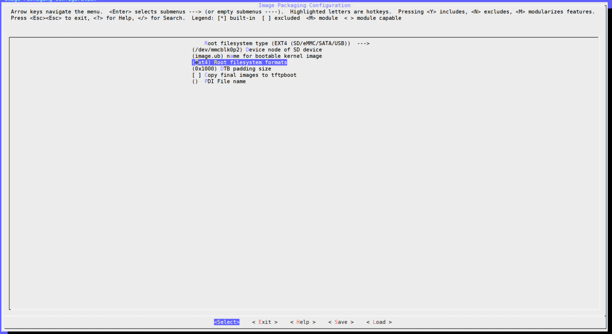

As the Vitis AI packages for versal devices are not included in the 2020.2 release, the following steps are required to copy the corresponding recipes manually from Versal DPU TRD.

```shell
<$TRD_HOME>/vck190_base_trd_platform1_2020.2_v0.5/petalinux/xilinx-vck190-prod-base-trd-platform1-2020.2$ cd <$TRD_HOME>/vck190_platform/petalinux
<$TRD_HOME>/vck190_platform/petalinux$ petalinux-create -t project -s xilinx-vck190-base-trd.bsp
<$TRD_HOME>/vck190_platform/petalinux$ cp -r xilinx-vck190-base-trd-bsp/project-spec/meta-user/{recipes-vai,recipes-core} <$TRD_HOME>/vck190_base_trd_platform1_2020.2_v0.5/petalinux/xilinx-vck190-prod-base-trd-platform1-2020.2/project-spec/meta-user
<$TRD_HOME>/vck190_platform/petalinux$ cd <$TRD_HOME>/vck190_base_trd_platform1_2020.2_v0.5/petalinux/xilinx-vck190-prod-base-trd-platform1-2020.2
```

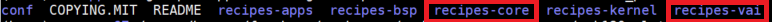

From any directory within the PetaLinux project, build the PetaLinux project.

```shell
<$TRD_HOME>/vck190_base_trd_platform1_2020.2_v0.5/petalinux/xilinx-vck190-prod-base-trd-platform1-2020.2$ petalinux-build
```

The PetaLinux image and rootfs files will be generated in <PetaLinux Project>/images/linux directory.

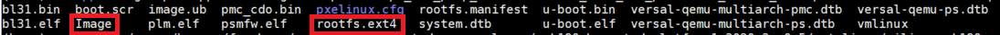

## Step 2 - Compile the Versal DPU

Enter the vitis_prj folder to modify the Makefile based on new platform and software package.

```shell
<$TRD_HOME>/vck190_base_trd_platform1_2020.2_v0.5/petalinux/xilinx-vck190-prod-base-trd-platform1-2020.2$ cd <$TRD_HOME>/vitis_prj
<$TRD_HOME>/vitis_prj$ vim Makefile
```

Disable the post_linker.tcl in v++ compiler to let the Vitis create the block design automatically.

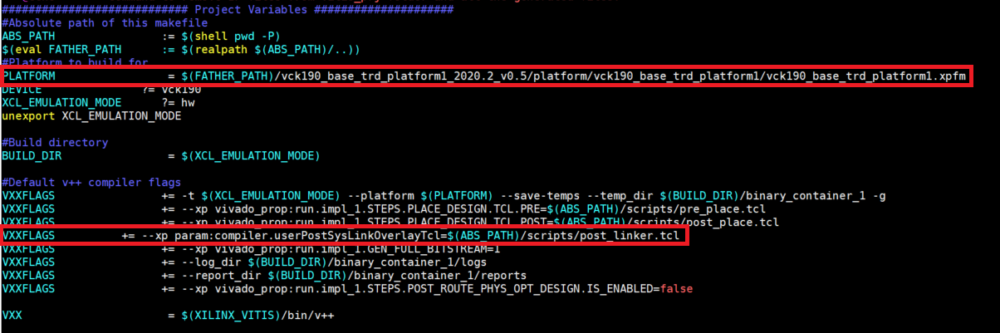

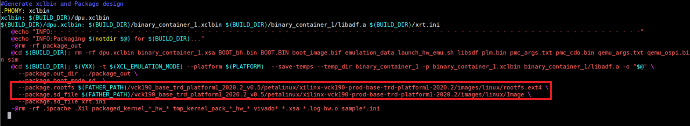

Then compile the DPU with following command.

```shell
<$TRD_HOME>/vitis_prj$ make files
<$TRD_HOME>/vitis_prj$ make all
```

You will find the BOOT.BIN and sd_card.img generated in the package_out folder.

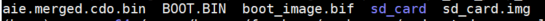

## Step 3 - Hardware Optimization for DPU (Recommanded)

The DPU integration is finished after **Step 2** and user could follow the instructions on [Versal DPU Early Access](https://www.xilinx.com/member/versal-ml-ea.html#versal-dpu) page to download the models and images for further validation.

However, as the VCK190 base platform is not adapted to the DPU very well, there are some optimization can apply to achieve a better performance.

For advanced Vivido users, you could directly use post_linker.tcl to finish the modification. A reference tcl file is attached in this tutorial as an example. The recommanded approach is to open the Vivado project and do the modification to the block design. The vivado project can be found at 

`<$TRD_HOME>/vitis_prj/hw/binary_container_1/link/vivado/vpl/prj`

+ Open the **prj.xpr** design with Vivado
+ Double-click the platform (yellow item)

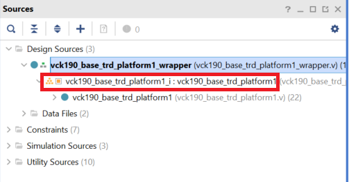

Then you will find the block design as below popping up

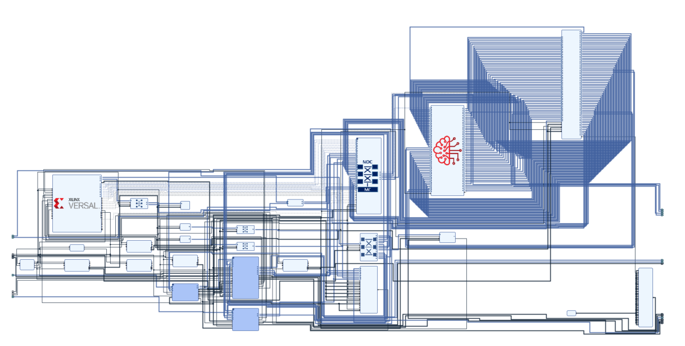

+ Double click the block **ai_engine_0** 
+ Change the **AI Engine Core Frequency** to **1333MHz**
+ Click **OK** to close the dialog

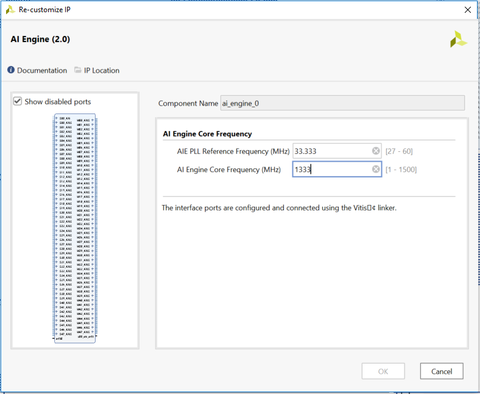

+ Double click the block **NOC_0**
+ Click the **General** tab
+ Increase the **Number of AXI Slave Interfaces** to **27**
+ Increase the **Number of AXI Slave Clocks** to **13**

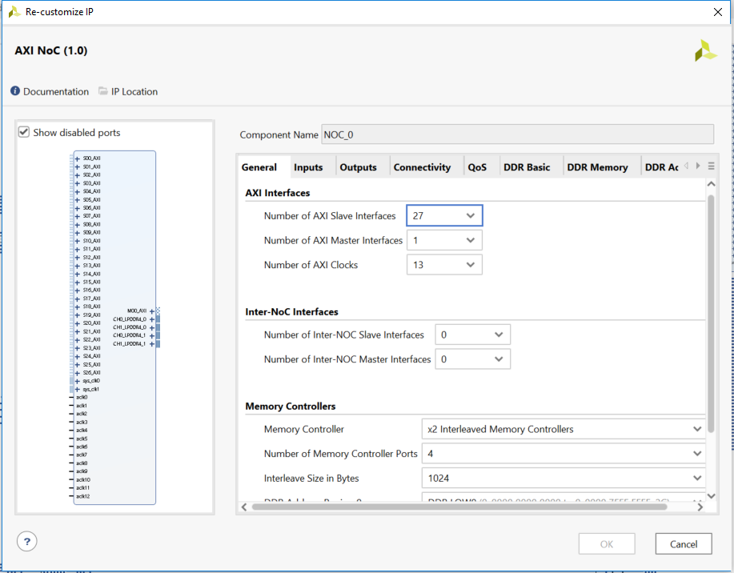

+ Click the **Inputs** tab
+ Change the clock of new added  **S15_AXI to S26_AXI** to **aclk12**

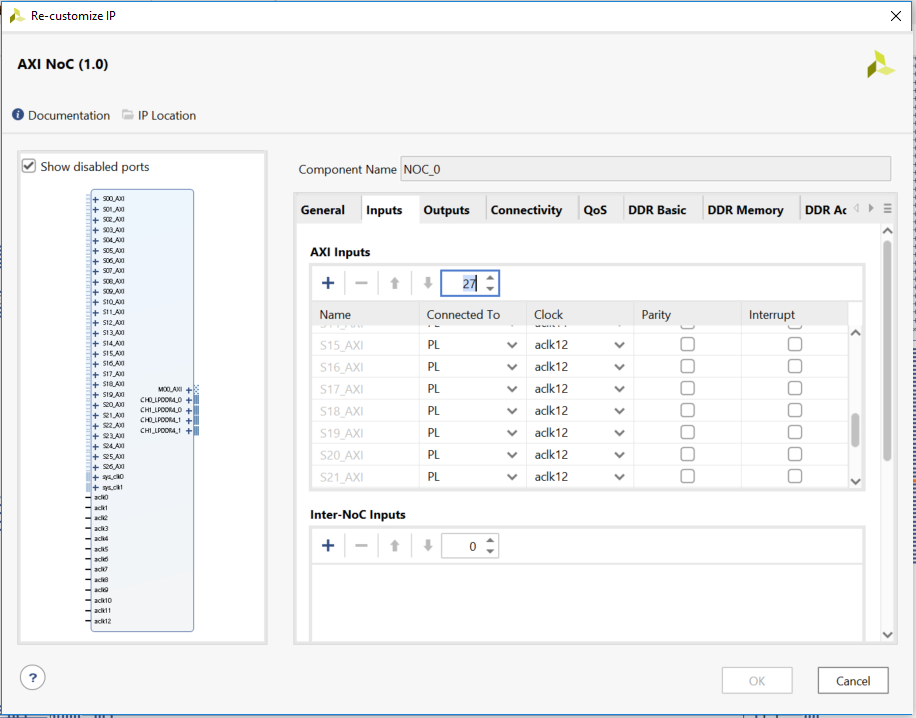

+ Click the **Connectivity** tab
+ Add the connections as shown below

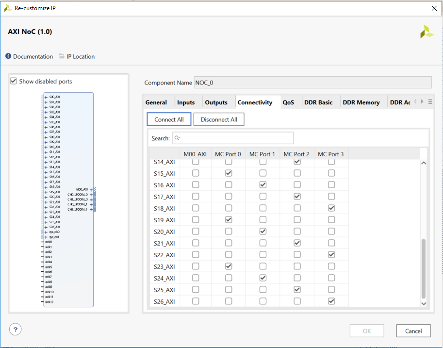

+ Click the **QoS** tab
+ Change **Bandwidth Read** of **S15_AXI**  to **64**
+ Change **Bandwidth Read** from **S16_AXI to S21_AXI** to **1000**
+ Change **Bandwidth Read** from **S22_AXI to S25_AXI** to **6000**
+ Change **Read Traffic Class** from **S22_AXI to S25_AXI** to **LOW_LATENCY**
+ Change **Bandwidth Read** of **S26_AXI**  to **1000**
+ Change **Bandwidth Write** from **S15_AXI to S26_AXI** to **32**
+ Click **OK** to close the dialog

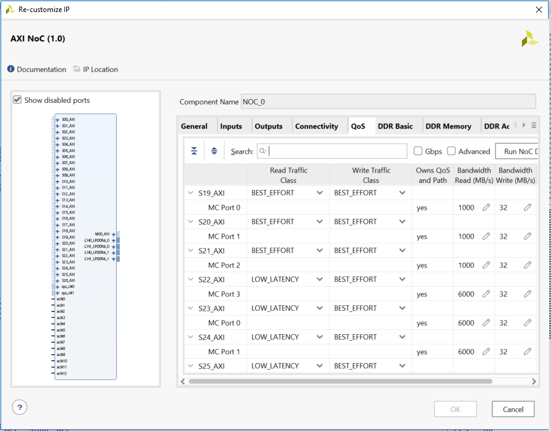

+ Disconnect the default connections of Pins from **M00_INSTR_AXI.INSERT_VIP to M00_BIAS_AXI.INSERT_VIP** of Block **DPUCVDX8G**
+ Connect the Pins from **M00_INSTR_AXI.INSERT_VIP to M00_BIAS_AXI.INSERT_VIP** of Block **DPUCVDX8G** to **S15_AXI to S26_AXI** of **NOC_0**

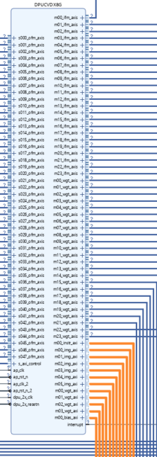

Add the clocking wizard block to generate three clocks:

+ Right click Diagram view and select **Add IP**.
+ Search for and add a **Clocking Wizard** from the IP Search dialog.
+ Rename the clock block to **clk_wiz_accel**
+ Double-click the **clk_wiz_accel** IP block to open the Re-Customize IP dialog box.
+ Click the **Output Clocks** tab.
+ Enable clk_out1 the Output Clock column. Set the **Output Freq Requested** to **333**
+ Click the **Optional Ports** tab.
+ Enable **Reset** port and At the bottom of the dialog box set the **Reset Type** to **Active Low**.


Add Processor System Reset blocks corresponging to the three clocks:

+ Right click Diagram view and select **Add IP**.
+ Search for and add a **Processor System Reset** from the IP Search dialog
+ Rename the reset block to **rst_processor_333MHz** so that it's easy to understand the relationship between reset modules and the clock signals.

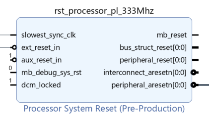

+ Disconnect the default connections of Pins from **ap_clk to dpu_2x_resetn** of Block **DPUCVDX8G**
+ Disconnect the default connection of Pins **ap_clk0** of Block **ai_engine_0**
+ Connect new Clocks and Resets with **DPUCVDX8G** as follows

  + **clk_wiz_accel/resetn** with **CIPS_0/pl0_resetn**
  + **clk_wiz_accel/clk_in1** with **CIPS_0/pl0_ref_clk**
  + **clk_wiz_accel/clk_out_333** with **rst_processor_333MHz/slowest_sync_clk**
  + **rst_processor_333MHz/ext_reset_in** with **CIPS_0/pl0_resetn**
  
  + **clk_wiz/clk_out_150** with **DPUCVDX8G/ap_clk_2**
  + **clk_wiz_accel/clk_out_333** with **DPUCVDX8G/ap_clk**
  + **clk_wiz_accel/clk_out_333** with **DPUCVDX8G/dpu_2x_clk**
  + **clk_wiz_accel/clk_out_333** with **NOC_0/aclk12**
  + **clk_wiz_accel/clk_out_333** with **ai_engine_0/aclk0**
  + **rst_processor_150MHz/peripheral_aresetn** with **DPUCVDX8G/ap_rst_n_2**
  + **rst_processor_333MHz/peripheral_aresetn** with **DPUCVDX8G/ap_rst_n**
  + **rst_processor_333MHz/peripheral_aresetn** with **DPUCVDX8G/dpu_2x_resetn**


Each operation in the block design will create a command in the **Tcl Console**. 

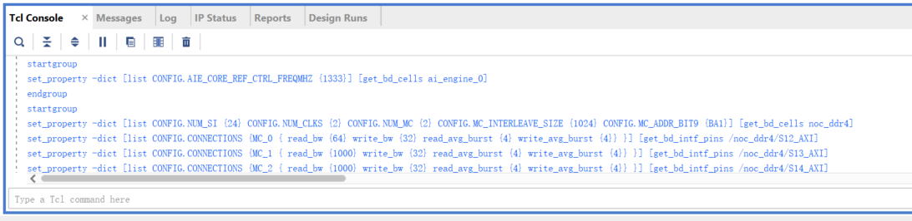

Please copy this commands mannually to the **post_linker.tcl** (remove previous content if have) in the following directory 

`<$TRD_HOME>/vitis_prj/scripts`

Enable the **post_linker.tcl** in Makefile and re-do the compilation to let the modification taking effects.

```shell
<$TRD_HOME>/vitis_prj$ make clean
<$TRD_HOME>/vitis_prj$ make files
<$TRD_HOME>/vitis_prj$ make all
```
