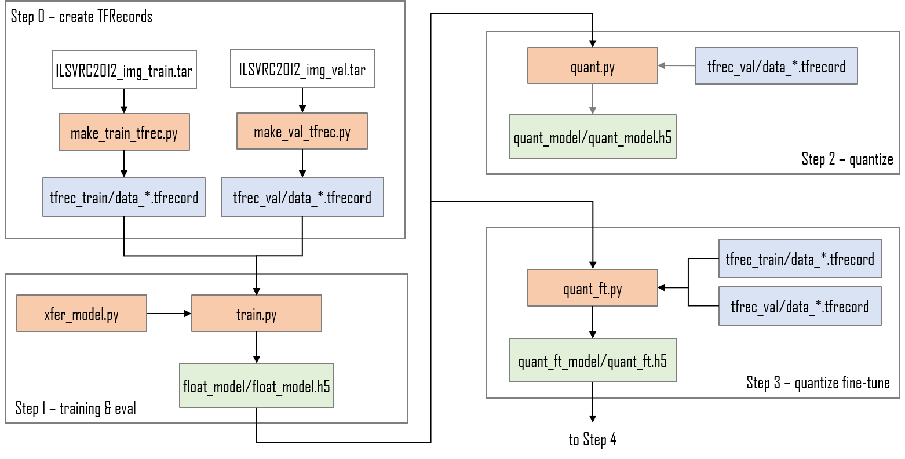
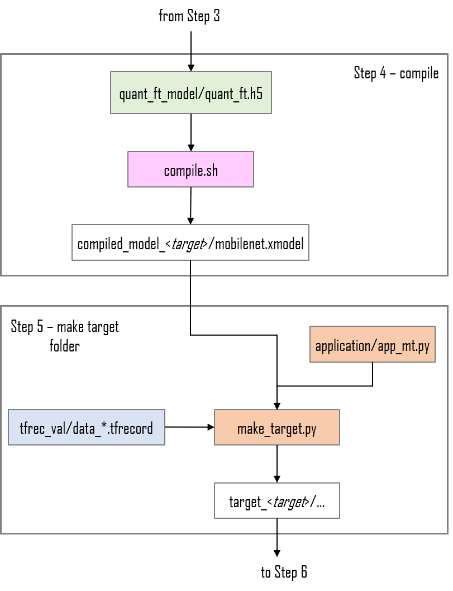

<!--
Copyright 2021 Xilinx Inc.
 
Licensed under the Apache License, Version 2.0 (the "License");
you may not use this file except in compliance with the License.
You may obtain a copy of the License at

http://www.apache.org/licenses/LICENSE-2.0
 
Unless required by applicable law or agreed to in writing, software
distributed under the License is distributed on an "AS IS" BASIS,
WITHOUT WARRANTIES OR CONDITIONS OF ANY KIND, either express or implied.
See the License for the specific language governing permissions and
limitations under the License.

Author: Mark Harvey, Xilinx Inc
-->
<table class="sphinxhide">
 <tr>
   <td align="center"><h1>Vitis AI Tutorials</h1>
  </td>
 </tr>
 <tr>
 <td align="center"><h1>Fine-Tuning TensorFlow2 quantized models</h1>
 </td>
 </tr>
</table>

## Current Status

+ Tested with Vitis-AI 1.3.2, TensorFlow 2.3 and ZCU102 evaluation board


# Introduction

Machine learning models such as Convolutional Neural Networks are generally trained and saved using floating-point formats. However the Xilinx family of DPU accelerators operate on fixed point integer values (usually 8bit) and so this requires our original floating-point model to be quantized. The process of converting a model whose values have a very wide dynamic range to a functionally equivalent model but with values that have a much more limited dynamic range can lead to a small loss in accuracy.

Some models are affected more than others by this change in dynamic range and when this happens it may be necessary to use quantization fine-tuning to recover accuracy.

This tutorial will show you how to implement the Vitis-AI quantization fine-tuning for TensorFlow2.3.  The steps we will run are as follows:

 + Download the Imagenet training and validation datasets and convert them to TFRecord format.
 + Train, evaluate and save the floating-point MobileNet model.
 + Quantization of the trained model *without* fine-tuning to demonstrate accuracy loss.
 + Quantization *with* fine-tuning to recover the lost accuracy and bring the quantized model back up to the same accuracy as the floating-point model.
 + Compiling the fine-tuned model for the target board
 + Execution of the compiled model on the target board

This tutorial assumes the user is familiar with Python3, TensorFlow and has some knowledge of machine learning principles.

The complete flow is shown in the figures below:

<p align="center">
 
</p>
<p align="center">
 
</p>


# The MobileNet CNN

We will use a MobileNet that has been pre-trained on ImageNet as our starting point. The Keras MobileNet model is instantiated as a base model but without including the final classification layers. We then add a new classification head that consists of a dropout layer, a 10-output dense/fully-connected layer and a softmax layer.

The MobileNet base model is set to be 'frozen' and will not be trained at all, only the new 10-output classification head will be trained.

The complete code for the MobileNet model is contained in the xfer_model.py file. The base model is instantiated with the ImageNet weights but no classifier head layers:

```python
base_model = MobileNet(input_shape=input_shape,
                       alpha=1.0,
                       depth_multiplier=1,
                       include_top=False,
                       weights='imagenet',
                       pooling='avg')
```

..and then set to be non-trainable:

```python
base_model.trainable = False
```

The output of the base model is then fed into a new classifier head which is parameterized for the number of classes we are using:

```python
net = base_model.output

# add output classifier head
net = Dropout(0.01)(net)
output_layer = Dense(classes)(net)
```


# Before You Begin

The host machine has several requirements that need to be met before we begin. You will need:

  + An x86 host machine with a supported OS and the GPU version of the Vitis-AI docker installed - see [System Requirements](https://github.com/Xilinx/Vitis-AI/blob/master/docs/system_requirements.md).

  + The host machine will require Docker to be installed and the Vitis-AI GPU docker image to be built - see [Getting Started](https://github.com/Xilinx/Vitis-AI#getting-started).

  + A GPU card suitable for ML training - a GPU with at least 8GB of memory is recommended.

  + The ZCU102 evaluation board should be prepared with the board image as per the [Setup the Target](https://github.com/Xilinx/Vitis-AI/tree/master/setup/mpsoc/VART#step2-setup-the-target) instructions. Hints on how to connect the various cables to the ZCU102 are also available [here](https://www.xilinx.com/html_docs/vitis_ai/1_3/installation.html#yjf1570690235238).

For more details, refer to the latest version of the *Vitis AI User Guide* ([UG1414](https://www.xilinx.com/html_docs/vitis_ai/1_3/zmw1606771874842.html)).


# Setting up the workspace

1. Copy this repository by doing either of the following:

    + Download the repository as a ZIP file to the host machine, and then unzip the archive.
    + From a terminal, use the `git clone` command.

2. Open a linux terminal, `cd` to the repository folder, and then `cd` to the `files` folder.
   
4. Start either the Vitis AI GPU or CPU docker (we recommend using the GPU docker if possible):

     ```shell
     # navigate to densenet tutorial folder
     cd <path_to_densenet_design>/files

     # to start GPU docker container
     ./docker_run.sh xilinx/vitis-ai-gpu:latest
     
     # to start CPU docker container
     ./docker_run.sh xilinx/vitis-ai-cpu:latest
     ```

  The docker container will start and after accepting the license agreement, you should see something like this in the terminal:

     ```shell
     ==========================================
     
     __      ___ _   _                   _____
     \ \    / (_) | (_)            /\   |_   _|
      \ \  / / _| |_ _ ___ ______ /  \    | |
       \ \/ / | | __| / __|______/ /\ \   | |
        \  /  | | |_| \__ \     / ____ \ _| |_
         \/   |_|\__|_|___/    /_/    \_\_____|
     
     ==========================================

     Docker Image Version:  1.3 
     Build Date: 2020-12-20
     VAI_ROOT: /opt/vitis_ai

     For TensorFlow Workflows do:
          conda activate vitis-ai-tensorflow 
     For Caffe Workflows do:
          conda activate vitis-ai-caffe 
     For Neptune Workflows do:
          conda activate vitis-ai-neptune 
     For PyTorch Workflows do:
          conda activate vitis-ai-pytorch 
     For TensorFlow 2.3 Workflows do:
          conda activate vitis-ai-tensorflow2 
     For Darknet Optimizer Workflows do:
          conda activate vitis-ai-optimizer_darknet 
     For Caffe Optimizer Workflows do:
          conda activate vitis-ai-optimizer_caffe 
     For TensorFlow 1.15 Workflows do:
          conda activate vitis-ai-optimizer_tensorflow 
     For LSTM Workflows do:
          conda activate vitis-ai-lstm 
     Vitis-AI /workspace > 
     ```

>:bulb: *If you get a "Permission Denied" error when starting the docker container, it is almost certainly because the docker_run.sh script is not set to be executable. You can fix this by running the following command:*
>    
>    ```shell
>     chmod +x docker_run.sh
>    ```


Activate the Tensorflow2 python virtual environment with `conda activate vitis-ai-tensorflow2` and you should see the prompt change to indicate that the environment is active:


```shell
Vitis-AI /workspace > conda activate vitis-ai-tensorflow2
(vitis-ai-tensorflow2) Vitis-AI /workspace > 
```

### Install patches (if required)

At the time of writing of this tutorial, the current Vitis-AI version (1.3.2) required some patches to be installed. The patches can be downloaded manually from [here](https://github.com/Xilinx/Vitis-AI/blob/master/docs/quick-start/install/Vitis%20AI%201.3.2%20April%202021%20Patch.md) or by using the Linux shell command shown below.

They must be installed from within the vitis-ai-tensorflow2 conda virtual environment. The order of install is important:

```shell
# fetch patches
wget --no-clobber https://www.xilinx.com/bin/public/openDownload?filename=unilog-1.3.2-h7b12538_35.tar.bz2 -O unilog-1.3.2-h7b12538_35.tar.bz2
wget --no-clobber https://www.xilinx.com/bin/public/openDownload?filename=target_factory-1.3.2-hf484d3e_35.tar.bz2 -O target_factory-1.3.2-hf484d3e_35.tar.bz2
wget --no-clobber https://www.xilinx.com/bin/public/openDownload?filename=xir-1.3.2-py37h7b12538_47.tar.bz2 -O xir-1.3.2-py37h7b12538_47.tar.bz2
wget --no-clobber https://www.xilinx.com/bin/public/openDownload?filename=xcompiler-1.3.2-py37h7b12538_53.tar.bz2 -O xcompiler-1.3.2-py37h7b12538_53.tar.bz2
wget --no-clobber https://www.xilinx.com/bin/public/openDownload?filename=xnnc-1.3.2-py37_48.tar.bz2 -O xnnc-1.3.2-py37_48.tar.bz2

# install patches
# MUST MAINTAIN THIS INSTALL ORDER!
sudo env PATH=/opt/vitis_ai/conda/bin:$PATH CONDA_PREFIX=/opt/vitis_ai/conda/envs/vitis-ai-tensorflow2 conda install unilog-1.3.2-h7b12538_35.tar.bz2
sudo env PATH=/opt/vitis_ai/conda/bin:$PATH CONDA_PREFIX=/opt/vitis_ai/conda/envs/vitis-ai-tensorflow2 conda install target_factory-1.3.2-hf484d3e_35.tar.bz2
sudo env PATH=/opt/vitis_ai/conda/bin:$PATH CONDA_PREFIX=/opt/vitis_ai/conda/envs/vitis-ai-tensorflow2 conda install xir-1.3.2-py37h7b12538_47.tar.bz2
sudo env PATH=/opt/vitis_ai/conda/bin:$PATH CONDA_PREFIX=/opt/vitis_ai/conda/envs/vitis-ai-tensorflow2 conda install xcompiler-1.3.2-py37h7b12538_53.tar.bz2
sudo env PATH=/opt/vitis_ai/conda/bin:$PATH CONDA_PREFIX=/opt/vitis_ai/conda/envs/vitis-ai-tensorflow2 conda install xnnc-1.3.2-py37_48.tar.bz2
```


# Implementing the design

The remainder of this README describes each single step to implement the tutorial - each command needs to be run from within the Vitis-AI Docker container which was started in the previous section.

A shell script called run_all.sh is also provided - this contains the commands needed to run the complete flow:

```shell
source run_all.sh
```

## Step 0 - Download the datasets and convert to TFRecords

  + Download ILSVRC2012_img_val.tar from [Academic Torrents](https://academictorrents.com/details/5d6d0df7ed81efd49ca99ea4737e0ae5e3a5f2e5) or other source. Place ILSVRC2012_img_val.tar in the <path_to_repo>/files folder.

  + Download ILSVRC2012_img_train.tar from [Academic Torrents](https://academictorrents.com/details/a306397ccf9c2ead27155983c254227c0fd938e2) or other source. Place ILSVRC2012_img_train.tar in the <path_to_repo>/files folder.

  + Convert the images in the ILSVRC2012_img_val.tar archive to TFRecords (requires an internet connection). The `-mc 10` option will ensure that only the first 10 classes are used instead of all 1000 classes:

```shell
python -u make_val_tfrec.py -mc 10 2>&1 | tee make_val_tfrec.log
```

..this should create a folder called tfrec_val that contains a single TFRecord file - if you use more classes then more than one TFRecord file may be generated. The ILSVRC2012_img_val.tar archive can be deleted at this point to save disk space.


  + Convert the images in the ILSVRC2012_img_train.tar archive to TFRecords (requires internet connection). The `-mc 10` option will ensure that only the first 10 classes are used - these are obviously the same 10 classes used when converting the validation set:

```shell
python -u make_train_tfrec.py -mc 10 2>&1 | tee make_train_tfrec.log
```

..this should create a folder called tfrec_train that contains 10 TFRecord files. If required, the ILSVRC2012_img_train.tar archive can be deleted at this point to save disk space.


## Step 1 - Training

Train the floating-point MobileNet model. The `-mc 10` option will ensure that the classifer output vector is of the correct shape and matches the number of classes used to create the TFRecords:

```shell
python -u train.py -mc 10 2>&1 | tee train.log
```

After training is completed, the trained floating-point model is saved as float_model/float.h5  ...evaluation will also be run and should give an accuracy of approximately 85%.


## Step 2 - Quantize without fine-tuning

Next we will run quantization *without* fine-tuning followed by evaluation. This step is just to demonstrate that normal quantization does not give sufficient accuracy:

```shell
python -u quant.py -e 2>&1 | tee quant.log
```

..evaluation should give an accuracy of approximately 65% which is much lower than the floating-point accuracy.


## Step 3 - Quantize with fine-tuning

Now we can run quantization *with* fine-tuning:


```shell
python -u quant_ft.py 2>&1 | tee quant_ft.log
```

This is effectively a form of retraining of the quantized model. First we load the floating-point model:

```python
float_model = load_model(float_dir+'/float_model.h5', compile=False)
```

..then we create a quantized model that can be fine-tuned:

```python
# Quantization-aware training model
quantizer = vitis_quantize.VitisQuantizer(float_model)
ft_model = quantizer.get_qat_model()
```

After that, training is run using the .compile() and .fit() methods of the tf.kKeras API.

Once the quantization-aware training has completed, evaluation will be run and should give an accuracy of approximately 85% which should be almost identical to the original floating-point model accuracy.


## Step 4 - Compile the fine-tuned model

To run step 3, run the `compile.sh` with one of the target boards as a command line argument, for example:

```shell
source compile.sh zcu102
```

The `compile.sh` script also supports `zcu104` and `vck190` as command line arguments. The `compile.sh` shell script will compile the quantized model and create an .xmodel file which contains the instructions and data to be executed by the DPU in the compiled_model_<target> folder.


## Step 5 - Make the target folder to be copied to the SDcard

Run make_target.py with the appropriate command lines options to create a folder ready to be copied to the target board, for example:

```shell
python -u make_target.py -m compiled_model_zcu102/mobilenet.xmodel -td target_zcu102 2>&1 | tee logs/target_zcu102.log
```

## Step 6 - Run the application on the target

The entire `target_<xxx>` folder needs to be copied to the /home/root folder of the flashed SD card, this can be done in one of several ways:

1. Direct copy to SD Card:

  + If the host machine has an SD card slot, insert the flashed SD card and when it is recognised you will see two volumes, BOOT and ROOTFS. Navigate into the ROOTFS and then into the /home folder.  Make the ./root folder writeable by issuing the command ``sudo chmod -R 777 root`` and then copy the entire `target` folder from the host machine into the /home/root folder of the SD card.

  + Unmount both the BOOT and ROOTFS volumes from the host machine and then eject the SD Card from the host machine.

2. With scp command:

  + If the target evaluation board is connected to the same network as the host machine, the `target_<xxx>` folder can be copied using scp.

  + The command will be something like ``scp -r ./build/target_zcu102 root@192.168.1.227:~/.``  assuming that the target board IP address is 192.168.1.227 - adjust this as appropriate for your system.

  + If the password is asked for, insert 'root'.


With the `target_<xxx>` folder copied to the SD Card and the evaluation board booted, you can issue the command for launching the application - note that this done on the target evaluation board, not the host machine, so it requires a connection to the board such as a serial connection to the UART or an SSH connection via Ethernet.

The application can be started by navigating into the `target_<xxx>` folder on the evaluation board and then issuing the command ``python3 app_mt.py``. The application will start and after a few seconds will show the accuracy and throughput in frames/sec, like this:


```shell
root@xilinx-zcu102-2020_2:~/target# python3 app_mt.py
-----------------------------------------------
Command line options:
 --image_dir :  images
 --threads   :  1
 --model     :  mobilenet.xmodel
-----------------------------------------------
Found 500 images - processing 500 of them
Found 1 subgraphs in mobilenet.xmodel
Pre-processing 500 images...
Starting 1 threads...
-----------------------------------------------
Correct:416, Wrong:84, Accuracy:0.8320
-----------------------------------------------
FPS: 194.12, total frames: 500, total time: 2.576 seconds
-----------------------------------------------
```


The throughput can be improved by increasing the number of threads with the `--threads` option:


```shell
root@xilinx-zcu102-2020_2:~/target# python3 app_mt.py --threads 6
-----------------------------------------------
Command line options:
 --image_dir :  images
 --threads   :  6
 --model     :  mobilenet.xmodel
-----------------------------------------------
Found 500 images - processing 500 of them
Found 1 subgraphs in mobilenet.xmodel
Pre-processing 500 images...
Starting 6 threads...
-----------------------------------------------
Correct:416, Wrong:84, Accuracy:0.8320
-----------------------------------------------
FPS: 731.21, total frames: 500, total time: 0.684 seconds
-----------------------------------------------
```


## References

1. [Xilinx Vitis-AI User Guide ver 1.3](https://www.xilinx.com/support/documentation/sw_manuals/vitis_ai/1_3/ug1414-vitis-ai.pdf)

2. [MobileNets: Efficient Convolutional Neural Networks for Mobile Vision Applications](https://arxiv.org/abs/1704.04861)

