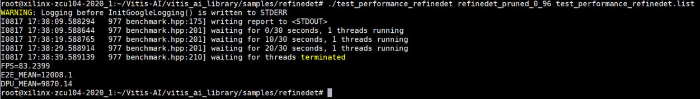
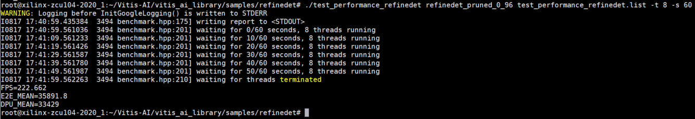

3.2 Setting up board environment & Demo run
-----------------------
In Module_1, user has downloaded the board environment with DPU and corresponding runtime integrated. In this module, We only need to copy the images and videos in for inference.
* The script is provided in this Module_2 repository to download the images and videos for demo purpose.
    ```
    $cd [DOWNLOAD_PATH]/Board_Dependency
    $sh get_image_video_zcu104.sh
    $scp vitis_ai_library_* root@[IP_OF_BOARD]:~/
    $ssh root@[IP_OF_THE_BOARD]
    ```
 * Now we can operate on the board through an ethernet connection.
   * unpack the images and videos
   ```
   root@xilinx-zcu104-2020_1:~# tar -xzvf vitis_ai_library_r1.2.0_images.tar.gz -C ~/Vitis-AI/vitis_ai_library
   root@xilinx-zcu104-2020_1:~# tar -xzvf vitis_ai_library_r1.2.0_video.tar.gz -C ~/Vitis-AI/vitis_ai_library
   ```
   * Run the demo
   ```
   root@xilinx-zcu104-2020_1:~# cd Vitis-AI/vitis_ai_library/samples/refinedet
   root@xilinx-zcu104-2020_1:~/Vitis-AI/vitis_ai_library/samples/refinedet# ./test_performance_refinedet refinedet_pruned_0_96 test_performance_refinedet.list
   ```
   <p align="left">
   
   </p>
   Note that the user could also use parameters to define the number of threads and running time as below. For more detailed instruction, please refer to the Readme file within the refinedet folder.

   ```
   root@xilinx-zcu104-2020_1:~/Vitis-AI/vitis_ai_library/samples/refinedet# ./test_performance_refinedet refinedet_pruned_0_96 test_performance_refinedet.list -t 8 -s 60
   -t: <num_of_threads>
   -s: <num_of_seconds>
   ```
   <p align="left">
   
   </p>

   The prebuild models can run on ZCU104 now. If users want to do some modification and recompile the model, please follow the instruction on [Module 3](https://gitenterprise.xilinx.com/swm/Vitis-In-Depth-Tutorial/tree/master/Machine_Learning_Tutorial/Section_3-Basic/Module_3) for next step.

<p align="center"><sup>Copyright&copy; 2020 Xilinx</sup></p>
