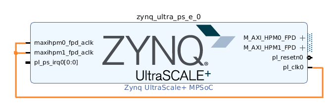
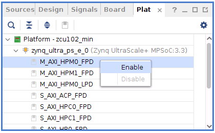
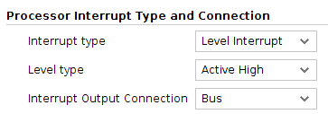
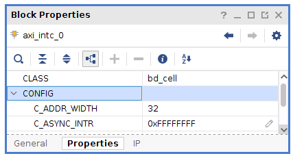
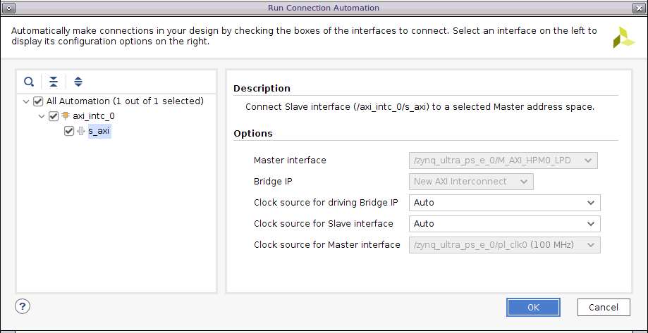
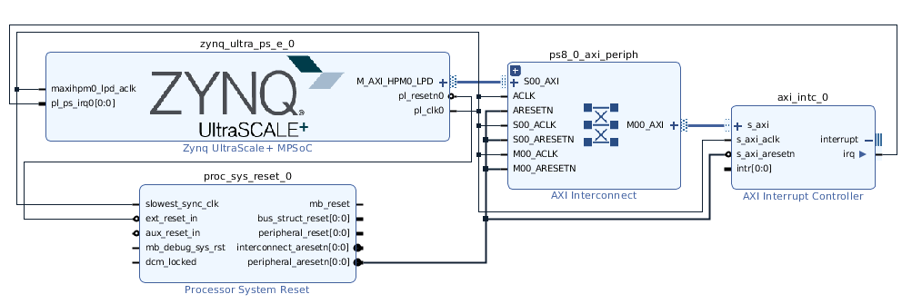
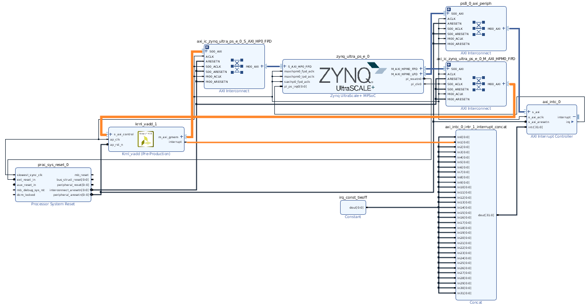

## Example 1: Create a minimum platform for ZCU104

*Vitis and Vivado Version: 2020.1*

### Step 0: Prepare base components

For detailed instructions of how to design a base system, please refer to UG1209 for MPSoC, UG1305 for Versal.

If you're familiar with creating Vivado project and PetaLinux project for MPSoC, please feel free to skip this section and jump to Step 1. [src/zcu104_min_step0.tcl](./src/zcu104_min_step0.tcl) is provided to re-create the Vivado project for this step. 

This example is based on ZCU104. It's assumed all platform project files are saved in **~/zcu104_min** directory.

Here's the instructions for a minimum start for the base component.

#### A. Prepare Hardware Specification in Vivado

1. Launch Vivado
   `vivado &` 
2. Create a Project

| Vitis GUI Instructions                                       |
| ------------------------------------------------------------ |
| Create Project: File -> Project -> New                       |
| Project name: zcu102_min</br>Project location: ~/zcu104_min/vivado </br>Create project subdirectory: checked |
| RTL Project Do not specify sources at this time: checked     |
| Boards: Zynq UltraScale+ ZCU104 Evaluation Board             |
| Finish                                                       |

3. Create Block Diagram

| Vitis GUI Instructions              |
| ----------------------------------- |
| IP Integrator → Create Block Design |
| Design name: zcu104_min             |

4. Add Processing System

| Vitis GUI Instructions         |
| ------------------------------ |
| Add IP: Zynq UltraScale+ MPSoC |

5. Setup PS parameters

| Vitis GUI Instructions      |
| --------------------------- |
| Run Block Automation        |
| Apply Board Preset: checked |

6. Connect signals

| Vitis GUI Instructions                                     |
| ---------------------------------------------------------- |
| Connect pl_clk0 to maxihpm0_fpd_aclk and maxihpm1_fpd_aclk |
| Click save button on tool bar                              |
| Save block diagram with Ctrl+S                             |



7. Add top module

| Vitis GUI Instructions                                       |
| ------------------------------------------------------------ |
| Go to Sources tab                                            |
| Right click on zcu104_min(zcu104_min.bd), select Create HDL Wrapper |
| Select "Let Vivado manage wrapper and auto-update"           |

8. Generate Block Design

| Vitis GUI Instructions        |
| ----------------------------- |
| Click "Generate Block Design" |
| Synthesis Options = Global    |
| Click Generate                |

Note: Global Synthesis skips submodule synthesis when generating block design. It saves time because implementation is not required by Vitis platform XSA.

9. Export XSA

| Vitis GUI Instructions          |
| ------------------------------- |
| File → Export → Export Hardware |
| Platform type: Fixed            |
| Output: Pre-synthesis           |
| XSA file name: zcu104_min       |
| Finish                          |


#### B. Prepare software components with PetaLinux


1. Create a PetaLinux project in petalinux directory

   

```bash
cd petalinux 
petalinux-create -t project -n zcu104_min --template zynqMP
```

   

2. Import XSA generated by Vivado

```bash
cd zcu104_min # from petalinux directory
petalinux-config --get-hw-description=../../vivado/zcu104_min --silentconfig
# --silentconfig prevents the pop-up configuration menu
```

   

3. Build PetaLinux project

```bash
petalinux-bulid
```

   Note: PetaLinux default build area is in project directory, but it's not able to build in NFS directory. If your project is in a NFS directory, please run `petalinux-config` to change `CONFIG_TMP_DIR_LOCATION` to a non-NFS directory.

4. Package Boot Image (boot.bin)

```bash
cd images/linux 
petalinux-package --boot --u-boot
```

In this step, `petalinux-package` will assemble FSBL, PMUFW, u-boot and generate boot.bin. 

Note: Since we don't need to test the PL side in next step, bit file is not added to boot.bin in this step. If in your case PL is needed to make Linux boot properly, please add bit file with an additional option `--fpga system.bit`.


#### C. Test Image on board

| Instructions                                                 |
| ------------------------------------------------------------ |
| Copy BOOT.BIN and image.ub to SD card.                       |
| Insert SD card to SD slot on board. Boot the board with SD boot mode. The UART console should print boot log until you see this login prompt. <br />Use default username and password root/root to login. |

Console output example:

```
PetaLinux 2019.2 zcu102_min /dev/ttyPS0

zcu102_min login: root
Password:
root@zcu102_min:~#
```

   

   

### Step 1: Add Hardware Interfaces

#### A. Setup AXI Interfaces

1. Setup AXI Interfaces for IP within the platform

| Vitis GUI Instructions                                       |
| ------------------------------------------------------------ |
| Open the Vivado Block Design if it's not open                |
| Double click **Zynq UltraScale+ MPSoC** block to edit its properties |
| Go to **PS-PL Configuration** -> **PS-PL Interfaces**, Enable master interface **AXI HPM0 LPD** (for interrupt controller) |
| Open menu **Window** → **Platform Interfaces** <br />Click "Enable Platform Interfaces" if it's not enabled |

2. Enable AXI Interface for Kernels' further usage

| Vitis GUI Instructions                                       |
| ------------------------------------------------------------ |
| Open menu **Window** → **Platform Interfaces** <br />Click "Enable Platform Interfaces" if it's not enabled |
| Enable AXI Master port for kernel control: <br />Right click **M_AXI_HPM0_FPD** and select **Enable**<br /> |
| Enable AXI Slave ports for memory:<br />Right click **S_AXI_HP0_FPD** and select **Enable**<br />In **Platform Interface Properties** window, select **Options**, update the following properties:<br />sptag: HP0<br />memory: zynq_ultra_ps_e_0 HP0_DDR_LOW |

Enabled interfaced will be usable in v++ link stage. Property sptag value would be used in v++ link configuration `--connectivity.sp` [option](https://www.xilinx.com/html_docs/xilinx2020_1/vitis_doc/vitiscommandcompiler.html?hl=vitis%2Ccore%2Ctools#clt1568640709907__section_tfc_zxm_1jb).

#### B. Setup Clocks

1. Enable clocks for IP in the platform and kernel

| Vitis GUI Instructions                                       |
| ------------------------------------------------------------ |
| Double click **Zynq UltraScale+ MPSoC** block to edit its properties |
| Go to **Clock Configruation** → **Output Clocks** → **Low Power Domain Clocks** → **PL Fabric Clocks** Enable **PL0** for 100MHz |

Note: in this minimal platform, only one 100MHz clock is used. Please enable more clocks if necessary.

2. Add synchronous reset signals for corresponding clocks

| Vitis GUI Instructions                                       |
| ------------------------------------------------------------ |
| Add IP: Processor System Reset<br />Default instance name: **proc_sys_reset_0** |
| Click "Run Connection Automation" on the top of diagram      |
| ext_reset_n:  <br />* Select Board Part Interface: **Custom**<br />* Select Manual Source: **/zynq_ultra_ps_e_0/pl_resetn0 (Active Low)** <br /><br />slowest_sync_clk<br />* Clock Source: **/zynq_ultra_ps_e_0/pl_clk0** |

3. Enable clock for kernel's further usage

| Vitis GUI Instructions                                       |
| ------------------------------------------------------------ |
| In **Platform Interfaces** window, right click **pl_clk0** and select **Enable** |
| In **Platform Interface Properties** window, select **Options**, update the following properties<br />is_default: **checked**<br />proc_sys_reset: **/proc_sys_reset_0**<br /> |

#### C. Setup Interrupts

1. Add interrupt controller

GUI Flow:

| Vitis GUI Instructions                                       |
| ------------------------------------------------------------ |
| Add IP → **AXI Interrupt Controller**<br />Use default instance name: **axi_intc_0** |
| Double click instance and configure or make sure the parameters are set as following:<br />Processor Interrupt Type and Connection: **Level Interrupt**<br /> <br />This step is to make sure PS can recognize IRQ generated by interrupt controller.|
| Select **axi_intc_0** instance and go to Block Properties -> Properties,  configure or make sure the parameters are set as following:<br />**C_ASYNC_INTR**: 0xFFFFFFFF. <br />When interrupts generated from kernels are clocked by different clock domains, this option is useful to capture the interrupt signals properly. For the platform that has only one clock domain, this step can be skipped.<br />  |


2. Connect interrupt controller to Processing System

| Vitis GUI Instructions                                  |
| ------------------------------------------------------- |
| Run Connection Automation                               |
| Set properties for **s_axi** of **axi_intc_0**          |
| Master interface: **/zynq_ultra_ps_e_0/M_AXI_HPM0_LPD** |



3. Connect IRQ to PS

| Vitis GUI Instructions                                       |
| ------------------------------------------------------------ |
| Expand output interface **Interrupt** of **axi_intc_0** to show the port **irq** |
| Connect irq to **zynq_ultra_ps_e_0.pl_ps_irq0**              |


Here's a screenshot for the block diagram after executing the operations above.



4. Setup `PFM_IRQ` property

```
set_property PFM.IRQ {intr {id 0 range 32}} [get_bd_cells /axi_intc_0]
```


[src/zcu104_min_step1.tcl](src/zcu104_min_step1.tcl) is provided to re-generate the Vivado project till this step.

#### D. Export XSA

1. Validate the block design

| Vitis GUI Instructions                    |
| ----------------------------------------- |
| In Block Diagram, click "Validate Design" |
| (Optional) Click **Run Implementation**   |

2. Export Platform from Vitis GUI

| Vitis GUI Instructions                                       |
| ------------------------------------------------------------ |
| Click menu **File -> Export -> Export Hardware**             |
| Platform Type: **Expandable**                                |
| Platform Stage: **Pre-synthesis**, or Post-implementation if "Run Implementation" is executed in previous step |
| Input Platform Properties, for example<br />Name: zcu104_min<br />Vendor: xilinx<br />Board: zcu104<br />Version: 0.0<br />Description: Vivado generated hardware platform |
| XSA file name: zcu104_min<br />Export to: ~/zcu104_min/vivado/zcu104_min |

3. Alternatively, the above export can be done in Tcl scripts

```tcl
# Setting platform properties
set_property platform.default_output_type "sd_card" [current_project]
set_property platform.design_intent.embedded "true" [current_project]
set_property platform.design_intent.server_managed "false" [current_project]
set_property platform.design_intent.external_host "false" [current_project]
set_property platform.design_intent.datacenter "false" [current_project]
# Write pre-synthesis expandable XSA
write_hw_platform -unified ./zcu104_min.xsa
# Or uncomment command below to write post-implementation expandable XSA
# write_hw_platform -unified -include_bit ./zcu104_min.xsa
```


### Step 2: Update Software Components to Enable Application Acceleration

#### A. Update XSA

```bash
cd petalinux/zcu104_min 
petalinux-config --get-hw-description=../../vivado/zcu104_min 
```


#### B. Add XRT support

```
petalinux-config -c rootfs
```

Enable these packages

- Filesystem Packages → libs → xrt, xrt-dev
- Filesystem Packages → libs → zocl


#### C. Update device tree to include zocl

Add the following zocl code block to [system-user.dtsi](https://github.com/Xilinx/Vitis_Embedded_Platform_Source/blob/master/Xilinx_Official_Platforms/zcu102_base/petalinux/project-spec/meta-user/recipes-bsp/device-tree/files/system-user.dtsi) in project-spec/meta-user/recipes-bsp/device-tree/files/

```
&amba {
   zyxclmm_drm {
      compatible = "xlnx,zocl";
      status = "okay";
      interrupt-parent = <&axi_intc_0>;
      interrupts = <0  4>, <1  4>, <2  4>, <3  4>,
              <4  4>, <5  4>, <6  4>, <7  4>,
              <8  4>, <9  4>, <10 4>, <11 4>,
              <12 4>, <13 4>, <14 4>, <15 4>,
              <16 4>, <17 4>, <18 4>, <19 4>,
              <20 4>, <21 4>, <22 4>, <23 4>,
              <24 4>, <25 4>, <26 4>, <27 4>,
              <28 4>, <29 4>, <30 4>, <31 4>;
   };
};
```


#### D. Build Image

```bash
petalinux-build
```

The build process takes a while.


#### E. Build and install sysroot

Build sysroot

```
petalinux-build --sdk
```

It takes 10 minutes to 1 hour to build sysroot, depends on the server performance.

sysroot package is generated as a self-extract tar in zcu104_min/petalinux/zcu104_min/images/linux/sdk.sh


Install sysroot

```
cd zcu104_min/petalinux/zcu104_min/images/linux
./sdk.sh
```

Follow the prompts and install the sysroot to ~/zcu104_min/pfm/sysroot

### Step 3: Wrap a Vitis Acceleration Platform

In step 1 and step 2, we prepared all requirements for Vitis acceleration platforms. We can wrap them together and generate the final Vitis acceleration platform.

#### A. Prepare Platform Software Contents

1. BIF

Boot description file is required when creating Linux domain for platform. 

Create linux.bif in zcu104_min/pfm/xrt/ directory with the following contents.

```
/* linux */
the_ROM_image:
{
  [bootloader, destination_cpu = a53-0] <fsbl.elf>
  [pmufw_image] <pmufw.elf>
  [destination_device=pl] <bitstream>
  [destination_cpu=a53-0, exception_level=el-3, trustzone] <bl31.elf>
  [destination_cpu=a53-0, exception_level=el-2] <u-boot.elf>
}
```

All the files referred here (except bitstream) should be able to be found in the directory generated by step 2.D. For example, zcu104_min/petalinux/zcu104_min/images/linux.

2. Additional Files to be added to SD card FAT32 partition

Additional files can be added to SD card FAT32 partition during v++ package. The XRT required initialization scripts are usually added in this way. More user files can be added here.

Create a directory **zcu104_min/pfm/xrt/image**. Add **init.sh** and **platform_desc.txt** to this directory.

Sample of **init.sh**:

```bash
SCRIPTPATH4=$(dirname $BASH_SOURCE)
echo ${SCRIPTPATH4}
cp ${SCRIPTPATH4}/platform_desc.txt /etc/xocl.txt
export XILINX_XRT=/usr
```

**platform_desc.txt** needs to contain the platform name.

```
zcu104_min
```


#### B. Create Vitis Platform

| Vitis GUI Instructions                                       |
| ------------------------------------------------------------ |
| Launch Vitis                                                 |
| Set workspace: **zcu104_min/pfm**                            |
| File → New → Platform Project                                |
| Project name: **zcu104_min**                                 |
| Create from hardware specification (XSA)                     |
| XSA file: **zcu104_min.xsa** in Vivado project<br />Operating System: **Linux**<br />Processor: **psu_cortexa53**<br />Generate boot components: **uncheck** |
| Double click zcu102_min/platform.spr, select linux on psu__cortexa53<br />Bif File:**zcu104_min/pfm/xrt/linux.bif**<br />Boot Components Directory: **zcu104_min/petalinux/zcu104_min/images/linux**<br />Linux Image Directory: **zcu104_min/pfm/xrt/image** |
| Click hammer icon on tool bar to build platform              |

The generated platform is located in zcu104_min/pfm/zcu104_min/export/zcu104_min directory. It has the top level platform description file **zcu104_min.xpfm**. The software components listed above are all copied to platform directory.

Note: The software components packaged into platform are for boot purpose. The Linux kernel image, root file system and sysroot are to be provided in application creation time. Besides the kernel image, rootfs and sysroot generated in step 2, [Common images for Embedded Vitis platforms](https://www.xilinx.com/support/download/index.html/content/xilinx/en/downloadNav/embedded-design-tools.html) provided by Xilinx can also be used.

#### C. Update Platform for Iterations (optional)

In case any platform hardware source files need to be updated, please use the following steps.

| Vitis GUI Instructions                                       |
| ------------------------------------------------------------ |
| Update Vivado design and export XSA                          |
| Right click platform project, select **Update Hardware Specification** |
| Confirm the XSA file location and click OK                   |
| Click hammer icon on toolbar to build the platform           |

In case any platform software components need to be updated, please use the following steps.

| Vitis GUI Instructions                                       |
| ------------------------------------------------------------ |
| Run `petalinux-build` if the update software is a part of PetaLinux project |
| Update Platform Linux domain configuration if BIF, boot components and Linux image location changes. |
| Click hammer icon in Vitis toolbar to build the platform     |


### Step 4: Test Your Platform

#### A. Check with platforminfo utility

```
cd zcu102_min/pfm/zcu104_min/export/zcu104_min/
platforminfo ./zcu104_min.xpfm
```


Please check the clock information, memory information

```
=================
Clock Information
=================
Default Clock Index: 0
Clock Index: 0
Frequency: 99.990005

==================
Memory Information
==================
Bus SP Tag: HP0
```

If XSA is exported with option `include_bit`, the report will have an additional section "Resource Availability".


#### B. Test with a vadd application

1. Build vector addition application with the platform.

| Vitis GUI Instructions                                       |
| ------------------------------------------------------------ |
| Launch Vitis with new workspace: zcu104_min/test/vadd        |
| File → New → Application Project                             |
| Project Name: vadd                                           |
| Click add icon to add custom platform<br />Select zcu102/pfm/zcu104_min/export<br />Select zcu104_min platform<br /><br />Note: If platform and test application are created in the same workspace, custom platform is visible directly. There's no need to add custom platform. |
| Select sysroot path: zcu104_min/pfm/sysroot/sysroots/aarch64-xilinx-linux |
| Select template: Vector Addition                             |
| Build for hardware<br />Change Active build configuration: **Hardware**<br />Click hammer icon in toolbar |

2. Verify the AXI and interrupt signals are properly connected

A Vivado project is generated during Vitis build process. It can be found at binary_container_1.build/link/vivado/vpl/prj/prj.xpr.

Use Vivado to open this project.

```
vivado binary_container_1.build/link/vivado/vpl/prj/prj.xpr &
```

Open block design. 

Verify that the vadd kernel is connected to control AXI and memory AXI properly. Interrupt signals are connected to interrupt controller properly.

Here's an example.



3. Run the design on board

Copy files generated in package/sd_card directory to SD Card and boot.

*Note: To simplify EXT4 rootfs write to SD card process, sd_card.img is provided. This SD card image can be written to SD card with image writers like Etcher or Win32 Disk Imager on Windows or dd command on Linux.*

Boot the board in SD boot mode. 

Run the vadd application.

```bash
mount /dev/mmcblk0p1 /mnt
cd /mnt
source ./init.sh
./vadd binary_container_1.xclbin
```

It should print

```
TEST PASSED
```

