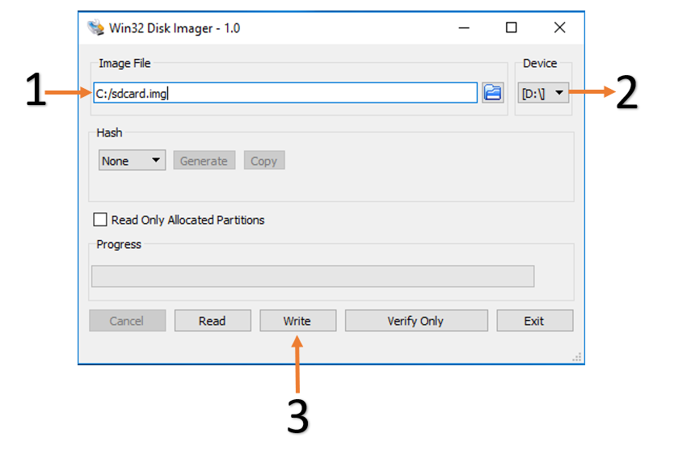

3.1 Retrieve pre-built DPU platform
-----------------------
* Prerequisites
  * Terminal emulater (https://osdn.net/projects/ttssh2)
  * Win32 Disk Imager (https://sourceforge.net/projects/win32diskimager)
 
* Download the pre-built DPU board image from the link below

  * [ZCU104](https://www.xilinx.com/bin/public/openDownload?filename=xilinx-zcu104-dpu-v2019.2-v2.img.gz) 

* Choose an unpartitioned SD card of size 8GB or greater. Use Win32DiskImager to burn the image file onto the SD card.
  * Unzip the image file ``xilinx-zcu104-dpu-v2019.2-v2.img.gz`` using windows extractor
  * Browse to the location of the unzipped image in the Win32 utility
  * Choose the correct SD card under 'Device'
  * Select 'Write' to the SD card, click 'Yes' at the prompt to continue writing and wait till the operation is complete
  
  <p align="left">
  
  </p>
  
* Afterwards, please get the ZCU104 board ready with one serial cable and ethernet cable.
  * Insert the SD card with the image into the destination board.
  * Plug in the power and boot the board using the serial port to operate on the system.
  * Find out the IP information of the board using the serial port. 
    ```
    root@xilinx-zcu104-2019_2:~# ifconfig 
    ```
    <p align="left">
    
    </p>
  * Now the board could be operated by using SSH.
  <p align="left">
  
  </p>
